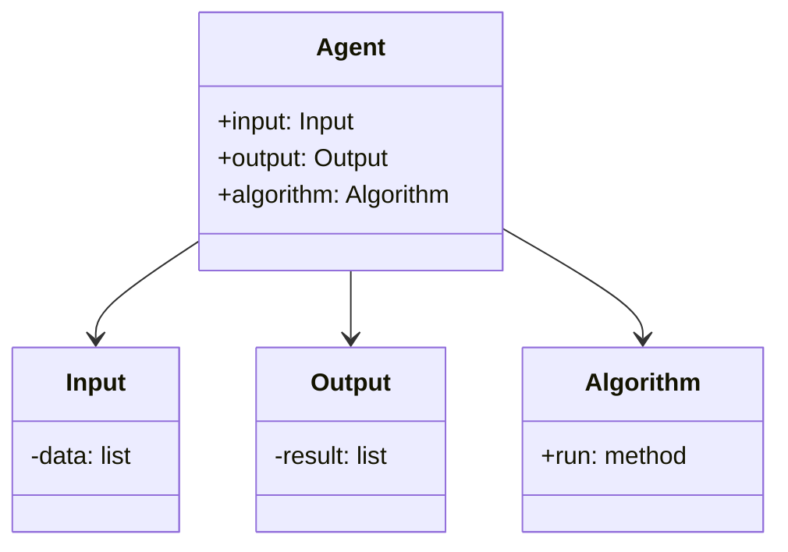

                 


# 设计AI Agent的多目标优化决策系统

## 关键词：AI Agent，多目标优化，决策系统，算法设计，系统架构

## 摘要：本文章详细探讨了设计AI Agent多目标优化决策系统的各个方面。从AI Agent和多目标优化的基本概念出发，分析了多目标优化的数学模型与常见算法，如遗传算法和粒子群优化。通过系统架构设计和项目实战，展示了如何将这些算法应用于实际场景。文章还提供了详细的代码示例和系统设计图，帮助读者全面理解并掌握设计方法。

---

## 第一部分: AI Agent与多目标优化决策系统概述

### 第1章: AI Agent的基本概念与背景

#### 1.1 AI Agent的定义与特点
AI Agent（智能体）是指在环境中能够感知并自主行动以实现目标的实体。AI Agent具有以下特点：
- **自主性**：无需外部干预，自主决策。
- **反应性**：能感知环境并实时调整行为。
- **目标导向**：所有行动均以实现目标为导向。

#### 1.2 多目标优化的基本概念
多目标优化是指在多个目标之间找到最佳平衡点的过程。与单目标优化不同，多目标优化需要在多个相互冲突的目标间进行权衡。

### 第2章: 多目标优化的背景与问题描述
多目标优化在AI Agent中广泛应用，例如自动驾驶中的速度与安全平衡。传统单目标优化无法应对复杂场景，因此需要多目标优化来平衡多个目标。

---

## 第二部分: 多目标优化决策系统的数学模型与算法原理

### 第3章: 多目标优化的数学模型

#### 3.1 多目标优化的数学表达
多目标优化问题可以表示为：
$$ \min_{x} f_1(x), f_2(x), \dots, f_n(x) $$
其中，$x$是决策变量，$f_i$是目标函数。

#### 3.2 常见的多目标优化算法
- 遗传算法（GA）
- 粒子群优化（PSO）

### 第4章: 多目标优化算法的原理与实现

#### 4.1 遗传算法的原理与实现
遗传算法模拟自然选择，包括选择、交叉和变异步骤。代码示例如下：

```python
import random

def fitness(x):
    return -x**2

def crossover(parent1, parent2):
    return (parent1[0], parent2[1])

population = [ (1,2), (3,4), (5,6) ]
fitted = [fitness(individual[0]) for individual in population]
```

#### 4.2 粒子群优化算法的原理与实现
粒子群优化算法通过模拟鸟群觅食行为，更新粒子位置和速度。代码示例如下：

```python
def update(position, velocity, target):
    velocity = 1.0 * (target - position)
    position += velocity
    return position, velocity
```

### 第5章: 多目标优化算法的数学模型与公式

#### 5.1 遗传算法的数学模型
遗传算法的基本步骤包括：
1. 初始化种群
2. 计算适应度
3. 选择
4. 交叉
5. 变异

#### 5.2 粒子群优化的数学模型
粒子群优化的基本步骤包括：
1. 初始化粒子位置和速度
2. 计算适应度
3. 更新粒子速度和位置

---

## 第三部分: AI Agent的多目标优化决策系统设计

### 第6章: 系统架构设计

#### 6.1 系统架构概述
系统架构包括输入处理模块、优化算法模块和输出结果模块。使用类图展示模块关系：



#### 6.2 系统功能模块设计
系统功能模块包括输入处理、优化算法和输出结果模块。

### 第7章: 系统的接口设计与交互流程

#### 7.1 系统接口设计
系统接口包括输入接口和输出接口。

#### 7.2 系统交互流程
系统交互流程包括用户输入处理、优化算法执行和结果输出。

---

## 第四部分: 项目实战与案例分析

### 第8章: 项目实战

#### 8.1 环境安装与配置
安装Python和相关库，如numpy和matplotlib。

#### 8.2 系统核心实现源代码
实现一个多目标优化算法，如遗传算法。

#### 8.3 代码应用解读与分析
解读代码，展示如何将多目标优化应用于实际场景。

### 第9章: 案例分析

#### 9.1 案例分析
以自动驾驶为例，展示多目标优化的应用。

---

## 第五部分: 总结与扩展

### 第10章: 总结

#### 10.1 最佳实践
- 选择合适的算法
- 合理设置目标权重
- 定期测试和优化

#### 10.2 小结
设计AI Agent多目标优化决策系统需要综合考虑算法选择、系统架构和实际应用。

### 第11章: 注意事项

#### 11.1 注意事项
- 目标权重设置影响结果
- 算法选择需考虑问题规模
- 系统设计需考虑可扩展性

### 第12章: 拓展阅读

#### 12.1 拓展阅读
推荐阅读相关书籍和论文，深入了解多目标优化的最新进展。

---

通过以上结构，文章详细讲解了设计AI Agent多目标优化决策系统的各个方面，从理论到实践，帮助读者全面理解并掌握设计方法。

