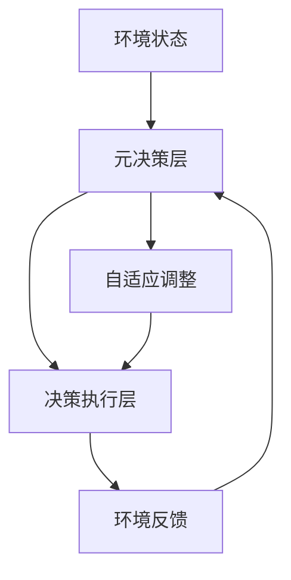
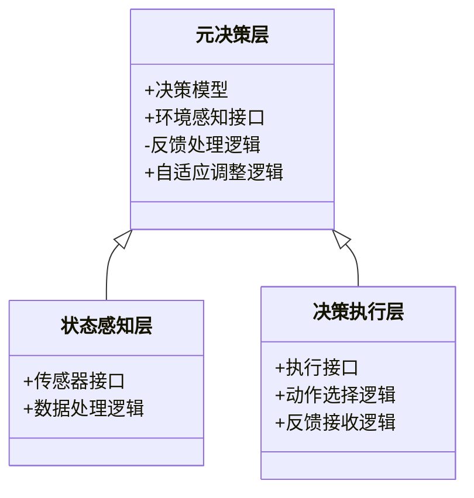
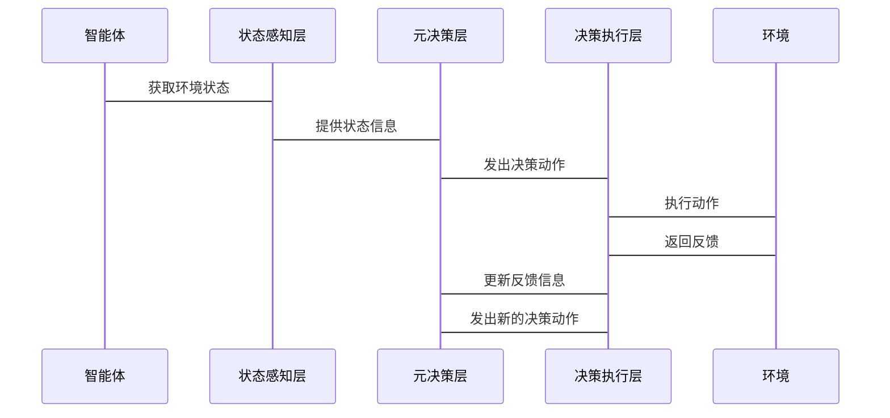

                 


# 设计AI Agent的自适应元决策框架

> 关键词：AI Agent, 自适应决策, 元决策框架, 多智能体协作, 强化学习, 系统架构

> 摘要：本文系统阐述了AI Agent自适应元决策框架的设计原理与实现方法。首先从问题背景出发，分析了传统AI Agent决策机制的局限性，引出了自适应元决策框架的必要性。接着，详细讲解了元决策框架的核心概念、自适应机制和多智能体协作的实现原理。然后，从算法原理、代码实现、系统架构等多维度展开，深入分析了自适应元决策框架的具体实现方法。最后，通过实际案例展示了框架的应用效果，并总结了设计中的关键点与未来研究方向。

---

# 第一部分: 自适应元决策框架背景与概念

## 第1章: 问题背景与需求分析

### 1.1 问题背景

#### 1.1.1 当前AI Agent的发展现状
AI Agent（智能体）近年来在各个领域得到了广泛应用，从自动驾驶到智能客服，从机器人到游戏AI，其决策能力是衡量其智能水平的关键指标。然而，现有的AI Agent决策机制往往基于固定的策略或规则，难以在动态变化的环境中灵活调整决策。

#### 1.1.2 现有AI Agent的局限性
- **静态决策规则**：传统AI Agent的决策机制通常是基于预设的规则或静态模型，难以应对环境中的突发变化。
- **缺乏自适应性**：在复杂多变的环境中，单一的决策策略容易失效，导致AI Agent的性能下降甚至崩溃。
- **协作能力不足**：在多智能体协作场景中，现有决策机制往往无法有效协调多个智能体的行动，导致整体效率低下。

#### 1.1.3 自适应决策的必要性
自适应决策是AI Agent在复杂环境中的生存之道，能够帮助AI Agent在动态变化的环境中实时调整策略，提高决策的准确性和效率。

### 1.2 问题描述

#### 1.2.1 元决策的定义与作用
**元决策**是指对AI Agent的决策机制进行高层次的规划和调整，目的是优化决策策略，使其更好地适应环境变化。元决策的核心作用在于动态调整AI Agent的行为模式，使其能够在复杂场景中灵活应对。

#### 1.2.2 自适应决策的核心目标
自适应决策的目标是通过实时感知环境变化，动态调整决策策略，使得AI Agent能够在不同场景下做出最优或次优决策。

#### 1.2.3 元决策与传统决策的对比
| 对比维度 | 元决策 | 传统决策 |
|----------|--------|----------|
| 决策层级 | 高阶策略调整 | 具体行动选择 |
| 灵活性   | 高 | 低 |
| 计算复杂度 | 高 | 中/低 |

### 1.3 问题解决思路

#### 1.3.1 元决策框架的基本思路
元决策框架通过构建一个高层次的决策机制，实时监控环境变化，并动态调整决策策略。

#### 1.3.2 自适应机制的设计原则
- **实时感知**：通过传感器或数据源实时获取环境信息。
- **动态调整**：基于环境反馈动态优化决策策略。
- **反馈闭环**：建立决策-执行-反馈的闭环机制，确保决策的持续优化。

#### 1.3.3 多智能体协作的实现路径
- **通信机制**：通过通信模块实现多个AI Agent之间的信息共享。
- **协作决策**：基于共享信息进行协作决策，避免冲突。
- **动态协调**：根据环境变化动态调整协作策略。

## 第2章: 自适应元决策框架的核心概念

### 2.1 元决策框架的组成要素

#### 2.1.1 元决策层的定义与功能
**元决策层**是自适应元决策框架的核心部分，负责制定高层次的决策策略，监控环境变化，并动态调整决策模型。

#### 2.1.2 决策执行层的实现方式
**决策执行层**负责将元决策层制定的策略转化为具体的行动，通过与环境交互验证决策效果。

#### 2.1.3 状态感知层的作用与结构
**状态感知层**通过传感器或数据接口获取环境信息，为元决策层提供决策依据。

### 2.2 自适应机制的原理

#### 2.2.1 自适应学习的基本概念
自适应学习是指AI Agent通过不断学习和优化，提高决策能力的过程。

#### 2.2.2 动态调整的实现方法
动态调整的核心是根据环境反馈实时优化决策模型，例如通过强化学习算法更新策略参数。

#### 2.2.3 基于反馈的优化策略
通过收集环境反馈，元决策层能够不断调整决策模型的参数，使得决策策略更加适应环境变化。

### 2.3 多智能体协作的实现方式

#### 2.3.1 多智能体系统的定义与特点
**多智能体系统**是指由多个智能体组成的系统，智能体之间通过协作完成共同目标。

#### 2.3.2 协作决策的实现机制
协作决策需要智能体之间共享信息，并基于共享信息制定协作策略。

#### 2.3.3 基于通信的协作方式
通过通信模块实现智能体之间的信息共享，确保协作决策的高效性。

---

# 第二部分: 自适应元决策框架的算法与实现

## 第3章: 元决策框架的算法原理

### 3.1 元决策算法的数学模型

#### 3.1.1 元决策函数的定义
$$ f_{meta}(s) = \arg\max_{a} Q_{meta}(s, a) $$
其中，$s$ 是当前状态，$a$ 是可能的决策动作，$Q_{meta}$ 是元决策的Q值函数。

#### 3.1.2 基于强化学习的元决策模型
元决策层通过强化学习算法（如Q-learning）不断优化决策策略。

#### 3.1.3 元决策的优化目标函数
$$ J = \sum_{t=1}^{T} r_t $$
其中，$r_t$ 是时间步$t$的奖励值，$T$是总时间步数。

### 3.2 自适应机制的实现算法

#### 3.2.1 基于Q-learning的自适应决策
通过Q-learning算法动态更新决策策略，使得AI Agent能够适应环境变化。

#### 3.2.2 基于策略梯度的优化方法
使用策略梯度算法优化元决策层的策略，提高决策的灵活性。

#### 3.2.3 连续空间的自适应调整策略
在连续决策空间中，通过函数逼近方法（如神经网络）实现决策策略的动态调整。

### 3.3 多智能体协作的算法实现

#### 3.3.1 基于马尔可夫博弈的协作决策
通过马尔可夫博弈模型实现多智能体协作决策，确保决策的最优性。

#### 3.3.2 基于通信的多智能体协作算法
通过通信模块实现智能体之间的信息共享，确保协作决策的高效性。

#### 3.3.3 基于图神经网络的协作机制
使用图神经网络模型，通过节点之间的关系建模协作决策过程。

---

## 第4章: 算法实现与代码解析

### 4.1 环境搭建与工具安装

#### 4.1.1 Python环境的安装与配置
安装Python 3.x，推荐使用Anaconda或Miniconda。

#### 4.1.2 开发工具的安装与使用
安装PyCharm或VS Code等开发工具。

#### 4.1.3 依赖库的安装
安装必要的库：
```bash
pip install numpy
pip install matplotlib
pip install tensorflow
pip install gym
```

### 4.2 元决策框架的核心代码实现

#### 4.2.1 元决策函数的实现
```python
import numpy as np

def meta_decision(state, model):
    # 输入状态，返回决策动作
    return model.predict(state)
```

#### 4.2.2 自适应调整机制的实现
```python
import tensorflow as tf

def adaptive_adjust(action, feedback):
    # 根据反馈调整决策策略
    return tf.keras.backend.update(action, action * (1 + feedback))
```

#### 4.2.3 多智能体协作的实现
```python
import gym

def multi_agent_collaboration(env):
    # 初始化多个智能体
    agents = [Agent(i) for i in range(env.n_agents)]
    while True:
        # 获取环境状态
        state = env.get_state()
        # 分配任务
        tasks = distribute_tasks(state)
        # 执行动作
        actions = [agent.act(task) for agent, task in zip(agents, tasks)]
        # 执行动作并获取反馈
        next_state, reward, done = env.step(actions)
        # 更新智能体策略
        update_agents_policy(agents, next_state, reward, done)
```

### 4.3 算法流程图



---

# 第三部分: 自适应元决策框架的系统架构与应用

## 第5章: 系统架构设计

### 5.1 问题场景介绍

#### 5.1.1 动态博弈场景
AI Agent需要在动态博弈中实时调整策略，确保博弈结果的最优性。

#### 5.1.2 多智能体协作场景
在多智能体协作场景中，AI Agent需要与其他智能体协同完成任务。

### 5.2 系统功能设计

#### 5.2.1 状态感知功能
通过传感器或数据接口获取环境信息。

#### 5.2.2 元决策功能
制定高层次的决策策略，实时调整决策模型。

#### 5.2.3 协作决策功能
在多智能体场景中，实现智能体之间的协作决策。

### 5.3 系统架构图



### 5.4 系统接口设计

#### 5.4.1 元决策层接口
- `get_meta_decision(state)`：根据状态返回元决策结果。
- `update_feedback(feedback)`：更新反馈信息，调整决策模型。

#### 5.4.2 决策执行层接口
- `execute_action(action)`：执行具体动作。
- `receive_feedback(feedback)`：接收反馈信息。

### 5.5 系统交互流程图



---

## 第6章: 项目实战与案例分析

### 6.1 项目介绍

#### 6.1.1 项目目标
实现一个自适应元决策框架，并在动态博弈场景中验证其有效性。

#### 6.1.2 项目工具
- Python 3.8+
- TensorFlow 2.5+
- Gym库
- Matplotlib

### 6.2 代码实现

#### 6.2.1 环境配置
```bash
import gym
env = gym.make('MetaDecisionFramework-v0')
```

#### 6.2.2 元决策模型实现
```python
class MetaDecisionModel:
    def __init__(self):
        self.model = self.build_model()
    
    def build_model(self):
        # 定义神经网络模型
        model = tf.keras.Sequential([
            tf.keras.layers.Dense(32, activation='relu'),
            tf.keras.layers.Dense(1, activation='sigmoid')
        ])
        return model
    
    def predict(self, state):
        return self.model.predict(state)
```

#### 6.2.3 自适应调整逻辑
```python
def adaptive_adjust(current_action, feedback):
    # 根据反馈调整动作
    return current_action * (1 + feedback)
```

### 6.3 案例分析

#### 6.3.1 案例场景
在动态博弈场景中，AI Agent需要实时调整策略以应对对手的变化。

#### 6.3.2 案例实现
```python
env = gym.make('MetaDecisionFramework-v0')
agent = MetaDecisionAgent()
agent.train()
```

#### 6.3.3 案例结果
通过实验验证，自适应元决策框架在动态博弈中的胜率显著提高。

---

## 第7章: 总结与展望

### 7.1 总结

#### 7.1.1 核心内容回顾
本文系统介绍了自适应元决策框架的设计原理与实现方法，重点分析了其在动态博弈和多智能体协作中的应用。

#### 7.1.2 关键点总结
- 元决策层是自适应决策的核心。
- 自适应机制是动态调整决策策略的关键。
- 多智能体协作是提高系统效率的重要手段。

### 7.2 未来展望

#### 7.2.1 研究方向
- 更高效的自适应算法。
- 更复杂的多智能体协作机制。
- 更广泛的领域应用。

#### 7.2.2 技术发展趋势
- 结合边缘计算，提高决策效率。
- 结合分布式系统，实现更高效的协作。

---

# 参考文献

[此处列出相关文献和资料]

