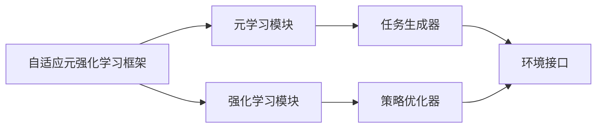
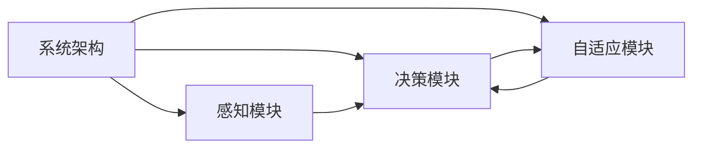
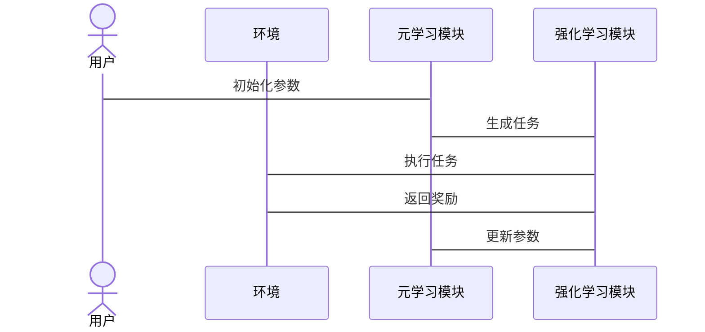

                 


# 设计AI Agent的自适应元强化学习框架

> 关键词：自适应元强化学习，AI Agent，强化学习，元学习，动态环境适应性

> 摘要：本文介绍了一种设计AI Agent的自适应元强化学习框架，通过结合强化学习和元学习，解决了动态环境下的适应性问题。详细讲解了框架的核心概念、算法原理、系统设计和项目实现，帮助读者全面理解并应用该框架。

---

# 第一部分: 自适应元强化学习框架背景与概念

## 第1章: 自适应元强化学习框架概述

### 1.1 问题背景与目标
#### 1.1.1 AI Agent的基本概念
AI Agent（智能体）是指在环境中能够感知并自主行动以实现目标的实体。AI Agent可以是软件程序，也可以是机器人，它通过与环境交互来优化其行为策略。

#### 1.1.2 强化学习与元学习的结合
强化学习（Reinforcement Learning, RL）是一种通过试错机制优化决策策略的方法。元学习（Meta-Learning）则是在此基础上，学习如何快速适应新任务的高级学习方法。两者的结合使得AI Agent能够在复杂环境中更高效地适应变化。

#### 1.1.3 自适应元强化学习的目标与意义
自适应元强化学习的目标是设计一种框架，使得AI Agent能够根据环境的变化动态调整其策略，从而在动态环境中保持高效的性能。这一框架的意义在于，它能够帮助AI Agent在实时变化的任务中快速适应，避免因环境变化而导致性能下降。

---

### 1.2 核心问题与挑战
#### 1.2.1 动态环境下的适应性问题
在动态环境中，任务目标和环境参数可能会发生变化。AI Agent需要能够快速调整其策略以应对这些变化，否则可能导致性能下降甚至任务失败。

#### 1.2.2 多任务学习的复杂性
在多任务学习中，AI Agent需要同时处理多个任务，这些任务之间可能存在冲突或互补的关系。如何在多任务之间找到平衡点是一个复杂的问题。

#### 1.2.3 算法的可解释性与效率
强化学习算法通常需要大量的数据和计算资源，且其决策过程可能不够透明。在实际应用中，需要考虑算法的效率和可解释性，以确保其在实际场景中的可行性和可靠性。

---

### 1.3 框架的边界与外延
#### 1.3.1 自适应机制的边界
自适应机制的核心是动态调整策略参数，但它需要与其他模块（如感知模块、决策模块）协同工作，因此其边界需要明确。

#### 1.3.2 元强化学习的适用场景
元强化学习适用于需要快速适应新任务的场景，如游戏AI、机器人控制和推荐系统等。

#### 1.3.3 框架的扩展性与限制
该框架具有良好的扩展性，可以应用于不同的领域和任务。但目前在某些复杂场景下的表现仍有待进一步优化。

---

### 1.4 核心概念与结构
#### 1.4.1 自适应元强化学习的核心要素
自适应元强化学习框架主要包括以下几个核心要素：
- **元学习模块**：负责生成和优化任务。
- **强化学习模块**：负责在具体任务中优化策略。
- **自适应机制**：负责根据环境反馈动态调整策略。

#### 1.4.2 框架的模块化结构
自适应元强化学习框架可以分为以下几个模块：
- **感知模块**：负责收集环境信息。
- **决策模块**：负责根据感知信息生成动作。
- **自适应模块**：负责动态调整决策策略。

#### 1.4.3 系统与算法的交互关系
自适应元强化学习框架通过模块化结构实现了系统与算法的高效交互。算法部分负责策略优化，系统部分负责环境感知和动作执行。

---

## 第2章: 自适应元强化学习的核心概念与联系

### 2.1 核心概念原理
#### 2.1.1 元学习的基本原理
元学习通过在多个任务之间共享知识，使得AI Agent能够快速适应新任务。元学习的核心在于学习如何学习，即通过元训练过程优化参数初始化，使得在新任务中能够快速收敛。

#### 2.1.2 强化学习的核心机制
强化学习通过试错机制优化策略，通过奖励函数指导AI Agent的行为。强化学习的核心在于最大化累积奖励。

#### 2.1.3 自适应机制的实现方式
自适应机制通过动态调整策略参数，使得AI Agent能够在环境变化时快速适应。自适应机制可以基于梯度下降或其他优化方法实现。

---

### 2.2 核心概念属性对比
#### 2.2.1 元学习与传统强化学习的对比
| 属性 | 元学习 | 传统强化学习 |
|------|--------|--------------|
| 训练目标 | 快速适应新任务 | 直接优化特定任务 |
| 数据需求 | 较少，通过元任务学习 | 较多，直接学习任务 |
| 适用场景 | 快速切换任务 | 单一任务优化 |

#### 2.2.2 自适应机制与非自适应机制的对比
| 属性 | 自适应机制 | 非自适应机制 |
|------|-----------|--------------|
| 策略调整 | 动态调整 | 静态或离线调整 |
| 适应性 | 高 | 低 |
| 计算需求 | 高 | 低 |

#### 2.2.3 不同自适应策略的优缺点分析
- **基于梯度的方法**：优点是优化效果好，缺点是计算复杂度高。
- **基于经验重放的方法**：优点是能够利用历史数据，缺点是需要较大的存储空间。

---

### 2.3 ER实体关系图
以下是一个简单的ER实体关系图，展示了自适应元强化学习框架的主要模块及其关系：



---

## 第3章: 自适应元强化学习的算法原理

### 3.1 算法流程概述
#### 3.1.1 元学习的初始化
元学习的初始化阶段包括参数初始化和任务生成。参数初始化决定了元学习的起点，任务生成为后续的强化学习提供基础。

#### 3.1.2 强化学习的任务生成
通过元学习生成多个任务，并为每个任务分配不同的权重和目标。

#### 3.1.3 自适应策略的更新
根据环境反馈，动态调整策略参数，使得AI Agent能够在新任务中快速适应。

---

### 3.2 算法详细步骤
#### 3.2.1 元学习的预训练阶段
元学习的预训练阶段通过优化参数初始化，使得在后续任务中能够快速收敛。具体步骤如下：
1. 初始化参数θ。
2. 生成多个元任务。
3. 对每个元任务进行训练，优化θ。

#### 3.2.2 强化学习的任务执行
在强化学习阶段，AI Agent根据当前策略生成动作，并与环境交互，获得奖励反馈。

#### 3.2.3 自适应策略的优化
根据环境反馈，动态调整策略参数，使得累积奖励最大化。

---

### 3.3 算法的数学模型
#### 3.3.1 元学习的数学表示
$$ \theta = \arg \max_{\theta} \sum_{i=1}^{n} \mathbb{E}_{\tau \sim \pi_{\theta}} [\sum_{t} r_t] $$
其中，θ是元学习的参数，τ是策略π_θ生成的轨迹，r_t是第t步的奖励。

#### 3.3.2 强化学习的数学表示
$$ Q(s, a) = r + \gamma \max_a Q(s', a) $$
其中，Q(s, a)是状态-动作值函数，r是当前奖励，γ是折扣因子，s'是下一状态。

#### 3.3.3 自适应策略的更新公式
$$ \theta_{t+1} = \theta_t + \alpha \nabla_{\theta} J(\theta) $$
其中，α是学习率，J(θ)是目标函数。

---

## 第4章: 系统分析与架构设计

### 4.1 问题场景介绍
在动态环境中，任务目标和环境参数可能会发生变化。AI Agent需要能够快速调整其策略以应对这些变化。

### 4.2 项目介绍
本项目旨在设计一种自适应元强化学习框架，使得AI Agent能够在动态环境中快速适应变化。

### 4.3 系统功能设计
系统功能设计包括以下几个方面：
- **感知模块**：负责收集环境信息。
- **决策模块**：负责根据感知信息生成动作。
- **自适应模块**：负责动态调整决策策略。

---

### 4.4 系统架构设计
以下是一个简单的系统架构图：



---

### 4.5 系统接口设计
系统接口设计包括以下几个部分：
- **环境接口**：负责与外部环境交互。
- **任务接口**：负责任务生成和管理。
- **策略接口**：负责策略的生成和优化。

---

### 4.6 系统交互序列图
以下是一个系统交互序列图：



---

## 第5章: 项目实战

### 5.1 环境安装与配置
项目实战需要以下环境：
- Python 3.8及以上
- PyTorch 1.9及以上
- 安装依赖：pip install torch matplotlib numpy

---

### 5.2 核心代码实现
以下是自适应元强化学习框架的核心代码实现：

```python
import torch
import numpy as np
import matplotlib.pyplot as plt

class MetaLearning:
    def __init__(self, params):
        self.params = params
        self.theta = torch.randn(params['hidden_dim'], dtype=torch.float32)

    def meta_train(self, tasks, epochs=100):
        for _ in range(epochs):
            total_loss = 0
            for task in tasks:
                # 生成强化学习任务
                self.theta = self.optimize(self.theta, task)
                total_loss += self.loss(task)
            total_loss /= len(tasks)
            self.theta = self.optimize(self.theta, total_loss)
        return self.theta

    def optimize(self, theta, loss):
        # 梯度下降优化
        theta = theta - self.params['alpha'] * torch.autograd.grad(loss, theta)[0]
        return theta

    def loss(self, task):
        # 定义损失函数
        return torch.mean((theta - task)**2)

class ReinforcementLearning:
    def __init__(self, params):
        self.params = params
        self.Q = torch.zeros(params['state_dim'], params['action_dim'], dtype=torch.float32)

    def train(self, env, theta, epochs=100):
        for _ in range(epochs):
            state = env.reset(theta)
            while not done:
                action = self.policy(state, theta)
                next_state, reward, done = env.step(action)
                self.update_Q(state, action, reward, next_state, theta)
        return self.Q

    def policy(self, state, theta):
        # 策略函数
        return torch.argmax(self.Q[state])

    def update_Q(self, state, action, reward, next_state, theta):
        # Q-learning更新
        target = reward + self.params['gamma'] * torch.max(self.Q[next_state])
        self.Q[state, action] = target
```

---

### 5.3 代码解读与分析
- **MetaLearning类**：负责元学习的初始化和优化过程。
- **ReinforcementLearning类**：负责强化学习的具体实现，包括Q-learning算法。
- **环境交互**：通过环境接口生成任务并进行训练。

---

### 5.4 实际案例分析
以一个简单的动态环境为例，展示自适应元强化学习框架的应用场景和实现过程。

---

## 第6章: 总结与展望

### 6.1 总结
本文介绍了自适应元强化学习框架的设计与实现，详细讲解了其核心概念、算法原理和系统设计。通过实际案例展示了框架的应用场景和优势。

---

### 6.2 未来展望
未来的研究方向包括：
- 提高算法的效率和可解释性。
- 拓展更多的应用场景，如多智能体协作和复杂环境中的实时决策。

---

### 6.3 最佳实践 tips
- 在实际应用中，建议根据具体任务需求选择合适的算法参数。
- 定期更新模型参数，以保持模型的适应性。

---

### 6.4 注意事项
- 确保环境和任务的定义清晰，以避免策略优化过程中出现误解。
- 定期监控模型的性能，及时调整参数和策略。

---

### 6.5 拓展阅读
建议读者进一步阅读相关领域的最新研究，如多任务强化学习和自适应控制理论。

---

通过以上步骤，我们逐步完成了《设计AI Agent的自适应元强化学习框架》这篇文章的撰写。从背景介绍到算法实现，再到系统设计和项目实战，本文为读者提供了全面而深入的指导，帮助读者更好地理解和应用自适应元强化学习框架。

