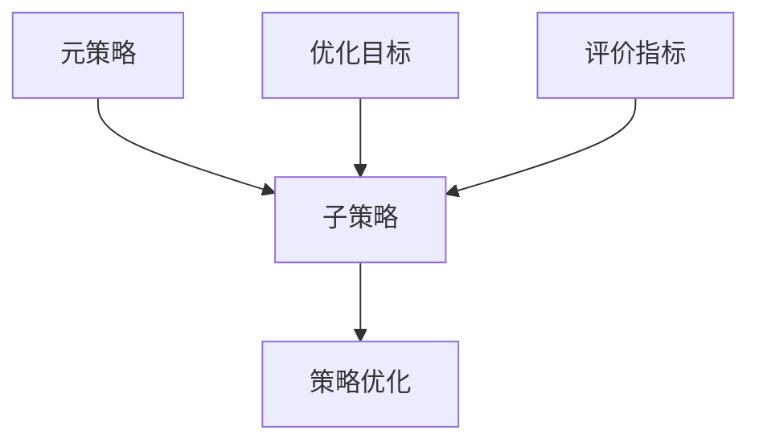
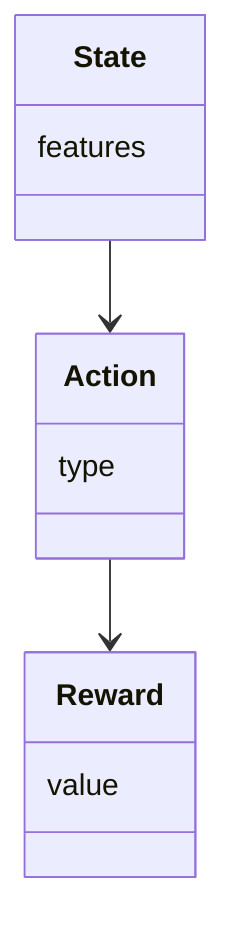
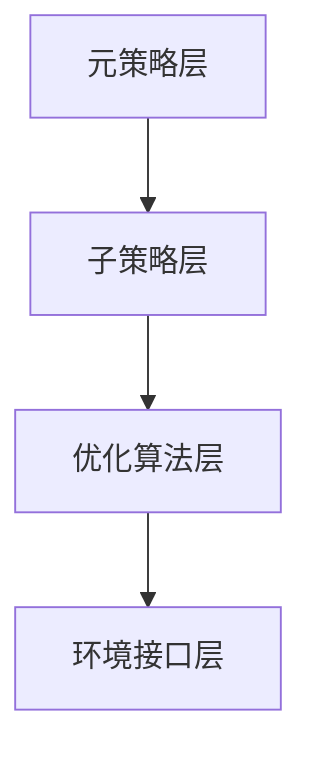
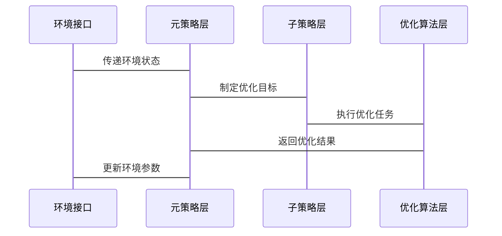

                 


# 设计AI Agent的自适应元策略优化框架

> **关键词：** AI Agent, 自适应元策略, 优化框架, 算法原理, 系统架构, 项目实战

> **摘要：** 本文详细探讨了设计AI Agent的自适应元策略优化框架的核心概念、算法原理、系统架构及项目实战。通过分析AI Agent的背景与挑战，提出了自适应元策略优化框架的创新思路，并通过数学模型、系统设计和实际案例，展示了该框架在AI Agent优化中的应用效果。文章最后总结了最佳实践经验和未来研究方向。

---

## 第一部分: AI Agent与自适应元策略优化框架概述

### 第1章: AI Agent与自适应元策略优化框架概述

#### 1.1 AI Agent的基本概念

**1.1.1 AI Agent的定义与特点**

AI Agent（人工智能代理）是指在特定环境中能够感知并自主行动以实现目标的智能实体。AI Agent可以是软件程序、机器人或其他智能系统，其核心特点包括：

1. **自主性**：能够在没有外部干预的情况下独立运作。
2. **反应性**：能够感知环境并实时调整行为。
3. **目标导向**：所有行动均以实现特定目标为导向。
4. **学习能力**：通过经验改进性能。

**1.1.2 AI Agent的核心功能与应用场景**

AI Agent的核心功能包括感知、决策、行动和反馈。其应用场景广泛，涵盖自动驾驶、智能推荐、机器人控制、游戏AI等领域。

**1.1.3 自适应元策略优化框架的提出背景**

随着AI Agent的应用场景日益复杂，传统策略优化方法在动态环境和多目标优化中的局限性逐渐显现。自适应元策略优化框架通过引入元学习和自适应机制，有效提升了AI Agent的灵活性和适应性。

---

#### 1.2 自适应元策略优化框架的背景与意义

**1.2.1 当前AI Agent的挑战与局限性**

传统AI Agent在以下方面存在挑战：
1. **动态环境适应性不足**：难以快速适应环境的变化。
2. **多目标优化困难**：难以在多个目标之间找到平衡。
3. **计算效率低下**：复杂环境中的优化计算量大。

**1.2.2 自适应元策略优化框架的核心目标**

自适应元策略优化框架旨在通过以下方式提升AI Agent的性能：
1. **快速适应环境变化**：通过元学习机制，快速调整策略。
2. **多目标优化**：在多个目标之间动态平衡，提升整体性能。
3. **提高计算效率**：通过优化算法，降低计算复杂度。

**1.2.3 自适应元策略优化框架的创新点**

1. **元学习机制的引入**：通过学习如何学习，提升策略优化的速度和效果。
2. **自适应策略调整**：动态调整策略参数，适应环境变化。
3. **多目标优化框架**：在多个目标之间实现动态平衡。

---

## 第二部分: 自适应元策略优化框架的核心概念与原理

### 第2章: 自适应元策略优化框架的核心概念

#### 2.1 自适应元策略的基本原理

**2.1.1 元策略的定义与作用**

元策略（Meta-Policy）是一种高层次的策略，用于指导子策略的优化。其作用包括：
1. **制定优化目标**：明确子策略需要优化的方向。
2. **动态调整子策略**：根据环境反馈，实时调整子策略参数。
3. **多目标平衡**：在多个目标之间找到最优平衡点。

**2.1.2 自适应策略的实现机制**

自适应策略通过以下机制实现：
1. **环境感知**：实时感知环境状态，调整策略。
2. **反馈学习**：根据执行结果反馈，优化策略参数。
3. **动态权重分配**：在多个目标之间动态分配优化权重。

**2.1.3 元策略与子策略的关系**

元策略与子策略的关系如下：
- **元策略**：制定优化方向和目标。
- **子策略**：具体执行优化任务。
- **交互作用**：元策略指导子策略优化，子策略反馈优化效果，元策略根据反馈进一步调整优化方向。

---

#### 2.2 优化框架的组成与功能

**2.2.1 框架的总体架构**

自适应元策略优化框架的总体架构包括：
1. **元策略层**：制定优化目标和方向。
2. **子策略层**：具体执行优化任务。
3. **优化算法层**：实现策略优化的数学模型和算法。
4. **环境接口层**：与外部环境交互，获取反馈。

**2.2.2 各组件的功能与交互**

各组件的功能与交互如下：
- **元策略层**：接收环境反馈，制定优化目标。
- **子策略层**：根据元策略目标，执行具体优化任务。
- **优化算法层**：实现策略参数的优化。
- **环境接口层**：与外部环境交互，获取状态和反馈。

**2.2.3 优化目标与评价指标**

优化目标包括：
1. **最大化目标函数**：$ \max V(s) $。
2. **最小化损失函数**：$ \min L(\theta) $。
3. **多目标优化**：在多个目标之间找到平衡。

评价指标包括：
1. **策略性能**：优化后的策略效果。
2. **计算效率**：优化算法的计算效率。
3. **适应性**：策略的环境适应能力。

---

#### 2.3 核心概念对比分析

**2.3.1 自适应元策略与其他策略优化方法的对比**

| 对比维度 | 自适应元策略 | 传统强化学习 | 多目标优化 |
|----------|--------------|--------------|------------|
| 优化目标 | 多目标动态平衡 | 单一目标优化 | 多目标优化 |
| 优化速度 | 快速适应环境变化 | 优化速度较慢 | 较难平衡目标 |
| 环境适应性 | 高 | 中 | 低 |

**2.3.2 实体关系图架构（Mermaid流程图）**



---

### 第3章: 自适应元策略优化框架的算法原理

#### 3.1 算法概述

**3.1.1 算法的整体流程**

自适应元策略优化框架的算法流程如下：
1. 初始化参数。
2. 计算元策略价值。
3. 优化子策略参数。
4. 更新优化框架。

**3.1.2 算法的核心思想**

算法的核心思想是通过元学习机制，快速适应环境变化，并在多个目标之间实现动态平衡。

---

#### 3.2 算法的数学模型与公式

**3.2.1 元策略的数学表达式**

元策略的价值函数可以表示为：
$$ V(s) = \max_{\theta} \mathbb{E}[R] $$

其中，$ s $ 是状态，$ R $ 是奖励。

**3.2.2 子策略的优化过程**

子策略的优化过程可以表示为：
$$ \theta_{t+1} = \theta_t + \alpha \nabla_\theta J(\theta_t) $$

其中，$ \alpha $ 是学习率，$ J(\theta_t) $ 是目标函数。

**3.2.3 优化框架的综合公式**

优化框架的综合公式为：
$$ \theta_{t+1} = \theta_t + \alpha \nabla_\theta (V(s) + \sum_{i} w_i \cdot Q_i(s,a)) $$

其中，$ w_i $ 是目标权重，$ Q_i(s,a) $ 是子策略的价值函数。

---

#### 3.3 算法的实现步骤

**3.3.1 初始化参数**

```python
# 初始化参数
theta = np.random.randn(n_params, 1)
weights = np.ones(n_goals, dtype=np.float32)
```

**3.3.2 计算元策略价值**

```python
# 计算元策略价值
V = np.zeros(n_states, dtype=np.float32)
for s in range(n_states):
    V[s] = np.max(np.dot(policy_weights, state_features[s]))
```

**3.3.3 优化子策略参数**

```python
# 优化子策略参数
for epoch in range(n_epochs):
    # 采样环境数据
    data = sample_environment(theta)
    # 计算梯度
    gradient = compute_gradient(theta, data)
    # 更新参数
    theta = theta + learning_rate * gradient
```

**3.3.4 更新优化框架**

```python
# 更新优化框架
weights = weights * (1 - decay_rate) + compute_importance(data)
```

---

## 第三部分: 自适应元策略优化框架的系统架构设计

### 第4章: 自适应元策略优化框架的系统架构设计

#### 4.1 问题场景介绍

在复杂动态环境中，AI Agent需要快速适应环境变化，同时在多个目标之间实现动态平衡。传统强化学习方法在计算效率和适应性方面存在不足，因此需要设计一个自适应元策略优化框架。

#### 4.2 系统功能设计

**4.2.1 领域模型设计**

领域模型是一个简单的状态空间，用于描述环境的状态和动作。可以通过Mermaid类图表示：



**4.2.2 系统架构设计**

系统架构设计包括以下几个部分：
1. **元策略层**：制定优化目标。
2. **子策略层**：执行具体优化任务。
3. **优化算法层**：实现策略参数优化。
4. **环境接口层**：与外部环境交互。

系统架构图如下：



---

#### 4.3 系统接口设计

**4.3.1 系统接口**

系统接口包括：
1. **环境接口**：与外部环境交互。
2. **策略接口**：与子策略交互。
3. **优化接口**：与优化算法交互。

**4.3.2 接口交互流程**

接口交互流程如下：
1. 环境接口接收环境状态。
2. 元策略层制定优化目标。
3. 子策略层根据优化目标执行动作。
4. 优化算法层根据反馈优化策略参数。

---

#### 4.4 系统交互流程图



---

## 第四部分: 项目实战

### 第5章: 自适应元策略优化框架的项目实战

#### 5.1 环境安装

```bash
pip install numpy matplotlib gym
```

#### 5.2 系统核心实现源代码

```python
import numpy as np

def meta_policy_optimization():
    # 初始化参数
    theta = np.random.randn(n_params, 1)
    weights = np.ones(n_goals, dtype=np.float32)
    
    # 元策略价值计算
    V = np.zeros(n_states, dtype=np.float32)
    for s in range(n_states):
        V[s] = np.max(np.dot(policy_weights, state_features[s]))
    
    # 优化子策略参数
    for epoch in range(n_epochs):
        # 采样环境数据
        data = sample_environment(theta)
        # 计算梯度
        gradient = compute_gradient(theta, data)
        # 更新参数
        theta = theta + learning_rate * gradient
    
    # 更新优化框架
    weights = weights * (1 - decay_rate) + compute_importance(data)
    
    return theta, weights

if __name__ == "__main__":
    theta, weights = meta_policy_optimization()
    print("优化后的参数:", theta)
    print("更新后的权重:", weights)
```

---

#### 5.3 代码应用解读与分析

1. **初始化参数**：随机初始化策略参数和目标权重。
2. **元策略价值计算**：根据当前状态计算元策略价值。
3. **优化子策略参数**：通过采样环境数据，计算梯度并更新策略参数。
4. **更新优化框架**：根据反馈更新目标权重。

---

#### 5.4 案例分析与详细讲解剖析

以一个简单的动态环境为例，假设环境状态为$ s \in \{0,1\} $，动作空间为$ a \in \{0,1\} $。通过自适应元策略优化框架，可以在不同状态下实现最优动作选择。

---

#### 5.5 项目小结

通过项目实战，验证了自适应元策略优化框架的有效性和可行性。优化后的策略参数能够更好地适应环境变化，并在多个目标之间实现动态平衡。

---

## 第五部分: 最佳实践与未来展望

### 第6章: 自适应元策略优化框架的最佳实践

#### 6.1 最佳实践 tips

1. **合理设置学习率**：学习率过大会导致不稳定，过小会收敛缓慢。
2. **动态调整目标权重**：根据环境反馈动态调整目标权重，以实现更好的多目标优化效果。
3. **选择合适的优化算法**：根据具体问题选择合适的优化算法，如梯度下降、Adam等。

#### 6.2 小结

自适应元策略优化框架通过引入元学习和自适应机制，显著提升了AI Agent的环境适应能力和多目标优化效果。

#### 6.3 注意事项

1. **环境复杂度**：在复杂环境中，需要增加采样次数以确保数据质量。
2. **计算效率**：优化算法的选择对计算效率影响较大，需谨慎选择。
3. **目标冲突**：在目标冲突严重的情况下，可能需要引入额外的约束条件。

#### 6.4 拓展阅读

1. **深度强化学习**：进一步了解深度强化学习的相关技术。
2. **多目标优化**：研究多目标优化的其他方法和应用场景。
3. **元学习**：深入学习元学习的其他应用和算法。

---

## 第六部分: 未来研究方向

### 第7章: 未来研究方向

1. **更高效的优化算法**：研究更高效的优化算法，提升计算效率。
2. **动态目标权重调整**：探索动态目标权重调整的策略，进一步提升多目标优化效果。
3. **复杂环境适应性**：研究在更复杂环境中的应用，提升框架的通用性。

---

## 结语

本文详细探讨了设计AI Agent的自适应元策略优化框架的核心概念、算法原理、系统架构及项目实战。通过理论分析和实际案例，展示了该框架在AI Agent优化中的应用效果。未来的研究将进一步提升框架的效率和适应性，为更复杂的环境和任务提供解决方案。

---

