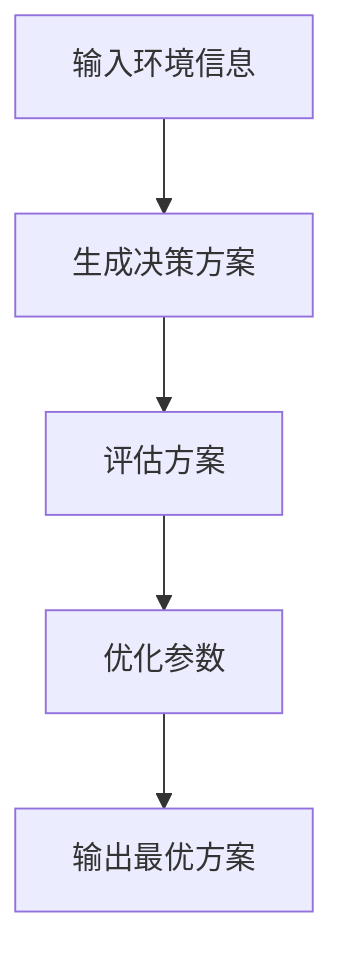
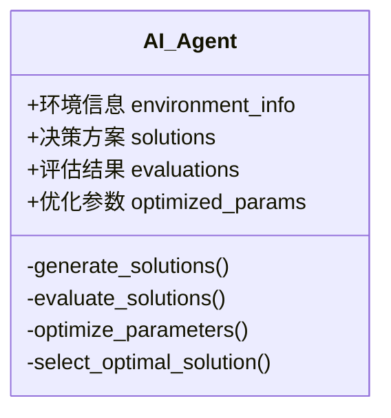
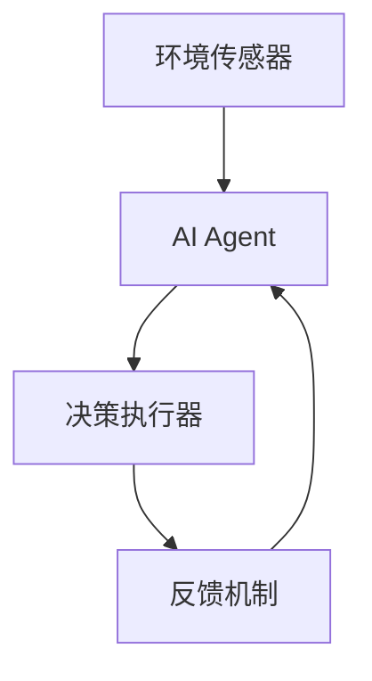
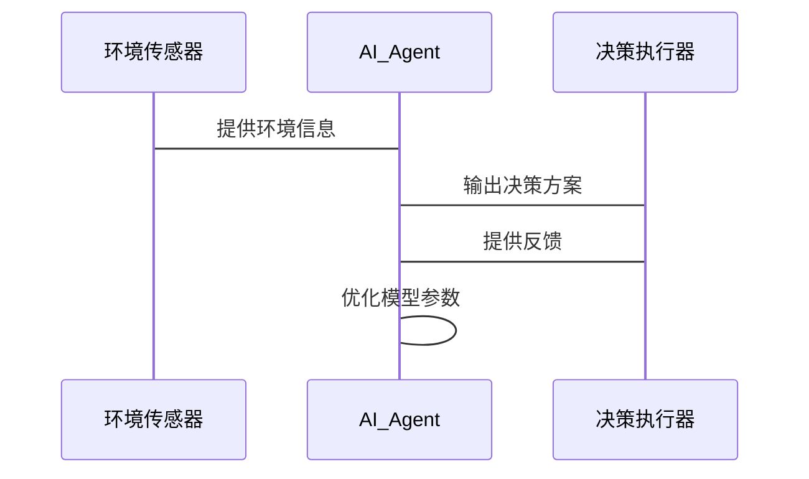

                 


# 设计AI Agent的自适应批判性思维模型

## 关键词：AI Agent，自适应批判性思维，算法原理，系统架构，项目实战

## 摘要：  
本文旨在探讨如何设计一个基于自适应批判性思维的AI Agent模型。通过分析AI Agent的基本概念、自适应批判性思维模型的核心原理，结合具体的算法实现和系统架构设计，本文详细阐述了如何构建一个能够自我优化、具备批判性思维能力的AI Agent。文章最后通过实际案例展示了模型的应用，并提出了相关的最佳实践建议。

---

## 第1章: AI Agent的基本概念与应用

### 1.1 AI Agent的基本概念  
AI Agent（人工智能代理）是一种能够感知环境、自主决策并执行任务的智能实体。它通过传感器获取信息，利用推理能力做出决策，并通过执行器与环境交互。AI Agent的核心功能包括感知、推理、规划和执行。

#### 1.1.1 什么是AI Agent  
AI Agent是一种智能系统，能够根据环境信息做出决策并执行动作。它具有以下特点：  
- **自主性**：无需外部干预，自主完成任务。  
- **反应性**：能够实时感知环境并做出反应。  
- **目标导向**：以特定目标为导向，优化决策过程。  

#### 1.1.2 AI Agent的分类  
AI Agent可以根据智能水平分为以下几类：  
- **反应式AI Agent**：基于当前感知做出反应，适用于简单任务。  
- **认知式AI Agent**：具备推理、规划能力，适用于复杂任务。  
- **学习型AI Agent**：能够通过经验优化自身性能。  

#### 1.1.3 AI Agent的核心功能与特点  
AI Agent的核心功能包括：  
- **感知**：通过传感器获取环境信息。  
- **推理**：基于感知信息进行逻辑推理。  
- **规划**：制定行动方案以实现目标。  
- **执行**：通过执行器执行决策。  

---

### 1.2 批判性思维模型的定义与作用  
批判性思维是一种通过分析、评估和判断来得出合理结论的思维过程。在AI Agent中，批判性思维模型能够帮助AI Agent做出更合理的决策。

#### 1.2.1 批判性思维的基本概念  
批判性思维强调对信息的分析和评估，包括以下步骤：  
1. **分析**：分解问题，识别关键因素。  
2. **评估**：评估信息的合理性、相关性和可靠性。  
3. **判断**：基于评估结果做出合理结论。  

#### 1.2.2 批判性思维在AI Agent中的应用  
在AI Agent中，批判性思维模型用于优化决策过程，例如：  
- **多目标决策**：在多个目标冲突时，选择最优解。  
- **不确定性处理**：在信息不完全时，评估不同选项的优劣。  

#### 1.2.3 自适应批判性思维模型的必要性  
自适应批判性思维模型能够根据环境变化动态调整决策策略，提升AI Agent的灵活性和适应性。

---

### 1.3 AI Agent与自适应批判性思维模型的结合  
将自适应批判性思维模型集成到AI Agent中，能够使其具备更强的自主决策能力和问题解决能力。

#### 1.3.1 问题背景与目标  
传统AI Agent在复杂动态环境中容易面临决策失误的问题。自适应批判性思维模型的引入，旨在提升AI Agent的决策质量。

#### 1.3.2 解决方案概述  
通过设计一个自适应批判性思维模型，AI Agent能够根据环境变化动态调整决策策略。

#### 1.3.3 边界与外延  
- **边界**：模型仅针对AI Agent的决策过程进行优化，不涉及感知和执行部分。  
- **外延**：模型可以应用于各种AI Agent场景，如机器人、自动驾驶等。  

#### 1.3.4 概念结构与核心要素  
自适应批判性思维模型的核心要素包括：  
- **自适应机制**：动态调整决策策略。  
- **批判性思维模块**：分析和评估决策方案。  
- **反馈机制**：根据执行结果优化模型。  

---

## 第2章: 自适应批判性思维模型的核心概念与联系  

### 2.1 模型的核心原理  
自适应批判性思维模型通过动态调整决策策略，帮助AI Agent做出更合理的决策。

#### 2.1.1 自适应机制的原理  
自适应机制通过反馈学习不断优化模型参数，提升决策的准确性。

#### 2.1.2 批判性思维的实现方式  
批判性思维模块通过对多个决策方案进行评估，选择最优解。

#### 2.1.3 模型的整体架构  
模型的整体架构包括输入层、处理层和输出层，各层协同完成决策过程。

---

### 2.2 核心概念的属性特征对比  

#### 2.2.1 自适应机制的属性  
- **动态性**：能够根据环境变化调整参数。  
- **学习性**：通过反馈优化模型。  

#### 2.2.2 批判性思维的属性  
- **分析性**：对决策方案进行深入分析。  
- **评估性**：评估方案的优劣。  

#### 2.2.3 两者属性的对比分析  
| 属性 | 自适应机制 | 批判性思维 |  
|------|------------|------------|  
| 动态性 | 高 | 低 |  
| 学习性 | 高 | 中 |  
| 分析性 | 中 | 高 |  
| 评估性 | 中 | 高 |  

---

### 2.3 ER实体关系图架构  

#### 2.3.1 实体定义  
- **决策方案**：可能的行动方案。  
- **评估结果**：方案的评估指标。  
- **优化参数**：模型的优化参数。  

#### 2.3.2 实体关系分析  
决策方案通过评估结果影响优化参数，优化参数反过来影响决策方案的选择。

#### 2.3.3 ER图展示  
```mermaid
erd
  entity(决策方案) {
    --> 技术指标
    --> 经济指标
  }
  entity(评估结果) {
    --> 决策方案
    --> 优化参数
  }
  entity(优化参数) {
    --> 决策方案
  }
```

---

## 第3章: 自适应批判性思维模型的算法原理  

### 3.1 算法概述  
自适应批判性思维模型的算法包括输入处理、方案评估和参数优化三个阶段。

#### 3.1.1 算法的输入与输出  
- **输入**：环境信息、任务目标。  
- **输出**：最优决策方案。  

#### 3.1.2 算法的训练过程  
1. **输入处理**：获取环境信息。  
2. **方案生成**：生成多个决策方案。  
3. **方案评估**：评估每个方案的优劣。  
4. **参数优化**：根据评估结果优化模型参数。  

#### 3.1.3 算法的优化策略  
- **反馈学习**：根据执行结果优化模型。  
- **动态调整**：根据环境变化调整决策策略。  

---

### 3.2 算法流程图  

#### 3.2.1 流程图展示  


---

### 3.3 算法实现代码  

#### 3.3.1 Python代码实现  
```python
def adaptive_critical_thinking_agent(environment_info):
    # 生成决策方案
    solutions = generate_solutions(environment_info)
    # 评估方案
    evaluations = evaluate_solutions(solutions)
    # 优化参数
    optimized_params = optimize_parameters(evaluations)
    # 输出最优方案
    return select_optimal_solution(solutions, evaluations, optimized_params)
```

---

### 3.4 数学模型与公式解析  

#### 3.4.1 损失函数  
$$L = \sum_{i=1}^{n} (y_i - \hat{y_i})^2$$  
其中，$y_i$是真实值，$\hat{y_i}$是预测值。  

#### 3.4.2 优化器  
$$\theta_{t+1} = \theta_t - \eta \cdot \frac{\partial L}{\partial \theta_t}$$  
其中，$\eta$是学习率，$\frac{\partial L}{\partial \theta_t}$是损失函数关于参数$\theta_t$的导数。  

---

## 第4章: 系统分析与架构设计方案  

### 4.1 问题场景介绍  
AI Agent需要在动态环境中做出决策，例如自动驾驶车辆需要实时调整行驶路线。

### 4.2 系统功能设计  

#### 4.2.1 领域模型类图  


---

### 4.3 系统架构设计  

#### 4.3.1 系统架构图  


---

### 4.4 系统接口设计  

#### 4.4.1 接口描述  
- **输入接口**：接收环境信息。  
- **输出接口**：输出决策方案。  
- **反馈接口**：接收执行结果。  

---

### 4.5 系统交互图  

#### 4.5.1 序列图  


---

## 第5章: 项目实战  

### 5.1 环境安装  

#### 5.1.1 安装Python和依赖库  
```bash
pip install numpy matplotlib scikit-learn
```

---

### 5.2 系统核心实现源代码  

#### 5.2.1 核心代码实现  
```python
def generate_solutions(environment_info):
    # 根据环境信息生成多个决策方案
    return [solution1, solution2, solution3]

def evaluate_solutions(solutions):
    # 评估每个方案的优劣
    return {solution1: 0.8, solution2: 0.7, solution3: 0.9}

def optimize_parameters(evaluations):
    # 根据评估结果优化模型参数
    return optimized_params

def select_optimal_solution(solutions, evaluations, optimized_params):
    # 根据优化参数选择最优方案
    return max(evaluations, key=lambda k: evaluations[k])
```

---

### 5.3 代码应用解读与分析  

#### 5.3.1 代码功能说明  
上述代码实现了自适应批判性思维模型的核心功能，包括方案生成、评估、参数优化和最优方案选择。

---

### 5.4 实际案例分析  

#### 5.4.1 案例描述  
以自动驾驶车辆为例，AI Agent需要实时调整行驶路线以应对交通变化。

#### 5.4.2 案例分析  
在动态交通中，AI Agent通过自适应批判性思维模型评估多个行驶方案，选择最优路线。

---

### 5.5 项目小结  
通过实际案例分析，可以验证自适应批判性思维模型的有效性，提升AI Agent的决策能力。

---

## 第6章: 最佳实践、小结与注意事项  

### 6.1 最佳实践  

#### 6.1.1 模型优化建议  
- 定期更新模型参数，保持模型的适应性。  
- 结合实际场景调整模型参数，提升模型性能。  

#### 6.1.2 代码实现建议  
- 使用现有库（如Scikit-learn）优化模型。  
- 通过日志记录优化过程，便于调试。  

---

### 6.2 小结  
本文详细探讨了如何设计一个基于自适应批判性思维的AI Agent模型，涵盖了模型的设计原理、算法实现和实际应用。

---

### 6.3 注意事项  

#### 6.3.1 模型局限性  
- 自适应批判性思维模型在复杂场景中可能面临计算开销大的问题。  
- 模型的优化需要大量数据支持，数据不足时可能影响模型性能。  

#### 6.3.2 使用建议  
- 在实际应用中，结合具体场景优化模型参数。  
- 定期更新模型，保持模型的适应性。  

---

### 6.4 拓展阅读  
推荐阅读以下文献，深入了解自适应批判性思维模型的应用：  
1. Russell, S., & Norvig, P. (2010). Artificial Intelligence: A Modern Approach.  
2. Searle, J. R. (1980). The Chinese Room Argument.  

---

## 结语  
通过本文的详细阐述，读者可以全面了解如何设计一个基于自适应批判性思维的AI Agent模型，并将其应用于实际场景中。希望本文能够为相关领域的研究和实践提供有价值的参考。

