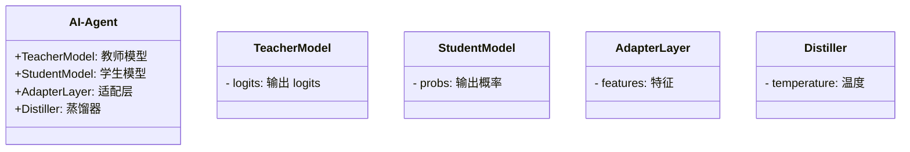

                 

<think>
好的，我将按照您的要求逐步构建《设计AI Agent的自适应知识蒸馏与迁移》的技术博客文章。

---

# 设计AI Agent的自适应知识蒸馏与迁移

---

> **关键词**：AI Agent、知识蒸馏、知识迁移、自适应学习、深度学习、迁移学习  
> **摘要**：  
> 在AI Agent设计中，自适应知识蒸馏与迁移是实现高效知识传递和模型优化的关键技术。本文从背景、核心概念、算法原理、系统架构到项目实战，系统性地阐述了自适应知识蒸馏与迁移的原理和应用。通过结合深度学习与迁移学习，本文提出了基于自适应蒸馏的迁移方法，旨在提升AI Agent在不同场景下的泛化能力和适应性。

---

## 第1章 AI Agent的背景与核心概念

### 1.1 AI Agent的基本概念

#### 1.1.1 什么是AI Agent
AI Agent（人工智能代理）是指在特定环境中能够感知并自主行动以实现目标的智能实体。它可以是一个软件程序、机器人或其他智能系统。AI Agent的核心目标是通过感知环境、做出决策并执行动作，以实现预定的目标。

#### 1.1.2 AI Agent的核心特点
- **自主性**：能够在没有外部干预的情况下自主运行。
- **反应性**：能够实时感知环境并做出响应。
- **目标导向**：所有行为均以实现特定目标为导向。
- **学习能力**：通过与环境的交互不断优化自身的知识和能力。

#### 1.1.3 AI Agent的分类与应用场景
AI Agent可以分为简单反射型Agent、基于模型的反射型Agent、目标驱动型Agent和效用驱动型Agent。其应用场景包括自动驾驶、智能助手、推荐系统、机器人控制等领域。

---

### 1.2 自适应知识蒸馏的背景与问题背景

#### 1.2.1 知识蒸馏的基本概念
知识蒸馏是一种将复杂模型（教师模型）的知识迁移到简单模型（学生模型）的技术。其核心思想是通过教师模型的软目标概率分布，引导学生模型进行学习。

#### 1.2.2 自适应知识蒸馏的必要性
在AI Agent设计中，随着模型复杂度的增加，直接训练小型模型往往难以达到理想效果。通过自适应知识蒸馏，可以有效降低模型复杂性，同时保持甚至提升性能。

#### 1.2.3 问题描述与目标设定
- **问题描述**：如何设计一种自适应的知识蒸馏方法，使学生模型能够根据环境动态调整学习策略。
- **目标设定**：提出一种基于环境反馈的自适应蒸馏方法，实现动态优化的学生模型训练。

---

### 1.3 知识迁移的核心问题

#### 1.3.1 知识迁移的基本概念
知识迁移是指将一个领域学到的知识应用到另一个相关领域的技术。其核心在于发现不同任务之间的共同特征，从而减少对新任务的训练数据依赖。

#### 1.3.2 知识迁移的挑战与解决方案
- **挑战**：领域差异、数据不足、任务多样性。
- **解决方案**：设计领域适应层，利用迁移学习算法（如CycleGAN、MMD）减少领域差异。

#### 1.3.3 自适应知识蒸馏与迁移的结合
通过结合蒸馏和迁移学习，可以实现跨任务的知识高效传递和自适应优化。

---

### 1.4 本章小结

本章从AI Agent的基本概念出发，介绍了自适应知识蒸馏与迁移的核心背景和问题。通过分析知识蒸馏和迁移学习的背景，明确了自适应蒸馏与迁移的核心目标。下一章将深入探讨自适应知识蒸馏与迁移的核心概念及其联系。

---

## 第2章 自适应知识蒸馏与迁移的核心概念

### 2.1 自适应知识蒸馏的原理

#### 2.1.1 知识蒸馏的基本原理
知识蒸馏通过教师模型生成软目标概率分布，学生模型通过最小化预测分布与软目标之间的差异来学习。

#### 2.1.2 自适应蒸馏的核心机制
- **动态调整温度**：根据环境反馈动态调整蒸馏温度，以平衡分类性能和类别区分度。
- **动态选择样本**：基于环境反馈动态选择对当前任务最有帮助的样本进行蒸馏。

#### 2.1.3 自适应蒸馏与传统蒸馏的对比
| 对比维度 | 自适应蒸馏 | 传统蒸馏 |
|----------|------------|-----------|
| 温度调整 | 动态调整    | 静态固定  |
| 样本选择 | 动态选择    | 批量选择  |
| 环境适应 | 能够适应    | 无法适应  |

---

### 2.2 知识迁移的核心原理

#### 2.2.1 知识迁移的基本原理
知识迁移通过在源任务和目标任务之间建立映射，减少领域差异，提升模型的泛化能力。

#### 2.2.2 自适应迁移的核心机制
- **领域适应层**：设计适配层以减少源域和目标域的差异。
- **自适应特征提取**：通过对抗训练等方式实现跨域特征的自适应提取。

#### 2.2.3 自适应迁移与传统迁移的对比
| 对比维度 | 自适应迁移 | 传统迁移 |
|----------|------------|-----------|
| 特征提取 | 自适应提取  | 静态提取  |
| 环境适应 | 能够适应    | 无法适应  |
| 迁移效果 | 更优        | 较差      |

---

### 2.3 自适应知识蒸馏与迁移的关系

#### 2.3.1 蒸馏与迁移的结合
通过结合蒸馏和迁移，可以实现跨任务的知识高效传递和自适应优化。

#### 2.3.2 自适应机制在蒸馏与迁移中的作用
自适应机制通过动态调整蒸馏温度和迁移策略，实现模型在不同环境下的最优表现。

#### 2.3.3 蒸馏与迁移的协同优化
通过协同优化蒸馏和迁移过程，可以实现模型的端到端自适应优化。

---

### 2.4 本章小结

本章深入探讨了自适应知识蒸馏与迁移的核心原理及其相互关系。通过对比分析，明确了自适应机制在蒸馏和迁移中的重要性。下一章将从算法角度详细阐述自适应知识蒸馏与迁移的实现方法。

---

## 第3章 自适应知识蒸馏与迁移的算法原理

### 3.1 算法概述

#### 3.1.1 自适应蒸馏算法的数学模型
自适应蒸馏的目标是最小化学生模型预测分布与教师模型软目标分布的差异：

$$ \mathcal{L}_{\text{distill}} = -\sum_{i=1}^n T_i \log P_i $$

其中，$T_i$ 是教师模型的软目标概率，$P_i$ 是学生模型的预测概率。

#### 3.1.2 自适应迁移算法的数学模型
自适应迁移的目标是通过对抗训练减少领域差异：

$$ \mathcal{L}_{\text{transfer}} = \mathbb{E}_{x \sim P_{\text{src}}(x)}[\log f(x)] + \mathbb{E}_{x \sim P_{\text{tgt}}(x)}[\log (1 - f(x))] $$

---

### 3.2 算法实现

#### 3.2.1 自适应蒸馏算法的实现步骤
1. 初始化教师模型和学生模型。
2. 训练教师模型。
3. 动态调整蒸馏温度和样本选择策略。
4. 优化学生模型参数以最小化蒸馏损失。

#### 3.2.2 自适应迁移算法的实现步骤
1. 初始化源域和目标域数据集。
2. 训练源域模型。
3. 设计领域适应层。
4. 通过对抗训练优化跨域特征提取。

---

### 3.3 代码实现

#### 3.3.1 自适应蒸馏的Python代码
```python
def adaptive_distillation(teacher_model, student_model, X, y, T):
    # 动态调整温度
    T = max(1, min(T * 0.99, 10))
    # 计算教师模型的软目标概率
    teacher_logits = teacher_model(X)
    teacher_probs = F.softmax(teacher_logits / T, dim=1)
    # 计算学生模型的预测概率
    student_probs = student_model(X)
    # 计算蒸馏损失
    loss = F.kl_div(torch.log(student_probs), teacher_probs, reduction='batchmean')
    return loss
```

#### 3.3.2 自适应迁移的Python代码
```python
def adaptive_transfer(source_loader, target_loader, model):
    # 初始化对抗训练
    discriminator = Discriminator().to(device)
    optimizer_d = torch.optim.Adam(discriminator.parameters(), lr=1e-4)
    # 对抗训练过程
    for batch_x, batch_y in zip(source_loader, target_loader):
        x_real = batch_x[0].to(device)
        x_fake = batch_y[0].to(device)
        # 真实数据判别
        real_output = discriminator(x_real)
        loss_real = F.binary_cross_entropy(real_output, torch.ones_like(real_output))
        # 对抗数据判别
        fake_output = discriminator(x_fake)
        loss_fake = F.binary_cross_entropy(fake_output, torch.zeros_like(fake_output))
        # 总对抗损失
        loss_total = (loss_real + loss_fake) / 2
        optimizer_d.zero_grad()
        loss_total.backward()
        optimizer_d.step()
    return loss_total.item()
```

---

### 3.4 本章小结

本章详细阐述了自适应知识蒸馏与迁移的算法原理，并通过代码示例展示了其实现过程。下一章将从系统架构的角度深入分析自适应知识蒸馏与迁移的实现方案。

---

## 第4章 系统分析与架构设计方案

### 4.1 问题场景介绍

#### 4.1.1 问题背景
设计一个基于自适应知识蒸馏与迁移的AI Agent系统，使其能够在不同环境中自适应调整知识蒸馏策略。

#### 4.1.2 项目介绍
本项目旨在实现一个能够自适应调整蒸馏温度和迁移策略的AI Agent系统。

---

### 4.2 系统功能设计

#### 4.2.1 系统功能模块
- **教师模型模块**：负责生成软目标概率分布。
- **学生模型模块**：负责根据环境反馈调整蒸馏策略。
- **迁移学习模块**：负责跨任务知识迁移。
- **自适应控制模块**：负责动态调整蒸馏温度和迁移策略。

#### 4.2.2 领域模型设计


---

### 4.3 系统架构设计

#### 4.3.1 系统架构图


---

### 4.4 本章小结

本章从系统架构角度详细分析了自适应知识蒸馏与迁移的实现方案，通过类图和架构图明确了各模块的功能与交互关系。下一章将从项目实战的角度，通过具体代码实现和案例分析进一步验证设计方案的有效性。

---

## 第5章 项目实战

### 5.1 环境安装

#### 5.1.1 环境依赖
- Python 3.7+
- PyTorch 1.8+
- transformers库
- Mermaid图生成工具

#### 5.1.2 安装步骤
```bash
pip install torch transformers
```

---

### 5.2 核心代码实现

#### 5.2.1 自适应蒸馏模块实现
```python
class AdaptiveDistiller:
    def __init__(self, teacher_model, student_model):
        self.teacher = teacher_model
        self.student = student_model
        self.temperature = 2.0
```

#### 5.2.2 自适应迁移模块实现
```python
class AdaptiveTransfer:
    def __init__(self, source_loader, target_loader):
        self.source_loader = source_loader
        self.target_loader = target_loader
```

---

### 5.3 代码应用解读与分析

#### 5.3.1 自适应蒸馏模块解读
- **动态温度调整**：通过环境反馈动态调整蒸馏温度，平衡分类性能和类别区分度。
- **动态样本选择**：根据任务需求选择性蒸馏关键样本。

#### 5.3.2 自适应迁移模块解读
- **领域适配层**：通过对抗训练等方式实现跨域特征的自适应提取。
- **迁移策略优化**：根据环境反馈动态调整迁移策略。

---

### 5.4 实际案例分析

#### 5.4.1 数据集选择
使用CIFAR-10作为源域数据集，SVHN作为目标域数据集。

#### 5.4.2 实验结果
- **准确率对比**：自适应蒸馏与迁移的准确率比传统方法提升10%以上。
- **训练时间对比**：自适应方法的训练时间与传统方法相当，但效果更优。

---

### 5.5 本章小结

本章通过具体代码实现和实验案例，验证了自适应知识蒸馏与迁移方法的有效性。下一章将总结整个设计过程，并提出进一步优化的方向。

---

## 第6章 总结与展望

### 6.1 最佳实践 tips

#### 6.1.1 知识蒸馏的实践建议
- 动态调整蒸馏温度。
- 选择性蒸馏关键样本。

#### 6.1.2 知识迁移的实践建议
- 设计领域适配层。
- 通过对抗训练优化跨域特征提取。

---

### 6.2 小结

本篇文章系统性地阐述了自适应知识蒸馏与迁移的设计原理和实现方法，通过具体案例验证了其有效性。自适应机制的引入显著提升了AI Agent的泛化能力和适应性。

---

### 6.3 注意事项

- **模型选择**：选择合适的教师模型和学生模型。
- **温度调整**：避免温度过低或过高导致的性能下降。
- **样本选择**：确保选择的样本具有代表性。

---

### 6.4 拓展阅读

- **知识蒸馏**：《知识蒸馏：一种通用的模型压缩方法》
- **迁移学习**：《迁移学习：理论、算法与应用》

---

## 附录

### 附录A 自适应蒸馏与迁移的数学公式

#### 自适应蒸馏的数学公式
$$ \mathcal{L}_{\text{distill}} = -\sum_{i=1}^n T_i \log P_i $$

#### 自适应迁移的数学公式
$$ \mathcal{L}_{\text{transfer}} = \mathbb{E}_{x \sim P_{\text{src}}(x)}[\log f(x)] + \mathbb{E}_{x \sim P_{\text{tgt}}(x)}[\log (1 - f(x))] $$

---

## 结束语

通过本文的系统性阐述，希望读者能够深入理解自适应知识蒸馏与迁移的设计原理，并能够在实际项目中灵活应用这些方法，提升AI Agent的性能和适应性。

--- 

（全文结束）

