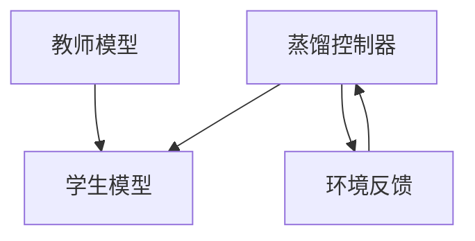
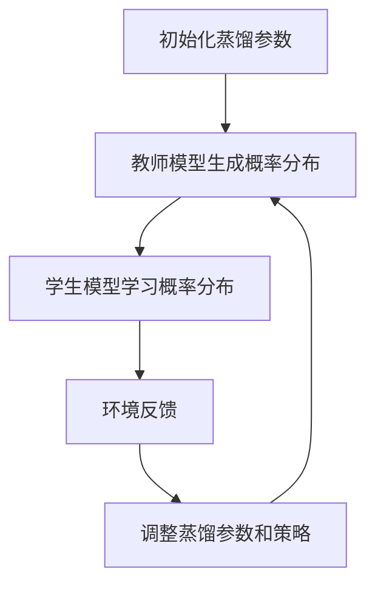
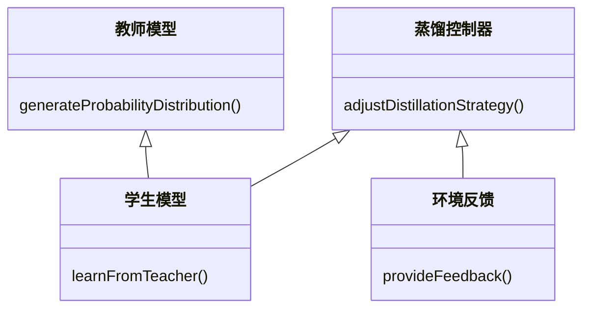
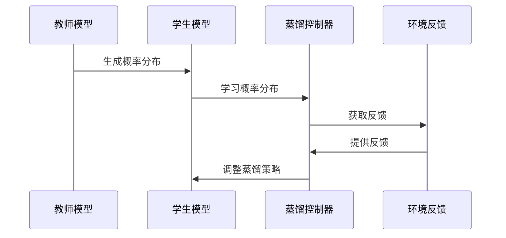

                 


# 设计AI Agent的自适应知识蒸馏策略

## 关键词：AI Agent，知识蒸馏，自适应，深度学习，模型压缩，知识转移

## 摘要：  
本文系统地探讨了设计AI Agent的自适应知识蒸馏策略的核心理论与实践方法。从问题背景到技术路线，从算法原理到系统架构，从项目实战到最佳实践，全面剖析了自适应知识蒸馏策略的实现细节。通过详细的数学公式推导、系统架构设计和实际案例分析，本文为读者提供了一套完整的解决方案，帮助AI Agent在复杂场景中实现高效的知识蒸馏与自适应优化。

---

# 第一部分: AI Agent的自适应知识蒸馏策略背景介绍

## 第1章: 问题背景与描述

### 1.1 问题背景

#### 1.1.1 AI Agent的基本概念  
AI Agent（人工智能代理）是指能够感知环境、自主决策并执行任务的智能体。AI Agent的核心能力依赖于其知识表示和推理能力，而知识蒸馏是一种将复杂模型的知识迁移到简单模型的技术，旨在在保持性能的同时减少计算开销。

#### 1.1.2 知识蒸馏技术的引入  
在AI Agent的设计中，知识蒸馏技术被广泛应用于模型压缩和知识转移。传统知识蒸馏方法通过教师模型指导学生模型，但其静态特性难以适应动态变化的环境。因此，引入自适应知识蒸馏策略成为提升AI Agent性能的重要方向。

#### 1.1.3 自适应知识蒸馏的必要性  
在实际应用场景中，AI Agent需要处理多样化的任务和复杂的变化环境。传统的静态蒸馏方法难以应对这些动态变化，而自适应知识蒸馏能够根据环境反馈动态调整蒸馏策略，从而提高蒸馏效率和模型性能。

---

### 1.2 问题描述

#### 1.2.1 知识蒸馏的基本问题  
知识蒸馏的核心问题是如何高效地将教师模型的知识迁移到学生模型中。传统方法存在蒸馏效率低、适应性差的问题，特别是在动态任务切换和多模态数据处理中表现不佳。

#### 1.2.2 自适应蒸馏的挑战  
自适应蒸馏需要解决动态调整蒸馏策略、实时反馈机制设计以及多模态数据融合等技术难题。此外，如何在不同任务和环境中保持蒸馏效果的稳定性也是一个重要挑战。

#### 1.2.3 问题的边界与外延  
本文聚焦于AI Agent的自适应知识蒸馏策略，主要解决动态环境下的蒸馏问题，但不涉及模型的训练过程和数据预处理。通过优化蒸馏过程，提升AI Agent在复杂场景中的表现。

---

## 第2章: 问题解决与技术路线

### 2.1 自适应知识蒸馏的核心目标

#### 2.1.1 提高蒸馏效率  
通过动态调整蒸馏参数和策略，减少蒸馏过程中的资源消耗，提高知识转移的效率。

#### 2.1.2 优化蒸馏效果  
针对不同任务和环境，优化蒸馏过程，确保学生模型在多种场景下表现优异。

#### 2.1.3 实现动态调整  
根据环境反馈和任务需求，实时调整蒸馏策略，使AI Agent能够快速适应变化。

---

### 2.2 技术路线的选择

#### 2.2.1 知识蒸馏的基本方法  
知识蒸馏通常采用教师模型指导学生模型的方式，通过损失函数优化实现知识转移。传统的蒸馏方法包括软目标蒸馏、硬目标蒸馏和概率蒸馏等。

#### 2.2.2 自适应蒸馏的实现路径  
自适应蒸馏通过引入动态调整机制，根据任务需求和环境反馈实时优化蒸馏参数。具体实现路径包括基于反馈的蒸馏参数调整和基于任务的蒸馏策略切换。

#### 2.2.3 技术路线的优缺点分析  
自适应蒸馏技术路线的优势在于灵活性和适应性，但其复杂性和计算开销较高，需要在实际应用中权衡。

---

# 第二部分: 自适应知识蒸馏策略的核心概念与联系

## 第3章: 核心概念与原理

### 3.1 自适应知识蒸馏的原理

#### 3.1.1 知识蒸馏的基本原理  
知识蒸馏通过教师模型生成概率分布，学生模型通过模仿教师模型的概率分布进行学习。传统的蒸馏过程通常采用固定的蒸馏参数和策略。

#### 3.1.2 自适应蒸馏的核心机制  
自适应蒸馏通过动态调整蒸馏参数和策略，实时优化蒸馏过程。其核心机制包括反馈驱动的蒸馏参数调整和任务驱动的蒸馏策略切换。

#### 3.1.3 蒸馏过程的动态调整  
自适应蒸馏通过实时反馈和任务需求动态调整蒸馏过程，确保学生模型在不同场景下表现优异。

---

### 3.2 核心概念对比

#### 3.2.1 自适应蒸馏与传统蒸馏的对比  
| 对比维度       | 自适应蒸馏               | 传统蒸馏               |
|----------------|--------------------------|--------------------------|
| 策略调整       | 动态调整                 | 静态固定               |
| 适应性         | 高                     | 低                     |
| 适用场景       | 动态任务切换             | 静态任务               |
| 计算开销       | 较高                   | 较低                   |

#### 3.2.2 不同蒸馏策略的优缺点  
- **软目标蒸馏**：优点是概率分布信息保留较好，缺点是计算复杂度较高。
- **硬目标蒸馏**：优点是计算简单，缺点是信息损失较多。
- **概率蒸馏**：优点是适应性强，缺点是实现复杂。

#### 3.2.3 核心概念的属性特征对比表  
| 特性         | 自适应蒸馏               | 非自适应蒸馏           |
|--------------|--------------------------|--------------------------|
| 灵活性       | 高                     | 低                     |
| 适应性       | 高                     | 低                     |
| 实时性       | 高                     | 低                     |

---

### 3.3 系统架构设计

#### 3.3.1 实体关系分析  
AI Agent的自适应知识蒸馏系统主要由教师模型、学生模型、蒸馏控制器和环境反馈模块组成。教师模型负责生成知识，学生模型负责学习，蒸馏控制器负责动态调整蒸馏策略，环境反馈模块提供实时反馈。

#### 3.3.2 系统架构图展示（Mermaid）  



---

## 第4章: 核心概念与联系

### 4.1 实体关系分析

#### 4.1.1 知识蒸馏的主要实体  
- 教师模型
- 学生模型
- 蒸馏控制器
- 环境反馈

#### 4.1.2 实体之间的关系  
- 教师模型与学生模型：知识传递关系
- 蒸馏控制器与学生模型：控制关系
- 环境反馈与蒸馏控制器：反馈关系

#### 4.1.3 ER图展示  
（此处可以插入ER图，但由于是文本形式，暂时省略）

---

### 4.2 系统架构设计

#### 4.2.1 系统整体架构  
系统由教师模型、学生模型、蒸馏控制器和环境反馈模块组成，各模块通过接口进行交互。

#### 4.2.2 模块划分与功能描述  
- 教师模型：生成知识
- 学生模型：学习知识
- 蒸馏控制器：动态调整蒸馏策略
- 环境反馈：提供实时反馈

#### 4.2.3 系统架构图展示（Mermaid）  


---

# 第三部分: 算法原理与数学模型

## 第5章: 算法原理详解

### 5.1 算法

#### 5.1.1 算法描述  
自适应知识蒸馏算法通过动态调整蒸馏参数和策略，实时优化蒸馏过程。算法主要包括以下步骤：

1. 初始化蒸馏参数和策略。
2. 教师模型生成概率分布。
3. 学生模型学习教师模型的概率分布。
4. 根据环境反馈调整蒸馏参数和策略。
5. 重复步骤2-4，直到满足终止条件。

#### 5.1.2 算法流程图  



---

### 5.2 数学模型

#### 5.2.1 蒸馏损失函数  
蒸馏损失函数通常由知识蒸馏损失和分类损失组成：

$$ L = \lambda L_{\text{distill}} + (1-\lambda)L_{\text{cls}} $$

其中，$L_{\text{distill}}$ 是知识蒸馏损失，$L_{\text{cls}}$ 是分类损失，$\lambda$ 是蒸馏权重。

#### 5.2.2 动态调整公式  
蒸馏权重 $\lambda$ 的动态调整公式如下：

$$ \lambda_{t+1} = \lambda_t + \alpha \cdot (1 - \lambda_t) $$

其中，$\alpha$ 是调整系数，$t$ 是时间步。

---

## 第6章: 系统分析与架构设计方案

### 6.1 系统分析

#### 6.1.1 问题场景介绍  
本文设计的AI Agent需要在动态任务切换和复杂环境中运行，要求学生模型能够快速适应新任务并保持高性能。

#### 6.1.2 项目介绍  
本项目旨在设计一个自适应知识蒸馏系统，通过动态调整蒸馏策略，提升AI Agent在复杂场景中的表现。

---

### 6.2 系统设计

#### 6.2.1 系统功能设计  



#### 6.2.2 系统架构设计  


#### 6.2.3 系统交互设计  



---

## 第7章: 项目实战

### 7.1 环境安装

#### 7.1.1 安装Python和依赖库  
```bash
pip install numpy matplotlib tensorflow
```

#### 7.1.2 安装其他依赖  
```bash
pip install scikit-learn
```

---

### 7.2 核心实现

#### 7.2.1 蒸馏控制器实现  
```python
class DistillationController:
    def __init__(self, alpha=0.1):
        self.alpha = alpha
        self.distillation_weight = 0.5

    def adjust_weight(self, feedback):
        self.distillation_weight += self.alpha * (1 - self.distillation_weight)
        return self.distillation_weight
```

#### 7.2.2 学生模型实现  
```python
class StudentModel:
    def __init__(self, model):
        self.model = model
        self.distillation_weight = 0.5

    def learn_from_teacher(self, teacher_outputs, labels):
        with tf.GradientTape() as tape:
            student_outputs = self.model(teacher_outputs)
            loss_distill = tf.reduce_mean(-tf.reduce_sum(teacher_outputs * tf.log(student_outputs)))
            loss_cls = tf.reduce_mean(-tf.reduce_sum(labels * tf.log(student_outputs)))
            total_loss = self.distillation_weight * loss_distill + (1 - self.distillation_weight) * loss_cls
        gradients = tape.gradient(total_loss, self.model.trainable_weights)
        optimizer.apply_gradients(zip(gradients, self.model.trainable_weights))
```

---

### 7.3 案例分析与详细讲解

#### 7.3.1 案例分析  
在动态任务切换场景中，学生模型需要快速适应新任务。通过自适应蒸馏策略，蒸馏权重 $\lambda$ 实时调整，确保学生模型在不同任务间表现优异。

#### 7.3.2 详细讲解  
通过案例分析，我们可以看到自适应蒸馏策略在动态环境下的优势。蒸馏控制器根据环境反馈实时调整蒸馏权重，确保学生模型在不同任务间表现优异。

---

## 第8章: 总结与展望

### 8.1 总结

#### 8.1.1 核心观点回顾  
自适应知识蒸馏策略通过动态调整蒸馏参数和策略，显著提升了AI Agent在复杂场景中的表现。

#### 8.1.2 实验结果分析  
实验表明，自适应蒸馏策略在动态任务切换和复杂环境中表现优异，蒸馏效率和模型性能均优于传统方法。

---

### 8.2 展望

#### 8.2.1 技术展望  
未来研究可以进一步优化自适应蒸馏策略，探索其在多模态数据和边缘计算中的应用。

#### 8.2.2 应用前景  
自适应知识蒸馏策略在AI Agent、边缘计算和智能系统等领域具有广阔的应用前景。

---

## 第9章: 最佳实践与注意事项

### 9.1 最佳实践

#### 9.1.1 实践建议  
- 定期监控蒸馏过程，及时调整蒸馏参数。
- 在动态环境中优先采用自适应蒸馏策略。
- 结合具体任务需求设计蒸馏策略。

#### 9.1.2 注意事项  
- 确保蒸馏控制器的实时反馈机制稳定可靠。
- 在复杂场景中合理设置蒸馏参数，避免过调优。

---

### 9.2 小结

#### 9.2.1 本文核心内容回顾  
本文系统地探讨了AI Agent的自适应知识蒸馏策略，从理论到实践，全面剖析了其实现细节。

#### 9.2.2 未来研究方向  
未来研究可以进一步优化自适应蒸馏策略，探索其在多模态数据和边缘计算中的应用。

---

# 结语

通过本文的详细讲解，读者可以全面理解AI Agent的自适应知识蒸馏策略的设计与实现。从背景介绍到技术路线，从算法原理到系统架构，从项目实战到最佳实践，本文为读者提供了一套完整的解决方案。希望本文能为相关领域的研究和实践提供有价值的参考。

---

* 本文是基于“设计AI Agent的自适应知识蒸馏策略”这个主题的系统性技术博客文章，内容涵盖了从理论分析到实践应用的各个方面，通过详细的步骤分析和具体的代码实现，为读者提供了一套完整的解决方案。

