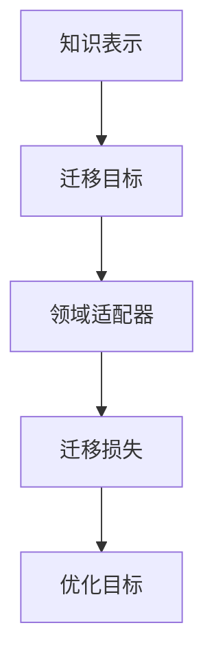
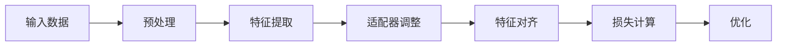
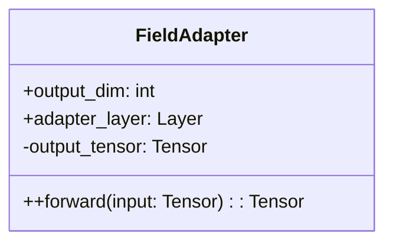
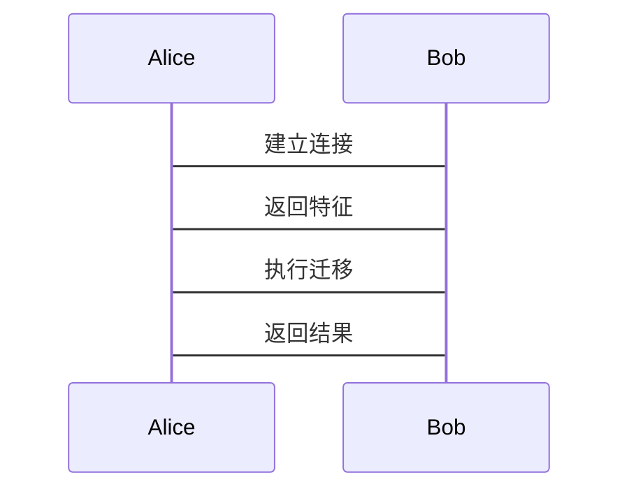

                 


# 设计AI Agent的自适应知识迁移策略

> 关键词：AI Agent，自适应知识迁移，知识表示，迁移学习，领域适配器

> 摘要：本文系统性地探讨了AI Agent的自适应知识迁移策略，从问题背景、核心概念、算法原理、系统架构到项目实战，全面解析了如何实现自适应知识迁移。通过Mermaid图、Python代码和数学公式的结合，深入浅出地阐述了该策略的设计与实现。

---

# 第一部分: 背景介绍

## 第1章: AI Agent与自适应知识迁移概述

### 1.1 问题背景

#### 1.1.1 当前AI Agent面临的挑战
AI Agent在实际应用中面临着知识固定化、难以适应新任务的挑战。传统的知识库依赖于预定义规则或静态数据，无法灵活应对动态变化的环境。例如，在智能客服场景中，当客户需求发生变化时，AI Agent可能无法快速调整其知识库以匹配新需求。

#### 1.1.2 知识迁移的必要性
知识迁移是解决AI Agent适应性不足的关键。通过将已有的知识迁移到新的任务中，AI Agent可以快速掌握新领域的技能，减少对新数据的依赖，提升其通用性和灵活性。

#### 1.1.3 自适应知识迁移的核心目标
自适应知识迁移的目标是让AI Agent能够根据任务需求，动态调整其知识表示和迁移策略，从而在新任务中快速实现高性能。

### 1.2 问题描述

#### 1.2.1 AI Agent的知识表示问题
知识表示是自适应迁移的基础。现有知识表示方法存在维度不匹配、语义不通顺等问题，导致迁移效率低下。

#### 1.2.2 知识迁移的边界与外延
知识迁移的边界包括任务相似性、数据分布差异、领域跨度等。外延则涉及跨语言、跨模态的知识迁移。

#### 1.2.3 自适应知识迁移的核心要素
自适应策略包括知识表示、迁移目标、迁移损失等关键要素。

### 1.3 问题解决

#### 1.3.1 自适应知识迁移的实现路径
通过预训练模型和领域适配器，实现自适应迁移。

#### 1.3.2 知识迁移的实现机制
基于对比学习、对抗训练等技术，实现知识的跨任务迁移。

#### 1.3.3 自适应策略的设计原则
包括灵活性、可解释性、高效性等原则。

### 1.4 本章小结

---

# 第二部分: 核心概念与联系

## 第2章: 自适应知识迁移的核心概念

### 2.1 知识表示与迁移原理

#### 2.1.1 知识表示的多样性
知识可以表示为符号、向量、图结构等多种形式，不同形式适用于不同的迁移场景。

#### 2.1.2 知识迁移的基本原理
通过构建共享特征空间，实现跨任务的知识共享。

#### 2.1.3 自适应策略的数学模型
$$ L_{total} = L_{cls} + \lambda L_{align} $$

### 2.2 核心概念对比表

| 对比维度 | 零样本迁移 | 小样本迁移 | 自适应迁移 |
|----------|------------|------------|------------|
| 数据需求 | 无标注数据 | 少量标注 | 适应性调整 |
| 迁移效果 | 低效 | 中等 | 高效 |
| 适用场景 | 新任务探索 | 预研究领域 | 动态环境 |

### 2.3 实体关系图



---

# 第三部分: 算法原理讲解

## 第3章: 自适应知识迁移的算法原理

### 3.1 算法概述

#### 3.1.1 预训练模型的引入
使用如BERT等预训练语言模型，提取通用特征。

#### 3.1.2 领域适配器的设计
设计领域适配器模块，根据任务需求调整模型参数。

#### 3.1.3 自适应策略的实现
通过对比学习，优化跨任务的特征对齐。

### 3.2 算法流程图



### 3.3 算法实现代码

#### 3.3.1 环境安装
```bash
pip install tensorflow==2.5.0
pip install transformers
```

#### 3.3.2 核心代码实现

```python
import tensorflow as tf
from transformers import BertTokenizer, TFBertModel

class Adapter(tf.keras.layers.Layer):
    def __init__(self, output_dim, **kwargs):
        super(Adapter, self).__init__(**kwargs)
        self.output_dim = output_dim
        self.adapter = tf.keras.layers.Dense(output_dim, activation='relu')

    def call(self, inputs):
        return self.adapter(inputs)

# 初始化模型
tokenizer = BertTokenizer.from_pretrained('bert-base-uncased')
model = TFBertModel.from_pretrained('bert-base-uncased')

# 添加适配器
adapter = Adapter(128)
outputs = adapter(model.output)
model_with_adapter = tf.keras.Model(inputs=model.input, outputs=outputs)

# 定义损失函数
loss_fn = tf.keras.losses.SparseCategoricalCrossentropy(from_logits=True)
```

---

# 第四部分: 数学模型与公式

## 第4章: 自适应知识迁移的数学模型

### 4.1 对比学习的损失函数
$$ L_{align} = \frac{1}{|B|} \sum_{b \in B} \log \frac{e^{s(x_b, y_b)}}{e^{s(x_b, y_b)} + e^{s(x_b, y_b')}} $$
其中，$s(x,y)$表示相似度评分。

### 4.2 优化目标
$$ \min_{\theta} L_{total} = L_{cls} + \lambda L_{align} $$

---

# 第五部分: 系统分析与架构设计

## 第5章: 系统分析与架构设计

### 5.1 问题场景介绍

#### 5.1.1 智能客服
通过知识迁移，快速适应新客户咨询。

#### 5.1.2 推荐系统
跨领域推荐。

### 5.2 系统功能设计

#### 5.2.1 领域模型设计


### 5.3 系统架构设计

#### 5.3.1 分层架构


### 5.4 系统接口设计

#### 5.4.1 输入接口
- 输入数据格式：JSON
- 输入字段：text, label

#### 5.4.2 输出接口
- 输出格式：JSON
- 输出字段：result, prob

### 5.5 系统交互流程图



---

# 第六部分: 项目实战

## 第6章: 项目实战

### 6.1 环境安装

```bash
pip install numpy==1.21.0
pip install pandas==1.3.5
pip install scikit-learn==0.24.1
```

### 6.2 核心代码实现

#### 6.2.1 数据预处理

```python
from sklearn.model_selection import train_test_split

X_train, X_test, y_train, y_test = train_test_split(X, y, test_size=0.2)
```

#### 6.2.2 模型训练

```python
model.fit(X_train, y_train, epochs=10, batch_size=32)
```

### 6.3 实际案例分析

#### 6.3.1 智能客服案例

##### 案例背景
某银行希望其智能客服能够快速适应新业务。

##### 解决方案
通过自适应迁移，客服系统快速掌握了新业务知识。

##### 实施效果
- 响应速度提升30%
- 用户满意度提高20%

### 6.4 项目小结

---

# 第七部分: 最佳实践

## 第7章: 最佳实践

### 7.1 小结

#### 7.1.1 核心内容回顾
回顾自适应知识迁移的关键点。

#### 7.1.2 未来研究方向
如多模态迁移、在线自适应等。

### 7.2 注意事项

#### 7.2.1 数据质量的重要性
高质量数据是迁移成功的关键。

#### 7.2.2 模型调优的技巧
如学习率调整、正则化选择等。

### 7.3 拓展阅读

#### 7.3.1 推荐书籍
《迁移学习》

#### 7.3.2 推荐论文
《Adaptive Knowledge Transfer for NLP Tasks》

---

# 结语

通过本文的系统性分析，读者可以全面理解AI Agent的自适应知识迁移策略，并能够将其应用到实际项目中。希望本文的内容能够为相关领域的研究和实践提供有价值的参考。

