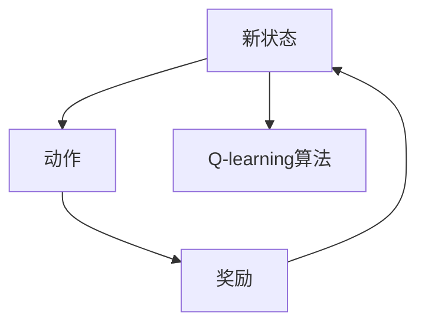
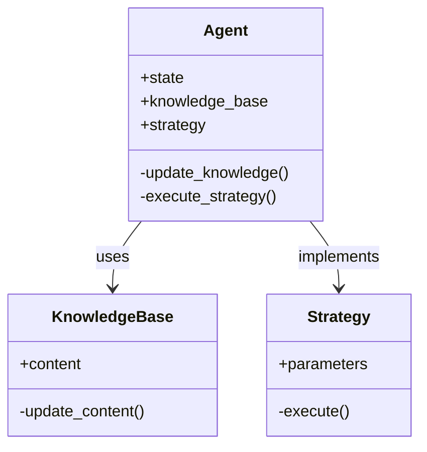
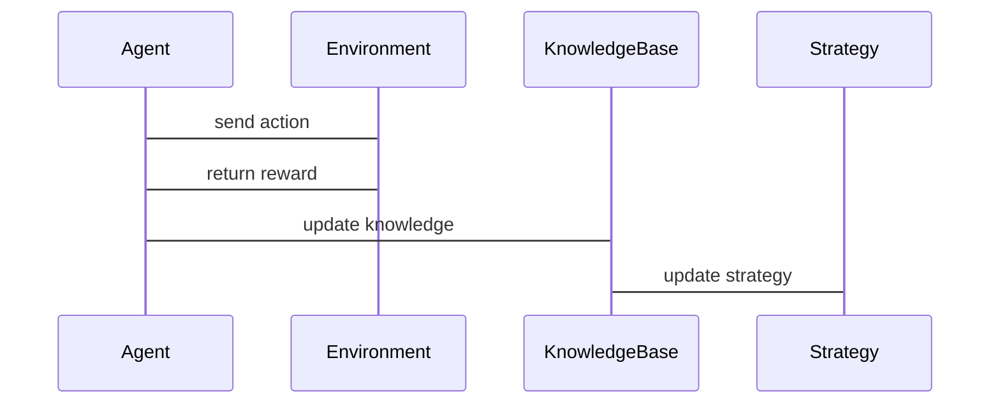

                 


# 设计AI Agent的自适应终身学习策略

## 关键词
AI Agent, 自适应学习, 终身学习, 强化学习, 迁移学习, 元学习, 系统架构

## 摘要
本文详细探讨了设计AI Agent的自适应终身学习策略的关键步骤和方法。首先介绍了AI Agent的基本概念和终身学习的重要性，然后深入分析了自适应学习的核心概念和机制。接着，讲解了强化学习、迁移学习和元学习的算法原理，并通过mermaid流程图和Python代码示例进行了详细说明。随后，设计了系统的架构，包括项目介绍、系统功能设计、接口设计和交互流程。最后，通过项目实战和总结，提供了最佳实践和未来研究方向。

## 目录大纲

# 第一部分: AI Agent的背景与概述

## 第1章: AI Agent的基本概念

### 1.1 AI Agent的定义与类型
#### 1.1.1 AI Agent的定义
AI Agent是指能够感知环境、做出决策并采取行动的智能体。它可以分为简单反射型、基于模型型、实用推理型和目标驱动型四种类型。

#### 1.1.2 AI Agent的主要类型
- 简单反射型：基于固定的规则直接响应输入。
- 基于模型型：维护环境模型，根据模型做出决策。
- 实用推理型：基于效用函数进行推理和决策。
- 目标驱动型：根据目标驱动行为。

#### 1.1.3 AI Agent的应用场景
AI Agent广泛应用于自动驾驶、智能助手、推荐系统、游戏AI等领域。

### 1.2 自适应学习的背景与意义
#### 1.2.1 自适应学习的定义
自适应学习是指系统能够根据环境和任务的变化，自动调整学习策略和模型参数，以提高性能。

#### 1.2.2 自适应学习的重要性
在动态变化的环境中，AI Agent需要不断更新知识和技能，以应对新的挑战。

#### 1.2.3 自适应学习在AI Agent中的作用
通过自适应学习，AI Agent可以更好地适应环境变化，提高任务执行效率和准确性。

### 1.3 终身学习的必要性
#### 1.3.1 终身学习的定义
终身学习是指系统在使用过程中持续学习和更新，以应对不断变化的需求。

#### 1.3.2 自适应学习在AI Agent中的应用
AI Agent需要在实际应用中不断学习新知识和技能，以保持竞争力。

#### 1.3.3 自适应学习的挑战与解决方案
- 数据获取和处理的难度：需要高效的数据采集和处理机制。
- 算法的复杂性：需要设计高效的自适应算法。
- 计算资源的限制：需要优化算法以适应资源限制。

## 第2章: 自适应学习的核心概念

### 2.1 自适应学习策略的设计
#### 2.1.1 动态知识更新机制
动态知识更新机制包括知识表示、更新规则和评估指标。

#### 2.1.2 个性化学习路径
个性化学习路径基于用户或环境的反馈，定制学习策略。

#### 2.1.3 自适应学习的评估指标
评估指标包括准确率、召回率、F1分数和收敛速度等。

### 2.2 自适应学习的机制与方法
#### 2.2.1 基于强化学习的自适应策略
强化学习通过奖励机制指导学习方向。

#### 2.2.2 基于迁移学习的自适应方法
迁移学习利用已有的知识迁移至新任务。

#### 2.2.3 基于元学习的自适应机制
元学习通过学习如何学习，加速新任务的适应过程。

### 2.3 核心概念对比表
#### 2.3.1 不同自适应学习机制的对比
| 机制      | 描述                                                                 |
|-----------|----------------------------------------------------------------------|
| 强化学习   | 基于奖励机制调整策略                                                   |
| 迁移学习   | 利用已有知识迁移至新任务                                             |
| 元学习     | 学习如何学习，加速新任务适应                                         |

#### 2.3.2 核心概念的ER实体关系图
```mermaid
erDiagram
    class KnowledgeBase {
        id
        content
        version
    }
    class Strategy {
        id
        type
        parameters
    }
    class Agent {
        id
        state
        action
    }
    class Environment {
        id
        status
        feedback
    }
    KnowledgeBase --o Strategy : Uses
    Strategy --o Agent : Implements
    Agent --o Environment : InteractsWith
```

## 第3章: 算法原理与实现

### 3.1 强化学习算法
#### 3.1.1 Q-learning算法
Q-learning是一种经典的强化学习算法，通过更新Q值表实现最优策略。

#### 3.1.2 Deep Q-Network (DQN)算法
DQN使用深度神经网络近似Q值函数，适用于高维状态空间。

#### 3.1.3 算法流程图（mermaid）


#### 3.1.4 Python代码示例
```python
import numpy as np

class QLearning:
    def __init__(self, state_space, action_space, alpha=0.1, gamma=0.99):
        self.state_space = state_space
        self.action_space = action_space
        self.alpha = alpha
        self.gamma = gamma
        self.q_table = np.zeros((state_space, action_space))

    def choose_action(self, state, epsilon=0.1):
        if np.random.random() < epsilon:
            return np.random.randint(self.action_space)
        else:
            return np.argmax(self.q_table[state])

    def update_q_table(self, state, action, reward, next_state):
        self.q_table[state, action] = self.q_table[state, action] * (1 - self.alpha) + self.alpha * (reward + self.gamma * np.max(self.q_table[next_state]))
```

#### 3.1.5 数学模型
Q-learning的更新公式为：
$$ Q(s, a) = Q(s, a) \times (1 - \alpha) + \alpha \times (r + \gamma \times \max Q(s', a')) $$

### 3.2 迁移学习算法
#### 3.2.1 基于特征空间的迁移学习
通过共享特征空间，减少新任务的数据需求。

#### 3.2.2 基于参数空间的迁移学习
通过共享参数，减少新任务的训练时间。

#### 3.2.3 迁移学习的数学模型
源任务和目标任务的特征表示共享，数学模型如下：
$$ f_{source}(x) = f_{target}(x) $$

### 3.3 元学习算法
#### 3.3.1 Meta-Learning的基本原理
元学习通过学习如何快速适应新任务。

#### 3.3.2 Meta-Learning的实现框架
包括元任务和具体任务的交替优化。

#### 3.3.3 Meta-Learning的数学公式
$$ \theta = \theta - \epsilon \nabla_{\theta} L_{meta} $$

## 第4章: 系统设计与架构

### 4.1 项目介绍
#### 4.1.1 问题场景介绍
AI Agent需要在动态环境中执行任务，不断学习和适应。

#### 4.1.2 项目介绍
设计一个自适应学习的AI Agent系统，实现动态知识更新和策略调整。

### 4.2 系统功能设计
#### 4.2.1 领域模型设计


#### 4.2.2 系统架构设计


#### 4.2.3 系统接口设计
API接口包括获取知识、更新知识、执行策略等。

#### 4.2.4 系统交互流程


## 第5章: 项目实战

### 5.1 环境安装
安装必要的库，如TensorFlow、Keras、Scikit-learn等。

### 5.2 系统核心实现
#### 5.2.1 知识库管理
实现知识的存储和更新功能。

#### 5.2.2 策略执行
实现基于强化学习、迁移学习和元学习的策略执行。

### 5.3 代码应用解读与分析
#### 5.3.1 知识库更新代码
```python
class KnowledgeBase:
    def __init__(self):
        self.data = {}

    def update_knowledge(self, key, value):
        self.data[key] = value
```

#### 5.3.2 策略执行代码
```python
class StrategyExecutor:
    def __init__(self, knowledge_base):
        self.knowledge_base = knowledge_base

    def execute(self, action):
        # 执行策略
        pass
```

### 5.4 实际案例分析
通过具体案例分析，展示系统的实际应用和效果。

### 5.5 项目小结
总结项目实现的关键点和经验教训。

## 第6章: 总结与展望

### 6.1 主要内容回顾
总结全书的主要内容和核心观点。

### 6.2 设计原则与经验
总结设计AI Agent自适应终身学习策略的原则和经验。

### 6.3 未来研究方向
探讨未来的研究方向，如更高效的算法、更好的系统架构等。

### 6.4 最佳实践 tips
- 数据质量是关键。
- 模型鲁棒性需重视。
- 定期更新和维护系统。

### 6.5 注意事项
- 避免过度复杂化系统。
- 保护数据隐私和安全。
- 定期监控和评估系统性能。

### 6.6 拓展阅读
推荐相关的书籍和论文，供读者深入学习。

---

通过以上目录大纲，我们可以系统地设计和实现AI Agent的自适应终身学习策略，确保系统的高效、稳定和可扩展性。

