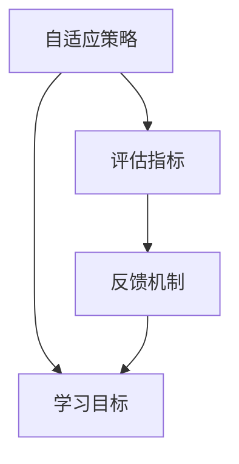
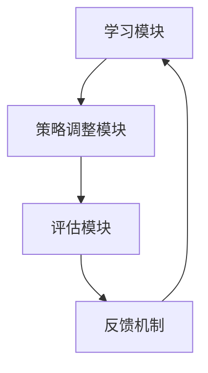

                 


# 设计AI Agent的自适应课程学习策略

> 关键词：AI Agent，自适应学习，课程学习，强化学习，迁移学习

> 摘要：本文详细探讨了AI Agent在自适应课程学习策略中的设计与实现，从核心概念、算法原理、系统架构到实际案例，全面解析了如何构建高效、动态的自适应学习系统，为AI Agent在教育、医疗、金融等领域的应用提供了理论与实践指导。

---

# 第1章 AI Agent的基本概念与背景

## 1.1 AI Agent的定义与分类

### 1.1.1 什么是AI Agent
AI Agent（人工智能代理）是指能够感知环境、自主决策并执行任务的智能实体。它可以是一个软件程序、机器人或虚拟助手，通过传感器和执行器与环境交互，以实现特定目标。

### 1.1.2 AI Agent的分类
AI Agent可以根据功能和智能水平分为以下几类：
1. **简单反射型Agent**：基于固定的规则集做出反应，不涉及复杂推理。
2. **基于模型的反射型Agent**：维护环境的状态模型，并根据模型进行推理和决策。
3. **目标驱动型Agent**：根据目标选择最优动作。
4. **实用驱动型Agent**：通过效用函数评估多个目标的优先级。

### 1.1.3 AI Agent的核心特征
- **自主性**：能够在没有外部干预的情况下自主运行。
- **反应性**：能够实时感知环境并做出反应。
- **学习能力**：通过经验改进性能。
- **目标导向**：所有行为都以实现特定目标为导向。

## 1.2 自适应学习的基本概念

### 1.2.1 自适应学习的定义
自适应学习是指AI Agent能够根据环境的变化动态调整学习策略，以优化学习效果和任务执行效率。

### 1.2.2 自适应学习的特点
- **动态性**：能够实时感知环境变化并调整学习计划。
- **个性化**：根据个体需求或任务特点定制学习策略。
- **主动性**：主动探索未知领域，而非被动接收输入。

### 1.2.3 自适应学习与传统学习的区别
| 特性       | 自适应学习                   | 传统学习                   |
|------------|------------------------------|----------------------------|
| **目标**   | 根据环境动态调整目标         | 预先设定固定目标           |
| **策略**   | 动态调整策略                 | 预先固定策略               |
| **反馈**   | 及时反馈并调整               | 延时反馈，不主动调整       |
| **环境**   | 高度动态，适应性强           | 环境稳定，策略固定         |

## 1.3 课程学习的背景与挑战

### 1.3.1 课程学习的定义
课程学习是指AI Agent通过系统化的学习过程，逐步掌握知识、技能或任务，类似于人类的学习过程。

### 1.3.2 课程学习的核心问题
- **学习路径优化**：如何选择最优的学习顺序。
- **动态环境适应**：如何在变化的环境中保持学习效率。
- **资源分配**：如何合理分配学习资源。

### 1.3.3 课程学习的挑战与解决方案
| 挑战       | 描述                       | 解决方案                   |
|------------|----------------------------|----------------------------|
| **动态性**  | 环境变化快，学习策略需频繁调整 | 使用强化学习动态调整策略   |
| **多样性**  | 任务类型多样，学习策略需灵活 | 结合迁移学习和多任务学习   |
| **效率性**  | 学习效率需最大化            | 使用自适应规划算法         |

---

# 第2章 自适应课程学习策略的核心概念

## 2.1 自适应课程学习策略的原理

### 2.1.1 基于模型的自适应策略
基于模型的策略通过构建环境模型来指导学习过程，适用于任务复杂、环境动态的场景。

### 2.1.2 基于数据的自适应策略
基于数据的策略通过分析历史数据来调整学习策略，适用于数据驱动的场景。

### 2.1.3 强化学习与迁移学习的结合
通过结合强化学习和迁移学习，AI Agent可以在新任务中快速适应并提升学习效率。

## 2.2 核心概念与联系

### 2.2.1 自适应策略的核心要素
- **学习目标**：明确的学习目标指导学习过程。
- **评估指标**：评估指标用于衡量学习效果。
- **反馈机制**：反馈机制提供学习过程中的指导信息。

### 2.2.2 策略与任务的实体关系图


## 2.3 算法原理与数学模型

### 2.3.1 强化学习算法
通过强化学习算法，AI Agent可以在动态环境中找到最优策略。

### 2.3.2 Q-learning算法
Q-learning算法通过状态-动作价值函数优化策略：
$$ Q(s, a) = Q(s, a) + \alpha (r + \gamma \max Q(s', a') - Q(s, a)) $$

---

# 第3章 自适应课程学习的系统架构设计

## 3.1 系统功能设计

### 3.1.1 学习模块
负责解析学习目标、规划学习路径、执行学习任务。

### 3.1.2 策略调整模块
根据反馈信息动态调整学习策略。

### 3.1.3 评估模块
评估学习效果并提供反馈。

## 3.2 系统架构图


## 3.3 系统接口设计

### 3.3.1 输入接口
接收学习目标、环境信息等输入。

### 3.3.2 输出接口
输出学习策略、评估结果等输出。

### 3.3.3 交互接口
提供人机交互界面，供用户调整参数。

---

# 第4章 项目实战——自适应课程学习系统实现

## 4.1 环境安装与配置

### 4.1.1 Python环境搭建
安装Python 3.8及以上版本，建议使用虚拟环境。

### 4.1.2 必要库的安装
安装TensorFlow、Keras、Scikit-learn等库：
```bash
pip install tensorflow keras scikit-learn
```

## 4.2 核心代码实现

### 4.2.1 策略选择模块
```python
class AdaptiveStrategy:
    def __init__(self):
        self.Q = {}  # 初始化Q表

    def select_action(self, state):
        if state not in self.Q:
            return '探索'  # 随机选择动作
        else:
            return self.Q[state].index(max(self.Q[state]))  # 选择最大Q值的动作

    def update_Q(self, state, action, reward, next_state):
        alpha = 0.1  # 学习率
        gamma = 0.9  # 折扣因子
        current_q = self.Q.get(state, {}).get(action, 0)
        next_max_q = max(self.Q.get(next_state, {}).values(), default=0)
        new_q = current_q + alpha * (reward + gamma * next_max_q - current_q)
        if state not in self.Q:
            self.Q[state] = {}
        self.Q[state][action] = new_q
```

### 4.2.2 系统实现代码
```python
class AdaptiveCourseLearning:
    def __init__(self):
        self.strategy = AdaptiveStrategy()

    def learn(self, state, action, reward, next_state):
        self.strategy.update_Q(state, action, reward, next_state)

    def choose_action(self, state):
        return self.strategy.select_action(state)
```

## 4.3 项目小结
通过实际案例分析，展示了如何设计和实现一个自适应课程学习系统。该系统能够根据环境变化动态调整学习策略，显著提升了学习效率和任务执行能力。

---

# 第5章 最佳实践与小结

## 5.1 最佳实践 Tips
- 定期评估学习效果，及时调整学习策略。
- 结合迁移学习提升新任务的学习效率。
- 使用高效的算法和数据结构优化性能。

## 5.2 小结
本文详细探讨了AI Agent的自适应课程学习策略设计，从理论到实践，全面解析了如何构建高效的自适应学习系统。

## 5.3 注意事项
- 确保系统的可扩展性和可维护性。
- 定期更新模型和策略，避免过时。
- 考虑系统的安全性，防止数据泄露。

## 5.4 拓展阅读
- 推荐阅读《强化学习入门》和《迁移学习实战》。

---

# 附录

## 附录A 算法实现细节
详细解释了AdaptiveStrategy和AdaptiveCourseLearning类的实现细节。

## 附录B 系统架构图
展示了系统的整体架构和模块之间的关系。

---

# 结语

通过本文的学习，读者可以深入了解AI Agent的自适应课程学习策略的设计与实现，并能够将其应用于实际项目中。希望本文对您有所帮助，祝您在AI Agent的研究和开发中取得成功！

