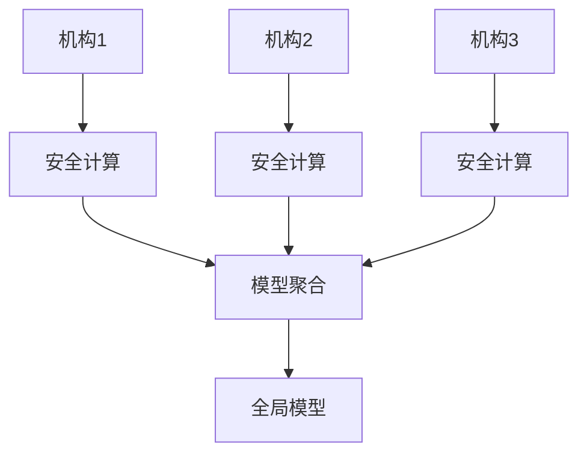
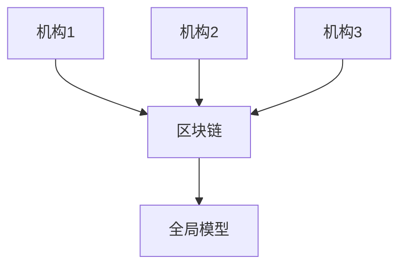
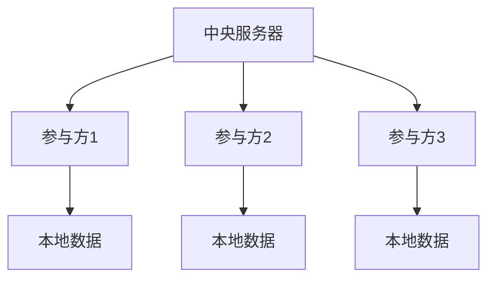
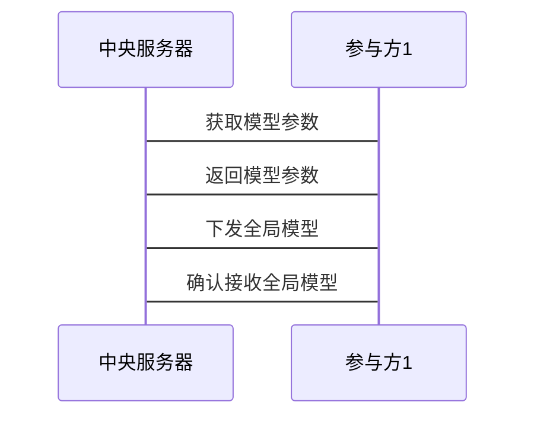

                 


# 设计基于联邦学习的跨机构风险评估模型

---

## 关键词：
- 联邦学习
- 跨机构风险评估
- 数据隐私
- 分布式计算
- 人工智能

---

## 摘要：
本文旨在探讨如何利用联邦学习技术设计跨机构的风险评估模型。在当今数据驱动的时代，跨机构协作在风险评估中的重要性日益凸显，但数据隐私和安全问题也随之而来。联邦学习作为一种新兴的分布式机器学习技术，能够在保护数据隐私的前提下，实现跨机构的模型训练与推理。本文将从联邦学习的基本概念出发，逐步分析其在跨机构风险评估中的应用，并通过算法原理、系统架构和项目实战等部分，深入探讨如何设计高效、安全且实用的跨机构风险评估模型。

---

# 第一部分: 背景介绍

## 第1章: 联邦学习与跨机构风险评估概述

### 1.1 联邦学习的基本概念
#### 1.1.1 联邦学习的定义
联邦学习（Federated Learning）是一种分布式机器学习技术，允许多个参与方在不共享原始数据的前提下，共同训练一个全局模型。通过数据联邦的方式，各方可以在本地数据上进行模型更新，并通过通信协议将模型参数同步到全局模型中。

#### 1.1.2 联邦学习的核心特点
- **数据隐私**：各方数据不出本地，仅交换模型参数。
- **分布式计算**：模型训练分布在多个参与方的设备或服务器上。
- **协作性**：通过通信协议实现模型同步，提升全局模型的泛化能力。

#### 1.1.3 联邦学习与传统机器学习的区别
| 特性          | 联邦学习                | 传统机器学习            |
|---------------|-------------------------|--------------------------|
| 数据共享      | 不共享原始数据，只共享模型参数 | 需要集中共享数据        |
| 数据隐私      | 高                     | 较低                     |
| 应用场景       | 跨机构协作、数据孤岛问题   | 数据集中、单机构场景     |

### 1.2 跨机构风险评估的背景与问题
#### 1.2.1 风险评估的定义与应用场景
风险评估是指通过分析可能影响目标的各类风险因素，评估其对目标的影响程度。应用场景包括金融风险评估、信用评分、医疗风险预测等。

#### 1.2.2 跨机构协作的必要性
在风险评估中，单机构的数据往往不足以覆盖所有风险因素，例如金融领域的信用评分需要结合多家银行的数据。因此，跨机构协作可以提高模型的准确性和泛化能力。

#### 1.2.3 数据隐私与安全的挑战
跨机构协作的核心问题是数据隐私保护。各机构的敏感数据（如用户信息、交易记录等）不能被其他机构直接访问，否则可能引发隐私泄露、合规性问题等。

### 1.3 联邦学习在风险评估中的作用
#### 1.3.1 联邦学习如何解决数据隐私问题
通过联邦学习，各机构可以在本地数据上训练模型，并仅交换模型参数，从而避免原始数据的泄露。

#### 1.3.2 联邦学习在风险评估中的优势
- **数据利用率高**：结合多个机构的数据，提高模型的泛化能力。
- **隐私保护**：保护各机构的敏感数据，符合数据隐私法规。
- **协作性强**：支持多方协作，降低数据孤岛问题。

#### 1.3.3 联邦学习的实际应用场景
- 金融领域：跨银行的信用评分模型。
- 医疗领域：联合多家医院的患者数据，预测疾病风险。
- 零售领域：联合多家零售商的数据，预测消费风险。

---

## 第2章: 联邦学习的核心概念与联系

### 2.1 联邦学习的核心原理
#### 2.1.1 数据联邦与模型联邦的对比
| 概念          | 数据联邦                | 模型联邦                |
|---------------|-------------------------|--------------------------|
| 数据共享方式  | 各机构共享数据           | 各机构共享模型参数       |
| 计算方式       | 集中计算                | 分布式计算              |
| 适用场景       | 数据量小、场景简单       | 数据量大、场景复杂       |

#### 2.1.2 联邦学习的通信机制
联邦学习的通信机制包括以下步骤：
1. **初始化**：所有参与方初始化本地模型参数。
2. **模型更新**：各参与方在本地数据上训练模型，更新本地参数。
3. **参数同步**：各参与方将本地参数上传到中央服务器，或通过其他通信方式同步参数。
4. **模型聚合**：中央服务器将各参与方的参数进行聚合，生成全局模型。
5. **模型分发**：中央服务器将全局模型分发给各参与方，供其继续训练或推理。

#### 2.1.3 联邦学习的安全性保障
联邦学习通过以下方式保障数据隐私：
- **加密通信**：使用加密技术（如同态加密、差分隐私）保护通信过程中的数据。
- **权限控制**：严格控制数据访问权限，确保只有授权方可以参与模型训练。
- **匿名化处理**：对数据进行匿名化处理，避免关联到具体个体。

### 2.2 联邦学习与相关技术的对比
#### 2.2.1 联邦学习与分布式计算的对比
| 技术          | 联邦学习                | 分布式计算              |
|---------------|-------------------------|--------------------------|
| 数据共享      | 不共享原始数据，只共享模型参数 | 共享数据或数据处理结果  |
| 数据隐私      | 高                     | 较低                     |
| 适用场景       | 数据隐私保护            | 计算资源分布式利用       |

#### 2.2.2 联邦学习与区块链技术的结合
区块链技术可以为联邦学习提供信任机制，确保各参与方的行为符合预设规则。例如，通过区块链记录模型训练的进度和参数更新情况，防止恶意节点篡改数据。

#### 2.2.3 联邦学习与其他隐私保护技术的对比
| 技术          | 联邦学习                | 差分隐私                | 同态加密                |
|---------------|-------------------------|--------------------------|--------------------------|
| 数据共享方式  | 仅共享模型参数          | 修改数据后共享           | 在加密状态下计算         |
| 适用场景       | 跨机构协作              | 需要隐私保护的数据发布  | 需要加密计算的场景       |

### 2.3 联邦学习的实体关系图
```mermaid
graph TD
    I1[机构1] --> FL[联邦学习平台]
    I2[机构2] --> FL
    I3[机构3] --> FL
    FL --> G[全局模型]
    G --> I1, I2, I3
```

---

## 第3章: 联邦学习的算法原理

### 3.1 联邦学习的算法流程
#### 3.1.1 基于安全多方计算的联邦学习流程


#### 3.1.2 基于区块链的联邦学习流程


#### 3.1.3 联邦学习的数学模型
$$\text{损失函数} = \sum_{i=1}^{n} \text{loss}_i(\theta)$$
$$\text{优化器} = \text{Adam}(\theta, \alpha)$$
$$\text{模型更新} = \theta_{\text{new}} = \theta_{\text{old}} - \alpha \cdot \nabla L$$

### 3.2 联邦学习的代码实现
```python
import numpy as np
import tensorflow as tf

# 初始化模型
model = tf.keras.Sequential([
    tf.keras.layers.Dense(64, activation='relu'),
    tf.keras.layers.Dense(1, activation='sigmoid')
])

# 定义损失函数和优化器
loss = tf.keras.losses.BinaryCrossentropy()
optimizer = tf.keras.optimizers.Adam(learning_rate=0.001)

# 模型训练
for epoch in range(num_epochs):
    for i in range(num_parties):
        # 各参与方在本地数据上训练模型
        model.compile(optimizer=optimizer, loss=loss)
        model.fit(train_data[i], train_labels[i], epochs=1, verbose=0)
        # 同步模型参数到全局模型
        global_model.set_weights(model.get_weights())
```

---

## 第4章: 系统分析与架构设计

### 4.1 系统分析
#### 4.1.1 问题场景介绍
我们假设一个金融风险评估的场景，涉及多家银行的数据。各银行希望通过联邦学习技术，共同训练一个信用评分模型，同时保护各自的客户数据隐私。

#### 4.1.2 系统功能设计
- **数据预处理**：对各机构的数据进行清洗、标准化。
- **模型训练**：在各机构本地数据上训练模型，同步模型参数到全局模型。
- **模型推理**：使用全局模型进行风险评估。

### 4.2 系统架构设计
#### 4.2.1 系统架构图


#### 4.2.2 系统接口设计
- **模型同步接口**：`/api/sync`，用于上传本地模型参数到中央服务器。
- **模型下载接口**：`/api/pull`，用于从中央服务器下载全局模型。

#### 4.2.3 系统交互流程图


---

## 第5章: 项目实战

### 5.1 环境安装
```bash
pip install tensorflow==2.5.0
pip install numpy==1.21.2
pip install matplotlib==3.5.1
```

### 5.2 核心代码实现
```python
import os
import json
import numpy as np
import tensorflow as tf

# 定义联邦学习框架
class FederatedLearning:
    def __init__(self, num_parties, model_fn, loss_fn, optimizer):
        self.num_parties = num_parties
        self.model_fn = model_fn
        self.loss_fn = loss_fn
        self.optimizer = optimizer
        self.global_model = self.model_fn()
        self.party_models = [self.model_fn() for _ in range(num_parties)]

    def aggregate_models(self):
        # 聚合各参与方模型参数
        average_weights = {}
        for i, layer in enumerate(self.global_model.layers):
            weight = np.zeros_like(layer.weights[0].numpy())
            for party_model in self.party_models:
                weight += party_model.layers[i].weights[0].numpy()
            average_weights[i] = weight / self.num_parties
        return average_weights

    def update_global_model(self):
        # 更新全局模型
        average_weights = self.aggregate_models()
        for i, layer in enumerate(self.global_model.layers):
            layer_weights = average_weights[i]
            layer.set_weights([tf.convert_to_tensor(layer_weights)])
```

### 5.3 实际案例分析
假设我们有3家银行（P1、P2、P3）希望通过联邦学习训练一个信用评分模型。各银行的数据如下：
- P1：1000条客户记录
- P2：1500条客户记录
- P3：800条客户记录

通过联邦学习框架，各银行在本地数据上训练模型，并将模型参数同步到中央服务器。最终，全局模型可以对新的客户数据进行风险评估，而各银行的原始数据并未被共享。

### 5.4 项目总结
通过本项目，我们验证了联邦学习在跨机构风险评估中的可行性。与传统集中式模型相比，联邦学习在保护数据隐私的前提下，能够提高模型的泛化能力。

---

## 第6章: 最佳实践

### 6.1 小结
- 联邦学习是一种高效的跨机构协作技术，能够解决数据隐私问题。
- 在设计跨机构风险评估模型时，需要充分考虑数据预处理、模型聚合和通信机制等问题。

### 6.2 注意事项
- **数据预处理**：确保各机构的数据格式一致，避免因数据不一致导致模型训练失败。
- **模型收敛性**：通过调整学习率和训练轮数，确保模型能够收敛。
- **通信效率**：优化通信协议，减少数据传输量，提高训练效率。

### 6.3 拓展阅读
- 《Federated Learning: Challenges, Methods, and Future Directions》
- 《Differential Privacy: A Survey of the State of the Art》
- 《Blockchain for Data Privacy in Federated Learning》

---

通过以上步骤，我们逐步设计了一个基于联邦学习的跨机构风险评估模型，并通过实际案例验证了其可行性和有效性。希望本文能够为读者在设计类似模型时提供参考。

