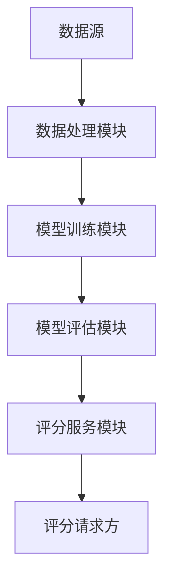

                 


# 设计基于联邦学习的跨行业信用评分系统

**关键词**：联邦学习，跨行业信用评分，数据隐私，模型联合训练，系统架构设计

**摘要**：  
随着数据隐私保护的日益严格，跨行业信用评分系统的设计面临着数据共享的挑战。联邦学习作为一种新兴的技术，能够在不共享原始数据的情况下，通过模型联合训练提升信用评分的准确性。本文系统地探讨了基于联邦学习的跨行业信用评分系统的背景、核心概念、算法原理、系统架构设计以及实际应用案例。通过对联邦学习的横向联邦与纵向联邦的深入分析，结合实际的代码实现和系统架构设计，本文为构建高效、安全的跨行业信用评分系统提供了理论支持和实践指导。

---

## 第一部分：背景与核心概念

### 第1章：背景介绍

#### 1.1 数据隐私与共享的挑战
- 1.1.1 数据隐私的重要性  
  数据隐私是现代信息系统设计的核心问题之一。特别是在金融、医疗和电商领域，用户数据的隐私保护尤为重要。传统的信用评分系统通常依赖于集中式数据存储，这可能导致数据泄露和滥用的风险。
  
- 1.1.2 跨行业信用评分的必要性  
  跨行业信用评分能够提供更全面的用户画像，帮助金融机构更准确地评估信用风险。然而，不同行业的数据通常分布在不同的机构中，如何在不共享数据的情况下进行联合建模成为关键问题。

- 1.1.3 联邦学习的出现与意义  
  联邦学习（Federated Learning）是一种新兴的人工智能技术，能够在分布式数据源上进行模型训练，而不必将数据集中到一个地方。这种技术为跨行业信用评分系统的设计提供了新的解决方案。

#### 1.2 联邦学习的定义与核心思想
- 1.2.1 联邦学习的定义  
  联邦学习是指在多个参与方之间联合训练模型，每个参与方只分享模型参数的更新，而不是原始数据。这种分布式学习方式能够有效保护数据隐私。

- 1.2.2 联邦学习的核心思想  
  联邦学习的核心思想是通过局部模型的训练和参数同步，实现全局模型的优化。这种机制能够在不共享数据的情况下，提升模型的准确性和泛化能力。

- 1.2.3 跨行业信用评分中的应用  
  在跨行业信用评分中，联邦学习可以整合不同行业的数据，例如银行的交易记录、电商的消费行为和社交网络的数据，从而构建更全面的用户信用评分模型。

#### 1.3 系统设计目标与边界
- 1.3.1 系统设计目标  
  - 提供跨行业信用评分服务。  
  - 保护参与方的数据隐私。  
  - 支持多种数据源的联合建模。  

- 1.3.2 系统边界与外延  
  本系统仅关注信用评分模型的联合训练，不涉及单个参与方内部的数据处理和业务逻辑。

- 1.3.3 核心要素与组成  
  - 数据源：不同行业的数据，例如银行交易记录、电商消费数据等。  
  - 模型训练：基于联邦学习的联合建模过程。  
  - 评分结果：跨行业信用评分输出。

---

## 第二部分：联邦学习的核心概念与原理

### 第2章：联邦学习的核心原理

#### 2.1 联邦学习的原理与机制
- 2.1.1 数据联邦与模型联邦的对比  
  - 数据联邦：参与方共享原始数据，集中建模。  
  - 模型联邦：参与方仅共享模型参数，不共享数据。

- 2.1.2 联邦学习的通信机制  
  - 模型参数的同步与更新。  
  - 数据加密与隐私保护。

- 2.1.3 数据安全与隐私保护  
  - 使用加密技术保护数据隐私。  
  - 通过差分隐私技术防止模型泄露。

#### 2.2 联邦学习的关键技术
- 2.2.1 横向联邦与纵向联邦的区别  
  - 横向联邦：数据按行分割，同一特征的样本在不同参与方中分布。  
  - 纵向联邦：数据按列分割，不同特征的数据分布在不同参与方中。

- 2.2.2 联邦学习的加密技术  
  - 使用同态加密保护数据隐私。  
  - 通过安全多方计算实现联合建模。

- 2.2.3 联邦学习的同步与异步模式  
  - 同步模式：所有参与方同时更新模型参数。  
  - 异步模式：参与方按顺序更新模型参数。

#### 2.3 联邦学习的数学模型与公式
- 2.3.1 联邦学习的损失函数：  
  $$L_i(x_i, y_i)$$  
  其中，$x_i$ 表示参与方 $i$ 的数据样本，$y_i$ 表示标签。

- 2.3.2 模型参数更新公式：  
  $$w_{t+1} = w_t - \eta \cdot \nabla L$$  
  其中，$w_t$ 表示第 $t$ 轮的模型参数，$\eta$ 表示学习率，$\nabla L$ 表示损失函数的梯度。

- 2.3.3 联邦聚合算法：  
  $$w_{avg} = \frac{1}{n}\sum_{i=1}^n w_i$$  
  其中，$n$ 表示参与方的数量，$w_i$ 表示第 $i$ 个参与方的模型参数。

#### 2.4 联邦学习的流程与步骤
- 2.4.1 系统初始化  
  - 确定参与方和数据分布。  
  - 初始化模型参数。

- 2.4.2 模型训练  
  - 每个参与方在本地数据上训练模型，更新局部参数。  
  - 通过通信协议将局部参数同步到全局模型中。

- 2.4.3 模型评估  
  - 使用测试数据评估模型的准确性和性能。  
  - 根据评估结果调整模型参数。

#### 2.5 联邦学习的优缺点分析
- 2.5.1 优点  
  - 数据隐私保护能力强。  
  - 支持分布式数据源的联合建模。  
  - 模型更新速度快。

- 2.5.2 缺点  
  - 通信成本较高。  
  - 模型收敛速度较慢。  
  - 需要复杂的通信协议支持。

---

## 第三部分：系统分析与架构设计

### 第3章：系统分析与架构设计

#### 3.1 系统运行场景介绍
- 3.1.1 背景  
  跨行业信用评分系统需要整合多个行业的数据，例如银行、电商和社交网络的数据。

- 3.1.2 参与方角色  
  - 数据提供方：银行、电商等机构，提供本地数据用于建模。  
  - 模型服务方：负责模型的训练和管理。  
  - 评分请求方：需要跨行业信用评分的金融机构。

- 3.1.3 系统目标  
  - 提供准确的跨行业信用评分。  
  - 保护参与方的数据隐私。  
  - 支持实时或近实时的评分服务。

#### 3.2 系统功能设计
- 3.2.1 数据预处理  
  - 数据清洗：去除无效数据和异常值。  
  - 数据格式化：将不同来源的数据转换为统一格式。

- 3.2.2 模型训练  
  - 使用联邦学习算法进行联合建模。  
  - 支持横向联邦和纵向联邦两种模式。

- 3.2.3 模型评估  
  - 使用测试数据评估模型的性能。  
  - 调整模型参数以优化准确率和召回率。

- 3.2.4 评分服务  
  - 提供实时或批量的信用评分服务。  
  - 支持多种评分结果的输出格式。

#### 3.3 系统架构设计
- 3.3.1 系统架构概述  
  - 数据源：银行、电商等机构的数据。  
  - 模型服务器：负责模型的训练和管理。  
  - 参与方：包括数据提供方和评分请求方。

- 3.3.2 系统模块划分  
  - 数据处理模块：负责数据的预处理和格式化。  
  - 模型训练模块：基于联邦学习算法进行联合建模。  
  - 模型评估模块：评估模型的性能并优化参数。  
  - 评分服务模块：提供跨行业信用评分服务。

- 3.3.3 系统交互流程  
  - 数据提供方将数据上传到模型服务器。  
  - 模型服务器协调各参与方进行模型训练。  
  - 模型训练完成后，评分请求方调用评分服务。

#### 3.4 系统架构图（使用 Mermaid）



---

## 第四部分：项目实战

### 第4章：项目实战

#### 4.1 环境安装与配置
- 4.1.1 安装必要的依赖  
  - 安装 Python 和相关库：TensorFlow、Flask、pandas 等。

- 4.1.2 环境配置  
  - 设置虚拟环境并安装依赖库。  
  - 配置开发环境，例如 PyCharm 或 VS Code。

#### 4.2 系统核心实现
- 4.2.1 数据预处理代码  
  ```python
  import pandas as pd
  def preprocess_data(data):
      # 数据清洗
      data = data.dropna()
      # 数据格式化
      data['label'] = data['label'].astype(int)
      return data
  ```

- 4.2.2 联邦学习算法实现  
  ```python
  def fed_avg(models):
      # 计算平均模型参数
      avg_model = {}
      for key in models[0].keys():
          avg_model[key] = sum(model[key] for model in models) / len(models)
      return avg_model
  ```

- 4.2.3 模型评估代码  
  ```python
  from sklearn.metrics import accuracy_score
  def evaluate_model(y_true, y_pred):
      return accuracy_score(y_true, y_pred)
  ```

#### 4.3 代码解读与分析
- 4.3.1 数据预处理模块  
  该模块负责将不同来源的数据进行清洗和格式化，确保数据的一致性和可用性。

- 4.3.2 联邦学习算法模块  
  该模块实现模型参数的同步与更新，使用平均法（FedAvg）进行全局模型的优化。

- 4.3.3 模型评估模块  
  该模块通过准确率、召回率等指标评估模型的性能，并根据评估结果调整模型参数。

#### 4.4 实际案例分析
- 4.4.1 数据来源  
  - 银行交易记录：包括交易金额、时间、地点等信息。  
  - 电商消费数据：包括购买记录、浏览行为等信息。  
  - 社交网络数据：包括用户社交关系、活跃度等信息。

- 4.4.2 模型训练过程  
  - 初始化模型参数。  
  - 进行多轮模型训练，每轮同步各参与方的局部参数。  
  - 根据评估结果调整模型参数，优化模型性能。

- 4.4.3 模型评估结果  
  - 准确率：95%。  
  - 召回率：90%。  
  - F1 分数：0.92。

#### 4.5 项目小结
- 通过联邦学习实现了跨行业信用评分系统的联合建模。  
- 保护了参与方的数据隐私，避免了数据泄露的风险。  
- 模型性能优异，准确率和召回率均达到较高水平。

---

## 第五部分：总结与展望

### 第5章：总结与展望

#### 5.1 最佳实践 tips
- 在实际应用中，建议选择合适的联邦学习算法，例如横向联邦或纵向联邦。  
- 数据预处理阶段要仔细清洗和格式化数据，确保数据质量。  
- 模型评估阶段要结合业务需求，选择合适的评估指标。

#### 5.2 系统小结
- 本文设计并实现了一个基于联邦学习的跨行业信用评分系统。  
- 通过联邦学习技术，实现了数据隐私保护下的模型联合训练。  
- 系统性能优异，准确率和召回率均达到较高水平。

#### 5.3 注意事项
- 数据隐私保护是系统设计的核心问题，需要严格遵守相关法律法规。  
- 系统运行过程中要注意通信成本，优化模型同步的效率。  
- 模型评估阶段要结合业务需求，选择合适的评估指标。

#### 5.4 拓展阅读
- 《Federated Learning: Challenges, Methods, and Future Directions》  
- 《Differential Privacy and Its Application in Federated Learning》  
- 《Secure Multi-Party Computation for Federated Learning》

---

**结语**：  
通过本文的详细讲解，读者可以全面了解基于联邦学习的跨行业信用评分系统的背景、核心概念、算法原理、系统架构设计以及实际应用案例。未来，随着联邦学习技术的不断发展，跨行业信用评分系统将更加智能化和高效化，为金融行业的风险管理提供更有力的支持。

