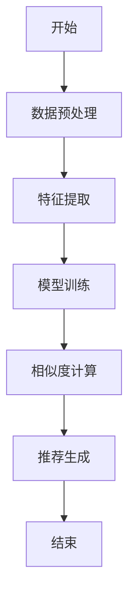
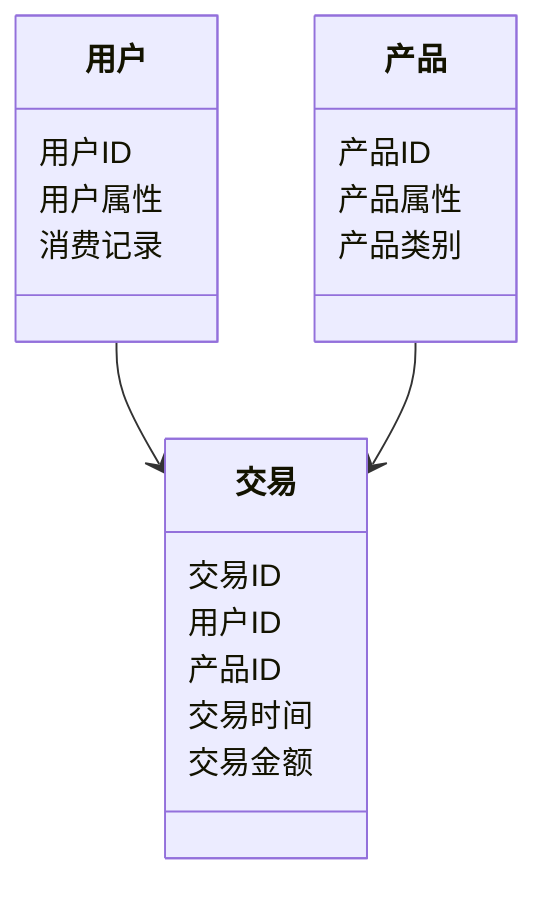
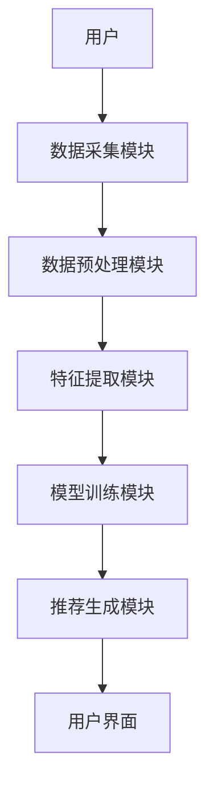
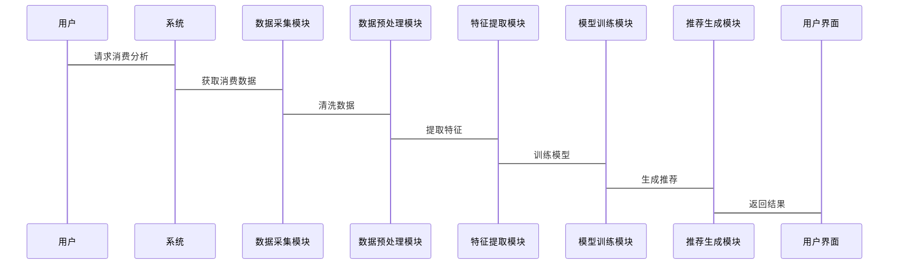

                 


# 设计智能化的个人消费行为分析系统

## 关键词：人工智能、消费行为分析、机器学习、数据挖掘、系统设计

## 摘要：  
智能化的个人消费行为分析系统通过整合多源数据，利用机器学习和人工智能技术，深入分析用户的消费模式和偏好，从而为企业和消费者提供精准的决策支持。本文将从系统设计背景、核心概念、算法原理、系统架构、项目实战到最佳实践等方面，全面解析如何构建一个高效、智能的消费行为分析系统。

---

# 第1章: 智能化个人消费行为分析系统背景与概述

## 1.1 问题背景

### 1.1.1 个人消费行为分析的重要性  
随着互联网和移动支付的普及，消费者的购物行为变得越来越复杂。通过分析消费数据，企业可以更好地理解消费者需求，优化产品和服务，提升客户满意度和忠诚度。同时，消费者也可以通过分析自己的消费行为，优化预算和财务规划。

### 1.1.2 当前消费行为分析的痛点  
传统的消费行为分析依赖于人工统计和简单的数据汇总，难以捕捉用户行为的动态变化和深层次需求。随着数据量的爆炸式增长，传统方法在效率和精度上已无法满足需求。

### 1.1.3 智能化分析的必要性  
人工智能和机器学习技术的快速发展为消费行为分析提供了新的工具和方法。智能化分析能够实时处理海量数据，发现潜在的消费规律和趋势，为企业和消费者提供更精准的决策支持。

## 1.2 问题描述

### 1.2.1 消费行为分析的维度  
消费行为分析可以从多个维度入手，包括时间、地点、产品类别、消费金额、用户属性等。这些维度的综合分析能够帮助我们更全面地理解用户的消费习惯。

### 1.2.2 数据来源与处理的挑战  
消费数据来源多样，包括线上和线下的交易数据、社交媒体数据、用户行为数据等。这些数据格式多样，可能存在噪声和缺失值，给数据处理带来了挑战。

### 1.2.3 智能化分析的目标  
智能化分析的目标是通过机器学习算法，从海量数据中提取有价值的信息，预测用户的消费行为，优化企业的营销策略，或者为用户提供个性化的消费建议。

## 1.3 问题解决思路

### 1.3.1 数据驱动的分析方法  
通过采集和处理多源数据，利用数据挖掘和机器学习技术，提取用户行为特征，构建预测模型。

### 1.3.2 AI技术在消费行为分析中的应用  
人工智能技术（如深度学习、自然语言处理等）可以用于用户画像构建、情感分析、需求预测等场景。

### 1.3.3 系统设计的核心理念  
智能化消费行为分析系统应具备实时性、精准性、可扩展性和用户隐私保护等特点，能够适应不同场景和用户需求。

## 1.4 系统边界与外延

### 1.4.1 系统的功能边界  
系统主要关注用户的消费行为分析，不涉及具体的支付功能或财务系统的集成。

### 1.4.2 系统的适用范围  
适用于电商、零售、金融等多个行业，帮助企业和消费者更好地理解和优化消费行为。

### 1.4.3 系统与其他系统的交互  
系统需要与数据源（如数据库、API接口）、用户界面（如移动端、Web端）以及其他业务系统（如CRM、营销系统）进行交互。

## 1.5 核心要素与概念结构

### 1.5.1 数据采集模块  
负责从多源数据中采集消费数据，包括交易记录、用户行为数据等。

### 1.5.2 特征提取模块  
将原始数据转化为有用的特征，如消费频率、偏好类别、消费金额分布等。

### 1.5.3 模型训练模块  
利用机器学习算法（如协同过滤、聚类分析、深度学习等）训练预测模型。

### 1.5.4 预测与决策模块  
基于训练好的模型，预测用户的消费行为，并提供决策支持。

## 1.6 本章小结  
本章介绍了智能化个人消费行为分析系统的背景、目标和核心要素，为后续章节的系统设计奠定了基础。

---

# 第2章: 智能化个人消费行为分析系统的核心概念与联系

## 2.1 核心概念原理

### 2.1.1 数据采集与预处理  
数据采集是消费行为分析的第一步，需要从多个渠道获取数据，并进行清洗和特征提取。

### 2.1.2 特征工程与提取  
通过特征工程，将原始数据转化为能够反映用户行为的特征，如时间特征、金额特征、产品特征等。

### 2.1.3 AI模型训练与优化  
利用机器学习算法对特征数据进行建模，训练出能够预测用户行为的模型，并通过优化提升模型性能。

### 2.1.4 系统预测与决策  
基于训练好的模型，对用户的消费行为进行预测，并提供个性化的决策支持。

## 2.2 核心概念属性对比表

| 核心概念 | 属性 | 描述 |
|---------|------|------|
| 数据采集 | 数据来源 | 线上交易数据、社交媒体数据、问卷调查数据 |
| 特征提取 | 特征类型 | 时间特征（消费频率）、金额特征（消费金额分布）、产品特征（偏好类别） |
| 模型训练 | 算法类型 | 协同过滤、聚类分析、深度学习 |
| 预测与决策 | 输出结果 | 用户行为预测、个性化推荐、消费趋势分析 |

## 2.3 ER实体关系图架构

```mermaid
er
    %%{初始化}
    init [用户行为分析系统]
    
    %%{实体}
    user (用户)
    product (产品)
    transaction (交易)
    feature (特征)
    model (模型)
    
    %%{关系}
    user -| 消费 | transaction
    transaction -| 包含 | product
    transaction -| 提取 | feature
    feature -| 训练 | model
    model -| 预测 | user
```

## 2.4 本章小结  
本章通过对比表和实体关系图，详细阐述了智能化个人消费行为分析系统的核心概念及其相互联系，为后续章节的系统设计提供了理论基础。

---

# 第3章: 协同过滤推荐算法的原理与实现

## 3.1 算法原理

### 3.1.1 协同过滤的定义  
协同过滤是一种基于用户相似性或物品相似性的推荐算法，常用于个性化推荐系统。

### 3.1.2 用户-物品评分矩阵  
协同过滤算法的核心是构建一个用户-物品评分矩阵，通过计算用户之间的相似度或物品之间的相似度，推荐用户可能感兴趣的产品或服务。

### 3.1.3 相似度计算  
常用的相似度计算方法包括余弦相似度、皮尔逊相关系数等。

## 3.2 算法实现步骤

### 3.2.1 数据预处理  
对消费数据进行清洗和格式化处理，提取用户-物品评分矩阵。

### 3.2.2 特征提取  
从消费数据中提取用户行为特征，如消费频率、偏好类别等。

### 3.2.3 模型训练  
使用协同过滤算法训练推荐模型，计算用户相似度或物品相似度。

### 3.2.4 推荐生成  
基于相似度计算，生成个性化推荐结果。

## 3.3 协同过滤算法的流程图



## 3.4 协同过滤算法的数学模型

### 3.4.1 余弦相似度公式  
$$ \text{余弦相似度} = \frac{\sum_{i=1}^{n} x_i y_i}{\sqrt{\sum_{i=1}^{n} x_i^2} \cdot \sqrt{\sum_{i=1}^{n} y_i^2}} $$

### 3.4.2 皮尔逊相关系数公式  
$$ r = \frac{\sum (x_i - \bar{x})(y_i - \bar{y})}{\sqrt{\sum (x_i - \bar{x})^2} \cdot \sqrt{\sum (y_i - \bar{y})^2}} $$

## 3.5 代码实现与解读

### 3.5.1 环境安装  
安装Python和相关库（如pandas、numpy、scikit-learn）。

### 3.5.2 数据预处理代码

```python
import pandas as pd
import numpy as np

# 加载数据
data = pd.read_csv('consumption_data.csv')

# 数据清洗
data.dropna(inplace=True)
```

### 3.5.3 协同过滤实现代码

```python
from sklearn.metrics.pairwise import cosine_similarity

# 构建用户-物品评分矩阵
matrix = data.pivot('用户ID', '产品ID', '评分')

# 计算余弦相似度
similarity = cosine_similarity(matrix)
```

### 3.5.4 推荐生成代码

```python
def get_recommendations(user_id, similarity_matrix, num_recommendations=5):
    user_index = matrix.index.get_loc(user_id)
    similar_users = np.argsort(similarity[user_index])[::-1][:num_recommendations]
    recommendations = []
    for i in similar_users:
        recommendations.append(matrix.columns[i])
    return recommendations

# 生成推荐结果
recommendations = get_recommendations('用户1', similarity)
```

## 3.6 本章小结  
本章通过协同过滤算法的原理、流程图和代码实现，详细讲解了消费行为分析中的推荐算法，为后续系统的实现提供了技术支撑。

---

# 第4章: 智能化个人消费行为分析系统的系统分析与架构设计

## 4.1 问题场景介绍

### 4.1.1 系统需求分析  
系统需要支持多源数据的接入、实时数据分析和个性化推荐功能。

### 4.1.2 项目介绍  
本项目旨在设计一个智能化的个人消费行为分析系统，帮助企业和消费者优化消费决策。

## 4.2 系统功能设计

### 4.2.1 领域模型设计



### 4.2.2 系统架构设计



### 4.2.3 系统接口设计  
系统需要提供API接口，支持数据的接入和结果的输出。

### 4.2.4 系统交互流程  



## 4.3 本章小结  
本章通过系统分析与架构设计，明确了智能化个人消费行为分析系统的功能模块和交互流程，为后续的系统实现奠定了基础。

---

# 第5章: 智能化个人消费行为分析系统项目实战

## 5.1 项目环境安装

### 5.1.1 安装Python和相关库  
安装Python 3.x，然后使用pip安装pandas、numpy、scikit-learn、mermaid等库。

```bash
pip install pandas numpy scikit-learn mermaid
```

### 5.1.2 数据准备  
准备消费数据，格式为CSV文件，包含用户ID、产品ID、交易时间、交易金额等字段。

## 5.2 系统核心实现

### 5.2.1 数据预处理代码

```python
import pandas as pd
import numpy as np

# 加载数据
data = pd.read_csv('consumption_data.csv')

# 删除缺失值
data.dropna(inplace=True)
```

### 5.2.2 特征提取代码

```python
from sklearn.preprocessing import StandardScaler

# 提取用户ID和产品ID
X = data[['用户ID', '产品ID', '交易金额']]

# 标准化处理
scaler = StandardScaler()
X_scaled = scaler.fit_transform(X)
```

### 5.2.3 模型训练代码

```python
from sklearn.cluster import KMeans

# 训练聚类模型
model = KMeans(n_clusters=5, random_state=42)
model.fit(X_scaled)
```

### 5.2.4 推荐生成代码

```python
# 预测用户聚类结果
predictions = model.predict(X_scaled)
print("推荐结果：", predictions)
```

## 5.3 项目实战案例分析

### 5.3.1 数据分析与清洗  
对消费数据进行清洗和预处理，提取有用特征。

### 5.3.2 模型训练与优化  
训练聚类模型，优化模型参数，提升推荐精度。

### 5.3.3 系统实现与测试  
实现系统功能，进行测试和优化，确保系统稳定性和准确性。

## 5.4 本章小结  
本章通过项目实战，详细讲解了智能化个人消费行为分析系统的实现过程，包括环境安装、数据处理、模型训练和系统测试。

---

# 第6章: 智能化个人消费行为分析系统的最佳实践

## 6.1 总结与经验分享

### 6.1.1 数据质量的重要性  
数据质量直接影响模型的性能，需要重视数据清洗和特征提取。

### 6.1.2 模型调优的技巧  
通过交叉验证和网格搜索，优化模型参数，提升推荐精度。

### 6.1.3 系统设计的注意事项  
系统设计需要考虑可扩展性、可维护性和用户隐私保护。

## 6.2 最佳实践Tips

### 6.2.1 数据处理  
- 使用自动化工具进行数据清洗和特征提取。
- 对异常数据进行合理处理，避免影响模型性能。

### 6.2.2 模型优化  
- 定期更新模型，适应用户行为的变化。
- 使用多种算法进行对比，选择最优模型。

### 6.2.3 系统维护  
- 定期监控系统运行状态，及时发现和解决故障。
- 优化系统接口设计，提升用户体验。

## 6.3 未来展望

### 6.3.1 技术发展  
随着AI技术的不断进步，消费行为分析系统将更加智能化和个性化。

### 6.3.2 应用拓展  
智能化消费行为分析系统将在更多行业和场景中得到应用，为企业和消费者创造更大的价值。

## 6.4 本章小结  
本章总结了项目中的经验和教训，提出了系统的优化建议，为读者提供了实用的指导。

---

# 结语  
设计智能化的个人消费行为分析系统是一项复杂而富有挑战性的任务，需要结合数据分析、机器学习和系统设计等多方面的知识。通过本文的详细讲解，读者可以掌握系统设计的核心要点，为实际项目提供有力的支持。

