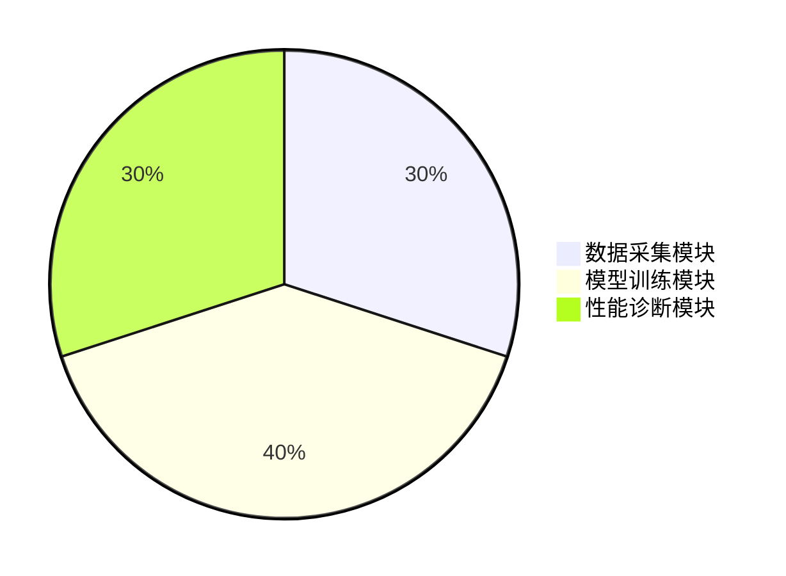

                 


# 设计智能化的企业信用评级模型性能诊断系统

> **关键词**：企业信用评级、模型性能诊断、人工智能、机器学习、系统架构设计

> **摘要**：本文详细探讨了设计智能化的企业信用评级模型性能诊断系统的各个方面。从信用评级的基本概念到智能化诊断系统的构建，结合实际案例和系统架构设计，深入分析了该系统的核心算法和实现方法。文章内容涵盖背景介绍、核心概念、算法原理、系统架构设计以及项目实战，旨在为企业信用评级模型的性能优化提供全面的理论支持和技术指导。

---

# 第一部分: 企业信用评级模型性能诊断系统概述

## 第1章: 企业信用评级模型概述

### 1.1 信用评级的基本概念

#### 1.1.1 信用评级的定义
信用评级是对企业或个人的信用状况进行评估，以确定其偿还债务的能力和意愿。企业信用评级是金融领域中的重要环节，主要用于银行贷款审批、投资决策等领域。

#### 1.1.2 企业信用评级的重要性
企业信用评级能够帮助金融机构评估客户的信用风险，降低不良贷款率，提高资金分配效率。同时，良好的信用评级有助于企业获得更低的融资成本和更多的商业机会。

#### 1.1.3 信用评级的分类与特点
信用评级可以分为内部评级和外部评级，内部评级由企业内部进行，外部评级由第三方评级机构完成。智能化信用评级的特点包括自动化、数据驱动、实时性等。

---

### 1.2 企业信用评级模型的背景

#### 1.2.1 传统信用评级方法的局限性
传统信用评级方法依赖人工经验，存在主观性强、效率低、覆盖面窄等问题。随着企业数量的激增和数据的多样化，传统方法难以满足现代金融的需求。

#### 1.2.2 智能化信用评级的需求
智能化信用评级能够利用大数据和人工智能技术，提高评级的准确性和效率。通过机器学习算法，模型可以自动分析企业的多维度数据，发现潜在风险。

#### 1.2.3 企业信用评级模型的演变
从简单的财务指标分析到复杂的机器学习模型，企业信用评级模型经历了从定性到定量、从单一维度到多维度的演变过程。

---

### 1.3 企业信用评级模型的性能诊断

#### 1.3.1 模型性能诊断的必要性
模型性能诊断能够帮助发现模型的不足之处，如数据偏差、过拟合等问题，从而优化模型，提高评级的准确性。

#### 1.3.2 模型性能诊断的核心问题
性能诊断的核心问题是如何量化模型的预测能力，并找到影响模型性能的关键因素。

#### 1.3.3 模型性能诊断的边界与外延
性能诊断的边界在于模型本身，而外延则涉及数据来源、模型训练环境等因素。

---

## 第2章: 企业信用评级模型性能诊断系统的核心概念

### 2.1 企业信用评级模型的构建

#### 2.1.1 模型构建的基本流程
模型构建包括数据收集、特征选择、模型训练和评估等步骤。数据收集是基础，特征选择决定了模型的输入，模型训练是核心，评估则是验证模型性能的关键。

#### 2.1.2 数据特征的选择与处理
数据特征的选择需要考虑相关性和重要性，常用方法包括主成分分析（PCA）和特征重要性排序。数据处理包括缺失值填充、标准化等。

#### 2.1.3 模型训练与优化
模型训练需要选择合适的算法，并通过交叉验证优化模型参数。常用算法包括逻辑回归、随机森林、梯度提升树等。

---

### 2.2 性能诊断系统的功能模块

#### 2.2.1 数据采集与预处理模块
数据采集模块负责从企业财务报表、交易记录等来源获取数据。预处理模块对数据进行清洗和标准化处理。

#### 2.2.2 模型训练与评估模块
模型训练模块使用训练数据构建信用评级模型，评估模块通过测试数据验证模型的准确性、召回率等指标。

#### 2.2.3 性能诊断与优化模块
性能诊断模块分析模型的预测结果，识别数据偏差或算法缺陷。优化模块根据诊断结果调整模型参数或更换算法。

---

### 2.3 核心概念的ER实体关系图

```mermaid
er
  actor: 企业
  model: 信用评级模型
  data: 数据特征
  result: 信用评分

  actor --> data: 提供
  data --> model: 输入
  model --> result: 输出
  result --> actor: 反馈
```

---

# 第三部分: 算法原理与系统架构设计

## 第3章: 企业信用评级模型性能诊断系统的算法原理

### 3.1 模型训练算法

#### 3.1.1 逻辑回归算法
逻辑回归是一种常用的分类算法，适用于二分类问题。其数学模型为：

$$ P(y=1|x) = \frac{e^{\beta_0 + \beta_1 x_1 + \dots + \beta_n x_n}}{1 + e^{\beta_0 + \beta_1 x_1 + \dots + \beta_n x_n}} $$

#### 3.1.2 随机森林算法
随机森林是一种集成学习算法，通过构建多个决策树并取其平均值来提高模型的准确性和鲁棒性。

#### 3.1.3 梯度提升树算法
梯度提升树是一种基于树结构的集成算法，通过不断优化损失函数来提高模型性能。

---

### 3.2 性能诊断算法

#### 3.2.1 基于阈值的诊断方法
通过调整分类阈值，分析模型在不同阈值下的表现，找到最优的分类效果。

#### 3.2.2 基于ROC曲线的诊断方法
ROC曲线用于评估模型的分类性能，AUC值是衡量模型好坏的重要指标。

---

## 第4章: 企业信用评级模型性能诊断系统的系统架构设计

### 4.1 系统功能设计

#### 4.1.1 数据采集模块
负责从企业财务数据、交易记录等来源获取数据，并进行清洗和预处理。

#### 4.1.2 模型训练模块
使用训练数据构建信用评级模型，并通过交叉验证优化模型参数。

#### 4.1.3 性能诊断模块
分析模型的预测结果，识别数据偏差或算法缺陷，并提出优化建议。

---

### 4.2 系统架构设计



---

## 第5章: 项目实战与系统实现

### 5.1 环境安装与配置

#### 5.1.1 安装Python环境
安装Python 3.8及以上版本，并配置Jupyter Notebook环境。

#### 5.1.2 安装依赖库
安装必要的机器学习库，如scikit-learn、xgboost、pandas等。

---

### 5.2 核心代码实现

#### 5.2.1 数据预处理代码

```python
import pandas as pd
from sklearn.impute import SimpleImputer
from sklearn.preprocessing import StandardScaler

# 读取数据
data = pd.read_csv('企业数据.csv')

# 处理缺失值
imputer = SimpleImputer(strategy='mean')
imputed_data = imputer.fit_transform(data)

# 标准化处理
scaler = StandardScaler()
processed_data = scaler.fit_transform(imputed_data)
```

#### 5.2.2 模型训练代码

```python
from sklearn.model_selection import train_test_split
from sklearn.linear_model import LogisticRegression

# 划分训练集和测试集
X_train, X_test, y_train, y_test = train_test_split(processed_data, target, test_size=0.2)

# 训练逻辑回归模型
model = LogisticRegression()
model.fit(X_train, y_train)
```

---

### 5.3 性能诊断与优化

#### 5.3.1 模型评估

```python
from sklearn.metrics import accuracy_score, precision_score, recall_score

# 预测结果
y_pred = model.predict(X_test)

# 计算指标
accuracy = accuracy_score(y_test, y_pred)
precision = precision_score(y_test, y_pred)
recall = recall_score(y_test, y_pred)

print(f'Accuracy: {accuracy}')
print(f'Precision: {precision}')
print(f'Recall: {recall}')
```

#### 5.3.2 模型优化

```python
from sklearn.model_selection import GridSearchCV
from xgboost import XGBClassifier

# 定义参数搜索空间
param_grid = {
    'n_estimators': [100, 200],
    'learning_rate': [0.05, 0.1],
    'max_depth': [3, 4]
}

# 参数搜索
grid_search = GridSearchCV(XGBClassifier(), param_grid, cv=5)
grid_search.fit(X_train, y_train)

# 最优模型
best_model = grid_search.best_estimator_
```

---

## 第6章: 总结与展望

### 6.1 小结
本文详细介绍了企业信用评级模型性能诊断系统的构建过程，包括核心概念、算法原理、系统架构设计以及项目实战。通过实际案例和系统实现，展示了智能化诊断系统的优势和应用价值。

### 6.2 最佳实践
- 数据预处理是模型构建的基础，需谨慎处理缺失值和异常值。
- 模型选择需结合业务需求和数据特点，避免盲目追求复杂算法。
- 性能诊断是优化模型的关键，需结合多种评估指标和诊断方法。

### 6.3 注意事项
- 数据隐私和安全问题需严格遵守相关法律法规。
- 模型部署需考虑计算资源和运行环境的限制。
- 模型上线后需定期更新和优化，以适应数据和业务的变化。

### 6.4 拓展阅读
- 《机器学习实战》
- 《深入浅出：信用评分模型》
- 《系统架构设计实践》

---

通过本文的学习和实践，读者可以掌握企业信用评级模型性能诊断系统的设计方法，并能够将其应用于实际业务场景中，为企业的信用风险管理提供有力支持。

