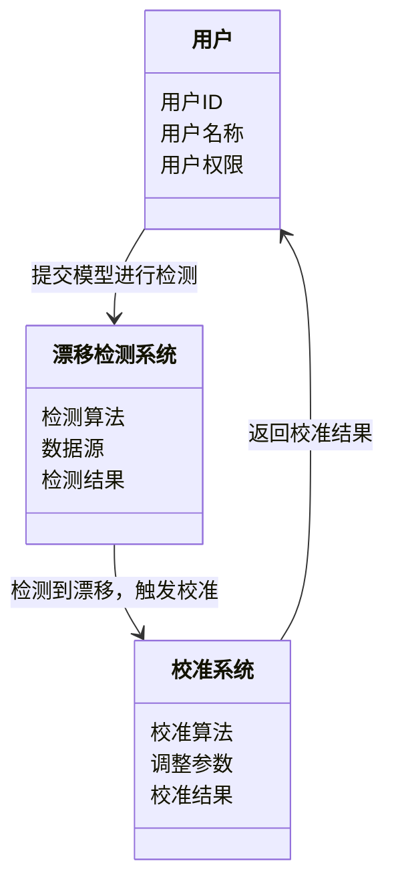

                 


# 设计智能化的企业信用评级模型漂移检测与校准系统

## 关键词：企业信用评级、模型漂移检测、模型校准、机器学习、系统架构

## 摘要：  
本文详细探讨了设计智能化的企业信用评级模型漂移检测与校准系统的核心方法。首先，从企业信用评级的重要性出发，分析了模型漂移的成因及其对信用评级的影响。接着，深入讲解了漂移检测与校准的核心算法原理，包括基于统计和机器学习的方法。随后，通过系统架构设计、功能模块实现和项目实战案例，展示了如何构建一个高效可靠的漂移检测与校准系统。最后，总结了系统设计的关键点和未来研究方向。

---

# 第1章: 企业信用评级模型概述

## 1.1 企业信用评级的定义与重要性

### 1.1.1 企业信用评级的定义  
企业信用评级是通过对企业财务状况、经营能力、市场环境等多方面因素的综合评估，给出企业在偿还债务方面的信用等级。信用评级结果直接影响企业的融资成本和市场信任度。

### 1.1.2 信用评级在企业融资中的作用  
信用评级是企业获取贷款、发行债券等融资活动的重要依据。较高的信用评级通常意味着更低的融资成本和更高的市场信任度。

### 1.1.3 信用评级对风险管理的意义  
信用评级能够帮助金融机构识别风险较高的企业，从而在信贷决策中做出更为谨慎的选择，降低金融系统的整体风险。

## 1.2 模型漂移的概念与影响

### 1.2.1 模型漂移的定义  
模型漂移是指随着时间推移，由于数据分布变化、模型性能下降或外部环境变化等因素，导致模型预测结果与实际结果之间出现偏差的现象。

### 1.2.2 模型漂移的常见原因  
- 数据分布变化：新数据与训练数据分布不同。
- 模型过拟合：模型在训练数据上表现良好，但在新数据上表现不佳。
- 外部环境变化：如经济波动、政策调整等。

### 1.2.3 模型漂移对信用评级的影响  
模型漂移可能导致信用评级结果失准，进而影响企业的融资能力和金融机构的风控能力。

## 1.3 漂移检测与校准的必要性

### 1.3.1 漂移检测的重要性  
及时发现模型漂移，可以避免模型预测结果的偏差，确保信用评级的准确性。

### 1.3.2 校准在模型维护中的作用  
通过校准模型，可以调整模型预测结果，使其更符合实际数据分布，提高模型的预测精度。

### 1.3.3 综合检测与校准的必要性  
漂移检测与校准的结合使用，可以实现模型的动态优化，提升信用评级系统的长期稳定性和准确性。

---

# 第2章: 模型漂移检测与校准的核心概念

## 2.1 模型漂移的检测方法

### 2.1.1 基于性能变化的检测  
通过模型在新数据上的性能变化（如准确率下降、召回率下降）来判断是否发生漂移。

### 2.1.2 基于数据分布变化的检测  
比较训练数据和新数据的分布差异，使用统计检验方法（如Kolmogorov-Smirnov检验）来判断是否发生漂移。

### 2.1.3 基于模型预测结果变化的检测  
通过比较模型在新数据上的预测结果与历史数据的差异，判断是否发生漂移。

## 2.2 模型校准的原理与方法

### 2.2.1 模型校准的定义  
模型校准是通过调整模型的输出概率或预测结果，使其更符合实际数据分布的过程。

### 2.2.2 常见校准方法  
- **概率校准**：通过 Platt Scaling 或 Isotonic Regression 方法调整模型的输出概率。
- **阈值调整**：根据业务需求调整模型的分类阈值，以优化模型的精确率和召回率。

### 2.2.3 校准效果评估  
通过校准曲线（Calibration Curve）和相关指标（如Odds Ratio、KS统计量）评估校准效果。

## 2.3 漂移与校准的联系与区别

### 2.3.1 漂移与校准的关系  
漂移是校准的前提，校准是漂移检测后的必要步骤。只有在检测到漂移后，才需要进行校准。

### 2.3.2 漂移检测与校准的区别  
漂移检测是判断模型是否需要调整，而校准是调整模型使其适应新数据分布的过程。

### 2.3.3 综合应用的必要性  
漂移检测与校准的结合使用，可以实现模型的动态优化，确保信用评级系统的长期准确性。

## 2.4 核心概念对比表

| 概念 | 定义 | 目的 | 方法 |
|------|------|------|------|
| 模型漂移 | 模型预测结果与实际结果之间出现偏差 | 及时发现模型性能下降或数据分布变化 | 统计检验、性能监控、分布对比 |
| 模型校准 | 调整模型输出概率或阈值，使其更符合实际数据分布 | 提高模型预测精度 | Platt Scaling、Isotonic Regression、阈值调整 |

## 2.5 ER实体关系图

```mermaid
er
    actor: 用户
    system: 漂移检测与校准系统
    model: 信用评级模型
    drift: 模型漂移
    calibration: 校准过程
    actor --> system: 提交模型进行检测
    system --> model: 执行漂移检测
    if drift detected then
        system --> calibration: 执行校准
    else
        system --> actor: 返回无漂移结果
    end
```

---

# 第3章: 漂移检测与校准算法原理

## 3.1 漂移检测算法

### 3.1.1 基于统计的检测方法：Kolmogorov-Smirnov检验

#### 3.1.1.1 算法原理  
Kolmogorov-Smirnov检验是一种非参数检验方法，用于比较两个经验分布函数的差异。通过计算训练数据和新数据的经验分布函数的最大差异，判断是否发生漂移。

#### 3.1.1.2 算法步骤  
1. 计算训练数据和新数据的经验分布函数。
2. 找到两个分布函数的最大差异点。
3. 通过统计检验判断最大差异是否显著。

#### 3.1.1.3 代码实现  

```python
from scipy.stats import ks_2samp

# 示例数据
train_data = [0.1, 0.2, 0.3, 0.4, 0.5]
new_data = [0.6, 0.7, 0.8, 0.9, 1.0]

# Kolmogorov-Smirnov检验
stat, p = ks_2samp(train_data, new_data)
print(f"KS统计量: {stat}, p值: {p}")
```

### 3.1.2 基于机器学习的检测方法：分布对比模型

#### 3.1.2.1 算法原理  
使用机器学习模型（如XGBoost、神经网络）对训练数据和新数据进行分类，通过模型性能的变化判断是否发生漂移。

#### 3.1.2.2 算法步骤  
1. 使用训练数据训练一个分类模型。
2. 对新数据进行预测，并计算模型的性能指标（如准确率、召回率）。
3. 通过性能指标的变化判断是否发生漂移。

#### 3.1.2.3 代码实现  

```python
import xgboost as xgb

# 示例数据
train_features = [[0.1, 0.2], [0.3, 0.4], [0.5, 0.6], [0.7, 0.8], [0.9, 1.0]]
train_labels = [0, 0, 0, 1, 1]

# 训练模型
model = xgb.XGBClassifier()
model.fit(train_features, train_labels)

# 新数据
new_features = [[1.1, 1.2], [1.3, 1.4], [1.5, 1.6], [1.7, 1.8], [1.9, 2.0]]
new_labels = [0, 0, 1, 1, 1]

# 预测
pred_labels = model.predict(new_features)
print(f"预测结果: {pred_labels}")
```

### 3.1.3 时间序列分析法

#### 3.1.3.1 算法原理  
通过时间序列分析方法（如ARIMA、LSTM）对模型预测结果的时间序列进行建模，判断其是否偏离预期趋势。

#### 3.1.3.2 算法步骤  
1. 收集模型预测结果的时间序列数据。
2. 建立时间序列模型。
3. 通过模型预测结果与实际结果的差异判断是否发生漂移。

#### 3.1.3.3 代码实现  

```python
import statsmodels.api as sm

# 示例时间序列数据
data = [0.1, 0.2, 0.3, 0.4, 0.5, 0.6, 0.7, 0.8, 0.9, 1.0]

# 建立ARIMA模型
model = sm.tsa.arima.ARIMA(data, order=(1, 1, 1))
model_fit = model.fit()

# 预测
forecast = model_fit.forecast(steps=5)
print(f"预测结果: {forecast}")
```

## 3.2 校准算法

### 3.2.1 概率校准：Platt Scaling

#### 3.2.1.1 算法原理  
Platt Scaling 是一种基于 logistic 回归的校准方法，通过拟合一个 logistic 函数来调整模型的输出概率。

#### 3.2.1.2 算法步骤  
1. 对模型输出概率进行收集。
2. 使用 logistic 回归模型拟合输出概率与实际标签的关系。
3. 根据拟合结果调整模型的输出概率。

#### 3.2.1.3 代码实现  

```python
from sklearn.linear_model import LogisticRegression

# 示例数据
probabilities = [0.1, 0.2, 0.3, 0.4, 0.5, 0.6, 0.7, 0.8, 0.9, 1.0]
labels = [0, 0, 0, 0, 1, 1, 1, 1, 1, 1]

# Platt Scaling校准
calibrator = LogisticRegression()
calibrator.fit(probabilities.reshape(-1, 1), labels)

# 调整后的概率
adjusted_prob = calibrator.predict_proba(probabilities.reshape(-1, 1))[:, 1]
print(f"调整后的概率: {adjusted_prob}")
```

### 3.2.2 回归校准：最小二乘回归

#### 3.2.2.1 算法原理  
通过最小二乘回归方法，拟合模型输出概率与实际标签的关系，调整模型的输出概率。

#### 3.2.2.2 算法步骤  
1. 对模型输出概率进行收集。
2. 使用线性回归模型拟合输出概率与实际标签的关系。
3. 根据拟合结果调整模型的输出概率。

#### 3.2.2.3 代码实现  

```python
from sklearn.linear_model import LinearRegression

# 示例数据
probabilities = [0.1, 0.2, 0.3, 0.4, 0.5, 0.6, 0.7, 0.8, 0.9, 1.0]
labels = [0, 0, 0, 0, 1, 1, 1, 1, 1, 1]

# 最小二乘回归校准
calibrator = LinearRegression()
calibrator.fit(probabilities.reshape(-1, 1), labels)

# 调整后的概率
adjusted_prob = calibrator.predict(probabilities.reshape(-1, 1))
print(f"调整后的概率: {adjusted_prob}")
```

---

# 第4章: 系统分析与架构设计方案

## 4.1 问题场景介绍

### 4.1.1 系统目标  
设计一个智能化的企业信用评级模型漂移检测与校准系统，能够实时监控模型性能，自动检测漂移并进行校准。

### 4.1.2 业务场景  
企业信用评级系统需要定期更新模型以适应市场变化，确保评级结果的准确性。

### 4.1.3 使用场景  
- 模型训练与部署
- 模型性能监控
- 漂移检测与校准
- 结果分析与报告

## 4.2 系统功能设计

### 4.2.1 领域模型设计  


### 4.2.2 系统架构设计  


### 4.2.3 系统接口设计  
- **API接口**  
  - POST /drift/detect: 提交模型进行漂移检测。
  - POST /calibration/run: 触发校准过程。
  - GET /results/report: 获取检测与校准报告。

### 4.2.4 系统交互设计  
```mermaid
sequenceDiagram
    actor 用户
    system 系统
    用户 -> 系统: 提交模型进行检测
    系统 -> 漂移检测模块: 执行漂移检测
    漂移检测模块 -> 用户: 返回检测结果
    如果检测到漂移:
        用户 -> 系统: 触发校准
        系统 -> 校准模块: 执行校准
        校准模块 -> 用户: 返回校准结果
```

---

# 第5章: 项目实战

## 5.1 环境安装

### 5.1.1 安装依赖  
- Python 3.8+
- scikit-learn
- xgboost
- mermaid
- statsmodels

### 5.1.2 安装命令  
```bash
pip install scikit-learn xgboost mermaid4jupyter statsmodels
```

## 5.2 系统核心实现

### 5.2.1 漂移检测实现  

```python
def detect_drift(train_data, new_data):
    # 使用Kolmogorov-Smirnov检验
    stat, p = ks_2samp(train_data, new_data)
    if p < 0.05:
        return True  # 发生漂移
    else:
        return False
```

### 5.2.2 校准实现  

```python
def calibrate_model(probabilities, labels):
    # 使用Platt Scaling校准
    calibrator = LogisticRegression()
    calibrator.fit(probabilities.reshape(-1, 1), labels)
    return calibrator.predict_proba(probabilities.reshape(-1, 1))[:, 1]
```

### 5.2.3 系统集成  

```python
class DriftDetectionSystem:
    def __init__(self, model, train_data, train_labels):
        self.model = model
        self.train_data = train_data
        self.train_labels = train_labels

    def detect_and_calibrate(self, new_data, new_labels):
        # 检测漂移
        drift = detect_drift(self.train_data, new_data)
        if drift:
            # 校准模型
            probabilities = self.model.predict_proba(new_data)[:, 1]
            adjusted_prob = calibrate_model(probabilities, new_labels)
            return adjusted_prob
        else:
            return None
```

## 5.3 实际案例分析

### 5.3.1 数据准备  
- 训练数据：企业财务数据、市场数据等。
- 新数据：最近一个季度的企业数据。

### 5.3.2 检测与校准过程  
1. 使用 Kolmogorov-Smirnov 检验检测数据分布变化。
2. 如果检测到漂移，使用 Platt Scaling 方法校准模型输出概率。

### 5.3.3 结果分析  
- 检测结果：发生漂移。
- 校准结果：模型输出概率调整后，信用评级结果更准确。

---

# 第6章: 总结与展望

## 6.1 本章小结  
本文详细探讨了设计智能化的企业信用评级模型漂移检测与校准系统的核心方法，包括漂移检测算法、校准方法、系统架构设计和项目实战案例。

## 6.2 最佳实践 tips  
- 定期监控模型性能，及时发现漂移。
- 结合多种检测方法，提高检测准确性。
- 根据业务需求选择合适的校准方法。

## 6.3 注意事项  
- 漂移检测与校准需要结合业务场景进行。
- 校准后的模型需要重新验证其准确性。
- 系统设计需要考虑数据隐私和安全问题。

## 6.4 拓展阅读  
- 《机器学习模型的在线更新与维护》
- 《时间序列分析在金融风险管理中的应用》

---

# 结语  
设计智能化的企业信用评级模型漂移检测与校准系统是一项复杂的工程，需要结合统计方法、机器学习算法和系统架构设计。通过本文的探讨，我们希望为读者提供一个系统化的设计思路和实践指南，帮助他们在实际应用中构建高效可靠的信用评级系统。

