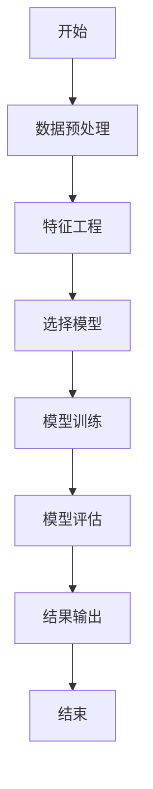
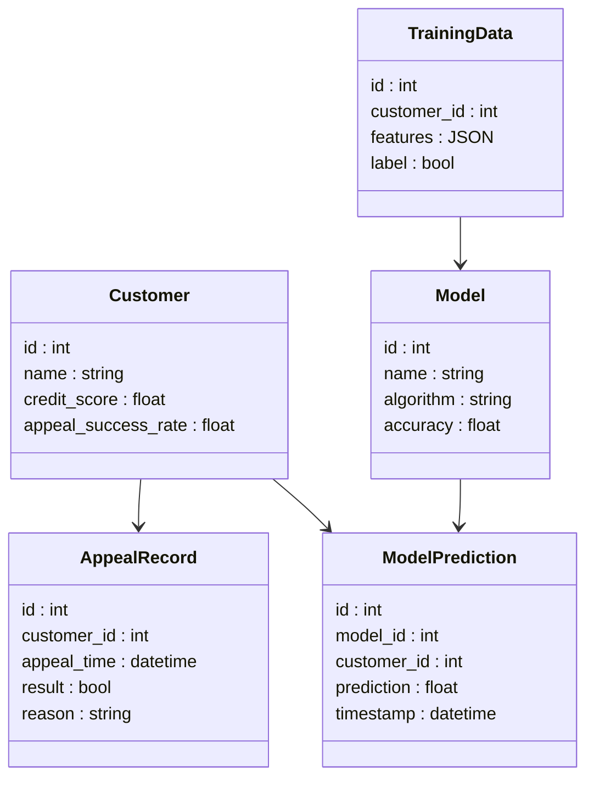
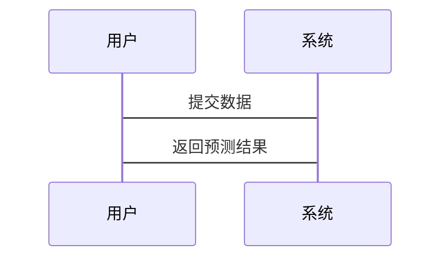

                 


# 设计智能化的企业信用评级申诉成功率预测系统

## 关键词
- 企业信用评级
- 申诉成功率预测
- 智能化系统
- 机器学习
- 深度学习
- 数据分析

## 摘要
本文旨在设计一个智能化的企业信用评级申诉成功率预测系统，通过分析企业信用评级的核心要素和申诉成功率的影响因素，构建一个基于机器学习和深度学习的预测模型。系统将结合历史数据和实时行为数据，利用自然语言处理技术和图嵌入方法，提取特征并建立预测模型，实现对申诉成功率的精准预测。文章详细阐述了系统的背景、核心概念、算法原理、系统架构，并通过实际案例展示了系统的实现过程和应用效果，最后总结了设计中的关键点和未来的发展方向。

---

# 第一部分: 背景介绍

## 第1章: 企业信用评级申诉成功率预测系统背景

### 1.1 问题背景
#### 1.1.1 企业信用评级的重要性
企业的信用评级是衡量其信用状况的重要指标，直接影响企业的融资能力、市场信任度和商业合作机会。信用评级越高，企业获得贷款的利率越低，合作方的信任度越高。

#### 1.1.2 申诉成功率预测的必要性
在信用评级过程中，企业可能会因评分不公而提出申诉。然而，传统的申诉处理方式效率低下，缺乏数据支持，难以准确预测申诉成功的概率。通过智能化预测系统，可以提高申诉处理的效率和准确性。

#### 1.1.3 当前存在的问题与挑战
- 数据分散：企业信用数据来源多样，难以整合。
- 数据清洗：数据质量参差不齐，清洗成本高。
- 模型选择：传统统计模型预测精度有限，难以满足需求。
- 实时性要求：需要快速处理和预测，实时反馈。

### 1.2 问题描述
#### 1.2.1 信用评级的定义与流程
信用评级是对企业的财务状况、经营能力、偿债能力等多方面进行综合评估的过程。通常包括数据收集、数据清洗、特征提取、模型训练和结果评估几个阶段。

#### 1.2.2 申诉成功率的定义与影响因素
申诉成功率是指企业在信用评级后提出申诉并成功调整评级的比例。影响因素包括企业规模、行业特性、信用历史、申诉理由的合理性等。

#### 1.2.3 现有预测方法的局限性
现有方法多基于简单的统计分析，缺乏对复杂因素的建模，预测精度低，难以满足实际需求。

### 1.3 问题解决思路
#### 1.3.1 数据驱动的预测方法
利用机器学习和深度学习技术，从海量数据中提取特征，建立预测模型。

#### 1.3.2 智能化预测模型的设计思路
结合企业历史数据和实时行为数据，构建混合模型，提高预测精度。

#### 1.3.3 系统化解决方案的构建框架
包括数据采集、数据清洗、特征工程、模型训练、结果分析和系统实现等步骤。

### 1.4 系统边界与外延
#### 1.4.1 系统的功能边界
系统主要功能包括数据采集、特征提取、模型训练、预测评估和结果展示。

#### 1.4.2 系统的输入与输出
输入：企业历史数据、实时数据。
输出：申诉成功的概率预测、建议和反馈。

#### 1.4.3 系统的适用范围与限制
适用于各类企业，但对数据质量和数量有一定要求。

### 1.5 核心概念与结构
#### 1.5.1 核心概念的定义与组成
- 信用评级：对企业信用状况的综合评估。
- 申诉成功率：企业申诉调整评级成功的概率。
- 智能化预测模型：基于机器学习和深度学习的预测系统。

#### 1.5.2 系统架构的核心要素
- 数据采集模块：收集企业数据。
- 数据处理模块：清洗和转换数据。
- 特征提取模块：提取关键特征。
- 模型训练模块：训练预测模型。
- 结果展示模块：输出预测结果。

#### 1.5.3 系统功能模块的划分
- 数据管理模块
- 预测模型模块
- 结果分析模块
- 用户界面模块

---

# 第二部分: 核心概念与联系

## 第2章: 核心概念原理

### 2.1 信用评级的核心要素
#### 2.1.1 企业信用评级的主要指标
- 财务指标：如资产负债率、净利润率。
- 经营指标：如销售额增长率、市场占有率。
- 风险指标：如违约概率、坏账率。

#### 2.1.2 申诉成功率的影响因素
- 企业规模：大企业申诉成功的概率较高。
- 行业特性：不同行业申诉难易程度不同。
- 信用历史：历史申诉记录影响当前申诉结果。
- 申诉理由：申诉理由的合理性和充分性。

#### 2.1.3 数据特征的分类与分析
- 数值型：如收入、利润。
- 分类型：如行业、地区。
- 时间序列型：如历史违约记录。

### 2.2 智能化预测模型的原理
#### 2.2.1 机器学习在信用评级中的应用
- 监督学习：如随机森林、支持向量机。
- 无监督学习：如聚类分析。

#### 2.2.2 深度学习模型的优势与挑战
- 神经网络模型：如LSTM、CNN。
- 训练数据需求大，计算资源消耗高。

#### 2.2.3 混合模型的构建思路
结合机器学习和深度学习的优势，构建混合模型，提高预测精度。

### 2.3 核心概念属性特征对比表
| 核心概念 | 特性 | 描述 |
|----------|------|------|
| 信用评级 | 数据来源 | 财务数据、行为数据、市场数据 |
| 申诉成功率 | 预测目标 | 企业申诉成功的概率 |
| 智能化模型 | 输入特征 | 文本、数值、时间序列数据 |

### 2.4 ER实体关系图
```mermaid
erDiagram
    customer[客户] {
        id : int
        name : string
        credit_score : float
        appeal_success_rate : float
    }
    model[预测模型] {
        id : int
        name : string
        algorithm : string
        accuracy : float
    }
    training_data[训练数据] {
        id : int
        customer_id : int
        features : JSON
        label : bool
    }
    appeal_record[申诉记录] {
        id : int
        customer_id : int
        appeal_time : datetime
        result : bool
        reason : string
    }
    model_prediction[模型预测] {
        id : int
        model_id : int
        customer_id : int
        prediction : float
        timestamp : datetime
    }
    customer ~{n:1}~ appeal_record
    customer ~{n:1}~ model_prediction
    model ~{n:1}~ model_prediction
    training_data ~{n:1}~ model
```

---

# 第三部分: 算法原理讲解

## 第3章: 智能化预测模型的算法原理

### 3.1 算法步骤流程图


### 3.2 算法实现代码
```python
import pandas as pd
from sklearn.ensemble import RandomForestClassifier
from sklearn.metrics import accuracy_score

# 数据加载
data = pd.read_csv('appeal_data.csv')

# 特征与标签分离
X = data.drop('appeal_success', axis=1)
y = data['appeal_success']

# 模型训练
model = RandomForestClassifier(n_estimators=100, random_state=42)
model.fit(X, y)

# 预测与评估
y_pred = model.predict(X)
print(f'Accuracy: {accuracy_score(y, y_pred)}')
```

### 3.3 数学模型与公式
#### 3.3.1 随机森林模型
随机森林是一种基于树的集成学习方法，公式如下：
$$
\text{预测概率} = \frac{\sum_{i=1}^{n} \text{树}_i(\text{输入})}{n}
$$

#### 3.3.2 LSTM模型
LSTM用于处理时间序列数据，公式如下：
$$
\text{cell状态} = \text{sigmoid}(W_c \cdot [\text{输入}, \text{前一状态}])
$$

---

# 第四部分: 系统分析与架构设计方案

## 第4章: 系统架构设计

### 4.1 领域模型类图


### 4.2 系统架构图


### 4.3 系统接口设计
- API接口：提供数据上传、模型训练、结果查询等接口。

### 4.4 系统交互流程图


---

# 第五部分: 项目实战

## 第5章: 项目实战

### 5.1 环境安装
- 安装Python、Jupyter Notebook、Scikit-learn、XGBoost等。

### 5.2 核心代码实现
```python
import pandas as pd
from sklearn.model_selection import train_test_split
from xgboost import XGBClassifier
from sklearn.metrics import confusion_matrix

# 数据加载
data = pd.read_csv('appeal_data.csv')

# 数据分割
X_train, X_test, y_train, y_test = train_test_split(X, y, test_size=0.2)

# 模型训练
model = XGBClassifier(n_estimators=100, learning_rate=0.1)
model.fit(X_train, y_train)

# 模型评估
y_pred = model.predict(X_test)
print(confusion_matrix(y_test, y_pred))
```

### 5.3 代码解读与分析
- 数据加载：使用pandas读取CSV文件。
- 数据分割：将数据分为训练集和测试集。
- 模型训练：使用XGBoost进行训练。
- 模型评估：计算混淆矩阵，评估模型性能。

### 5.4 实际案例分析
- 数据预处理：处理缺失值和异常值。
- 特征工程：提取关键特征，如财务指标、行为指标。
- 模型优化：调整模型参数，提升预测精度。

### 5.5 项目小结
- 项目实现的关键点：数据处理、特征工程、模型选择与优化。
- 需要注意的问题：数据质量和模型调优。

---

# 第六部分: 总结

## 第6章: 总结

### 6.1 最佳实践
- 数据预处理是关键，确保数据质量和完整性。
- 模型选择与调优直接影响预测精度，需谨慎选择。
- 系统架构设计需考虑可扩展性和可维护性。

### 6.2 小结
本文设计了一个智能化的企业信用评级申诉成功率预测系统，通过数据驱动和智能算法，提高了预测的准确性和效率。

### 6.3 注意事项
- 数据隐私和安全问题需高度重视。
- 模型的实时性和可解释性需进一步优化。
- 系统的易用性和用户体验需不断改进。

### 6.4 拓展阅读
- 《机器学习实战》
- 《深度学习入门》
- 《Python数据处理与分析》

---

# 结语

通过本文的设计与实现，我们可以看到，智能化的企业信用评级申诉成功率预测系统具有重要的应用价值。未来，随着人工智能技术的不断发展，系统将更加智能化、精准化，为企业信用管理提供更有力的支持。

