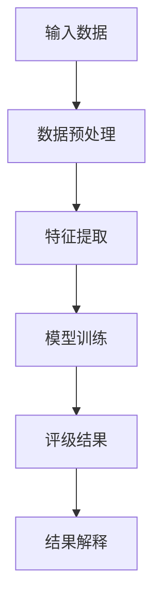
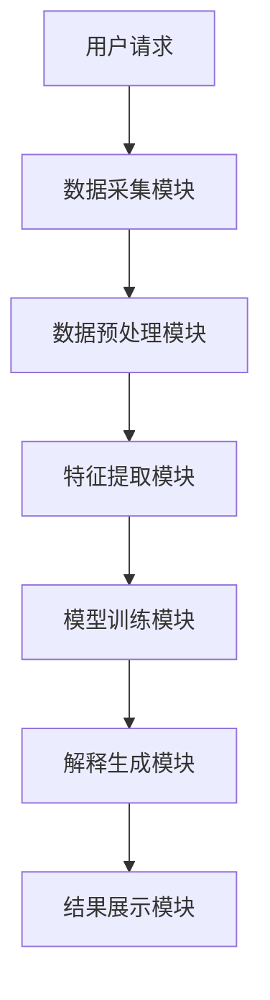
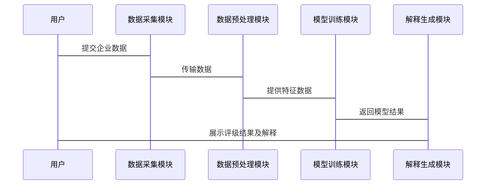

                 


# 设计智能化的企业信用评级解释系统

---

## 关键词
- 企业信用评级
- 人工智能
- 智能化系统
- 机器学习
- 解释性系统
- 数据驱动

---

## 摘要
随着企业信用评级的重要性日益增加，传统的信用评级方法逐渐暴露出其局限性。智能化企业信用评级解释系统的出现，利用人工智能和大数据技术，为信用评级提供了更加精准和可解释的解决方案。本文将从背景、核心概念、算法原理、系统架构设计到项目实战，全面解析如何设计一个智能化的企业信用评级解释系统，帮助读者理解其设计思路和实现方法。

---

# 第一部分: 背景与概述

---

# 第1章: 企业信用评级解释系统概述

## 1.1 问题背景与描述

### 1.1.1 传统企业信用评级的局限性
传统的企业信用评级方法主要依赖于人工经验和简单的统计模型，存在以下问题：
- **数据维度有限**：传统方法通常只考虑财务数据，忽略了非结构化数据（如文本、语音等）的价值。
- **模型可解释性差**：复杂的机器学习模型（如深度学习模型）虽然预测能力强，但缺乏解释性，难以满足监管和业务需求。
- **人工干预过多**：评级过程依赖人工经验，存在主观性和不一致性。

### 1.1.2 智能化信用评级的需求与目标
随着人工智能和大数据技术的快速发展，企业信用评级对智能化的需求日益迫切：
- **提高准确性**：利用机器学习算法处理多维度数据，提升评级的准确性。
- **增强可解释性**：通过模型解释技术，使评级结果更具透明性和可信度。
- **实现自动化**：构建自动化评级系统，减少人工干预，提高效率。

### 1.1.3 信用评级解释系统的核心问题
- 如何选择和处理多维度数据？
- 如何设计可解释的机器学习模型？
- 如何构建高效的系统架构？

## 1.2 系统目标与功能

### 1.2.1 系统的主要目标
- 提供智能化的企业信用评级服务。
- 提供可解释的评级结果，满足监管和业务需求。
- 实现自动化评级流程，提高效率。

### 1.2.2 系统的核心功能模块
1. 数据采集与预处理模块
2. 模型训练与优化模块
3. 评级结果解释与展示模块

### 1.2.3 系统的边界与外延
- 系统边界：仅关注企业信用评级相关的数据和模型。
- 系统外延：可与其他系统（如企业征信系统、信贷管理系统）无缝对接。

## 1.3 系统的核心要素与概念结构

### 1.3.1 核心要素分析
- **输入数据**：包括财务数据、市场数据、舆情数据等。
- **模型**：如逻辑回归、随机森林等机器学习模型。
- **输出结果**：评级结果及其解释。

### 1.3.2 概念结构与层次关系


### 1.3.3 系统的输入与输出
- 输入：企业相关数据（结构化和非结构化）。
- 输出：评级结果及解释。

---

# 第二部分: 核心概念与原理

---

# 第2章: 信用评级的核心概念与模型

## 2.1 信用评级的基本定义与分类

### 2.1.1 信用评级的定义
信用评级是对企业的信用状况进行评估，确定其偿还债务的能力和意愿。

### 2.1.2 信用评级的主要分类
1. **企业信用评级**：对企业的整体信用状况进行评估。
2. **债券信用评级**：对债券发行企业的信用状况进行评估。
3. **贷款信用评级**：对贷款申请企业的信用状况进行评估。

### 2.1.3 不同评级模型的特征对比
| 模型类型 | 输入数据 | 输出结果 | 优点 | 缺点 |
|----------|-----------|----------|------|------|
| 传统统计模型 | 少量结构化数据 | 级别（A, B, C等） | 易解释 | 准确性低 |
| 机器学习模型 | 多维结构化与非结构化数据 | 概率值或级别 | 准确性高 | 解释性差 |

## 2.2 智能化信用评级的核心原理

### 2.2.1 数据驱动的评级原理
通过大量数据的分析，提取特征，训练模型，实现自动化评级。

### 2.2.2 机器学习在信用评级中的应用
- **监督学习**：如逻辑回归、支持向量机（SVM）。
- **无监督学习**：如聚类分析。
- **集成学习**：如随机森林、梯度提升树（GBDT）。

### 2.2.3 深度学习模型的优势与局限
- **优势**：能够处理非结构化数据，如文本、图像。
- **局限**：解释性差，计算资源需求高。

## 2.3 系统架构的核心要素

### 2.3.1 数据采集模块
- 负责从多种数据源采集企业相关数据。

### 2.3.2 模型训练模块
- 负责对数据进行特征提取和模型训练。

### 2.3.3 解释生成模块
- 负责对模型输出结果进行解释，生成可理解的评级报告。

---

# 第三部分: 算法原理与实现

---

# 第3章: 信用评级模型的算法原理

## 3.1 特征选择与数据预处理

### 3.1.1 特征选择的方法
- **过滤法**：基于统计指标（如卡方检验）选择特征。
- **包装法**：通过构建子模型评估特征重要性。
- **嵌入法**：在模型训练过程中自动学习特征重要性。

### 3.1.2 数据清洗与标准化
- **数据清洗**：处理缺失值、异常值。
- **数据标准化**：归一化处理，确保模型收敛。

## 3.2 基于机器学习的信用评级模型

### 3.2.1 逻辑回归模型
- **损失函数**：对数损失函数。
- **优化算法**：梯度下降。
- **数学公式**：
  - 概率预测公式：
    $$ P(y=1|x) = \frac{e^{\beta x}}{1 + e^{\beta x}} $$
  - 损失函数：
    $$ L = -\sum_{i=1}^{n} [y_i \ln p_i + (1 - y_i) \ln (1 - p_i)] $$

### 3.2.2 随机森林模型
- **核心原理**：基于决策树的集成方法。
- **优势**：对特征工程要求低，抗过拟合。
- **实现步骤**：
  1. 生成多个决策树。
  2. 对每个样本进行投票，得到最终结果。

### 3.2.3 模型评估与调优
- **评估指标**：准确率、召回率、F1分数。
- **调优方法**：网格搜索、交叉验证。

## 3.3 模型解释性分析

### 3.3.1 特征重要性分析
- 使用 SHAP（SHapley Additive exPlanations）值解释特征对预测结果的影响。

### 3.3.2 评分卡解释
- 将模型输出转化为评分卡，直观展示评级结果。

---

# 第四部分: 系统分析与架构设计

---

# 第4章: 智能化信用评级系统的架构设计

## 4.1 问题场景介绍
- 企业信用评级系统需要处理海量数据，要求高实时性和可扩展性。

## 4.2 系统功能设计

### 4.2.1 数据采集模块
- 数据源：企业财务报表、市场数据、舆情数据。
- 实现方式：通过API接口采集数据。

### 4.2.2 模型训练模块
- 数据预处理：清洗、标准化。
- 模型选择：随机森林、逻辑回归。
- 训练流程：
  1. 特征提取。
  2. 模型训练。
  3. 模型评估。

### 4.2.3 解释生成模块
- 解释方法：SHAP、LIME。
- 报告生成：可视化解释结果。

## 4.3 系统架构设计

### 4.3.1 系统架构图


### 4.3.2 接口设计
- **输入接口**：接收企业数据。
- **输出接口**：返回评级结果及解释。

## 4.4 系统交互设计

### 4.4.1 交互流程
1. 用户提交企业数据。
2. 系统进行数据处理和模型训练。
3. 系统生成评级结果及解释。
4. 用户查看结果并进行反馈。

### 4.4.2 交互序列图


---

# 第五部分: 项目实战

---

# 第5章: 项目实战与案例分析

## 5.1 项目环境搭建

### 5.1.1 安装依赖
- Python环境：Python 3.8+
- 库依赖：
  - `pandas`：数据处理。
  - `numpy`：数值计算。
  - `scikit-learn`：机器学习模型。
  - `shap`：模型解释工具。

## 5.2 系统核心代码实现

### 5.2.1 数据预处理代码
```python
import pandas as pd
import numpy as np

# 加载数据
data = pd.read_csv('enterprise_data.csv')

# 处理缺失值
data = data.dropna()

# 标准化处理
from sklearn.preprocessing import StandardScaler
scaler = StandardScaler()
scaled_data = scaler.fit_transform(data)
```

### 5.2.2 模型训练代码
```python
from sklearn.ensemble import RandomForestClassifier
from sklearn.metrics import accuracy_score

# 训练模型
model = RandomForestClassifier()
model.fit(scaled_data, labels)

# 模型预测
predictions = model.predict(scaled_data)
print("Accuracy:", accuracy_score(labels, predictions))
```

### 5.2.3 模型解释代码
```python
import shap

# 解释模型
explainer = shap.TreeExplainer(model)
shap_values = explainer.shap_values(X)
shap.plot_importance(explainer, max_display=10)
```

## 5.3 项目小结
- 通过项目实战，验证了系统设计的可行性。
- 模型解释性是系统设计的关键，需要重点关注。

---

# 第六部分: 最佳实践与总结

---

# 第6章: 最佳实践与总结

## 6.1 小结
- 系统设计需要结合实际业务需求，注重数据质量和模型解释性。
- 在实际应用中，需要不断优化模型和系统架构。

## 6.2 注意事项
- 数据隐私和安全问题需高度重视。
- 模型解释性是系统设计的核心，需要优先考虑。

## 6.3 拓展阅读
- 推荐阅读《机器学习实战》、《深入浅出机器学习》等书籍。
- 关注最新的信用评级技术动态。

---

# 结语
设计智能化的企业信用评级解释系统是一项复杂的工程，需要结合人工智能、大数据和业务知识。通过本文的详细讲解，读者可以掌握系统设计的核心要点和实现方法，为实际应用提供参考。

---

