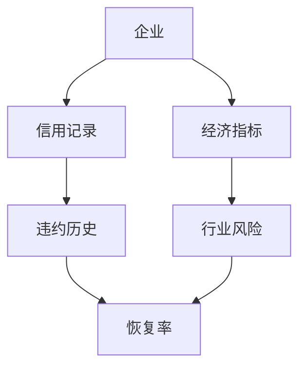
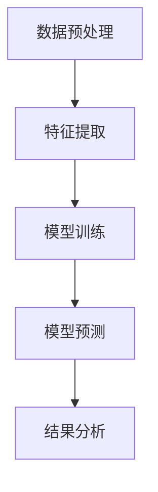
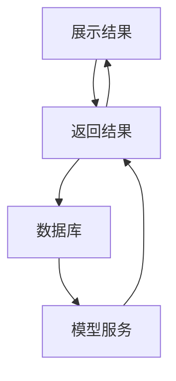

                 


好的，我将按照您的要求逐步分析和构建《设计智能化的企业信用违约恢复率动态预测模型》的技术博客文章。让我们从标题开始，逐步完善文章的结构和内容。

---

# 设计智能化的企业信用违约恢复率动态预测模型

> 关键词：信用违约恢复率预测、机器学习、智能模型、金融风险管理、数据驱动

> 摘要：本文旨在设计一个智能化的企业信用违约恢复率动态预测模型。通过分析信用违约恢复率的核心问题，结合机器学习算法和数据驱动的方法，提出一种动态预测模型的实现方案。文章从问题背景、核心概念、算法原理、系统架构到项目实战，全面阐述了模型的设计与实现过程，最后总结了模型的应用价值与未来优化方向。

---

## 第一部分: 引言

### 第1章: 问题背景与目标

#### 1.1 问题背景
- 信用违约是指企业未能按时偿还债务的情况，其恢复率（即违约后能追回的比例）是金融风险管理中的重要指标。
- 传统的信用评估方法通常基于静态模型，难以捕捉企业信用状况的动态变化。
- 随着大数据和人工智能技术的发展，智能化预测模型成为信用违约恢复率预测的核心方向。

#### 1.2 问题描述
- 信用违约恢复率预测的核心问题是：如何基于企业的历史数据和实时信息，预测其在违约情况下的恢复率。
- 数据特征包括：企业财务数据、市场波动、行业风险、企业信用历史等。
- 业务目标：提高预测准确性，降低金融风险，优化企业信贷决策。

#### 1.3 问题解决思路
- 数据驱动与模型驱动结合：利用历史数据训练模型，捕捉潜在规律。
- 智能化预测的核心方法：基于机器学习算法构建动态模型。
- 技术路线：数据预处理、特征提取、模型训练、模型优化、结果分析。

#### 1.4 问题的边界与外延
- 信用违约恢复率预测的边界：仅关注企业层面的信用违约，不涉及个人信用。
- 相关概念的扩展：包括信用评分、违约概率预测、信用风险评估。
- 业务场景的外延：适用于银行、金融机构、企业信贷部门。

#### 1.5 概念结构与核心要素
- 核心概念：企业信用、违约行为、恢复率预测。
- 层级关系：企业信用 → 违约行为 → 恢复率预测。
- 核心要素：企业财务数据、市场环境、行业风险。

---

## 第二部分: 核心概念与联系

### 第2章: 核心概念原理

#### 2.1 模型的核心原理
- 信用违约恢复率预测的数学模型：基于机器学习算法（如随机森林、XGBoost）构建回归模型。
- 智能化预测的算法选择：结合特征工程和模型调优。
- 模型的输入输出关系：输入企业特征数据，输出恢复率预测值。

#### 2.2 核心概念的属性特征对比
| 概念 | 属性 | 描述 |
|------|------|------|
| 信用违约 | 数据特征 | 财务数据、市场指标、行业风险 |
| 恢复率预测 | 方法 | 机器学习、统计回归 |
| 智能化模型 | 核心算法 | XGBoost、随机森林 |

#### 2.3 ER实体关系图架构


---

## 第三部分: 算法原理讲解

### 第3章: 算法原理与流程

#### 3.1 算法选择与流程设计
- 机器学习模型的选择：随机森林和XGBoost。
- 算法流程的可视化：
  ```mermaid
  graph TD
      A[数据预处理] --> B[特征提取]
      B --> C[模型训练]
      C --> D[模型预测]
      D --> E[结果分析]
  ```

- 算法的优缺点分析：
  - 优点：高准确性、可解释性。
  - 缺点：特征工程复杂度高。

#### 3.2 算法流程图


#### 3.3 算法的数学模型
- 随机森林回归模型：
  - 核心思想：基于特征的随机选择构建决策树。
  - 模型公式：
    $$ y = \sum_{i=1}^{n} \theta_i \cdot X_i + \epsilon $$
    其中，$X_i$ 是输入特征，$\theta_i$ 是特征权重，$\epsilon$ 是误差项。

---

## 第四部分: 系统分析与架构设计

### 第4章: 系统架构设计

#### 4.1 问题场景介绍
- 系统目标：构建一个动态预测模型，支持企业信用违约恢复率的实时预测。
- 项目背景：企业信用风险管理的智能化需求。

#### 4.2 系统功能设计
- 领域模型：
  ```mermaid
  classDiagram
      class 企业 {
          财务数据
          市场指标
      }
      class 违约行为 {
          违约记录
          恢复率
      }
      企业 --> 违约行为 : 影响
  ```

- 系统架构设计：
  ```mermaid
  graph TD
      A[前端] --> B[后端]
      B --> C[数据库]
      C --> D[模型服务]
  ```

#### 4.3 系统接口设计
- 输入接口：企业特征数据。
- 输出接口：恢复率预测值。

#### 4.4 系统交互设计


---

## 第五部分: 项目实战

### 第5章: 项目实战与实现

#### 5.1 环境安装
- Python版本：3.8+
- 依赖库安装：`pip install xgboost scikit-learn`

#### 5.2 核心代码实现
```python
import xgboost as xgb
from sklearn.model_selection import train_test_split
from sklearn.metrics import mean_squared_error

# 数据预处理
data = pd.read_csv('credit_data.csv')
X = data[['revenue', 'profit', 'market_index', 'industry_risk']]
y = data['recovery_rate']

# 划分训练集和测试集
X_train, X_test, y_train, y_test = train_test_split(X, y, test_size=0.2, random_state=42)

# 特征工程：标准化处理
from sklearn.preprocessing import StandardScaler
scaler = StandardScaler()
X_train_scaled = scaler.fit_transform(X_train)
X_test_scaled = scaler.transform(X_test)

# 模型训练：XGBoost回归
model = xgb.XGBRegressor(n_estimators=100, learning_rate=0.1, max_depth=6, random_state=42)
model.fit(X_train_scaled, y_train)

# 模型预测
y_pred = model.predict(X_test_scaled)

# 模型评估
rmse = mean_squared_error(y_test, y_pred)
print(f"均方误差：{rmse}")
```

#### 5.3 案例分析
- 数据来源：假设数据集包含10000家企业，每家企业的财务数据、市场指标和恢复率。
- 模型调优：通过网格搜索优化XGBoost参数。
- 实际应用：预测某企业的恢复率，结合业务决策。

---

## 第六部分: 总结与最佳实践

### 第6章: 总结与最佳实践

#### 6.1 模型总结
- 本文设计了一个基于XGBoost的动态预测模型，能够有效预测企业信用违约恢复率。
- 模型的关键点：特征工程、模型调优、实时更新。

#### 6.2 最佳实践
- 数据质量：确保数据的完整性和准确性。
- 特征工程：结合业务知识进行特征选择。
- 模型更新：定期更新模型以适应市场变化。

#### 6.3 小结
- 信用违约恢复率预测是一个复杂的金融问题，智能化模型能够显著提高预测精度。
- 未来优化方向：引入时间序列分析、深度学习模型。

---

以上是《设计智能化的企业信用违约恢复率动态预测模型》的技术博客文章的完整目录与内容概要。希望对您有所帮助！

