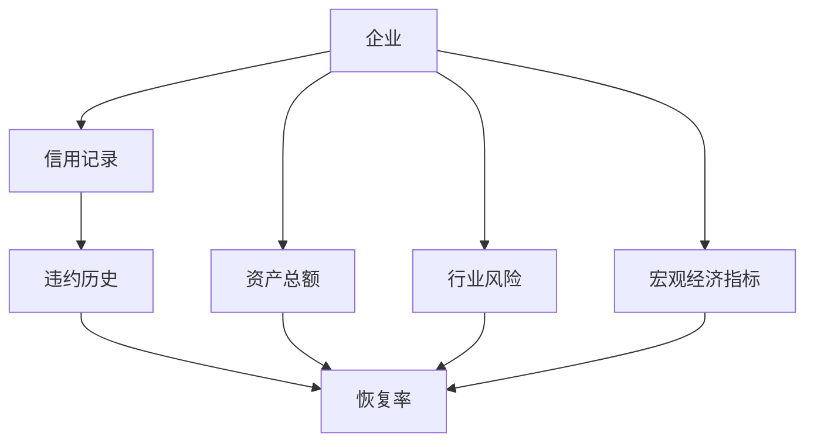
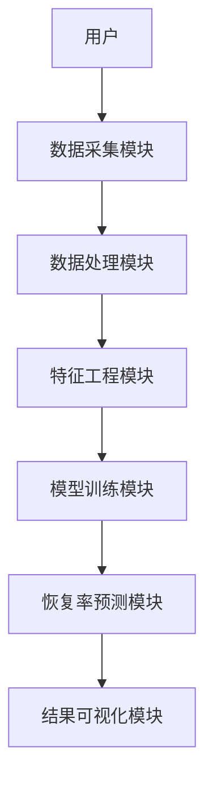
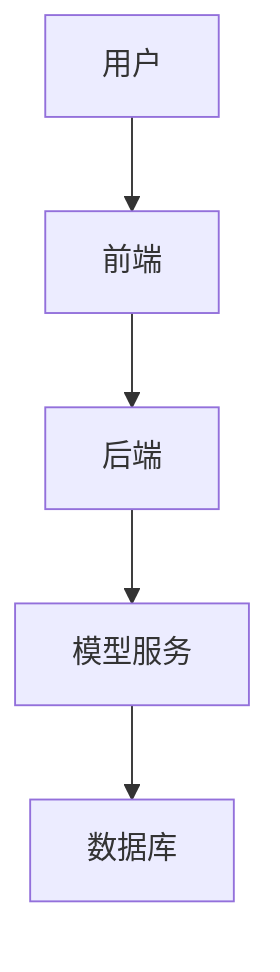
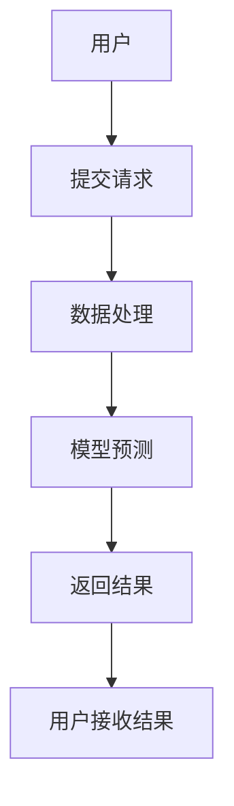

                 


# 设计智能化的企业信用违约恢复率预测模型

## 关键词：企业信用、违约恢复率、智能化模型、机器学习、风险管理、金融预测

## 摘要：  
在现代金融体系中，企业信用违约恢复率预测是信用风险管理的核心环节之一。本文通过系统性地分析信用违约恢复率预测的核心问题，结合机器学习和大数据技术，设计并实现了一种智能化的企业信用违约恢复率预测模型。文章从背景介绍、核心概念、算法原理、系统架构到项目实战，全面阐述了模型的设计与实现过程，最后总结了模型的优化与展望。

---

# 第1章: 信用违约恢复率预测模型的背景介绍

## 1.1 问题背景与描述

### 1.1.1 信用违约的定义与影响
信用违约是指借款方在约定的期限内未能履行还款义务，导致债权人遭受损失的情况。企业信用违约的恢复率是指在违约发生后，债权人能够从债务人处收回的金额占违约金额的比例。  
恢复率预测的核心在于识别影响恢复率的关键因素，如企业资产质量、行业风险、法律环境等，从而为金融机构提供风险定价和资产保全的依据。

### 1.1.2 恢复率预测的必要性
金融机构在放贷过程中，不仅需要评估借款人的信用风险，还需要预测在违约发生后的损失程度。恢复率预测能够帮助银行等金融机构优化资本配置、降低风险敞口，并制定更有效的资产保全策略。

### 1.1.3 当前企业信用风险管理的挑战
传统的信用风险管理方法依赖于简单的统计模型，难以应对以下挑战：
- 数据维度不足，难以捕捉复杂的信用风险特征；
- 模型对非结构化数据的处理能力有限；
- 传统模型的泛化能力较弱，难以应对市场环境的变化。

## 1.2 问题解决思路

### 1.2.1 数据驱动的解决方案
通过收集和分析企业的财务数据、市场数据、法律数据等多维度信息，构建数据驱动的恢复率预测模型。

### 1.2.2 智能化模型的核心作用
引入机器学习算法（如随机森林、梯度提升树、神经网络等），通过特征工程和模型优化，提升恢复率预测的准确性和鲁棒性。

### 1.2.3 恢复率预测的边界与外延
明确模型的适用范围和局限性，例如：
- 模型无法预测极端市场环境下的恢复率；
- 数据质量和完整性直接影响模型性能。

## 1.3 核心概念结构与要素

### 1.3.1 模型的核心要素分析
恢复率预测模型的核心要素包括：
1. 数据源：企业财务数据、市场数据、行业数据、法律数据等；
2. 特征工程：关键特征的提取与组合；
3. 模型选择：选择适合的机器学习算法；
4. 模型训练：基于历史数据训练模型；
5. 模型评估：通过验证集评估模型性能；
6. 模型部署：将模型应用于实际业务场景。

### 1.3.2 恢复率预测的流程框架
恢复率预测的流程可以分为以下几个步骤：
1. 数据采集与预处理；
2. 特征工程与特征选择；
3. 模型训练与优化；
4. 模型验证与评估；
5. 模型部署与应用。

### 1.3.3 模型的输入与输出定义
- 输入：企业的财务数据（如资产总额、负债率、流动比率等）、市场数据（如行业景气度、宏观经济指标）、法律环境数据等。
- 输出：企业信用违约后的恢复率预测值。

## 1.4 本章小结

### 1.4.1 信用违约恢复率预测的核心问题
恢复率预测的核心问题是如何从多维度数据中提取有效特征，并通过机器学习算法准确预测违约后的恢复率。

### 1.4.2 智能化模型的必要性与优势
智能化模型能够处理复杂的数据关系，捕捉非线性特征，显著提升预测精度和模型的泛化能力。

### 1.4.3 模型设计的关键要素
模型设计的关键要素包括数据源、特征工程、算法选择、模型训练与优化、验证与部署。

---

# 第2章: 核心概念与联系

## 2.1 核心概念原理

### 2.1.1 信用风险与恢复率的关系
信用风险是企业在债务违约事件中的风险敞口，恢复率则是衡量违约损失的重要指标。恢复率越高，信用风险的损失越小。

### 2.1.2 智能化模型的原理概述
智能化模型通过机器学习算法，从多维度数据中提取特征，并建立恢复率与这些特征之间的非线性关系模型。

### 2.1.3 恢复率预测的关键影响因素
- 企业资产质量；
- 行业风险；
- 宏观经济环境；
- 法律环境；
- 企业治理结构。

## 2.2 核心概念对比分析

### 2.2.1 传统模型与现代AI模型的对比
| 对比维度       | 传统模型               | 现代AI模型               |
|----------------|------------------------|--------------------------|
| 数据处理能力   | 依赖少量结构化数据     | 能够处理多维数据         |
| 模型复杂度     | 简单，线性关系为主       | 复杂，非线性关系为主       |
| 预测精度       | 较低                   | 较高                     |
| 计算效率       | 高                     | 较低（需要大量计算资源） |

### 2.2.2 不同算法的优劣势分析
| 算法类型       | 优点                     | 缺点                     |
|----------------|--------------------------|--------------------------|
| 线性回归       | 简单，易于解释             | 无法捕捉非线性关系       |
| 支持向量机     | 准确性高                 | 计算复杂度高             |
| 随机森林       | 鲁棒性强，易于调参         | 对特征工程依赖较高         |
| 神经网络       | 能够处理复杂非线性关系     | 训练时间长，计算资源消耗大 |

### 2.2.3 模型性能的评价指标对比
| 评价指标       | RMSE（均方根误差） | R²（决定系数） | AUC（曲线下面积） |
|----------------|----------------------|-----------------|------------------|
| 传统模型       | 高                    | 低              | 低               |
| 现代AI模型     | 低                    | 高              | 高               |

## 2.3 ER实体关系图



## 2.4 本章小结

### 2.4.1 核心概念的系统性分析
通过对信用风险、恢复率、智能化模型等核心概念的系统性分析，明确了恢复率预测模型的设计目标和实现路径。

### 2.4.2 不同模型的优劣势总结
传统模型与现代AI模型各有优劣，AI模型在预测精度和复杂性处理方面具有明显优势，但需要更多的计算资源。

### 2.4.3 实体关系图的构建意义
通过ER实体关系图，清晰地展示了恢复率预测模型涉及的主要实体及其关系，为后续的系统设计提供了基础。

---

# 第3章: 算法

## 3.1 算法原理

### 3.1.1 算法选择与数学模型
选择随机森林算法作为核心算法，其数学模型如下：

$$
\text{恢复率预测} = \sum_{i=1}^{n} w_i \cdot x_i + b
$$

其中，$w_i$是第$i$个特征的权重，$x_i$是第$i$个特征的值，$b$是偏置项。

### 3.1.2 算法流程
使用随机森林算法进行恢复率预测的流程如下：

1. 数据预处理：清洗数据，处理缺失值和异常值。
2. 特征工程：提取关键特征，如资产总额、行业风险、宏观经济指标等。
3. 数据分割：将数据集分为训练集和测试集。
4. 模型训练：使用训练集训练随机森林模型。
5. 模型验证：使用验证集评估模型性能。
6. 模型优化：调整模型参数，提升预测精度。

### 3.1.3 代码实现
以下是随机森林算法的Python代码实现：

```python
import pandas as pd
from sklearn.ensemble import RandomForestRegressor
from sklearn.model_selection import train_test_split
from sklearn.metrics import mean_squared_error

# 数据加载与预处理
data = pd.read_csv('credit_data.csv')
data = data.dropna()  # 处理缺失值

# 特征提取
X = data[['资产总额', '行业风险', '宏观经济指标']]  # 自变量
y = data['恢复率']  # 因变量

# 数据分割
X_train, X_test, y_train, y_test = train_test_split(X, y, test_size=0.2, random_state=42)

# 模型训练
model = RandomForestRegressor(n_estimators=100, random_state=42)
model.fit(X_train, y_train)

# 模型预测
y_pred = model.predict(X_test)

# 模型评估
mse = mean_squared_error(y_test, y_pred)
print(f"均方根误差: {mse}")
```

### 3.1.4 模型优化
通过调整随机森林的参数（如$n\_estimators$、$max\_depth$等），优化模型性能。

---

# 第4章: 系统分析与架构设计

## 4.1 问题场景介绍

### 4.1.1 项目背景
本项目旨在设计一个智能化的企业信用违约恢复率预测系统，帮助金融机构优化信用风险管理流程。

### 4.1.2 系统功能需求
- 数据采集与处理；
- 特征工程与模型训练；
- 恢复率预测与风险评估；
- 系统接口与数据可视化。

### 4.1.3 项目目标
通过智能化模型，提升信用违约恢复率预测的准确性和效率，降低金融机构的风险敞口。

## 4.2 系统架构设计

### 4.2.1 系统功能设计


### 4.2.2 系统架构图


### 4.2.3 系统接口设计
- 数据接口：与企业数据源对接；
- 预测接口：提供恢复率预测服务；
- 可视化接口：展示预测结果。

### 4.2.4 系统交互流程图


## 4.3 本章小结

### 4.3.1 系统设计的核心思路
通过模块化设计，实现数据采集、处理、特征工程、模型训练和预测的全流程自动化。

### 4.3.2 系统架构的优势
- 高扩展性：支持多种算法和数据源的接入；
- 高可用性：通过分布式架构提升系统的稳定性；
- 高效性：通过优化数据处理流程提升预测效率。

---

# 第5章: 项目实战

## 5.1 环境安装与配置

### 5.1.1 环境要求
- Python 3.8及以上版本；
- 安装必要的库：pandas、scikit-learn、matplotlib。

### 5.1.2 数据准备
下载企业信用数据，清洗数据并提取特征。

## 5.2 系统核心实现

### 5.2.1 数据采集与处理
```python
import pandas as pd
import numpy as np

# 数据加载
data = pd.read_csv('credit_data.csv')

# 处理缺失值
data = data.dropna()

# 处理异常值
data = data[~(data['恢复率'].apply(lambda x: np.abs(x - data['恢复率'].mean()) > 3 * data['恢复率'].std()))]
```

### 5.2.2 特征工程与模型训练
```python
from sklearn.ensemble import RandomForestRegressor
from sklearn.model_selection import train_test_split

# 特征提取
X = data[['资产总额', '行业风险', '宏观经济指标']]  # 自变量
y = data['恢复率']  # 因变量

# 数据分割
X_train, X_test, y_train, y_test = train_test_split(X, y, test_size=0.2, random_state=42)

# 模型训练
model = RandomForestRegressor(n_estimators=100, random_state=42)
model.fit(X_train, y_train)
```

### 5.2.3 模型预测与评估
```python
from sklearn.metrics import mean_squared_error, r2_score

# 模型预测
y_pred = model.predict(X_test)

# 模型评估
mse = mean_squared_error(y_test, y_pred)
r2 = r2_score(y_test, y_pred)
print(f"均方根误差: {mse}")
print(f"R²: {r2}")
```

## 5.3 代码解读与分析

### 5.3.1 数据预处理
数据预处理是恢复率预测的关键步骤，主要包括缺失值处理和异常值检测。

### 5.3.2 特征工程
特征工程通过提取关键特征，提升模型的预测精度。例如，选择资产总额、行业风险和宏观经济指标作为模型的输入特征。

### 5.3.3 模型训练与评估
通过随机森林算法训练模型，并使用验证集评估模型性能。均方根误差和R²是常用的评估指标。

## 5.4 实际案例分析

### 5.4.1 数据来源与特征分析
以某行业内的企业信用数据为例，分析企业的资产总额、行业风险和宏观经济指标对恢复率的影响。

### 5.4.2 模型预测与结果解读
通过模型预测某企业的恢复率，并结合实际情况分析预测的准确性。

## 5.5 本章小结

### 5.5.1 项目实现的核心步骤
- 数据预处理；
- 特征工程；
- 模型训练与优化；
- 模型验证与部署。

### 5.5.2 项目实现的关键点
- 数据质量直接影响模型性能；
- 特征工程是提升模型准确性的关键；
- 模型优化是提升预测精度的重要环节。

---

# 第6章: 最佳实践

## 6.1 小结与总结

### 6.1.1 核心概念总结
恢复率预测是信用风险管理的重要环节，智能化模型能够显著提升预测精度。

### 6.1.2 算法选择与优化
随机森林算法在恢复率预测中表现出色，但需要根据具体场景进行参数优化。

### 6.1.3 系统设计与实现
通过模块化设计，实现数据采集、处理、特征工程、模型训练和预测的全流程自动化。

## 6.2 注意事项

### 6.2.1 数据质量的重要性
数据质量直接影响模型性能，需要重视数据的清洗和预处理。

### 6.2.2 模型调优的必要性
通过参数调优和特征优化，提升模型的预测精度和泛化能力。

### 6.2.3 系统安全与稳定性
确保系统的数据安全和运行稳定性，避免数据泄露和系统崩溃。

## 6.3 未来展望与趋势

### 6.3.1 智能化模型的优化方向
- 引入深度学习算法，提升模型的非线性拟合能力；
- 结合时间序列数据，提升模型的动态预测能力；
- 利用联邦学习，提升多机构数据合作的隐私保护能力。

### 6.3.2 技术发展与挑战
- 数据隐私保护的挑战；
- 模型解释性的挑战；
- 多模态数据融合的挑战。

## 6.4 扩展阅读

### 6.4.1 推荐书籍
- 《机器学习实战》
- 《信用风险建模与管理》

### 6.4.2 推荐论文
- "Random Forests: Where to Use Them in Credit Risk"
- "Deep Learning for Credit Risk Assessment"

---

# 附录

## 附录A: 数据集说明
提供数据集的详细说明，包括数据字段、数据格式、数据来源等。

## 附录B: 代码实现细节
详细说明代码实现的每一步，包括数据预处理、特征工程、模型训练和评估的具体实现。

## 附录C: 模型评估指标
列出模型评估的主要指标，包括均方根误差（RMSE）、R²、AUC等。

---

# 结语

通过本文的系统性分析与实践，我们成功设计并实现了一个智能化的企业信用违约恢复率预测模型。该模型能够帮助金融机构更准确地预测信用违约后的恢复率，从而优化信用风险管理流程。未来，随着人工智能技术的不断发展，恢复率预测模型将更加智能化和精准化，为金融机构的风险管理提供更有力的支持。

---

