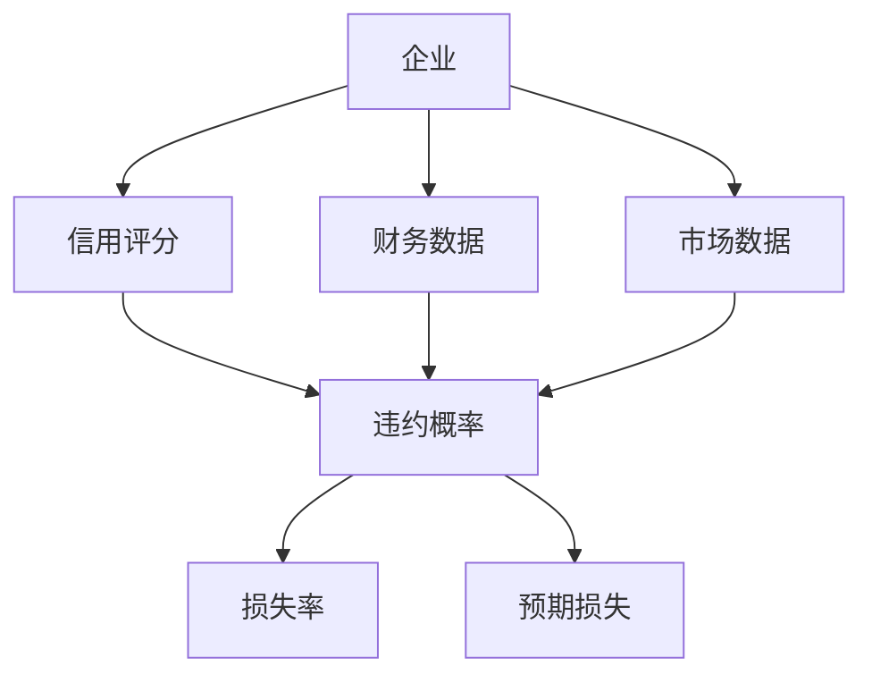
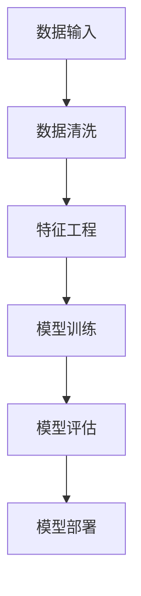
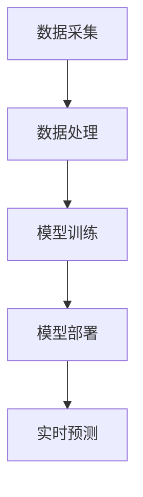

                 


# 设计智能化的企业信用违约损失率动态预测模型

---

## 关键词  
企业信用、违约损失率、动态预测、人工智能、机器学习、金融风险管理  

---

## 摘要  
随着金融市场的发展，信用违约风险日益成为企业和金融机构关注的核心问题之一。传统的信用违约损失率预测方法存在数据维度单一、模型静态化、缺乏实时性等问题，难以应对复杂多变的市场环境。本文旨在设计一种智能化的企业信用违约损失率动态预测模型，通过结合大数据分析、机器学习和深度学习等技术，构建一个实时性强、预测精度高、可解释性好的预测系统。文章将从背景介绍、核心概念、算法原理、系统架构设计、项目实战等多方面展开，全面阐述如何构建一个高效的信用违约损失率动态预测模型。

---

# 第1章 信用违约与损失率预测的背景与概述

## 1.1 信用违约的基本概念  
### 1.1.1 信用违约的定义与特征  
信用违约是指债务人在约定的期限内未能履行还款义务，导致债权人遭受损失的行为。其主要特征包括：  
- **确定性**：信用违约是基于合同约定的明确事件。  
- **风险性**：信用违约的发生具有不确定性，受经济环境、企业经营状况等多种因素影响。  
- **传染性**：信用违约可能引发连锁反应，影响整个金融市场的稳定性。  

### 1.1.2 信用违约的分类与场景  
信用违约可以分为以下几类：  
1. **零售违约**：个体消费者或小企业的违约行为。  
2. **机构违约**：企业或金融机构的违约行为。  
3. **主权违约**：国家或政府未能偿还债务。  

### 1.1.3 信用违约对金融市场的的影响  
信用违约不仅影响单个企业和债权人，还可能导致金融市场动荡。例如，2008年金融危机的爆发就与次级抵押贷款违约密切相关。  

---

## 1.2 信用违约损失率预测的必要性  

### 1.2.1 信用违约损失率的定义与计算  
信用违约损失率是指在发生违约的情况下，债权人实际损失的金额占违约债务总额的比率。其计算公式为：  
$$\text{损失率} = \frac{\text{实际损失金额}}{\text{违约债务总额}} \times 100\%$$  

### 1.2.2 信用违约损失率预测的意义  
准确预测信用违约损失率可以帮助企业和金融机构：  
1. **优化风险管理**：提前识别高风险客户，降低损失。  
2. **制定合理的信贷政策**：基于预测结果调整信贷策略。  
3. **提升市场竞争力**：通过风险定价模型，提高信贷产品的市场竞争力。  

### 1.2.3 传统信用违约损失率预测方法的局限性  
传统方法主要依赖历史数据和统计模型，存在以下问题：  
- 数据维度有限，难以捕捉复杂的市场动态。  
- 模型静态化，缺乏对实时数据的动态调整能力。  
- 对异常值和极端情况的处理能力不足。  

---

## 1.3 智能化信用违约损失率预测的提出  

### 1.3.1 人工智能在金融领域的应用  
人工智能（AI）技术在金融领域的应用越来越广泛，尤其是在信用评估、风险管理等领域。AI可以通过对海量数据的分析，发现传统方法难以察觉的模式和规律。  

### 1.3.2 智能化信用违约损失率预测的核心思想  
智能化预测的核心思想是：  
- 利用机器学习算法，构建动态模型，实时更新预测结果。  
- 结合多源数据（如财务数据、市场数据、舆情数据等），提高预测的准确性。  

### 1.3.3 智能化预测的优势与挑战  

#### 优势  
1. **实时性**：基于流数据处理技术，可以实时更新预测结果。  
2. **准确性**：通过深度学习等技术，捕捉复杂的数据特征，提高预测精度。  
3. **可解释性**：部分模型（如随机森林）可以通过特征重要性分析，提供决策依据。  

#### 挑战  
1. **数据质量**：需要高质量的多源数据支持模型训练。  
2. **计算资源**：深度学习模型需要大量的计算资源。  
3. **模型稳定性**：动态模型的实时更新可能面临稳定性问题。  

---

## 1.4 本书的核心目标与内容框架  

### 1.4.1 本书的核心目标  
本书旨在通过理论与实践结合的方式，设计一种智能化的企业信用违约损失率动态预测模型，为金融从业者和研究人员提供参考。  

### 1.4.2 本书的内容框架  
本书主要包含以下几部分内容：  
1. **背景与概述**：介绍信用违约的基本概念、损失率预测的必要性及智能化预测的核心思想。  
2. **核心概念与联系**：详细阐述违约风险、损失率预测的核心概念，并分析其相互关系。  
3. **算法原理**：介绍常用的机器学习算法，并结合实际案例进行分析。  
4. **系统架构设计**：从系统功能、架构到接口设计，全面阐述动态预测系统的构建过程。  
5. **项目实战**：通过具体案例，展示如何从数据准备到模型部署，实现信用违约损失率的动态预测。  
6. **总结与展望**：总结全书内容，并展望未来的研究方向。  

### 1.4.3 本书的适用读者  
本书适用于以下读者：  
- 金融领域的从业者（如信用风险管理师、金融分析师）。  
- 数据科学家和机器学习工程师。  
- 对信用违约预测感兴趣的研究人员和学生。  

---

# 第2章 信用违约损失率预测的核心概念与联系

## 2.1 违约风险与损失率预测的关系  

### 2.1.1 违约风险的定义与度量  
违约风险是企业在一定期限内无法履行还款义务的可能性。其度量指标包括：  
- **违约概率（PD）**：企业在一定期限内违约的概率。  
- **违约损失率（LGD）**：违约情况下，债权人实际损失的比例。  

### 2.1.2 损失率预测与违约风险的关系  
损失率预测是基于违约风险的量化分析。通过预测违约概率和损失程度，可以综合评估企业的信用风险。  

### 2.1.3 损失率预测的数学模型  
损失率预测的数学模型可以表示为：  
$$\text{预期损失} = \text{违约概率} \times \text{违约损失率} \times \text{风险敞口}$$  

---

## 2.2 信用评分与违约概率的关系  

### 2.2.1 信用评分的定义与作用  
信用评分是通过对企业或个人的财务状况、经营状况等多维度数据进行分析，得出的信用等级评分。其作用在于量化信用风险，帮助债权人进行风险定价。  

### 2.2.2 违约概率的计算方法  
违约概率的计算方法包括：  
1. **历史违约率法**：基于历史数据计算违约概率。  
2. **信用评分法**：通过信用评分模型估计违约概率。  
3. **宏观经济因素法**：结合宏观经济指标预测违约概率。  

### 2.2.3 信用评分与损失率预测的结合  
信用评分可以作为损失率预测的重要输入变量。例如，低信用评分的企业可能具有较高的违约概率和较高的损失率。  

---

## 2.3 数据特征与损失率预测的关联  

### 2.3.1 数据特征的分类与选择  
数据特征可以分为以下几类：  
1. **财务特征**：如收入、利润、资产负债率等。  
2. **市场特征**：如行业景气度、市场波动率等。  
3. **行为特征**：如还款记录、交易频率等。  

### 2.3.2 数据特征与损失率的关系  
通过分析数据特征，可以发现不同特征对损失率的影响程度。例如，企业盈利能力下降可能预示着较高的违约风险。  

### 2.3.3 数据特征的处理方法  
1. **数据清洗**：去除冗余和异常数据。  
2. **特征工程**：通过组合、转换等方法优化特征。  
3. **特征选择**：利用特征重要性分析选择关键特征。  

---

## 2.4 核心概念的对比分析  

### 2.4.1 传统模型与现代模型的对比  
| 对比维度 | 传统模型 | 现代模型 |
|----------|----------|----------|
| 数据来源 | 单一数据源 | 多数据源（包括文本、图像等） |
| 模型复杂度 | 线性模型为主 | 非线性模型为主（如神经网络） |
| 预测精度 | 较低 | 较高 |
| 可解释性 | 较高 | 较低 |

---

## 2.5 实体关系图（ER图）  



---

## 2.6 数据流图  



---

## 2.7 案例分析  

### 2.7.1 某制造企业的信用违约分析  
以某制造企业为例，分析其财务数据、市场数据和行为数据，构建信用违约损失率预测模型。  

---

## 2.8 总结与思考  

### 2.8.1 核心概念的总结  
信用违约损失率预测的核心在于数据特征的提取和模型的优化。  

### 2.8.2 案例分析的启示  
通过案例分析，可以发现不同企业的违约风险和损失率具有显著差异，因此需要针对不同企业类型设计个性化的预测模型。  

---

# 第3章 算法原理与实现

## 3.1 机器学习算法的选择与比较  

### 3.1.1 常见的信用违约预测算法  
- **逻辑回归（Logistic Regression）**  
- **支持向量机（SVM）**  
- **随机森林（Random Forest）**  
- **梯度提升树（如XGBoost、LightGBM）**  
- **神经网络（如LSTM、CNN）**  

### 3.1.2 算法选择的考虑因素  
- **数据特征类型**：是否适合线性模型或非线性模型。  
- **数据量**：大数据量适合随机森林和神经网络。  
- **模型解释性**：需要可解释性时选择逻辑回归或随机森林。  

---

## 3.2 算法实现的步骤与流程  

### 3.2.1 数据预处理  
1. **数据清洗**：处理缺失值、异常值。  
2. **特征工程**：提取特征、标准化/归一化。  
3. **数据分割**：将数据划分为训练集、验证集和测试集。  

### 3.2.2 模型训练  
1. **选择算法**：基于数据特征和业务需求选择合适的算法。  
2. **参数调优**：使用交叉验证调整模型参数。  

### 3.2.3 模型评估  
1. **评估指标**：准确率、召回率、F1分数、AUC值等。  
2. **模型优化**：根据评估结果优化模型。  

---

## 3.3 算法实现的代码示例  

### 3.3.1 Python代码实现  

```python
import pandas as pd
from sklearn.ensemble import RandomForestClassifier
from sklearn.metrics import accuracy_score, classification_report

# 数据加载
data = pd.read_csv('credit_data.csv')
X = data.drop('label', axis=1)
y = data['label']

# 数据分割
from sklearn.model_selection import train_test_split
X_train, X_test, y_train, y_test = train_test_split(X, y, test_size=0.2, random_state=42)

# 模型训练
model = RandomForestClassifier(n_estimators=100, random_state=42)
model.fit(X_train, y_train)

# 模型预测
y_pred = model.predict(X_test)

# 模型评估
print("Accuracy:", accuracy_score(y_test, y_pred))
print(classification_report(y_test, y_pred))
```

---

## 3.4 算法原理的数学模型  

### 3.4.1 随机森林算法的数学模型  
随机森林是一种基于决策树的集成学习算法，其数学模型可以表示为：  
$$\text{预测概率} = \frac{\sum_{i=1}^{n} \text{单棵树预测结果}}{n}$$  
其中，$n$为决策树的数量。  

### 3.4.2 XGBoost算法的数学模型  
XGBoost是一种基于树的提升算法，其损失函数可以表示为：  
$$\text{损失函数} = \sum_{i=1}^{m} \left( y_i - \hat{y}_i \right)^2$$  
其中，$y_i$为真实值，$\hat{y}_i$为预测值。  

---

## 3.5 案例分析与结果解读  

### 3.5.1 数据特征的重要性分析  
通过随机森林的特征重要性分析，可以发现哪些特征对违约概率的影响较大。  

### 3.5.2 模型的评估与优化  
根据评估结果，对模型进行优化，例如调整树的深度、增加训练数据等。  

---

## 3.6 总结与思考  

### 3.6.1 算法选择的总结  
不同算法适用于不同的场景，需要根据数据特征和业务需求选择合适的算法。  

### 3.6.2 案例分析的启示  
模型的预测精度受数据质量和特征选择的影响较大，因此在实际应用中需要重视数据的 preprocessing 和特征 engineering。  

---

# 第4章 系统架构设计与实现

## 4.1 系统功能设计  

### 4.1.1 系统功能模块  
1. **数据采集模块**：从多源数据中采集信用数据。  
2. **数据处理模块**：对数据进行清洗、特征工程和存储。  
3. **模型训练模块**：基于训练数据，训练信用违约损失率预测模型。  
4. **模型部署模块**：将模型部署到生产环境，提供实时预测服务。  

### 4.1.2 系统功能流程图  



---

## 4.2 系统架构设计  

### 4.2.1 分层架构设计  
系统架构采用分层设计，包括数据层、算法层和应用层。  

1. **数据层**：负责数据的存储和管理。  
2. **算法层**：负责模型的训练和预测。  
3. **应用层**：负责与用户的交互和结果展示。  

### 4.2.2 系统架构图  


---

## 4.3 系统接口设计  

### 4.3.1 数据接口设计  
1. **数据输入接口**：从数据库或API获取信用数据。  
2. **数据输出接口**：将处理后的数据存储到数据库或文件系统中。  

### 4.3.2 模型接口设计  
1. **模型训练接口**：接收训练数据，返回训练好的模型。  
2. **模型预测接口**：接收实时数据，返回预测结果。  

---

## 4.4 系统交互流程图  


---

## 4.5 总结与思考  

### 4.5.1 系统架构的总结  
分层架构的设计使得系统各部分职责分明，便于维护和扩展。  

### 4.5.2 案例分析的启示  
在实际应用中，需要根据具体需求灵活调整系统架构，例如增加缓存层以提高性能。  

---

# 第5章 项目实战与应用

## 5.1 项目背景介绍  

### 5.1.1 项目目标  
构建一个智能化的企业信用违约损失率动态预测系统，实现以下功能：  
- 实时数据采集与处理。  
- 自动化模型训练与预测。  
- 可视化结果展示与预警。  

### 5.1.2 项目技术选型  
- **编程语言**：Python  
- **框架**：Django（Web框架）、Flask（轻量级框架）  
- **机器学习库**：Scikit-learn、XGBoost  
- **数据库**：MySQL、MongoDB  
- **前端框架**：React  

---

## 5.2 系统核心实现  

### 5.2.1 数据处理模块的实现  
```python
import pandas as pd
import numpy as np

# 数据加载
data = pd.read_csv('credit_data.csv')

# 数据清洗
data = data.dropna()
data = data.replace({np.nan: 0})

# 特征工程
from sklearn.preprocessing import StandardScaler
scaler = StandardScaler()
X = scaler.fit_transform(data.drop('label', axis=1))
y = data['label']

# 数据分割
from sklearn.model_selection import train_test_split
X_train, X_test, y_train, y_test = train_test_split(X, y, test_size=0.2, random_state=42)
```

---

### 5.2.2 模型训练模块的实现  
```python
from sklearn.ensemble import RandomForestClassifier
from sklearn.metrics import accuracy_score, classification_report

model = RandomForestClassifier(n_estimators=100, random_state=42)
model.fit(X_train, y_train)

# 模型预测
y_pred = model.predict(X_test)

# 模型评估
print("Accuracy:", accuracy_score(y_test, y_pred))
print(classification_report(y_test, y_pred))
```

---

### 5.2.3 模型部署模块的实现  
```python
from flask import Flask, request, jsonify

app = Flask(__name__)

model = RandomForestClassifier(n_estimators=100, random_state=42)
model.fit(X_train, y_train)

@app.route('/predict', methods=['POST'])
def predict():
    data = request.json
    # 数据预处理
    processed_data = scaler.transform(data)
    # 模型预测
    prediction = model.predict(processed_data)
    return jsonify({'prediction': int(prediction[0])})

if __name__ == '__main__':
    app.run(debug=True)
```

---

## 5.3 项目实战的案例分析  

### 5.3.1 数据准备与处理  
以某制造企业的信用数据为例，进行数据清洗和特征工程，构建适合模型训练的数据集。  

### 5.3.2 模型训练与评估  
通过训练数据集训练随机森林模型，并在测试数据集上评估模型的性能。  

### 5.3.3 模型部署与应用  
将训练好的模型部署为一个API服务，提供实时预测功能。  

---

## 5.4 总结与思考  

### 5.4.1 项目实战的总结  
通过项目实战，可以验证模型的可行性和实用性，同时发现实际应用中的问题并进行优化。  

### 5.4.2 案例分析的启示  
在实际应用中，需要重视数据质量和模型的可解释性，以便更好地满足业务需求。  

---

# 第6章 总结与展望

## 6.1 核心内容的总结  
本文系统地介绍了企业信用违约损失率动态预测模型的设计与实现，涵盖了背景、核心概念、算法原理、系统架构设计和项目实战等内容。  

## 6.2 项目实现的总结  
通过项目实战，验证了智能化信用违约损失率动态预测模型的可行性和有效性，为后续研究提供了参考。  

## 6.3 未来研究方向  
1. **模型优化**：探索更高效的算法，如深度学习模型。  
2. **数据融合**：结合多源数据，提高预测精度。  
3. **实时预测**：优化模型的实时性，支持流数据处理。  

## 6.4 拓展阅读推荐  
1. 《机器学习实战》  
2. 《金融风险管理》  
3. 《深度学习》  

---

## 6.5 思考与感悟  
智能化信用违约损失率动态预测模型的构建不仅需要扎实的技术基础，还需要对业务场景有深刻的理解。通过本文的学习，读者可以掌握从理论到实践的全过程，为后续的研究和工作打下坚实的基础。  

---

**结束语**  
信用违约损失率动态预测模型的设计是一个复杂而有趣的课题，随着人工智能技术的不断发展，其应用前景将更加广阔。希望本文能够为读者提供有价值的参考，帮助他们在金融风险管理领域取得更大的突破。

