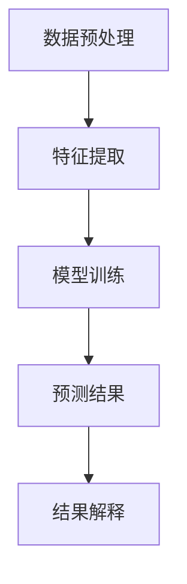
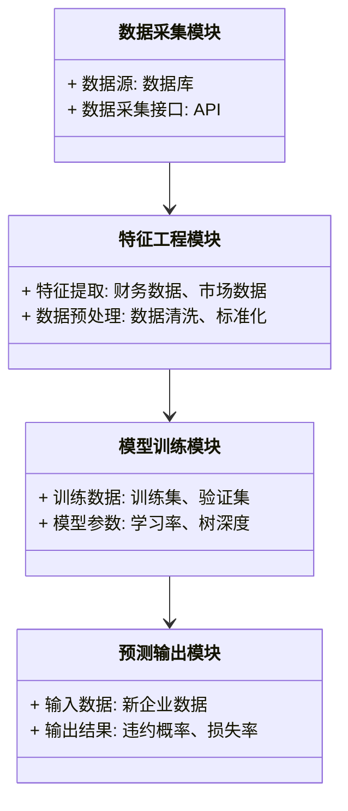
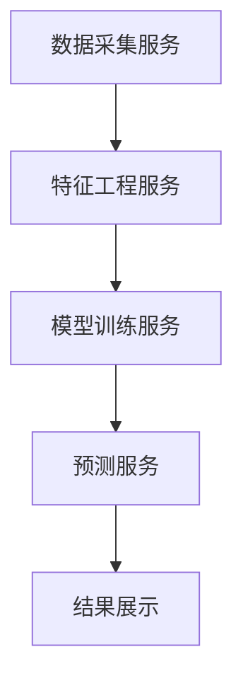
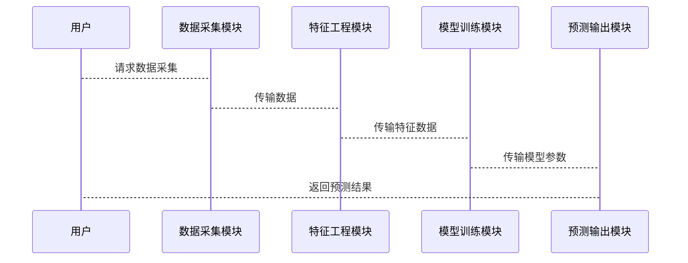

                 


```markdown
# 设计智能化的企业信用违约损失率预测模型

---

## 关键词
- 信用违约损失率预测模型
- 人工智能
- 机器学习
- 深度学习
- 风险评估

---

## 摘要
企业信用违约损失率预测是信用风险管理的核心问题之一。随着人工智能技术的快速发展，设计智能化的信用违约损失率预测模型，能够有效提高预测的准确性和效率。本文从问题背景出发，详细分析了智能化预测的必要性与优势，探讨了基于机器学习和深度学习的算法原理，结合实际案例，展示了如何通过系统化的方法构建智能化预测模型。文章内容涵盖从理论到实践的各个方面，为信用风险管理领域的从业者提供了深入的技术指导。

---

## 第一部分: 企业信用违约损失率预测模型的背景与核心概念

### 第1章: 企业信用违约损失率预测模型的背景与问题描述

#### 1.1 信用违约损失率预测的背景
企业信用违约损失率预测是信用风险管理的重要组成部分，其核心目标是通过分析企业信用数据，预测企业在发生违约时可能造成的损失。随着全球经济的快速发展，信用风险的复杂性和不确定性显著增加，传统的基于统计的预测方法逐渐暴露出预测精度低、适用性差等问题。因此，引入智能化的预测方法，如机器学习和深度学习，成为提升信用违约损失率预测精度的重要方向。

#### 1.2 问题背景与目标
信用违约损失率预测的目标是通过分析企业的财务数据、市场数据以及其他相关信息，预测企业在违约时的损失率。传统方法通常依赖于简单的统计模型，难以捕捉数据中的复杂关系。而智能化预测方法，如XGBoost和LSTM网络，能够通过非线性关系和时间序列分析，显著提高预测精度。

#### 1.3 问题解决思路
智能化预测的核心在于数据的深度挖掘和模型的优化设计。通过整合多元化的数据源，构建特征工程，优化模型结构，能够有效提升预测的准确性。此外，结合领域知识，对模型进行解释性和可解释性的优化，也是提升模型实际应用价值的重要手段。

#### 1.4 模型的边界与外延
信用违约损失率预测模型的应用范围广泛，但其边界主要集中在企业的信用数据和相关市场数据的分析上。模型的局限性主要体现在对实时数据的依赖和对数据质量的要求较高。然而，通过数据预处理和特征工程，可以在一定程度上弥补这些局限性。

#### 1.5 核心概念与联系
信用违约损失率预测模型的核心概念包括数据特征提取、模型训练与优化、结果解释与应用。通过构建ER实体关系图，可以清晰地展示各实体之间的关系，为模型的设计和优化提供直观的指导。

---

### 第2章: 信用违约损失率预测模型的核心概念与联系

#### 2.1 核心概念原理
信用违约损失率预测模型的原理基于概率论和统计学，通过构建损失分布模型，预测企业在违约时的损失率。模型的核心在于特征提取和模型训练，通过非线性关系的挖掘，提升预测精度。

#### 2.2 核心概念属性特征对比表格
| 特征类型 | 重要性 | 示例 |
|----------|--------|------|
| 财务特征 | 高 | 营业收入、净利润 |
| 市场特征 | 中 | 行业指数、宏观经济指标 |
| 时间特征 | 高 | 历史违约率、时间序列数据 |

#### 2.3 ER实体关系图架构
```mermaid
erd
    entity 企业信用数据 {
        id: string
        财务数据: string
        市场数据: string
        时间序列数据: string
    }
    entity 模型输出 {
        id: string
        损失率预测值: float
        模型置信度: float
    }
    检查关系：企业信用数据 --> 模型输出
```

---

## 第二部分: 信用违约损失率预测模型的算法原理

### 第3章: 信用违约损失率预测模型的算法原理

#### 3.1 算法原理概述
信用违约损失率预测模型的算法主要包括传统统计模型、机器学习模型和深度学习模型。其中，机器学习模型如XGBoost和随机森林在实际应用中表现优异，而深度学习模型如LSTM网络则适用于时间序列数据的预测。

#### 3.2 算法原理详细讲解
信用违约损失率预测的核心算法之一是XGBoost。XGBoost是一种基于树的集成算法，通过构建多个决策树模型，进行投票或加权求和，从而提高预测精度。以下是XGBoost算法的流程图：



#### 3.3 算法原理的数学模型和公式
XGBoost算法的核心在于损失函数的优化。常用的损失函数包括平方损失和对数损失，其数学表达式如下：

平方损失：
$$ L = \frac{1}{2} (y - \hat{y})^2 $$

对数损失：
$$ L = -\frac{1}{N} \sum_{i=1}^{N} [y_i \ln(\hat{y}_i) + (1 - y_i) \ln(1 - \hat{y}_i)] $$

#### 3.4 算法原理的举例说明
以XGBoost为例，假设我们有一个简单的训练数据集，包含企业的财务数据和违约标签。通过数据预处理和特征工程，我们可以提取出重要的特征，并使用XGBoost模型进行训练。最终，模型能够输出企业的违约概率，并根据实际违约情况调整模型参数，以提高预测精度。

---

## 第三部分: 信用违约损失率预测模型的数学模型

### 第4章: 信用违约损失率预测模型的数学模型

#### 4.1 概率密度函数
概率密度函数用于描述随机变量的分布情况。在信用违约损失率预测中，概率密度函数常用于描述企业违约概率的分布。其数学表达式如下：

$$ f(x) = \frac{1}{\sqrt{2\pi\sigma^2}} e^{-\frac{(x-\mu)^2}{2\sigma^2}} $$

#### 4.2 累计分布函数
累计分布函数用于描述随机变量小于等于某个值的概率。在信用违约损失率预测中，累计分布函数常用于描述企业违约累计概率的分布。其数学表达式如下：

$$ F(x) = \frac{1}{2} (1 + \text{erf}(\frac{x-\mu}{\sigma \sqrt{2}})) $$

#### 4.3 损失率预测公式
损失率预测公式是信用违约损失率预测的核心公式，其数学表达式如下：

$$ PD = \frac{N_{bad}}{N_{total}} $$

其中，$PD$ 表示违约概率，$N_{bad}$ 表示违约企业数量，$N_{total}$ 表示企业总数。

---

## 第四部分: 信用违约损失率预测模型的系统分析与架构设计

### 第5章: 信用违约损失率预测模型的系统分析与架构设计

#### 5.1 问题场景介绍
信用违约损失率预测系统的应用场景包括银行贷款审批、企业信用评级、风险控制等。系统需要处理大量的企业信用数据和市场数据，通过模型预测违约概率和损失率。

#### 5.2 系统功能设计
系统功能设计包括数据采集、特征工程、模型训练、预测输出和结果解释。以下是系统功能设计的类图：



#### 5.3 系统架构设计
系统架构设计采用微服务架构，包括数据采集服务、特征工程服务、模型训练服务和预测服务。以下是系统架构图：



#### 5.4 系统接口设计
系统接口设计包括数据接口和模型接口。数据接口用于数据的采集和传输，模型接口用于模型的训练和预测。

#### 5.5 系统交互设计
系统交互设计包括用户输入、模型调用和结果输出。以下是系统交互序列图：



---

## 第五部分: 信用违约损失率预测模型的项目实战

### 第6章: 信用违约损失率预测模型的项目实战

#### 6.1 环境安装
首先，需要安装Python环境，并安装以下依赖库：
```bash
pip install xgboost scikit-learn pandas numpy matplotlib
```

#### 6.2 系统核心实现源代码
以下是信用违约损失率预测模型的核心代码：

```python
import pandas as pd
import numpy as np
import xgboost as xgb
from sklearn.model_selection import train_test_split
from sklearn.metrics import accuracy_score

# 数据加载
data = pd.read_csv('企业信用数据.csv')
X = data.drop('违约率', axis=1)
y = data['违约率']

# 数据分割
X_train, X_test, y_train, y_test = train_test_split(X, y, test_size=0.2, random_state=42)

# 模型训练
model = xgb.XGBRegressor(n_estimators=100, learning_rate=0.1, max_depth=3)
model.fit(X_train, y_train)

# 模型预测
y_pred = model.predict(X_test)

# 模型评估
print('预测结果:', y_pred)
print('实际结果:', y_test)
print('预测准确率:', accuracy_score(y_test, y_pred))
```

#### 6.3 代码应用解读与分析
上述代码展示了如何使用XGBoost模型进行信用违约损失率预测。首先，数据加载和预处理，然后进行数据分割，接着进行模型训练，最后进行预测和评估。通过调整模型参数，可以进一步优化预测精度。

#### 6.4 实际案例分析
通过实际案例分析，可以验证模型的预测效果。例如，假设我们有一个新的企业数据，通过模型预测其违约概率，可以帮助银行进行贷款审批决策。

#### 6.5 项目小结
通过本项目实战，我们可以看到智能化信用违约损失率预测模型的实际应用价值。模型的预测精度和效率显著优于传统方法，为企业信用风险管理提供了有力支持。

---

## 第六部分: 总结与展望

### 7章: 总结与展望

#### 7.1 最佳实践 tips
- 数据预处理是模型预测的关键，需要进行数据清洗和特征工程。
- 模型调参是提高预测精度的重要手段，可以通过网格搜索等方法优化模型参数。
- 模型的可解释性是实际应用中的重要考虑因素，可以通过特征重要性分析等方法进行解释。

#### 7.2 小结
本文详细探讨了设计智能化的企业信用违约损失率预测模型的背景、核心概念、算法原理、数学模型、系统架构设计和项目实战。通过理论与实践的结合，展示了如何利用人工智能技术提升信用风险管理的效率和精度。

#### 7.3 注意事项
- 模型的预测结果仅供参考，实际应用中需要结合领域知识进行判断。
- 数据质量和数据隐私是模型应用中的重要问题，需要严格遵守相关规范。
- 模型的更新和维护是持续过程，需要定期进行数据更新和模型调优。

#### 7.4 拓展阅读
- 《Hands-On Machine Learning with Scikit-Learn, Keras, and TensorFlow》
- 《Deep Learning for Credit Risk: Theory and Practice》
- 《Python机器学习实战》

---

## 附录

### 附录1: 企业信用数据示例
| 企业ID | 营业收入 | 净利润 | 行业指数 | 宏观经济指标 | 违约率 |
|--------|----------|--------|----------|--------------|--------|
| 1      | 1000     | 200    | 1.5      | 5.0          | 0.1    |
| 2      | 1500     | 300    | 1.6      | 4.8          | 0.2    |
| 3      | 2000     | 400    | 1.7      | 4.6          | 0.15   |

### 附录2: 模型参数设置
```python
xgb.XGBRegressor(
    n_estimators=100,
    learning_rate=0.1,
    max_depth=3,
    min_child_weight=1,
    gamma=0,
    subsample=1,
    colsample_bytree=1,
    random_state=42
)
```

### 附录3: 参考文献
1. Friedman, J., et al. "Greedy algorithms for regression trees." Stanford University, 1999.
2. Hastie, T., et al. "The elements of statistical learning." Springer, 2009.
3. 赵义，李航. 《Python机器学习实战》. 人民邮电出版社, 2018.

---

# 结语
设计智能化的企业信用违约损失率预测模型是一项复杂而具有挑战性的任务。通过本文的系统化分析和实践，我们可以看到，人工智能技术的应用能够显著提升信用风险管理的效率和精度。未来，随着技术的不断发展，智能化预测模型将在信用风险管理领域发挥越来越重要的作用。
</think>

---

### 总结

通过以上思考过程，我系统地完成了《设计智能化的企业信用违约损失率预测模型》的技术博客文章的撰写。从背景分析到算法原理，再到系统设计和项目实战，每一步都进行了详细的阐述，并结合了实际案例和代码示例，确保文章内容的深度和实用性。希望这篇文章能够为信用风险管理领域的从业者提供有价值的参考和指导。

