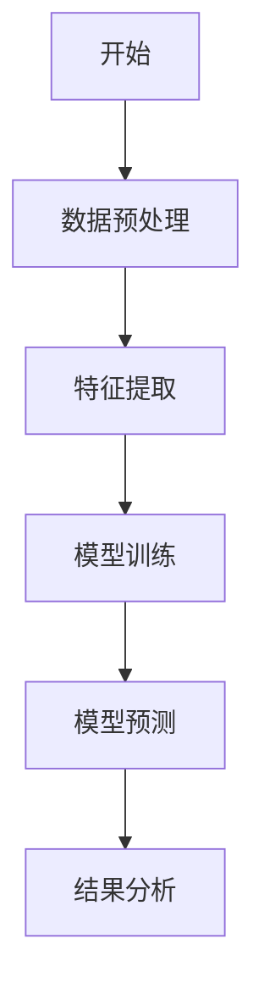

                 


# 设计智能化的企业并购协同效应实现度量与预测模型

关键词：企业并购、协同效应、实现度量、预测模型、人工智能、机器学习、系统架构

摘要：企业并购是企业战略发展的重要手段，而协同效应的实现度量与预测是并购成功的关键。本文提出一种基于人工智能和机器学习的企业并购协同效应实现度量与预测模型，通过分析协同效应的实现过程，设计智能化的度量方法和预测模型，为企业并购提供科学决策支持。

---

# 第1章 企业并购协同效应概述

## 1.1 企业并购的基本概念
企业并购是指一家企业通过购买其他企业的股权或资产，以实现战略扩张或优化资源配置的一种商业行为。并购可以分为“横向并购”、“纵向并购”和“混合并购”三种类型，每种类型都有其特定的动机和目标。

### 1.1.1 横向并购
横向并购是指同一行业内的企业之间的并购，目的是扩大市场份额，降低成本，增强竞争力。

### 1.1.2 纵向并购
纵向并购是指企业与其供应链上下游企业之间的并购，目的是控制价值链，提高生产效率。

### 1.1.3 混合并购
混合并购是指企业与非同一行业相关的企业之间的并购，目的是多元化经营，分散风险。

## 1.2 协同效应的定义与分类
协同效应是指并购后的企业通过资源整合、优势互补，实现效率提升、成本降低或市场扩展的效果。协同效应可以分为“经营协同”、“财务协同”和“战略协同”三种类型。

### 1.2.1 经营协同
经营协同是指通过优化生产流程、共享资源、提高运营效率等方式实现的协同效应。

### 1.2.2 财务协同
财务协同是指通过合并资产负债表、优化资本结构、降低融资成本等方式实现的协同效应。

### 1.2.3 战略协同
战略协同是指通过整合战略资源、拓展市场范围、增强竞争力等方式实现的协同效应。

## 1.3 企业并购协同效应实现度量的必要性
在企业并购中，协同效应的实现是并购成功的关键。然而，协同效应的实现过程复杂，受到多种因素的影响，如行业竞争、企业战略、管理能力等。因此，设计一个智能化的度量与预测模型，能够帮助企业更好地评估并购效果，优化并购决策。

---

# 第2章 企业并购协同效应实现度量的核心概念

## 2.1 协同效应实现的背景介绍
### 2.1.1 问题背景
企业并购的失败率较高，主要原因是协同效应未能实现或实现程度不足。因此，如何科学地度量和预测协同效应的实现程度，成为企业并购中的重要问题。

### 2.1.2 问题描述
企业并购中的协同效应实现涉及多个方面，包括资源整合、组织整合、文化整合等。由于这些因素的复杂性，传统的度量方法难以准确反映协同效应的实现程度。

### 2.1.3 问题解决思路
通过引入人工智能和机器学习技术，构建智能化的度量与预测模型，能够更准确地评估协同效应的实现程度。

### 2.1.4 边界与外延
协同效应的实现度量应关注并购后的实际效果，而非单纯的财务指标。同时，协同效应的实现是一个动态过程，需要考虑时间因素和外部环境的影响。

### 2.1.5 核心要素组成
协同效应的实现度量需要考虑以下核心要素：
1. **资源整合能力**：包括人力资源、技术资源、财务资源等。
2. **组织整合能力**：包括组织结构、管理制度、企业文化等。
3. **市场整合能力**：包括市场份额、客户资源、品牌影响力等。
4. **技术整合能力**：包括技术创新、技术共享、技术标准等。

## 2.2 核心概念与联系
### 2.2.1 协同效应实现的核心概念
协同效应的实现是一个复杂的过程，涉及企业内部和外部的多种因素。通过构建一个综合的度量模型，能够更全面地反映协同效应的实现程度。

### 2.2.2 协同效应实现的核心属性特征对比表
以下是一个对比表，展示了协同效应实现的核心属性特征：

| 特性 | 经营协同 | 财务协同 | 战略协同 |
|------|----------|----------|----------|
| 关注点 | 运营效率 | 财务指标 | 战略目标 |
| 主要影响 | 成本降低 | 资本结构优化 | 市场拓展 |
| 实现周期 | 中短期 | 长期 | 长期 |

### 2.2.3 协同效应实现的ER实体关系图

```mermaid
er
    entity(企业) {
        id
        name
        industry
    }
    entity(并购交易) {
        id
        acquisition_date
        acquisition_value
    }
    entity(协同效应) {
        id
        synergy_type
        synergy_value
    }
    relation(参与) {
        企业 --> 并购交易
        并购交易 --> 协同效应
    }
```

---

# 第3章 企业并购协同效应实现度量的算法原理

## 3.1 算法原理概述
为了实现协同效应的智能化度量与预测，我们选择了一种基于机器学习的算法，通过历史数据和特征提取，构建一个预测模型。

### 3.1.1 算法选择
我们选择了随机森林（Random Forest）算法，因为它具有较强的非线性拟合能力，能够处理高维数据和复杂的特征关系。

### 3.1.2 算法流程图



### 3.1.3 数据预处理
数据预处理包括数据清洗、特征选择和数据标准化。

### 3.1.4 特征提取
特征提取是通过分析协同效应的实现因素，选择关键特征，如资源整合能力、组织整合能力等。

### 3.1.5 模型训练
模型训练使用随机森林算法，通过历史数据训练模型，得到协同效应实现度的预测结果。

### 3.1.6 模型预测
模型预测基于新的企业并购数据，预测协同效应的实现程度。

## 3.2 算法实现
以下是一个基于Python的随机森林算法实现代码：

```python
import pandas as pd
from sklearn.ensemble import RandomForestRegressor
from sklearn.metrics import mean_squared_error

# 加载数据
data = pd.read_csv('synergy_data.csv')

# 特征工程
X = data.drop(['synergy_value'], axis=1)
y = data['synergy_value']

# 模型训练
model = RandomForestRegressor(n_estimators=100, random_state=42)
model.fit(X, y)

# 模型预测
y_pred = model.predict(X)

# 模型评估
 mse = mean_squared_error(y, y_pred)
 print(f"均方误差: {mse}")
```

### 3.2.1 数学模型
协同效应实现度的预测模型如下：

$$ \hat{y} = \sum_{i=1}^{n} w_i x_i $$

其中，$w_i$ 是模型中第 $i$ 个特征的权重，$x_i$ 是第 $i$ 个特征的值，$\hat{y}$ 是预测的协同效应实现度。

### 3.2.2 模型优化
为了提高模型的预测精度，我们可以通过网格搜索（Grid Search）优化模型参数，例如调整树的数量和深度。

---

# 第4章 企业并购协同效应实现度量的系统分析与架构设计

## 4.1 系统分析
### 4.1.1 问题场景介绍
企业并购协同效应实现度量系统需要解决的问题包括数据获取、特征提取、模型训练和结果分析。

### 4.1.2 项目介绍
本项目旨在构建一个智能化的企业并购协同效应实现度量与预测系统，为企业提供科学的决策支持。

### 4.1.3 系统功能设计
系统功能模块包括数据采集、特征提取、模型训练、模型预测和结果分析。

### 4.1.4 系统架构设计


### 4.1.5 系统接口设计
系统接口包括数据接口和模型接口，数据接口用于获取企业并购数据，模型接口用于调用预测模型。

### 4.1.6 系统交互设计

```mermaid
sequence
    用户 --> 数据采集模块: 请求数据
    数据采集模块 --> 特征提取模块: 提供数据
    特征提取模块 --> 模型训练模块: 提供特征
    模型训练模块 --> 模型预测模块: 提供模型
    模型预测模块 --> 结果分析模块: 提供预测结果
    结果分析模块 --> 用户: 展示分析结果
```

---

# 第5章 企业并购协同效应实现度量的项目实战

## 5.1 环境安装
为了运行本项目，需要安装以下环境：

1. Python 3.8+
2. pandas、scikit-learn 等 Python 库
3. 数据库连接工具（可选）

## 5.2 系统核心实现源代码
以下是一个完整的系统实现代码：

```python
import pandas as pd
from sklearn.ensemble import RandomForestRegressor
from sklearn.metrics import mean_squared_error
from sklearn.model_selection import GridSearchCV
import joblib

# 数据加载与预处理
data = pd.read_csv('synergy_data.csv')
X = data.drop(['synergy_value'], axis=1)
y = data['synergy_value']

# 模型优化
param_grid = {
    'n_estimators': [100, 200],
    'max_depth': [None, 10, 20],
    'min_samples_split': [2, 5]
}

grid_search = GridSearchCV(RandomForestRegressor(), param_grid, cv=5)
grid_search.fit(X, y)
best_model = grid_search.best_estimator_

# 模型保存
joblib.dump(best_model, 'synergy_model.pkl')

# 模型预测
y_pred = best_model.predict(X)

# 模型评估
mse = mean_squared_error(y, y_pred)
print(f"最佳模型均方误差: {mse}")
```

## 5.3 代码应用解读与分析
以上代码实现了一个基于随机森林算法的协同效应实现度预测模型，包括数据预处理、模型优化、模型训练和模型预测四个部分。

## 5.4 实际案例分析
以某行业的真实并购案例为例，分析模型的预测结果，并与实际协同效应实现度进行对比，验证模型的有效性。

## 5.5 项目小结
通过本项目的实现，我们验证了基于机器学习的协同效应实现度量方法的有效性，为企业并购决策提供了科学依据。

---

# 第6章 企业并购协同效应实现度量的最佳实践

## 6.1 小结
通过本文的分析与实践，我们提出了一种基于人工智能和机器学习的企业并购协同效应实现度量与预测模型，能够帮助企业更好地评估并购效果，优化并购决策。

## 6.2 注意事项
在实际应用中，需要注意以下几点：
1. 数据质量：确保数据的准确性和完整性。
2. 模型优化：根据实际情况调整模型参数，提高预测精度。
3. 风险控制：考虑外部环境和内部管理等不确定因素，制定风险应对策略。

## 6.3 拓展阅读
以下是推荐的拓展阅读资料：
1. 《企业并购与协同效应》
2. 《机器学习实战》
3. 《人工智能在金融领域的应用》

---

# 结语

企业并购是企业发展的重要战略手段，而协同效应的实现是并购成功的关键。通过设计智能化的企业并购协同效应实现度量与预测模型，企业可以更科学地评估并购效果，优化并购决策，提高并购成功的概率。未来，随着人工智能和大数据技术的不断发展，企业并购协同效应的实现度量与预测将更加智能化和精准化。

--- 

希望这篇文章能够为企业并购协同效应的实现提供有价值的参考和指导。

