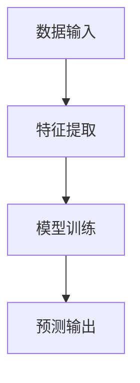
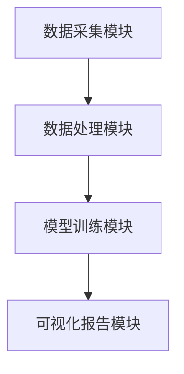
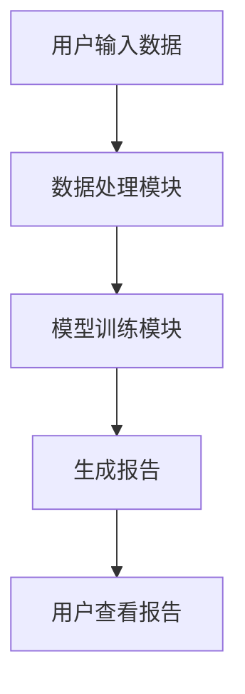

                 


# 设计智能化的企业并购协同效应评估模型

> 关键词：企业并购、协同效应、智能化评估、人工智能、机器学习、深度学习

> 摘要：本文将详细探讨如何设计一个智能化的企业并购协同效应评估模型。通过分析企业并购的背景与问题，结合协同效应的核心概念，提出一种基于人工智能的评估模型。该模型利用机器学习算法和深度学习方法，从数据驱动的角度出发，全面分析企业并购中的协同效应。文章还详细介绍了模型的算法原理、系统架构设计以及实际案例分析，旨在为企业并购提供科学的决策支持。

---

# 第一部分: 企业并购与协同效应概述

## 第1章: 企业并购的基本概念

### 1.1 企业并购的定义与类型
#### 1.1.1 企业并购的定义
企业并购（Mergers and Acquisitions, M&A）是指一家企业合并或收购另一家企业，以实现业务扩展、资源优化或市场扩张等目标。并购可以是全资收购，也可以是部分收购。

#### 1.1.2 并购的类型
- 横向并购：同一行业内的企业合并，旨在扩大市场份额或消除竞争。
- 纵向并购：供应链上下游企业的合并，以增强控制力和效率。
- 混合并购：不同行业或业务领域的企业合并，以实现多元化经营。

#### 1.1.3 并购的动机与目的
- 战略性扩张
- 资源整合
- 成本优势
- 市场进入
- 技术获取

### 1.2 协同效应的基本概念
#### 1.2.1 协同效应的定义
协同效应是指企业在并购后，通过整合资源、优化流程、共享知识等方式，实现成本降低、收入增加或效率提升的效果。

#### 1.2.2 协同效应的分类
- 成本协同效应：通过规模效应降低生产或管理成本。
- 收入协同效应：通过市场扩展或产品互补增加收入。
- 管理协同效应：通过管理经验共享提升管理水平。

#### 1.2.3 协同效应的重要性
协同效应是企业并购成功的关键因素，直接影响并购的经济效益和长期发展。

---

## 第2章: 企业并购协同效应的背景与问题

### 2.1 当前企业并购中的主要问题
#### 2.1.1 并购失败的常见原因
- 文化冲突
- 业务整合困难
- 战略目标不一致
- 估值偏差

#### 2.1.2 协同效应评估中的难点
- 数据不完整或不准确
- 评估方法单一
- 忽略动态变化

#### 2.1.3 数据驱动的并购决策需求
- 数据驱动的决策可以提高并购的精准性和成功率。
- 数据分析可以帮助识别潜在协同机会。

### 2.2 智能化评估的必要性
#### 2.2.1 传统协同效应评估方法的局限性
- 主观性较强，缺乏数据支持。
- 静态评估，忽视动态变化。

#### 2.2.2 数据分析与人工智能在并购中的应用潜力
- 数据分析可以提供客观的评估依据。
- 人工智能可以通过历史数据预测协同效应。

#### 2.2.3 智能化评估模型的优势
- 高度自动化
- 高度精准
- 能够处理复杂数据

---

# 第二部分: 智能化协同效应评估模型的核心概念

## 第3章: 协同效应的构成与影响因素

### 3.1 协同效应的构成要素
#### 3.1.1 成本协同效应
- 通过规模效应降低生产成本。
- 通过资源共享降低管理成本。

#### 3.1.2 收入协同效应
- 通过市场扩展增加收入。
- 通过产品互补增加收入。

#### 3.1.3 管理协同效应
- 通过管理经验共享提升管理水平。
- 通过组织结构优化提升效率。

### 3.2 协同效应的关键影响因素
#### 3.2.1 企业战略匹配度
- 并购双方的战略目标是否一致。
- 是否存在协同发展的机会。

#### 3.2.2 企业文化兼容性
- 企业文化是否互补。
- 是否存在文化冲突的风险。

#### 3.2.3 业务整合难度
- 业务是否容易整合。
- 是否存在协同障碍。

---

## 第4章: 智能化评估模型的核心原理

### 4.1 数据驱动的协同效应评估
#### 4.1.1 数据收集与处理
- 收集并购双方的财务数据、业务数据和市场数据。
- 对数据进行清洗和预处理。

#### 4.1.2 数据分析方法
- 使用回归分析评估协同效应。
- 使用聚类分析识别潜在协同机会。

#### 4.1.3 数据驱动的决策支持
- 提供数据可视化支持决策。
- 提供预测模型支持决策。

### 4.2 人工智能在协同效应评估中的应用
#### 4.2.1 机器学习算法的应用
- 使用随机森林算法预测协同效应。
- 使用支持向量机算法分类协同机会。

#### 4.2.2 自然语言处理在并购文档分析中的应用
- 使用NLP技术分析并购协议中的潜在风险。
- 使用文本挖掘技术提取关键信息。

#### 4.2.3 深度学习模型的构建
- 使用神经网络模型进行协同效应预测。
- 使用循环神经网络模型分析时间序列数据。

---

# 第三部分: 智能化协同效应评估模型的算法原理

## 第5章: 协同效应评估模型的算法框架

### 5.1 模型的整体架构
#### 5.1.1 数据输入层
- 并购双方的财务数据。
- 并购双方的业务数据。
- 并购双方的市场数据。

#### 5.1.2 特征提取层
- 提取关键特征变量。
- 进行特征工程处理。

#### 5.1.3 模型输出层
- 预测协同效应的大小。
- 生成协同效应的可视化报告。

### 5.2 核心算法的流程图


### 5.3 算法实现的Python代码示例

```python
import pandas as pd
from sklearn.ensemble import RandomForestRegressor
from sklearn.metrics import mean_squared_error

# 数据加载
data = pd.read_csv('并购数据.csv')

# 特征选择
features = ['收入', '成本', '利润', '市场份额']
target = '协同效应'

# 模型训练
model = RandomForestRegressor(n_estimators=100)
model.fit(data[features], data[target])

# 预测输出
predictions = model.predict(data[features])
print('均方误差:', mean_squared_error(data[target], predictions))
```

---

## 第6章: 算法原理的数学模型和公式

### 6.1 机器学习算法的数学模型
- 随机森林算法：基于决策树的集成学习方法。
- 支持向量机算法：通过最大化分类间隔进行分类。

### 6.2 深度学习模型的数学公式
- 神经网络模型：通过多层感知机进行非线性映射。
- 循环神经网络：处理时间序列数据，提取长期依赖关系。

---

## 第7章: 系统分析与架构设计

### 7.1 问题场景介绍
- 并购双方的业务整合问题。
- 协同效应的动态变化问题。

### 7.2 系统功能设计
- 数据采集模块：收集并购双方的财务、业务和市场数据。
- 数据分析模块：进行数据清洗、特征提取和模型训练。
- 可视化报告模块：生成协同效应的可视化报告。

### 7.3 系统架构设计


### 7.4 系统接口设计
- 数据接口：与数据库或其他数据源对接。
- API接口：提供协同效应评估的API服务。

### 7.5 系统交互设计


---

## 第8章: 项目实战

### 8.1 环境安装
- 安装Python和相关库（如scikit-learn、pandas、mermaid）。

### 8.2 核心代码实现
```python
import pandas as pd
from sklearn.ensemble import RandomForestRegressor
from sklearn.metrics import mean_squared_error

# 数据加载
data = pd.read_csv('并购数据.csv')

# 特征选择
features = ['收入', '成本', '利润', '市场份额']
target = '协同效应'

# 模型训练
model = RandomForestRegressor(n_estimators=100)
model.fit(data[features], data[target])

# 预测输出
predictions = model.predict(data[features])
print('均方误差:', mean_squared_error(data[target], predictions))
```

### 8.3 案例分析
- 通过具体案例分析模型的应用效果。
- 对比传统方法和智能化方法的评估结果。

---

## 第9章: 最佳实践、小结与拓展阅读

### 9.1 最佳实践
- 数据质量是模型准确性的关键。
- 模型需要不断更新和优化。
- 结合业务知识进行模型解释。

### 9.2 小结
智能化的企业并购协同效应评估模型能够帮助企业更精准地评估并购的潜在收益和风险，为决策提供科学支持。

### 9.3 注意事项
- 数据隐私和安全问题需要重视。
- 模型的可解释性需要加强。

### 9.4 拓展阅读
- 推荐阅读相关领域的书籍和论文，深入了解机器学习和深度学习在企业并购中的应用。

---

通过以上目录和内容设计，文章将系统地介绍企业并购协同效应评估的智能化方法，结合理论分析和实际案例，为企业提供有价值的参考。

