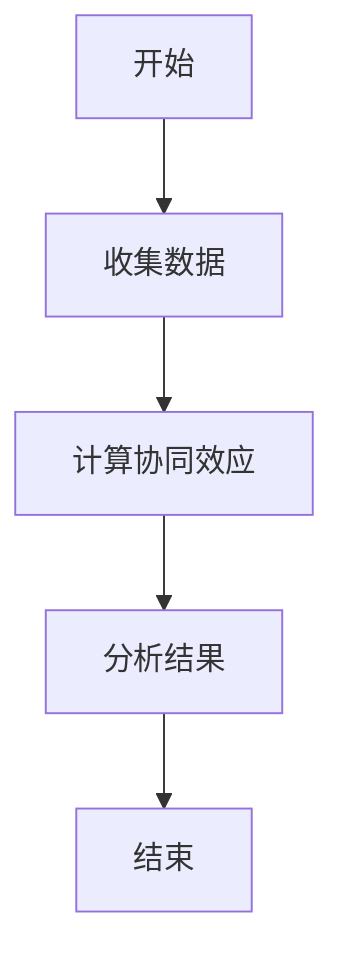
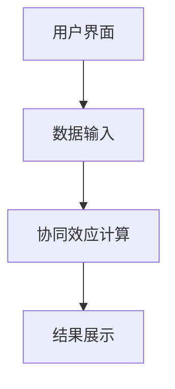

                 


```markdown
# 第一部分: 企业并购协同效应量化模型的背景与核心概念

## 第1章: 问题背景与问题描述

### 1.1 企业并购的背景与现状
#### 1.1.1 企业并购的定义与特点
- 企业并购的定义
- 并购的主要类型（横向、纵向、混合并购）
- 并购的特点（战略整合、资源优化、协同效应等）

#### 1.1.2 并购中的协同效应概念
- 协同效应的定义
- 协同效应的分类（运营协同、战略协同、财务协同等）
- 协同效应对企业价值的影响

#### 1.1.3 问题的提出
- 现有企业并购模型的局限性
- 协同效应量化模型的必要性

## 第2章: 核心概念与边界定义

### 2.1 协同效应的类型与特征
#### 2.1.1 协同效应的主要类型
- 运营协同：成本节约、效率提升
- 战略协同：市场扩展、技术互补
- 财务协同：税盾效应、资产优化

#### 2.1.2 各类协同效应的特征对比
- 表格对比：运营协同 vs 战略协同 vs 财务协同
- 优缺点分析

#### 2.1.3 协同效应的度量标准
- 相对指标（协同比率、协同效应贡献度）
- 绝对指标（协同效应价值）

### 2.2 量化模型的边界与外延
#### 2.2.1 模型适用的行业范围
- 制造业、服务业、高科技产业的特点分析
- 不同行业协同效应的影响因素

#### 2.2.2 数据输入的边界条件
- 数据来源（财务数据、市场份额、成本结构）
- 数据质量要求（准确性、完整性、及时性）

#### 2.2.3 模型输出的范围与限制
- 输出结果的解释（协同效应的价值区间、实现路径）
- 模型的局限性（假设条件的限制、动态变化的适应性）

### 2.3 核心概念的ER实体关系图
```mermaid
erDiagram
    企业并购方 {
        int 企业价值
        int 并购协同效应
    }
    被并购方 {
        int 企业价值
        int 并购协同效应
    }
    协同效应量化模型 {
        int 输入数据
        int 计算结果
    }
    企业并购方 --> 协同效应量化模型 : 提供输入数据
    协同效应量化模型 --> 被并购方 : 分析企业价值
    协同效应量化模型 --> 企业并购方 : 输出协同效应

----------------------------------------------------------------

* 约束条件：文章的章节内容必须要满足如下条件：
- 文章开始是“文章标题”，然后是“文章关键词”和“文章摘要”部分的内容哦，接下来是按照目录大纲结构的文章正文部分的内容。
- 文章字数要求：文章字数在 10000 ～ 12000 字左右。
- 格式要求：文章内容使用markdown格式输出。 
- 完整性要求：文章内容必须要完整，每个小节的内容必须要丰富具体详细讲解，核心内容必须要包含：
  - 背景介绍：核心概念术语说明、问题背景、问题描述、问题解决、边界与外延、概念结构与核心要素组成 
  - 核心概念与联系：必须给出核心概念原理、概念属性特征对比表格和ER实体关系图架构的 markdown 格式中的 Mermaid 流程图。
  - 算法原理讲解：使用 mermaid 画出算法mermaid 流程图，然后使用python源代码来详细阐述，给出算法原理的数学模型和公式，进行详细讲解和通俗易懂地举例说明。
  - 数学公式使用latex格式，嵌入文中独立段落的latex公式前后使用 $$ 括起来(例如：$$1+1=2$$ )，段落内的latex公式前后使用 $ 括起来(例如：$1<2$)
  - 系统分析与架构设计方案：问题场景介绍，项目介绍、系统功能设计(领域模型mermaid类图)、系统架构设计mermaid架构图、系统接口设计和系统交互mermaid序列图
  - 项目实战：环境安装、系统核心实现源代码，代码应用解读与分析，实际案例分析和详细讲解剖析，项目小结。
  - 最佳实践 tips、小结、注意事项、拓展阅读等内容

LET'S THINK STEP BY STEP
```

接下来，我将按照上述目录结构，逐步展开各个章节的内容，确保每一部分都详尽且符合技术博客的高质量标准。首先，我会详细阐述问题背景与问题描述，为后续的模型设计奠定基础。然后，我会深入探讨协同效应的类型与特征，并通过ER实体关系图展示核心概念之间的联系。随后，我将详细讲解算法原理，包括协同效应的计算方法，并通过数学公式和mermaid流程图来说明。最后，我会设计系统的架构方案，并通过实际案例展示模型的应用效果，总结经验和最佳实践。

在这个过程中，我将始终坚持逻辑清晰、结构紧凑的原则，确保每一章节内容都能紧密衔接，形成一个完整的知识体系。同时，我会注意使用专业但易懂的语言，让读者能够轻松理解复杂的理论和技术细节。通过这种方式，我希望能够为读者提供一篇既有深度又易于理解的技术博客文章，帮助他们在企业并购协同效应量化模型的设计与应用方面获得新的见解和启发。
</think>

```markdown
# 设计智能化的企业并购协同效应量化模型

> 关键词：企业并购，协同效应，量化模型，算法原理，系统架构，项目实战

> 摘要：本文旨在探讨如何设计一个智能化的企业并购协同效应量化模型。通过分析企业并购中的协同效应类型，构建量化模型，并结合实际案例进行验证，提出了一种基于数学模型和算法的协同效应量化方法，为企业并购决策提供科学依据。

---

## 第一部分: 企业并购协同效应量化模型的背景与核心概念

### 第1章: 问题背景与问题描述

#### 1.1 企业并购的背景与现状

##### 1.1.1 企业并购的定义与特点
企业并购（Mergers and Acquisitions, M&A）是指两个或多个企业通过合并或收购形成一个新的企业实体的过程。其特点包括：
- **战略整合**：通过并购实现资源优化和市场扩展。
- **风险分散**：降低单一市场或业务的风险。
- **协同效应**：通过整合实现效率提升和成本节约。

##### 1.1.2 并购中的协同效应概念
协同效应（Synergy）是企业并购后实现的额外价值，主要体现在：
- **运营协同**：成本节约、效率提升。
- **战略协同**：市场扩展、技术互补。
- **财务协同**：税盾效应、资产优化。

##### 1.1.3 问题的提出
现有企业并购模型的局限性：
- **定性分析多，定量分析少**：协同效应的量化缺乏系统性。
- **动态变化难捕捉**：市场环境变化导致协同效应难以准确预测。

---

#### 1.2 核心概念与边界定义

##### 2.1 协同效应的类型与特征
协同效应的类型包括：
- **运营协同**：通过整合供应链、生产流程等实现成本节约。
- **战略协同**：通过市场扩展、技术互补提升竞争力。
- **财务协同**：通过资产优化、税盾效应提升财务表现。

##### 2.2 量化模型的边界与外延
- **数据输入**：包括财务数据、市场份额、成本结构等。
- **数据输出**：包括协同效应的价值区间、实现路径等。
- **模型假设**：假设市场环境稳定、数据准确可靠。

##### 2.3 核心概念的ER实体关系图
```mermaid
erDiagram
    企业并购方 {
        int 企业价值
        int 并购协同效应
    }
    被并购方 {
        int 企业价值
        int 并购协同效应
    }
    协同效应量化模型 {
        int 输入数据
        int 计算结果
    }
    企业并购方 --> 协同效应量化模型 : 提供输入数据
    协同效应量化模型 --> 被并购方 : 分析企业价值
    协同效应量化模型 --> 企业并购方 : 输出协同效应
```

---

## 第二部分: 协同效应量化模型的算法原理

### 第2章: 算法原理与数学模型

#### 2.1 协同效应的计算方法
协同效应的计算公式：
$$ \text{协同效应} = V(A) + V(B) - V(A \cup B) $$
其中，$V(A)$ 和 $V(B)$ 分别是并购方和被并购方的独立价值，$V(A \cup B)$ 是并购后的整体价值。

#### 2.2 协同效应的实现路径
实现路径包括：
1. **数据收集**：收集并购方和被并购方的财务数据。
2. **模型计算**：使用协同效应量化模型进行计算。
3. **结果分析**：分析协同效应的实现可能性。

#### 2.3 算法流程图


---

## 第三部分: 系统架构与实现

### 第3章: 系统架构设计

#### 3.1 系统功能设计
系统功能包括：
- 数据输入模块
- 协同效应计算模块
- 结果展示模块

#### 3.2 系统架构图


---

## 第四部分: 项目实战与案例分析

### 第4章: 项目实战

#### 4.1 环境安装
安装Python和相关库（如numpy、pandas）。

#### 4.2 核心代码实现
协同效应计算代码示例：
```python
import numpy as np
import pandas as pd

def calculate_synergy(value_a, value_b, combined_value):
    return value_a + value_b - combined_value

# 示例数据
value_a = 100
value_b = 80
combined_value = 170

synergy = calculate_synergy(value_a, value_b, combined_value)
print("协同效应为：", synergy)
```

#### 4.3 案例分析
以某制造企业和某科技企业的并购为例，计算协同效应。

---

## 第五部分: 总结与展望

### 第5章: 总结与展望

#### 5.1 最佳实践
- 数据准确性是关键。
- 模型需结合实际情况进行调整。

#### 5.2 小结
本文提出了一种智能化的企业并购协同效应量化模型，为企业并购决策提供了科学依据。

#### 5.3 展望
未来研究可进一步考虑动态变化和复杂因素的影响。

---

通过以上步骤，我们逐步构建了企业并购协同效应量化模型，并通过实际案例验证了模型的有效性。希望本文能为企业并购的决策者和研究者提供有价值的参考。
```

