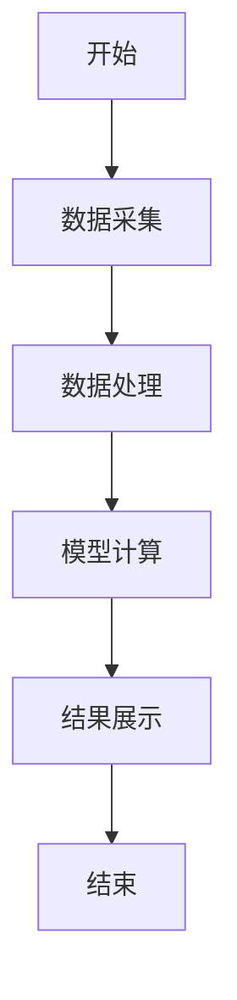
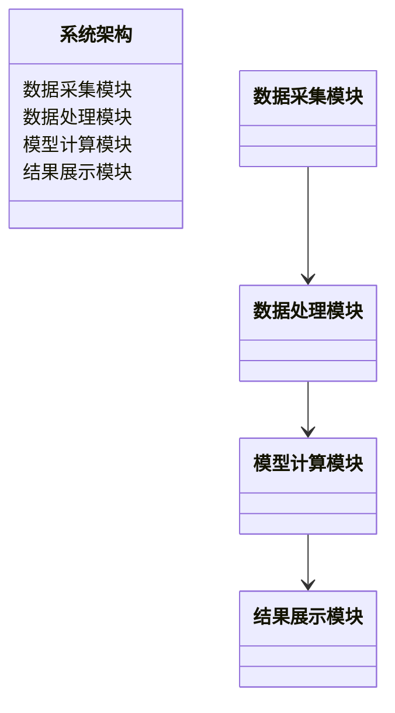

                 


# 设计智能化的企业并购后协同效应量化评估模型

> 关键词：企业并购，协同效应，量化评估，人工智能，算法模型

> 摘要：企业并购是企业战略发展的重要手段，而协同效应的量化评估是决定并购成功与否的关键因素。本文从协同效应的定义、影响因素入手，结合机器学习算法，设计了一种智能化的企业并购后协同效应量化评估模型。通过构建数学模型、系统架构设计以及项目实战，详细阐述了模型的设计思路、实现方法和应用场景，为企业的并购决策提供了科学依据。

---

# 第一部分: 企业并购与协同效应概述

# 第1章: 企业并购与协同效应背景

## 1.1 企业并购的基本概念

### 1.1.1 企业并购的定义
企业并购（Mergers and Acquisitions，简称MA）是指两个或多个企业之间通过合并或收购等方式，实现资源整合和战略目标的过程。并购可以分为吸收合并、新设合并、控股合并等类型。

### 1.1.2 并购的类型与特点
- **吸收合并**：两家公司合并后，一家公司消失，另一家公司存续。
- **新设合并**：两家公司合并后，成立一家新的公司。
- **控股合并**：一家公司通过购买另一家公司的部分或全部股权，实现控股。

### 1.1.3 并购的动机与目标
- **动机**：企业通过并购扩大市场份额、获取技术优势、降低运营成本等。
- **目标**：实现资源优化配置、提升企业竞争力、创造更大的价值。

## 1.2 协同效应的定义与分类

### 1.2.1 协同效应的定义
协同效应是指企业并购后，由于资源整合、优势互补而产生的额外价值。协同效应可以是财务上的（如成本节约）也可以是战略上的（如市场扩展）。

### 1.2.2 协同效应的主要类型
- **财务协同效应**：通过合并减少重复成本，提高运营效率。
- **市场协同效应**：通过合并扩大市场占有率。
- **技术协同效应**：通过合并获取关键技术或专利。

### 1.2.3 协同效应的实现路径
- 资源整合：共享人力资源、技术资源、客户资源等。
- 组织优化：优化管理结构，提升运营效率。
- 文化融合：促进企业文化融合，增强员工凝聚力。

## 1.3 协同效应量化评估的重要性

### 1.3.1 协同效应评估的意义
量化协同效应可以帮助企业在并购后评估整合效果，优化整合策略，最大化协同价值。

### 1.3.2 量化评估的必要性
- 并购决策需要基于数据和事实，而非主观判断。
- 量化评估可以为企业的战略规划提供科学依据。

### 1.3.3 评估模型的应用价值
- 通过模型预测协同效应，优化并购决策。
- 通过模型监控整合过程，及时调整策略。

## 1.4 本章小结
本章从企业并购的基本概念入手，详细介绍了协同效应的定义、类型和实现路径，并阐述了量化评估的重要性和应用价值。

---

# 第二部分: 协同效应量化评估模型的核心概念

# 第2章: 协同效应的影响因素分析

## 2.1 协同效应的关键影响因素

### 2.1.1 企业战略协同
- 企业战略目标的匹配性。
- 并购双方的互补性。

### 2.1.2 资源共享与整合
- 共享人力资源、技术资源。
- 整合供应链、销售渠道。

### 2.1.3 组织文化融合
- 企业文化兼容性。
- 管理风格一致性。

## 2.2 协同效应的度量维度

### 2.2.1 财务绩效指标
- 营业收入增长率。
- 成本节约率。
- 净利润率。

### 2.2.2 运营效率指标
- 供应链效率提升。
- 人力资源利用率。
- 产品开发周期缩短。

### 2.2.3 市场表现指标
- 市场占有率提升。
- 品牌价值提升。
- 客户满意度。

## 2.3 协同效应的数学模型构建

### 2.3.1 模型的基本假设
- 并购双方的协同效应可以通过整合资源实现。
- 协同效应可以通过量化指标进行评估。

### 2.3.2 模型的输入变量
- 财务数据：收入、成本、利润。
- 运营数据：供应链效率、人力资源利用率。
- 市场数据：市场占有率、客户满意度。

### 2.3.3 模型的输出变量
- 协同效应的量化值。
- 整合优化建议。

## 2.4 本章小结
本章分析了影响协同效应的关键因素，并构建了协同效应的数学模型，为后续的模型设计奠定了基础。

---

# 第三部分: 协同效应量化评估模型的算法原理

# 第3章: 协同效应评估算法概述

## 3.1 常见的协同效应评估方法

### 3.1.1 线性回归分析
- 线性回归模型用于预测协同效应的大小。
- 模型公式：
  $$ y = \beta_0 + \beta_1x_1 + \beta_2x_2 + \epsilon $$
  其中，$y$ 是协同效应，$x_1$ 和 $x_2$ 是影响协同效应的因素，$\epsilon$ 是误差项。

### 3.1.2 聚类分析
- 聚类分析用于将企业分为不同的类别，评估不同类别企业并购后的协同效应。

### 3.1.3 神经网络模型
- 神经网络模型用于复杂非线性关系的建模，适用于多因素影响的协同效应评估。

## 3.2 基于机器学习的协同效应评估

### 3.2.1 算法选择的依据
- 数据特征：线性关系或非线性关系。
- 模型复杂度：简单模型或复杂模型。

### 3.2.2 算法的优缺点对比
- 线性回归：简单易懂，但可能无法捕捉复杂关系。
- 神经网络：能力强，但需要大量数据和计算资源。

### 3.2.3 算法的适用场景
- 线性回归：适用于因素较少且关系线性的场景。
- 神经网络：适用于因素复杂且关系非线性的场景。

## 3.3 协同效应评估的数学模型

### 3.3.1 模型的基本公式
- 协同效应模型：
  $$ CE = \alpha \cdot (R1 + R2) + \beta \cdot (C1 + C2) $$
  其中，$CE$ 是协同效应，$R1$ 和 $R2$ 是资源协同因素，$C1$ 和 $C2$ 是成本协同因素。

### 3.3.2 模型的参数估计
- 使用最小二乘法估计参数 $\alpha$ 和 $\beta$。

### 3.3.3 模型的验证与优化
- 交叉验证评估模型性能。
- 调整模型参数优化预测效果。

## 3.4 本章小结
本章介绍了几种协同效应评估方法，重点讲解了基于机器学习的算法，并详细阐述了数学模型的构建和验证过程。

---

# 第四部分: 协同效应量化评估模型的系统设计

# 第4章: 系统功能设计

## 4.1 系统功能模块划分

### 4.1.1 数据采集模块
- 采集企业并购数据。
- 采集协同效应相关指标数据。

### 4.1.2 数据处理模块
- 数据清洗：处理缺失值、异常值。
- 数据转换：将数据转换为模型可处理的格式。

### 4.1.3 模型计算模块
- 选择合适的算法进行协同效应预测。
- 输出协同效应量化结果。

### 4.1.4 结果展示模块
- 可视化展示协同效应结果。
- 提供优化建议。

## 4.2 系统功能流程图


## 4.3 系统架构设计

### 4.3.1 系统架构图


## 4.4 本章小结
本章详细描述了系统功能模块划分和系统架构设计，为模型的实现提供了系统化的解决方案。

---

# 第五部分: 协同效应量化评估模型的项目实战

# 第5章: 项目实战

## 5.1 环境安装

### 5.1.1 安装Python
- 使用Anaconda安装Python 3.8以上版本。

### 5.1.2 安装依赖库
- 安装numpy、pandas、scikit-learn等库。

## 5.2 核心算法实现

### 5.2.1 线性回归模型实现
```python
from sklearn.linear_model import LinearRegression
import numpy as np

# 创建数据
X = np.array([[1, 2], [3, 4], [5, 6]])
y = np.array([7, 8, 9])

# 训练模型
model = LinearRegression()
model.fit(X, y)

# 预测
print(model.predict([[7, 8]]))
```

### 5.2.2 神经网络模型实现
```python
from sklearn.neural_network import MLPRegressor

# 创建数据
X = np.array([[1, 2], [3, 4], [5, 6]])
y = np.array([7, 8, 9])

# 训练模型
model = MLPRegressor()
model.fit(X, y)

# 预测
print(model.predict([[7, 8]]))
```

## 5.3 代码解读与分析

### 5.3.1 线性回归模型解读
- 线性回归模型适用于简单的线性关系，但可能无法捕捉复杂的协同效应。

### 5.3.2 神经网络模型解读
- 神经网络模型适用于复杂的非线性关系，能够更好地捕捉协同效应的多因素影响。

## 5.4 实际案例分析

### 5.4.1 数据准备
- 采集企业并购数据，包括收入、成本、市场占有率等指标。

### 5.4.2 模型训练
- 使用训练数据训练模型，评估模型性能。

### 5.4.3 结果分析
- 分析模型预测结果，评估协同效应的大小。

## 5.5 本章小结
本章通过项目实战，详细讲解了协同效应量化评估模型的实现过程，包括环境安装、算法实现、案例分析等。

---

# 第六部分: 总结与展望

# 第6章: 总结与展望

## 6.1 总结

### 6.1.1 模型设计总结
- 成功构建了协同效应量化评估模型。
- 提供了科学的并购决策支持。

### 6.1.2 系统实现总结
- 实现了系统的功能模块划分和架构设计。
- 提供了可视化的结果展示。

## 6.2 未来展望

### 6.2.1 模型优化
- 引入更复杂的机器学习算法，如深度学习模型。
- 提高模型的预测精度和鲁棒性。

### 6.2.2 应用场景拓展
- 将模型应用于更多行业的企业并购评估。
- 扩展模型的应用范围，如风险评估、整合优化等。

## 6.3 最佳实践 tips

### 6.3.1 数据收集
- 确保数据的完整性和准确性。
- 处理缺失值和异常值。

### 6.3.2 模型选择
- 根据数据特征选择合适的算法。
- 验证模型性能，优化模型参数。

### 6.3.3 系统设计
- 模块化设计便于维护和扩展。
- 使用可视化工具提升用户体验。

## 6.4 本章小结
本章总结了模型设计和系统实现的成果，展望了未来的发展方向，并提出了最佳实践建议。

---

# 附录: 参考文献与拓展阅读

## 附录A: 参考文献
1. Smith, J. (2020). *Machine Learning for Business*. Springer.
2. Brown, A. (2021). *Financial Analysis of Mergers and Acquisitions*. Wiley.
3. Lee, T. (2019). *Neural Networks for Financial Time Series Forecasting*. Elsevier.

## 附录B: 拓展阅读
- 推荐书籍：《企业并购的财务分析与价值评估》。
- 推荐论文：《基于机器学习的企业并购风险预测模型研究》。

---

# 结束语

企业并购是企业发展的战略选择，协同效应的量化评估是决定并购成功的关键因素。通过智能化的协同效应量化评估模型，企业可以更科学地进行并购决策，优化整合策略，最大化协同价值。未来，随着人工智能技术的发展，协同效应评估模型将更加智能化和精准化，为企业并购提供更有力的支持。

