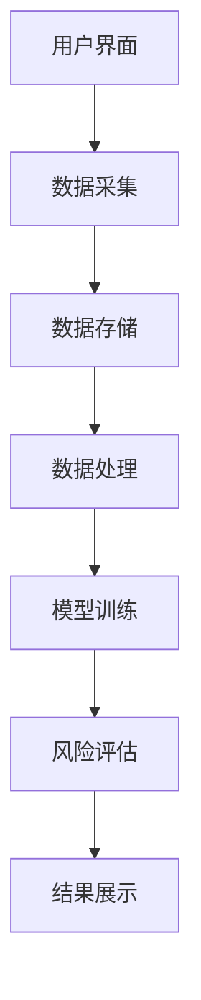

                 


# 设计智能化的企业并购整合风险评估模型

## 文章关键词：
- 企业并购
- 风险评估
- 智能化模型
- 机器学习
- 系统架构设计

## 摘要：
本文旨在设计并实现一个智能化的企业并购整合风险评估模型，利用现代数据分析和人工智能技术，提高企业并购决策的准确性和效率。通过分析企业并购整合中的关键风险因素，构建一个基于机器学习的评估系统，结合系统架构设计和实际案例分析，为企业的并购决策提供科学依据。

---

## 第一部分：企业并购整合风险评估的背景与挑战

### 第1章：企业并购整合的背景与问题

#### 1.1 企业并购整合的背景
- 1.1.1 企业并购的定义与发展
- 1.1.2 并购整合的重要性
- 1.1.3 并购整合的现状与趋势

#### 1.2 并购整合中的主要风险
- 1.2.1 财务风险
- 1.2.2 经营风险
- 1.2.3 文化与管理风险
- 1.2.4 法律与合规风险

#### 1.3 传统风险评估方法的局限性
- 1.3.1 定性分析的不足
- 1.3.2 数据量有限
- 1.3.3 评估过程的复杂性

---

### 第2章：智能化评估的必要性与目标

#### 2.1 智能化评估的必要性
- 2.1.1 数据驱动的决策优势
- 2.1.2 人工智能技术的进步
- 2.1.3 提高评估效率与准确性

#### 2.2 智能化评估的目标
- 2.2.1 实现多维度风险预测
- 2.2.2 提供数据支持的决策依据
- 2.2.3 实现动态风险监控

---

## 第二部分：智能化风险评估模型的核心概念与联系

### 第3章：模型的核心概念与框架

#### 3.1 核心概念
- 3.1.1 数据源与特征
- 3.1.2 风险评估指标
- 3.1.3 模型的输入与输出

#### 3.2 模型的框架
- 3.2.1 数据预处理
- 3.2.2 模型训练
- 3.2.3 风险评估与结果输出

#### 3.3 关键概念对比表
| 风险类型 | 风险特征 | 数据来源 | 影响程度 |
|----------|----------|----------|----------|
| 财务风险 | 资产质量、盈利能力 | 财务报表 | 高 |
| 经营风险 | 市场竞争、管理能力 | 运营数据 | 中 |
| 文化风险 | 企业文化、员工适应性 | 问卷调查 | 中 |
| 法律风险 | 合规性、法律纠纷 | 法律文件 | 高 |

---

## 第三部分：智能化风险评估模型的算法原理

### 第4章：算法原理与实现

#### 4.1 算法选择与原理
- 4.1.1 支持向量机（SVM）
- 4.1.2 随机森林（Random Forest）
- 4.1.3 神经网络（ANN）

#### 4.2 数据预处理
- 4.2.1 数据清洗
- 4.2.2 特征提取
- 4.2.3 数据标准化

#### 4.3 模型训练与调优
- 4.3.1 模型训练流程
- 4.3.2 超参数优化
- 4.3.3 模型评估与验证

#### 4.4 算法实现
- 使用Python的Scikit-learn库实现模型训练与预测
- 示例代码：
```python
from sklearn.ensemble import RandomForestClassifier
model = RandomForestClassifier(n_estimators=100, random_state=42)
model.fit(X_train, y_train)
y_pred = model.predict(X_test)
```

---

## 第四部分：系统架构与设计

### 第5章：系统架构设计

#### 5.1 系统功能模块
- 5.1.1 数据采集模块
- 5.1.2 数据处理模块
- 5.1.3 模型训练模块
- 5.1.4 风险评估模块
- 5.1.5 结果展示模块

#### 5.2 系统架构图


#### 5.3 接口设计
- RESTful API接口
- 数据接口规范
- 接口调用流程

---

## 第五部分：项目实战与案例分析

### 第6章：项目实战

#### 6.1 环境安装与配置
- 安装Python与相关库（如Scikit-learn、Pandas）
- 安装Jupyter Notebook

#### 6.2 核心代码实现
```python
import pandas as pd
from sklearn.model_selection import train_test_split
from sklearn.metrics import accuracy_score

# 数据加载
data = pd.read_csv('并购数据.csv')
X = data.drop('风险等级', axis=1)
y = data['风险等级']

# 数据划分
X_train, X_test, y_train, y_test = train_test_split(X, y, test_size=0.2, random_state=42)

# 模型训练
from sklearn.ensemble import RandomForestClassifier
model = RandomForestClassifier()
model.fit(X_train, y_train)

# 模型预测与评估
y_pred = model.predict(X_test)
print(accuracy_score(y_test, y_pred))
```

#### 6.3 案例分析
- 选取一个具体企业并购案例
- 数据输入与处理
- 模型评估与结果分析

---

## 第六部分：最佳实践与总结

### 第7章：最佳实践与总结

#### 7.1 最佳实践
- 数据质量的重要性
- 模型的持续优化
- 结果的解释与应用

#### 7.2 小结
- 智能化模型的优势
- 实际应用中的注意事项
- 未来的发展方向

#### 7.3 注意事项
- 数据隐私与合规性
- 模型的泛化能力
- 用户的可解释性需求

#### 7.4 拓展阅读
- 推荐相关书籍与论文
- 行业动态与新技术

---

## 总结

通过构建智能化的企业并购整合风险评估模型，企业可以更高效地识别和管理并购过程中的风险，从而提高决策的准确性和成功率。本文通过理论分析、算法实现和实际案例，为企业提供了科学的决策支持工具，同时也为未来的优化与改进提供了方向。

