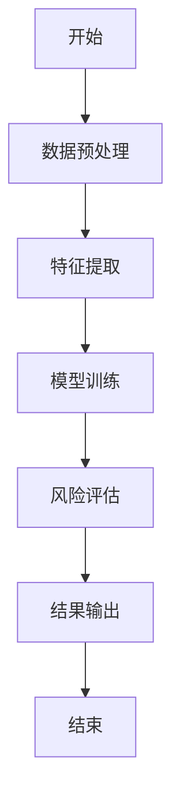
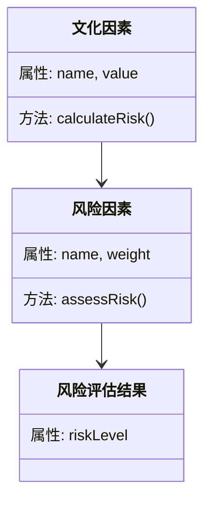

                 


# 设计智能化的企业并购文化整合风险评估模型

## 关键词：企业并购、文化整合、风险评估、智能化模型、算法原理

## 摘要：本文系统介绍了一种基于智能化模型的企业并购文化整合风险评估方法。通过分析企业并购中的文化整合问题，提出了一种结合风险管理与文化因素的评估模型，详细阐述了模型的核心概念、算法原理、系统架构及实际应用案例。文章结构清晰，内容涵盖背景介绍、核心概念、算法实现、系统设计、项目实战及最佳实践，为相关领域的研究和实践提供了参考。

---

# 目录

## 第一部分: 企业并购文化整合风险评估模型背景介绍

## 第1章: 企业并购文化整合风险评估模型概述

### 1.1 问题背景与描述

#### 1.1.1 企业并购中的文化整合问题
企业并购是企业战略发展的重要手段，但文化整合是其中的核心挑战。文化冲突可能导致整合失败，影响企业绩效。

#### 1.1.2 文化整合风险的定义与特征
文化整合风险指并购后因文化差异导致的整合失败风险，具有复杂性和动态性。

#### 1.1.3 问题的复杂性与挑战
文化整合涉及多个因素，如企业战略、组织结构、员工行为等，具有高度复杂性。

### 1.2 问题解决思路

#### 1.2.1 系统化方法的提出
采用系统化方法，将文化整合风险分解为可管理的模块。

#### 1.2.2 智能化模型的必要性
智能化模型能够高效处理复杂数据，提供准确的风险评估。

#### 1.2.3 目标与核心任务
模型旨在识别和评估文化整合风险，提供决策支持。

### 1.3 模型的边界与外延

#### 1.3.1 模型适用的范围
适用于企业并购中的文化整合风险评估，不涵盖财务和战略风险。

#### 1.3.2 模型的局限性
不考虑外部市场变化，仅聚焦于文化因素。

#### 1.3.3 相关概念的对比分析
对比文化整合与战略整合、组织整合的差异。

### 1.4 概念结构与核心要素

#### 1.4.1 核心要素的识别
识别风险因素、评估指标、权重等核心要素。

#### 1.4.2 要素之间的关系
描述各要素之间的相互作用和影响。

#### 1.4.3 模型的整体架构
展示模型的总体结构和功能模块。

### 1.5 本章小结
总结本章内容，强调模型的重要性和基本结构。

---

## 第二部分: 核心概念与联系

## 第2章: 模型核心概念与联系

### 2.1 核心概念原理

#### 2.1.1 风险评估的基本原理
介绍风险评估的基本方法和原理。

#### 2.1.2 文化整合的关键因素
分析文化整合的关键因素，如价值观、管理风格等。

#### 2.1.3 智能化模型的核心机制
描述模型如何利用智能化技术进行风险评估。

### 2.2 概念属性特征对比

#### 2.2.1 风险类型与特征对比
通过表格对比不同风险类型及其特征。

#### 2.2.2 文化因素与权重分析
分析文化因素及其权重分配。

#### 2.2.3 模型输入与输出对比
展示模型的输入和输出关系。

### 2.3 ER实体关系图

```mermaid
erDiagram
    actor 企业并购方

    entity 文化因素

    entity 风险因素

    entity 风险评估结果

    relation --> 文化因素
    relation --> 风险因素
    relation --> 风险评估结果
```

---

## 第三部分: 算法原理

## 第3章: 算法原理与实现

### 3.1 算法原理

#### 3.1.1 基于概率论的模型构建
利用概率论分析文化整合风险的可能性。

#### 3.1.2 统计学方法的应用
使用统计学方法分析数据，提取特征。

#### 3.1.3 机器学习算法的选择
选择适合的机器学习算法，如决策树、随机森林等。

### 3.2 算法流程图



### 3.3 Python实现代码

```python
import pandas as pd
from sklearn.ensemble import RandomForestClassifier
from sklearn.metrics import accuracy_score

# 数据预处理
data = pd.read_csv('cultural_factors.csv')
X = data.drop('risk_assessment', axis=1)
y = data['risk_assessment']

# 特征提取与模型训练
model = RandomForestClassifier()
model.fit(X, y)

# 风险评估
new_case = pd.DataFrame({'factor1': [0.8], 'factor2': [0.5]})
prediction = model.predict(new_case)

# 结果输出
print(f"预测的风险评估结果为: {prediction[0]}")
```

### 3.4 数学公式与推导

#### 3.4.1 风险概率计算公式
$$ P(risk) = \sum_{i=1}^{n} w_i \cdot f_i $$

#### 3.4.2 权重计算公式
$$ w_i = \frac{f_i}{\sum_{j=1}^{n} f_j} $$

#### 3.4.3 示例
假设因素f1权重为0.6，f2权重为0.4，计算风险概率：
$$ P(risk) = 0.6 \cdot 0.8 + 0.4 \cdot 0.5 = 0.72 + 0.2 = 0.92 $$

### 3.5 案例分析

#### 3.5.1 案例背景
某企业并购案例，涉及文化因素如管理风格、员工价值观等。

#### 3.5.2 数据分析
使用模型分析数据，计算各因素的权重和风险概率。

#### 3.5.3 结果解读
解释模型预测结果，提供风险评估建议。

### 3.6 本章小结
总结算法原理和实现过程，强调模型的有效性和实用性。

---

## 第四部分: 系统分析与架构设计

## 第4章: 系统分析与架构设计

### 4.1 问题场景介绍

#### 4.1.1 系统目标
构建智能化的风险评估系统，支持企业并购中的文化整合决策。

#### 4.1.2 问题分析
识别系统需要解决的关键问题，如数据采集、风险评估等。

### 4.2 系统功能设计

#### 4.2.1 领域模型类图



#### 4.2.2 系统架构图

```mermaid
container 企业并购文化整合风险评估系统 {
    component 数据采集模块 {
        接口: collectData()
    }
    component 数据处理模块 {
        接口: processData()
    }
    component 风险评估模块 {
        接口: assessRisk()
    }
    component 结果展示模块 {
        接口: displayResult()
    }
}
```

#### 4.2.3 系统接口设计

```mermaid
sequenceDiagram
    用户 -> 数据采集模块: 请求数据采集
    数据采集模块 -> 数据处理模块: 传输数据
    数据处理模块 -> 风险评估模块: 请求评估
    风险评估模块 -> 结果展示模块: 返回结果
    用户 <- 结果展示模块: 显示结果
```

### 4.3 本章小结
总结系统设计的内容，强调模块化和可扩展性。

---

## 第五部分: 项目实战

## 第5章: 项目实战与案例分析

### 5.1 环境安装与配置

#### 5.1.1 安装Python与相关库
安装Python和Pandas、Scikit-learn等库。

#### 5.1.2 数据准备
准备企业并购的文化因素数据集。

### 5.2 系统核心代码实现

#### 5.2.1 数据预处理代码

```python
import pandas as pd

data = pd.read_csv('cultural_factors.csv')
print(data.head())
```

#### 5.2.2 模型训练代码

```python
from sklearn.ensemble import RandomForestClassifier

model = RandomForestClassifier()
model.fit(X, y)
```

#### 5.2.3 风险评估代码

```python
new_case = pd.DataFrame({'factor1': [0.8], 'factor2': [0.5]})
prediction = model.predict(new_case)
print(f"预测的风险等级为: {prediction[0]}")
```

### 5.3 案例分析

#### 5.3.1 案例背景
介绍一个真实的并购案例，分析其文化整合风险。

#### 5.3.2 数据分析与评估
使用模型分析数据，得出风险评估结果。

#### 5.3.3 结果解读
解释模型预测结果，提出改进建议。

### 5.4 本章小结
总结项目实战的经验，强调模型的实际应用价值。

---

## 第六部分: 最佳实践

## 第6章: 最佳实践与经验总结

### 6.1 小结

#### 6.1.1 模型总结
总结模型的核心思想和实现方法。

#### 6.1.2 关键点回顾
回顾模型设计和实现中的关键点，如数据质量、特征选择等。

### 6.2 注意事项

#### 6.2.1 数据质量的重要性
强调数据质量和完整性对模型准确性的影响。

#### 6.2.2 模型适用性
说明模型的适用范围和局限性，避免滥用。

#### 6.2.3 模型更新与维护
建议定期更新模型，以适应新的数据和变化的环境。

### 6.3 未来研究方向

#### 6.3.1 动态风险评估
探索动态评估方法，实时监测风险变化。

#### 6.3.2 多模型融合
研究多模型融合方法，提高评估精度。

#### 6.3.3 智能化决策支持
开发智能化决策支持系统，辅助企业并购决策。

### 6.4 拓展阅读

#### 6.4.1 推荐书籍
推荐相关领域的书籍和论文。

#### 6.4.2 在线资源
推荐在线课程和工具，供读者深入学习。

### 6.5 本章小结
总结全文，强调最佳实践的重要性，鼓励读者进一步研究和应用。

---

## 参考文献
此处列出相关文献和资源，供读者参考。

---

## 附录

### 附录A: 风险评估模型代码

```python
# 完整的模型代码实现
import pandas as pd
from sklearn.ensemble import RandomForestClassifier
from sklearn.metrics import accuracy_score

# 数据加载
data = pd.read_csv('cultural_factors.csv')
X = data.drop('risk_assessment', axis=1)
y = data['risk_assessment']

# 模型训练
model = RandomForestClassifier()
model.fit(X, y)

# 预测与评估
new_case = pd.DataFrame({'factor1': [0.8], 'factor2': [0.5]})
prediction = model.predict(new_case)
print(f"预测的风险评估结果为: {prediction[0]}")
print(f"模型准确率为: {accuracy_score(y, model.predict(X))}")
```

---

通过以上目录结构，我们可以系统地了解和掌握企业并购文化整合风险评估模型的设计与实现。从背景介绍到算法实现，再到系统设计和项目实战，每一部分都进行了详细的阐述，为读者提供了全面的知识体系。

