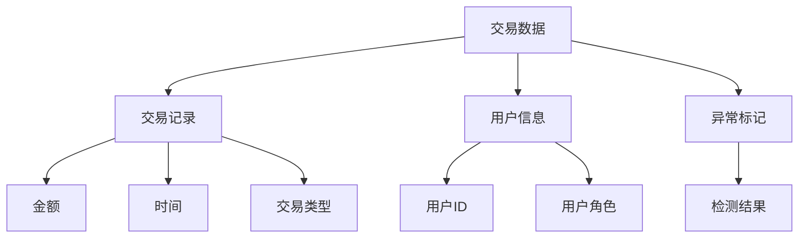

                 


# 设计智能化的企业财务异常交易检测系统

## 关键词
智能化, 异常交易, 财务检测, 机器学习, 系统架构, 数据建模, 财务审计

## 摘要
本文旨在设计一个智能化的企业财务异常交易检测系统，结合数据分析、机器学习和系统架构设计，通过统计学方法、聚类分析和深度学习模型，实现对财务数据的实时监控与异常检测。系统采用模块化设计，包含数据采集、特征提取、模型训练、异常检测和结果展示等功能模块，结合企业实际应用场景，提供高效的财务风险管理解决方案。

---

## 第一部分: 企业财务异常交易检测系统背景与概述

### 第1章: 问题背景与问题描述

#### 1.1 问题背景
- **企业财务舞弊与异常交易的现状**  
  当前企业财务造假问题日益严重，传统的财务审计方法效率低下，难以应对复杂的舞弊手段。
- **传统财务审计的局限性**  
  传统审计方法依赖人工审查，耗时且容易受到主观因素影响，难以发现隐藏的异常交易。
- **智能化检测的必要性**  
  随着人工智能技术的发展，智能化检测系统能够快速、准确地识别异常交易，提升企业风险管理能力。

#### 1.2 问题描述
- **异常交易的定义与特征**  
  异常交易指与正常业务模式不符、可能涉及舞弊或欺诈的交易行为。
- **异常交易的分类与场景**  
  异常交易可分为金额异常、时间异常、交易频率异常等类型，常见于关联交易、虚假交易、账务调整等场景。
- **异常交易检测的目标与边界**  
  目标是通过技术手段实时检测异常交易，辅助审计人员快速定位问题；边界包括合法交易、正常波动等非异常情况。

#### 1.3 问题解决思路
- **数据驱动的异常检测方法**  
  利用历史数据训练模型，识别正常交易模式，发现偏离模式的异常交易。
- **人工智能在财务检测中的应用**  
  引入机器学习和深度学习算法，提升检测精度和效率。
- **系统化解决方案的设计思路**  
  采用模块化设计，结合数据预处理、特征提取、模型训练和结果展示，构建智能化检测系统。

#### 1.4 系统概念结构与核心要素
- **系统组成模块**  
  包括数据采集模块、特征提取模块、模型训练模块、异常检测模块和结果展示模块。
- **核心要素与关系**  
  数据是核心，特征提取和模型训练是关键步骤，异常检测是最终目标。
- **系统架构的扩展性与可维护性**  
  采用模块化设计，便于功能扩展和维护。

---

## 第2章: 系统核心概念与联系

### 2.1 核心概念原理
- **财务数据的特征提取**  
  从交易数据中提取金额、时间、交易类型、用户角色等特征。
- **异常检测算法的选择**  
  根据数据类型和业务场景选择合适的算法，如马氏距离、聚类分析和神经网络。
- **数据建模与特征工程**  
  通过特征工程优化数据，提升模型性能。

### 2.2 核心概念属性对比
- **数据特征对比表**  
  对比金额、时间、交易类型等特征的分布情况。
- **算法性能对比表**  
  比较不同算法的检测精度、计算效率和适用场景。
- **系统模块功能对比表**  
  对比各模块的功能、输入输出和依赖关系。

### 2.3 ER实体关系图


---

## 第三部分: 异常检测算法原理

### 第3章: 异常检测算法原理

#### 3.1 统计学方法
- **马氏距离计算**  
  $$d(x_i, x_j) = \sqrt{(x_i - x_j)^T \Sigma^{-1} (x_i - x_j)}$$  
  马氏距离考虑了数据的分布情况，适用于多维数据的异常检测。
- **算法流程图**  
  ```mermaid
  graph TD
      A[输入数据] --> B[标准化处理]
      B --> C[计算马氏距离]
      C --> D[判断是否异常]
  ```

#### 3.2 机器学习方法
- **聚类分析**  
  使用K-means算法将数据分为正常和异常两类。
  ```python
  from sklearn.cluster import KMeans
  model = KMeans(n_clusters=2)
  model.fit(X)
  ```

#### 3.3 深度学习方法
- **自动编码器（Autoencoder）**  
  使用神经网络重构输入数据，通过重构误差检测异常。
  ```python
  import tensorflow as tf
  model = tf.keras.Sequential([
      tf.keras.layers.Dense(64, activation='relu'),
      tf.keras.layers.Dense(32, activation='relu'),
      tf.keras.layers.Dense(64, activation='relu'),
      tf.keras.layers.Dense(input_dim)
  ])
  ```

---

## 第四部分: 系统分析与架构设计

### 第4章: 系统架构设计

#### 4.1 问题场景介绍
- **企业财务数据管理**  
  包括交易数据、用户信息、财务报表等。
- **系统功能需求**  
  实现实时监控、异常检测、结果展示等功能。

#### 4.2 系统功能设计
- **领域模型**  
  ```mermaid
  graph TD
      A[交易数据] --> B[特征提取]
      B --> C[模型训练]
      C --> D[异常检测]
      D --> E[结果展示]
  ```

#### 4.3 系统架构设计
- **架构图**  
  ```mermaid
  graph LR
      I[输入数据] --> A[数据预处理]
      A --> B[特征提取]
      B --> C[模型训练]
      C --> D[异常检测]
      D --> E[结果展示]
  ```

#### 4.4 系统接口设计
- **API接口**  
  提供RESTful接口，支持数据输入和结果查询。
- **交互流程**  
  ```mermaid
  graph TD
      User[用户] --> A[发起请求]
      A --> B[数据处理]
      B --> C[返回结果]
  ```

---

## 第五部分: 项目实战

### 第5章: 项目实战

#### 5.1 环境安装
- **安装Python和相关库**  
  ```bash
  pip install numpy pandas scikit-learn tensorflow
  ```

#### 5.2 核心代码实现
- **特征提取代码**  
  ```python
  import pandas as pd
  df = pd.read_csv('transactions.csv')
  features = df[['amount', 'time', 'transaction_type']]
  ```

- **模型训练代码**  
  ```python
  from sklearn.ensemble import IsolationForest
  model = IsolationForest(n_estimators=100, random_state=42)
  model.fit(features)
  ```

#### 5.3 案例分析
- **异常交易检测**  
  使用训练好的模型预测新交易是否异常。
  ```python
  prediction = model.predict(new_transaction_features)
  ```

#### 5.4 项目总结
- **系统性能优化**  
  通过参数调优和模型集成提升检测精度。
- **实际应用效果**  
  系统能够有效识别异常交易，降低企业财务风险。

---

## 第六部分: 最佳实践与总结

### 第6章: 最佳实践

#### 6.1 小结
- **系统设计的关键点**  
  数据预处理、特征工程和模型选择是系统设计的核心。
- **注意事项**  
  数据质量和模型解释性是实际应用中的重要考量。

#### 6.2 注意事项
- **数据隐私保护**  
  确保数据处理符合隐私保护法规。
- **模型可解释性**  
  提供清晰的解释，便于审计人员理解和验证。

#### 6.3 拓展阅读
- **推荐书籍**  
  《异常检测与数据挖掘》、《深度学习实战》。
- **推荐资源**  
  TensorFlow官方文档、Scikit-learn教程。

---

## 第七章: 总结

通过本文的详细讲解，我们了解了设计智能化企业财务异常交易检测系统的核心概念、算法原理和系统架构。未来，随着人工智能技术的不断发展，系统将更加智能化和高效化，为企业财务管理提供更有力的支持。

