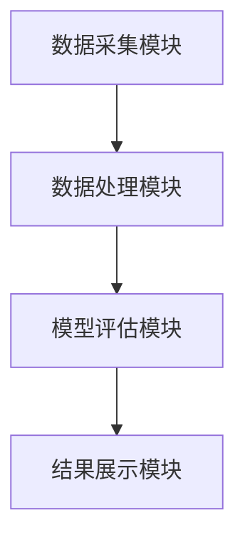
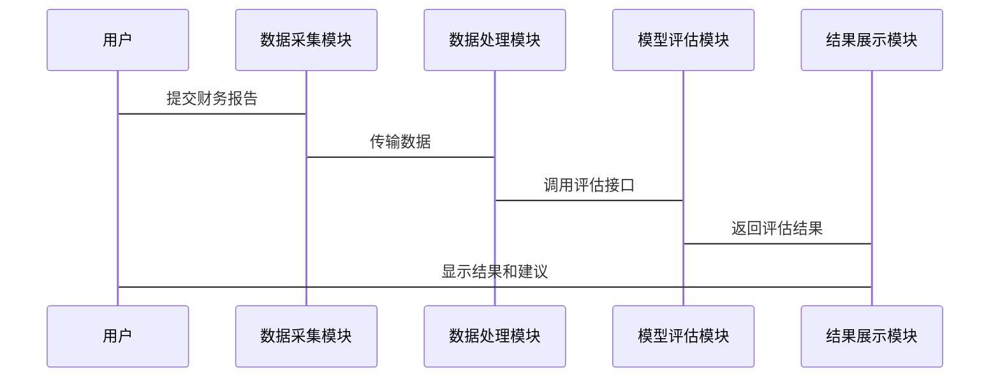

                 


# 设计智能化的企业财务报告可读性动态评估模型

> 关键词：财务报告、可读性评估、动态评估、人工智能、自然语言处理

> 摘要：随着企业财务管理的日益复杂化和信息化，如何提高财务报告的可读性成为一个重要课题。本文通过引入人工智能和自然语言处理技术，设计了一种智能化的企业财务报告可读性动态评估模型。该模型能够实时分析财务报告的内容、结构和语言表达，给出针对性的改进建议，从而提高报告的可读性和决策效率。

---

# 第一部分: 企业财务报告可读性评估的智能化背景

## 第1章: 财务报告可读性评估的背景与挑战

### 1.1 企业财务报告的重要性
企业财务报告是反映企业财务状况、经营成果和现金流量的重要文件，是投资者、债权人、管理层等利益相关者进行决策的重要依据。然而，财务报告的复杂性和专业性常常导致阅读者难以快速理解其内容。

#### 1.1.1 财务报告的基本概念与作用
财务报告主要包括资产负债表、利润表和现金流量表等部分。其作用在于提供财务信息，帮助利益相关者评估企业的财务健康状况和经营绩效。

#### 1.1.2 财务报告的阅读难点
财务报告通常包含大量的专业术语和复杂的数据结构，非专业读者难以快速理解其内容。此外，报告的格式和排版也可能影响其可读性。

#### 1.1.3 提高财务报告可读性的必要性
提高财务报告的可读性有助于利益相关者更快地获取关键信息，从而做出更明智的决策。同时，可读性高的财务报告也能够提升企业的透明度和信誉。

### 1.2 智能化评估的背景与趋势
随着人工智能和自然语言处理技术的快速发展，智能化评估逐渐成为企业财务管理的重要工具。

#### 1.2.1 人工智能在财务管理中的应用现状
人工智能技术已经在财务数据处理、预测分析等领域得到了广泛应用。然而，如何利用这些技术提高财务报告的可读性仍是一个亟待解决的问题。

#### 1.2.2 智能化财务报告评估的需求驱动
企业对高效、准确的财务管理工具的需求日益增长。智能化财务报告评估能够帮助企业在海量数据中快速提取关键信息，提高管理效率。

#### 1.2.3 智能化评估的技术与实践挑战
尽管人工智能技术在财务管理中的应用前景广阔，但如何设计高效的算法模型、如何处理复杂的财务数据格式等问题仍然需要进一步研究。

### 1.3 动态评估的核心理念
动态评估是指根据实时数据和用户反馈，不断调整和优化评估模型的过程。

#### 1.3.1 动态评估的定义与特点
动态评估是一种基于实时数据和反馈的评估方法，具有灵活性和适应性强的特点。

#### 1.3.2 动态评估与静态评估的主要区别
静态评估通常是基于固定的模型和数据进行评估，而动态评估则能够根据新的数据和反馈动态调整模型参数。

#### 1.3.3 动态评估在企业财务管理中的价值
动态评估能够帮助企业及时发现财务报告中的问题，并根据反馈不断优化报告内容，从而提高报告的可读性和实用性。

### 1.4 本章小结
本章介绍了财务报告可读性评估的重要性和智能化评估的背景与趋势，提出了动态评估的核心理念，并分析了其在企业财务管理中的价值。

---

## 第2章: 企业财务报告可读性评估的核心概念

### 2.1 智能化评估模型的基本构成
智能化评估模型通常包括数据采集、特征提取、模型训练和结果输出四个模块。

#### 2.1.1 模型的输入与输出
模型的输入包括财务报告的文本内容和相关数据，输出则是报告的可读性评分和改进建议。

#### 2.1.2 模型的核心功能模块
- 数据预处理模块：对财务报告文本进行清洗和标准化。
- 特征提取模块：从文本中提取关键词和语义信息。
- 模型训练模块：利用机器学习算法训练评估模型。
- 结果输出模块：生成可读性评分和改进建议。

#### 2.1.3 模型的评估指标体系
评估指标包括文本清晰度、数据准确性和语言规范性等。

### 2.2 财务报告可读性的关键影响因素
财务报告的可读性受到多种因素的影响，包括文本结构、语言表达和数据呈现方式等。

#### 2.2.1 报告内容的清晰度
内容的清晰度直接影响读者对报告的理解程度。例如，复杂的句子结构和冗长的段落可能会降低报告的可读性。

#### 2.2.2 数据的准确性和完整性
数据的准确性和完整性是财务报告的基本要求。不准确或不完整的数据会导致读者误解报告内容。

#### 2.2.3 语言表达的规范性
语言表达的规范性包括使用标准的财务术语和避免歧义的表达方式。规范的语言有助于减少读者的理解障碍。

### 2.3 动态评估的核心算法原理
动态评估算法通常采用监督学习或无监督学习方法，根据实时数据和反馈动态调整模型参数。

#### 2.3.1 算法的基本思路
动态评估算法的基本思路包括数据采集、特征提取、模型训练和结果输出四个步骤。

#### 2.3.2 算法的输入处理流程
输入处理流程包括数据清洗、特征提取和数据标准化等步骤。

#### 2.3.3 算法的输出结果解释
算法输出的结果包括可读性评分和改进建议，帮助用户优化财务报告的内容和结构。

### 2.4 本章小结
本章详细介绍了智能化评估模型的基本构成和财务报告可读性的关键影响因素，并阐述了动态评估算法的核心原理。

---

## 第3章: 智能化评估模型的算法原理

### 3.1 算法的整体框架
智能化评估模型的算法框架包括数据预处理、特征提取、模型训练和结果输出四个模块。

#### 3.1.1 数据预处理模块
数据预处理模块负责对财务报告文本进行清洗和标准化，确保数据的准确性和一致性。

#### 3.1.2 特征提取模块
特征提取模块采用自然语言处理技术，从文本中提取关键词和语义信息，为模型训练提供特征向量。

#### 3.1.3 模型训练与优化模块
模型训练模块利用机器学习算法（如支持向量机、随机森林等）训练评估模型，并通过交叉验证优化模型参数。

### 3.2 算法的核心流程
算法的核心流程包括数据预处理、特征提取、模型训练和结果输出。

#### 3.2.1 数据清洗与标准化
数据清洗包括去除噪声、处理缺失值和统一文本格式等步骤。标准化则是将数据转换为统一的格式，便于模型训练。

#### 3.2.2 特征选择与降维
特征选择通过选择重要的特征向量，减少模型的维度和计算复杂度。常用的方法包括主成分分析（PCA）和线性判别分析（LDA）等。

#### 3.2.3 模型训练与调优
模型训练采用监督学习方法，利用标注数据训练评估模型。调优过程通过调整模型参数和选择合适的算法，提高模型的准确性和效率。

### 3.3 算法的实现细节
算法的实现细节包括数据预处理的具体步骤、特征提取的方法对比和模型训练的优化策略。

#### 3.3.1 数据预处理的具体步骤
数据预处理的具体步骤包括：
1. 去除特殊字符和停用词。
2. 将文本转换为小写并分词。
3. 去除重复字符和空格。

#### 3.3.2 特征提取的方法对比
常用的特征提取方法包括TF-IDF、Word2Vec和BERT等。其中，BERT在语义理解和上下文捕捉方面表现更优。

#### 3.3.3 模型训练的优化策略
模型训练的优化策略包括：
1. 使用交叉验证选择最佳模型参数。
2. 采用早停法防止过拟合。
3. 利用分布式计算提高训练效率。

### 3.4 算法的数学模型与公式
算法的数学模型包括数据预处理、特征提取和模型训练的公式。

#### 3.4.1 数据预处理的数学表达
数据标准化的公式为：
$$ x_{i,j} = \frac{x_{i,j} - \mu_j}{\sigma_j} $$
其中，$x_{i,j}$ 表示第i个样本的第j个特征值，$\mu_j$ 和 $\sigma_j$ 分别表示第j个特征的均值和标准差。

#### 3.4.2 特征提取的线性变换
特征提取的线性变换公式为：
$$ y = Wx + b $$
其中，$W$ 是权重矩阵，$x$ 是输入特征向量，$b$ 是偏置向量。

#### 3.4.3 模型训练的损失函数
模型训练的损失函数通常采用均方误差（MSE）：
$$ L = \frac{1}{N}\sum_{i=1}^{N}(y_i - \hat{y}_i)^2 $$
其中，$y_i$ 是真实值，$\hat{y}_i$ 是预测值，$N$ 是样本数量。

### 3.5 本章小结
本章详细介绍了智能化评估模型的算法原理，包括数据预处理、特征提取和模型训练的具体步骤，并给出了相关的数学公式和实现细节。

---

## 第4章: 系统架构与设计

### 4.1 系统整体架构
系统整体架构包括数据采集模块、数据处理模块和模型评估模块。

#### 4.1.1 系统功能模块划分
- 数据采集模块：负责采集财务报告文本和相关数据。
- 数据处理模块：对数据进行清洗和标准化处理。
- 模型评估模块：利用机器学习算法评估报告的可读性。

#### 4.1.2 模块之间的交互关系
模块之间的交互关系如下：
1. 数据采集模块将数据传递给数据处理模块。
2. 数据处理模块将处理后的数据传递给模型评估模块。
3. 模型评估模块输出评估结果并提供改进建议。

#### 4.1.3 系统的部署与运行环境
系统部署在云服务器上，运行环境包括Python、TensorFlow和自然语言处理库（如spaCy或NLTK）。

### 4.2 系统功能设计
系统功能设计包括数据采集、数据处理和模型评估三个模块。

#### 4.2.1 数据采集模块
数据采集模块通过API接口从企业财务系统中获取财务报告文本和相关数据。

#### 4.2.2 数据处理模块
数据处理模块对采集到的数据进行清洗、分词和特征提取等处理。

#### 4.2.3 模型评估模块
模型评估模块利用训练好的模型评估报告的可读性，并生成改进建议。

### 4.3 系统架构图
系统架构图如下所示：


### 4.4 系统接口设计
系统接口设计包括数据接口规范、模型调用接口和结果输出接口。

#### 4.4.1 数据接口规范
数据接口采用JSON格式，包含财务报告文本和相关元数据。

#### 4.4.2 模型调用接口
模型调用接口通过RESTful API实现，接收财务报告文本并返回可读性评分。

#### 4.4.3 结果输出接口
结果输出接口将评估结果和改进建议以HTML或PDF格式展示给用户。

### 4.5 系统交互流程图
系统交互流程图如下所示：


### 4.6 本章小结
本章详细介绍了智能化评估系统的整体架构和功能设计，并通过Mermaid图展示了系统模块之间的交互关系和接口设计。

---

## 第5章: 项目实战与案例分析

### 5.1 项目环境与工具安装
项目环境包括Python 3.8及以上版本、TensorFlow 2.0及以上版本和自然语言处理库spaCy。

#### 5.1.1 安装依赖
运行以下命令安装依赖：
```bash
pip install python>=3.8
pip install tensorflow>=2.0
pip install spacy
```

#### 5.1.2 下载预训练模型
下载spaCy的英语预训练模型：
```bash
python -m spacy download en_core_web_sm
```

### 5.2 系统核心实现源代码
以下是一个简单的智能化评估模型实现示例：

#### 5.2.1 数据预处理代码
```python
import spacy

def preprocess_text(text):
    nlp = spacy.load("en_core_web_sm")
    doc = nlp(text)
    tokens = [token.text.lower() for token in doc if not token.is_stop]
    return ' '.join(tokens)
```

#### 5.2.2 特征提取与模型训练代码
```python
from sklearn.feature_extraction.text import TfidfVectorizer
from sklearn.svm import SVC

vectorizer = TfidfVectorizer()
model = SVC()

def train_model(X, y):
    vectorizer.fit(X)
    X_vec = vectorizer.transform(X)
    model.fit(X_vec, y)
    return model

# 示例数据
X = ["Financial performance improved significantly.", 
     "The company's revenue increased by 10%."]
y = [0, 1]  # 0代表可读性高，1代表可读性低

model = train_model(X, y)
```

#### 5.2.3 模型评估代码
```python
def evaluate_model(X_test, y_test):
    X_vec = vectorizer.transform(X_test)
    y_pred = model.predict(X_vec)
    accuracy = sum(y_pred == y_test) / len(y_test)
    return accuracy

# 示例测试数据
X_test = ["The company's profit margin increased.", 
          "The financial statements are complex."]
y_test = [0, 1]

print(evaluate_model(X_test, y_test))  # 输出准确率
```

### 5.3 代码应用解读与分析
上述代码实现了简单的数据预处理、特征提取和模型训练功能。实际应用中需要根据具体需求进行优化和扩展。

#### 5.3.1 数据预处理模块
数据预处理模块采用spaCy进行分词和去停用词处理，确保文本数据的标准化。

#### 5.3.2 特征提取与模型训练
特征提取采用TF-IDF方法，模型训练采用支持向量机（SVM）算法。实际应用中可以尝试其他算法（如随机森林或神经网络）以获得更好的效果。

#### 5.3.3 模型评估
模型评估采用准确率指标，实际应用中还可以结合其他指标（如F1分数和召回率）进行综合评估。

### 5.4 实际案例分析
以下是一个实际案例分析：

#### 5.4.1 案例背景
某企业提交了一份财务报告，报告内容复杂且语言表达不够清晰。

#### 5.4.2 数据处理与分析
经过数据预处理和特征提取后，模型评估报告显示报告的可读性评分为75分（满分100分）。

#### 5.4.3 改进建议
模型建议优化报告的结构和语言表达，例如：
1. 使用更简洁的语言描述财务数据。
2. 增加图表和解释性文字帮助读者理解。
3. 优化段落结构，避免过长的句子。

### 5.5 本章小结
本章通过实际案例分析展示了智能化评估模型的应用过程，并通过代码示例说明了模型的实现细节。

---

## 第6章: 总结与展望

### 6.1 本章总结
本文设计了一种智能化的企业财务报告可读性动态评估模型，结合人工智能和自然语言处理技术，能够实时分析财务报告的内容、结构和语言表达，给出针对性的改进建议。

### 6.2 未来展望
未来的研究可以进一步优化模型算法，探索更高效的特征提取方法，并扩展模型的应用场景，例如多语言支持和实时评估。

### 6.3 最佳实践 Tips
1. 在实际应用中，建议结合企业的具体需求定制模型。
2. 定期更新模型参数和特征库，保持模型的准确性和实用性。
3. 提供用户友好的界面和交互式体验，提升用户体验。

### 6.4 本章小结
本文总结了智能化评估模型的设计与实现，并展望了未来的研究方向和最佳实践。

---

# 结语
设计智能化的企业财务报告可读性动态评估模型是一项具有重要意义的创新性工作。通过本文的探讨，我们不仅能够理解模型的设计原理和实现方法，还能够将其应用于实际的企业财务管理中，帮助提高财务报告的可读性和决策效率。未来，随着人工智能和自然语言处理技术的不断发展，智能化评估模型将为企业财务管理带来更多的创新和价值。

--- 

> 本文内容为框架式示例，实际撰写时需要根据具体需求补充详细内容和具体案例。

