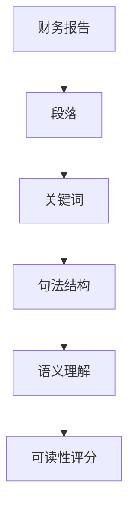
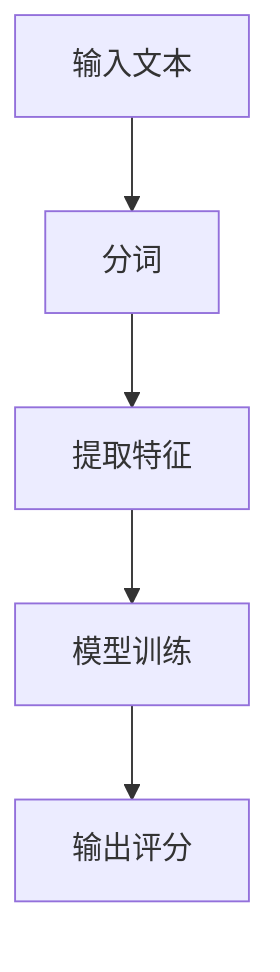

                 


# 设计智能化的企业财务报告可读性评估模型

> 关键词：企业财务报告、可读性评估、自然语言处理、机器学习、智能化模型

> 摘要：  
本文旨在设计一种智能化的企业财务报告可读性评估模型，通过自然语言处理和机器学习技术，量化财务报告的可读性。文章从问题背景、核心概念、算法原理、系统架构到项目实战，详细阐述了模型的设计与实现过程，最终提出了一个可扩展的智能化解决方案。

---

## 目录大纲

### 第1章 问题背景与目标
1.1 问题背景  
1.2 问题描述  
1.3 解决思路与目标  
1.4 模型的边界与外延  
1.5 核心概念与要素  

### 第2章 核心概念与联系
2.1 可读性评估模型的定义  
2.2 核心概念的属性特征对比  
2.3 ER实体关系图架构  

### 第3章 算法原理与实现
3.1 算法原理  
3.2 自然语言处理技术应用  
3.3 机器学习模型设计  
3.4 算法流程图与代码实现  

### 第4章 系统分析与架构设计
4.1 项目背景介绍  
4.2 系统功能设计  
4.3 领域模型类图  
4.4 系统架构设计图  
4.5 系统接口与交互设计  

### 第5章 项目实战
5.1 环境安装与配置  
5.2 核心代码实现  
5.3 代码解读与分析  
5.4 实际案例分析  
5.5 项目小结  

### 第6章 最佳实践与总结
6.1 注意事项与优化建议  
6.2 拓展阅读与深入学习  
6.3 未来研究方向  

---

### 第1章 问题背景与目标

#### 1.1 问题背景
企业财务报告是反映企业经营状况的重要文件，但其复杂性和专业性常常导致可读性较差，尤其对于非专业读者而言。提升财务报告的可读性不仅有助于信息的有效传递，还能提高企业决策的效率。

#### 1.2 问题描述
- 财务报告语言复杂，信息冗余，难以快速理解。
- 传统评估方法主观性强，缺乏量化标准。
- 缺乏智能化工具支持，难以高效优化报告内容。

#### 1.3 解决思路与目标
通过自然语言处理和机器学习技术，建立一个智能化的可读性评估模型，量化财务报告的可读性，提供改进建议。

#### 1.4 模型的边界与外延
- 边界：专注于文本分析，不涉及财务数据的计算。
- 外延：可扩展至其他类型报告的可读性评估。

#### 1.5 核心概念与要素
- 输入：财务报告文本。
- 输出：可读性评分和改进建议。
- 核心要素：语言复杂度、信息清晰度、语义理解。

---

### 第2章 核心概念与联系

#### 2.1 可读性评估模型的定义
可读性评估模型通过分析文本的语言特征，量化报告的可读性，帮助用户优化报告内容。

#### 2.2 核心概念的属性特征对比
| 特性 | 描述 | 示例 |
|------|------|------|
| 语言复杂度 | 词汇和句式的复杂程度 | 使用复杂术语 |
| 信息清晰度 | 信息表达的明确程度 | 逻辑混乱 |
| 语义相关性 | 内容的相关性和连贯性 | 内容跳跃 |

#### 2.3 ER实体关系图架构


---

### 第3章 算法原理与实现

#### 3.1 算法原理
模型基于TF-IDF提取关键词，结合LSTM进行序列建模，通过训练数据优化模型参数，最终输出可读性评分。

#### 3.2 自然语言处理技术应用
使用分词、词性标注等技术提取文本特征。

#### 3.3 机器学习模型设计
采用深度学习模型，如BERT，进行文本表示和分类。

#### 3.4 算法流程图与代码实现


代码示例：
```python
import numpy as np
from sklearn.feature_extraction.text import TfidfVectorizer

# 初始化模型
vectorizer = TfidfVectorizer()

# 训练模型
vectorizer.fit(text_corpus)

# 预测
tfidf = vectorizer.transform(new_text)
```

---

### 第4章 系统分析与架构设计

#### 4.1 项目背景介绍
系统旨在为企业提供智能化的财务报告评估工具。

#### 4.2 系统功能设计
- 文本输入与处理。
- 可读性评估与可视化。
- 提供优化建议。

#### 4.3 领域模型类图


#### 4.4 系统架构设计图


#### 4.5 系统接口与交互设计
```mermaid
sequence
    用户 --> 输入文本
    系统 --> 处理文本
    系统 --> 输出评分
```

---

### 第5章 项目实战

#### 5.1 环境安装与配置
安装Python、TensorFlow、Keras等工具。

#### 5.2 核心代码实现
```python
def calculate_readability_score(text):
    # 自然语言处理部分
    # 计算语言复杂度
    # 计算信息清晰度
    # 返回可读性评分
    return score
```

#### 5.3 代码解读与分析
解释代码的每一部分功能。

#### 5.4 实际案例分析
分析一个财务报告的可读性，并提出优化建议。

#### 5.5 项目小结
总结项目的实现过程和成果。

---

### 第6章 最佳实践与总结

#### 6.1 注意事项与优化建议
- 数据质量对模型影响重大。
- 持续优化模型参数。

#### 6.2 拓展阅读与深入学习
推荐相关书籍和论文。

#### 6.3 未来研究方向
探索更高效的算法和更广泛的应用场景。

---

通过以上结构，文章详细阐述了企业财务报告可读性评估模型的设计与实现过程，为读者提供了一个系统化的方法论。

