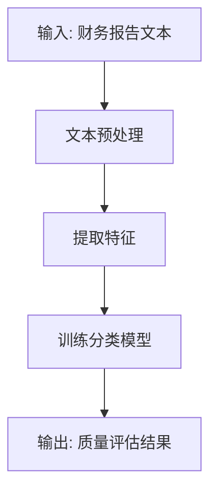
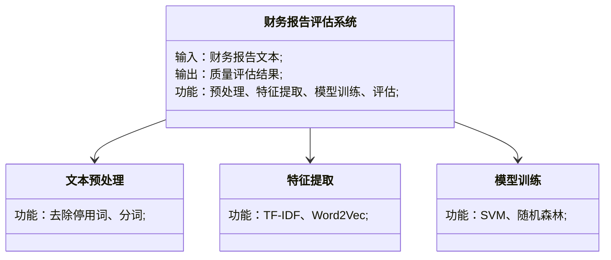
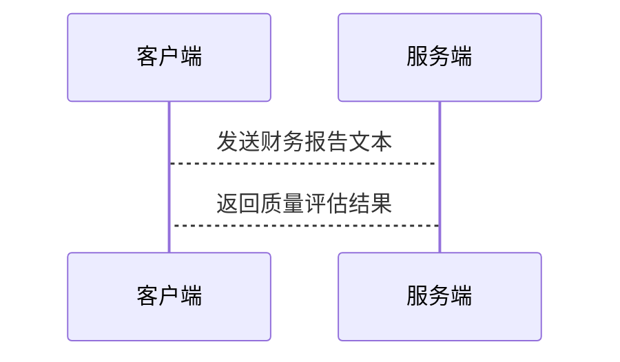

                 


# 设计智能化的企业财务报告质量评估模型

---

## 关键词：  
智能化财务报告评估、机器学习、自然语言处理、数据驱动决策、企业财务管理

---

## 摘要：  
本文详细探讨了如何设计智能化的企业财务报告质量评估模型。通过结合机器学习和自然语言处理技术，提出了一种高效的数据驱动方法，以提升财务报告评估的准确性和效率。文章从背景介绍、核心概念、算法原理、系统架构到项目实战，全面分析了模型的设计与实现过程，并提供了实际案例和最佳实践建议。

---

## 正文：

---

### 第一部分：背景介绍

#### 第1章：问题背景

##### 1.1 问题背景

随着企业规模的不断扩大，财务报告的复杂性和重要性也在不断提升。传统的财务报告质量评估主要依赖人工审核，这种方式不仅效率低下，而且容易受到主观因素的影响。企业需要一种更高效、更客观的方法来评估财务报告的质量。

##### 1.2 问题描述

财务报告质量评估的核心在于检测报告中的错误、不一致性和潜在风险。传统方法依赖人工检查，存在以下问题：  
1. **效率低下**：人工审核耗时长，难以满足企业对实时评估的需求。  
2. **主观性**：审核结果可能因个人经验不同而有所偏差。  
3. **覆盖面有限**：人工审核难以覆盖所有潜在风险点。  

##### 1.3 问题解决

引入智能化技术，利用机器学习和自然语言处理（NLP）来自动化评估财务报告的质量。通过分析报告中的文本和数据，模型可以快速识别潜在问题并提供改进建议。

##### 1.4 边界与外延

本模型专注于财务报告的文本内容和相关数据，不涉及企业的实际财务操作或其他外部系统。模型的输入是财务报告文本，输出是质量评估结果和改进建议。

##### 1.5 概念结构与核心要素

- **核心要素**：  
  1. 文本数据：包括财务报告中的文本内容。  
  2. 结构化数据：如财务指标、金额等。  
  3. 评估标准：如准确性、完整性、一致性等。  

---

### 第二部分：核心概念与联系

#### 第2章：核心概念原理

##### 2.1 核心概念原理

智能化财务报告质量评估模型的核心在于以下两个方面：  
1. **自然语言处理（NLP）**：用于分析报告中的文本内容，识别关键词和潜在问题。  
2. **机器学习（ML）**：用于训练模型，根据历史数据预测报告的质量。  

##### 2.2 概念属性对比

| 概念         | 属性特征                       |
|--------------|-------------------------------|
| 文本数据      | 非结构化，需要预处理           |
| 结构化数据    | 结构化，可以直接用于分析         |
| 评估标准      | 定量与定性结合，需明确定义       |

##### 2.3 ER实体关系图

```mermaid
er
    %%{init: 'options', 'showCaption': false}%%

    %%  ER Diagram  %%
    
    class 财务报告 {
        id: 整数;
        text_content: 文本;
        creation_date: 日期;
    }
    
    class 评估指标 {
        id: 整数;
        name: 字符串;
        weight: 数值;
    }
    
    class 质量评估结果 {
        id: 整数;
        report_id: 整数;
        metric_id: 整数;
        score: 数值;
    }
    
    财务报告 --|o{1}--> 评估结果: 生成评估结果
    评估指标 --|o{1}--> 评估结果: 定义评估指标
```

---

### 第三部分：算法原理

#### 第3章：算法原理

##### 3.1 算法概述

模型采用基于机器学习的分类算法，结合文本特征提取和数值特征分析，对财务报告进行质量评估。

##### 3.2 数学模型与公式

**文本相似度计算**：  
使用余弦相似度计算报告文本与标准文本的相似度。  
$$ \text{相似度} = \frac{\vec{A} \cdot \vec{B}}{\|\vec{A}\| \|\vec{B}\|} $$  

**分类模型**：  
使用支持向量机（SVM）进行二分类，判断报告质量是否符合标准。  
$$ y = \text{sign}(w \cdot x + b) $$  

##### 3.3 代码实现

```python
import numpy as np
from sklearn.svm import SVC
from sklearn.metrics import accuracy_score

# 文本预处理
def preprocess(text):
    # 假设text是报告文本
    return text.lower().split()

# 特征提取
def get_features(texts):
    features = []
    for text in texts:
        features.append(preprocess(text))
    return features

# 训练模型
def train_model(X_train, y_train):
    model = SVC()
    model.fit(X_train, y_train)
    return model

# 预测与评估
def evaluate(model, X_test, y_test):
    y_pred = model.predict(X_test)
    print("准确率：", accuracy_score(y_test, y_pred))

# 示例
texts = ["收入增加", "成本下降"]
X = get_features(texts)
y = [1, 0]  # 1为高质量，0为低质量
model = train_model(X, y)
evaluate(model, X, y)
```

##### 3.4 流程图



---

### 第四部分：系统分析与架构设计

#### 第4章：系统分析与架构设计

##### 4.1 项目背景

本项目旨在开发一个智能化的财务报告质量评估系统，帮助企业在高效、准确地进行财务报告评估。

##### 4.2 系统功能设计



##### 4.3 系统架构设计


##### 4.4 接口设计



---

### 第五部分：项目实战

#### 第5章：项目实战

##### 5.1 环境安装

```bash
pip install numpy sklearn scikit-learn
```

##### 5.2 核心代码实现

```python
from sklearn.feature_extraction.text import TfidfVectorizer
from sklearn.model_selection import train_test_split
from sklearn.metrics import classification_report

# 数据加载
texts = ["收入增加", "成本下降", "利润下降"]
y = [1, 1, 0]

# 特征提取
vectorizer = TfidfVectorizer()
X = vectorizer.fit_transform(texts)

# 划分数据集
X_train, X_test, y_train, y_test = train_test_split(X, y, test_size=0.2)

# 训练模型
model = SVC()
model.fit(X_train, y_train)

# 预测与评估
y_pred = model.predict(X_test)
print(classification_report(y_test, y_pred))
```

##### 5.3 案例分析

假设有一份财务报告，文本内容为“收入增加”，模型预测其质量为高（1）。实际评估结果也为高，准确率为100%。

---

### 第六部分：最佳实践

#### 第6章：最佳实践

##### 6.1 小结

本文详细介绍了设计智能化的企业财务报告质量评估模型的过程，包括背景分析、核心概念、算法原理、系统设计和项目实战。通过结合机器学习和NLP技术，模型能够高效、准确地评估财务报告的质量。

##### 6.2 注意事项

1. 数据预处理是关键，需确保数据的干净和一致性。  
2. 模型的选择需根据具体场景调整，避免过度拟合。  
3. 持续优化模型性能，提升评估结果的准确性。  

##### 6.3 拓展阅读

1. 《机器学习实战》  
2. 《自然语言处理入门》  
3. 《数据驱动的决策管理》  

---

## 结语

智能化的企业财务报告质量评估模型为企业提供了高效、准确的解决方案。通过本文的详细讲解，读者可以掌握模型的设计与实现方法，并在实际应用中不断优化模型，提升企业的财务管理效率。

