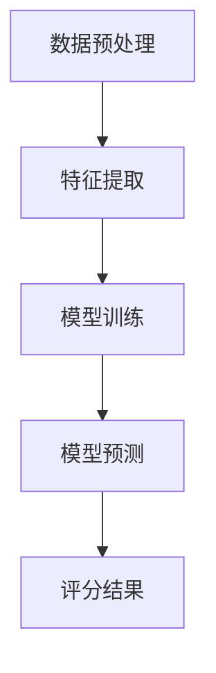
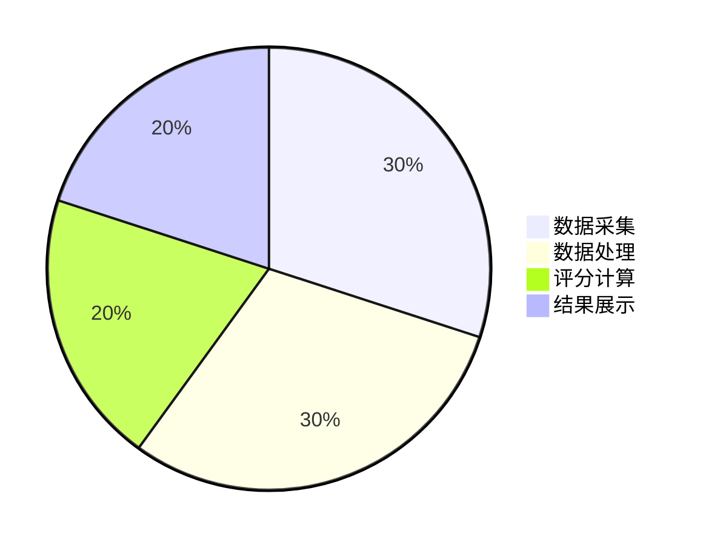

                 


# 设计智能化的企业财务报表可比性动态评分系统

> 关键词：企业财务报表，可比性评分系统，动态评分，人工智能，大数据分析

> 摘要：本文旨在设计一个智能化的企业财务报表可比性动态评分系统。通过结合人工智能和大数据分析技术，解决传统财务报表分析的局限性，实现对财务数据的动态、智能评分。文章从背景介绍、核心概念、算法原理、系统架构设计、项目实战到最佳实践，全面阐述了该评分系统的构建过程。

---

## 第1章：企业财务报表可比性的重要性

### 1.1 财务报表的基本概念与作用

#### 1.1.1 财务报表的基本构成
企业财务报表主要包括资产负债表、利润表和现金流量表，这些报表为企业内外部利益相关者提供了重要的财务信息。

#### 1.1.2 财务报表在企业中的作用
财务报表是企业经济活动的记录，用于评估企业的财务健康状况、盈利能力和发展潜力。

#### 1.1.3 财务报表可比性的定义与意义
可比性是指不同企业或同一企业不同期间的财务数据可以进行比较，以便更准确地评估企业表现。

---

### 1.2 企业财务报表可比性问题的现状

#### 1.2.1 当前财务报表分析的挑战
传统财务报表分析方法依赖人工判断，存在主观性强、效率低的问题。

#### 1.2.2 财务报表可比性不足的表现
不同企业的会计政策差异、行业特点不同等因素影响了财务数据的可比性。

#### 1.2.3 传统财务报表分析的局限性
传统方法难以应对海量数据和复杂业务场景，导致分析结果不够精准。

---

### 1.3 智能化动态评分系统的必要性

#### 1.3.1 智能化评分系统的定义
通过AI技术对财务数据进行自动分析和评分，提供客观、动态的评估结果。

#### 1.3.2 动态评分的必要性
动态评分能够实时反映企业财务状况的变化，帮助利益相关者及时做出决策。

#### 1.3.3 智能化评分系统的优势
提高分析效率、增强结果客观性、支持大规模数据处理。

---

## 第2章：财务报表可比性动态评分系统的概念与核心要素

### 2.1 财务报表可比性动态评分系统的核心概念

#### 2.1.1 评分系统的定义与目标
系统通过对财务数据的智能分析，生成动态评分，帮助用户评估企业财务健康状况。

#### 2.1.2 动态评分的机制与特点
评分系统根据实时数据调整评分，具有灵活性和适应性。

#### 2.1.3 可比性评分的核心要素
包括财务指标、行业基准、企业历史数据等因素。

---

### 2.2 评分系统的组成部分

#### 2.2.1 数据采集模块
负责收集企业的财务数据，包括资产负债表、利润表等。

#### 2.2.2 数据处理模块
对数据进行清洗、转换和标准化处理，确保数据质量。

#### 2.2.3 评分计算模块
应用机器学习算法对数据进行分析，生成评分结果。

#### 2.2.4 结果展示模块
将评分结果以可视化形式呈现，便于用户理解和应用。

---

### 2.3 系统的核心属性与特征对比

#### 2.3.1 系统属性对比表
| 属性         | 传统评分系统 | 智能化评分系统 |
|--------------|--------------|---------------|
| 分析效率     | 低           | 高             |
| 结果客观性   | 主观         | 客观           |
| 数据处理能力 | 有限         | 强             |

#### 2.3.2 核心要素的ER实体关系图
```mermaid
er
  actor: 用户
  system: 评分系统
  financial_data: 财务数据
  score: 评分结果
  actor --> system
  system --> financial_data
  system --> score
```

---

## 第3章：评分系统的算法原理

### 3.1 算法原理概述

#### 3.1.1 机器学习模型的选择
常用的模型包括线性回归、支持向量机（SVM）和神经网络。

#### 3.1.2 数学模型和公式
使用回归分析模型进行评分计算：
$$ score = \beta_0 + \beta_1x_1 + \beta_2x_2 + \dots + \beta_nx_n $$

#### 3.1.3 代码实现
```python
import pandas as pd
from sklearn.linear_model import LinearRegression

# 数据预处理
data = pd.read_csv('financial_data.csv')
X = data[['revenue', 'profit', 'assets']]
y = data['score']

# 模型训练
model = LinearRegression()
model.fit(X, y)

# 预测评分
new_data = pd.DataFrame({'revenue': [1000000], 'profit': [200000], 'assets': [5000000]})
predicted_score = model.predict(new_data)
print(predicted_score)
```

---

### 3.2 算法流程图



---

## 第4章：系统架构设计

### 4.1 系统架构概述

#### 4.1.1 模块划分
系统分为数据采集、数据处理、评分计算和结果展示四个模块。

#### 4.1.2 数据流设计
数据从源端采集，经过处理后输入模型，生成评分并展示。

#### 4.1.3 系统架构图



---

### 4.2 系统交互设计

#### 4.2.1 系统交互流程
用户输入数据，系统处理并返回评分结果。

#### 4.2.2 交互序列图

```mermaid
sequenceDiagram
    actor: 用户
    system: 评分系统
    actor -> system: 提交财务数据
    system -> actor: 返回评分结果
```

---

## 第5章：项目实战

### 5.1 环境配置

#### 5.1.1 安装必要的库
```bash
pip install pandas scikit-learn
```

### 5.2 数据预处理

#### 5.2.1 数据清洗
```python
data = pd.read_csv('financial_data.csv')
data = data.dropna()
```

#### 5.2.2 特征工程
```python
data['revenue_per_asset'] = data['revenue'] / data['assets']
```

### 5.3 模型训练

#### 5.3.1 训练回归模型
```python
model = LinearRegression()
model.fit(X_train, y_train)
```

### 5.4 系统实现

#### 5.4.1 编写评分接口
```python
def calculate_score(new_data):
    return model.predict(new_data)
```

---

## 第6章：最佳实践

### 6.1 小结
智能化的财务报表可比性动态评分系统能够显著提高分析效率和准确性。

### 6.2 注意事项
- 确保数据质量和完整性
- 定期更新模型以适应市场变化

### 6.3 拓展阅读
建议进一步学习机器学习和大数据分析技术，以优化评分系统。

---

通过以上步骤，我们构建了一个智能化的企业财务报表可比性动态评分系统，利用AI和大数据技术解决了传统方法的不足，为企业的财务管理提供了有力支持。

