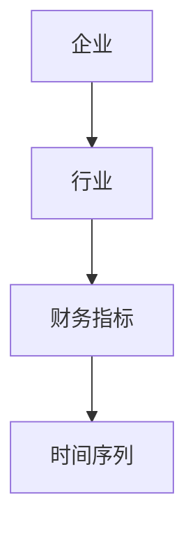
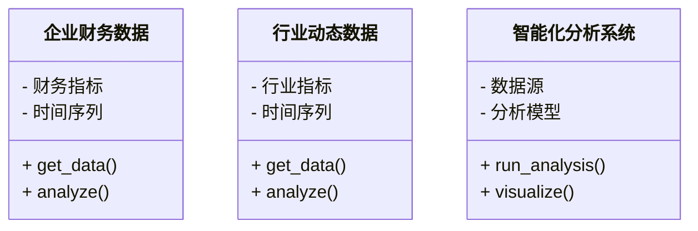
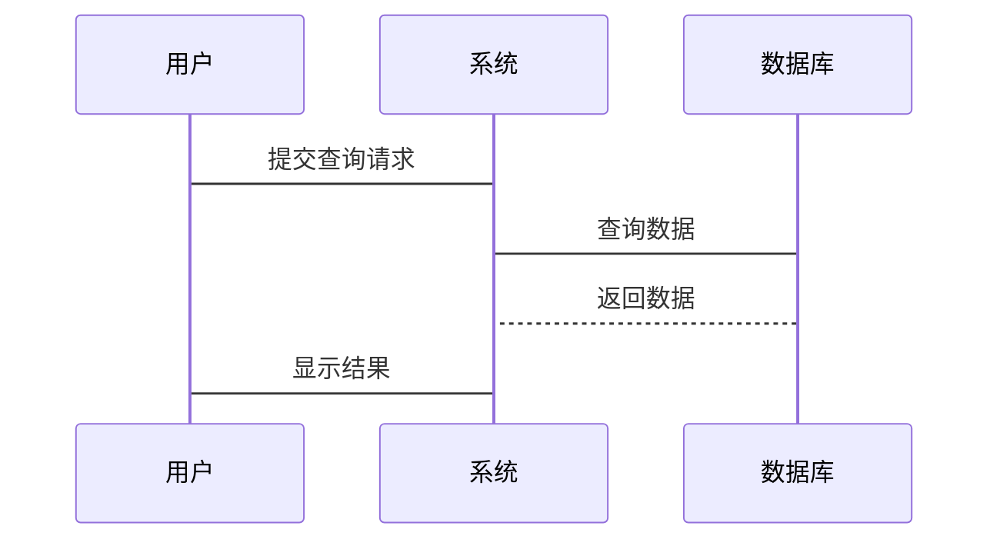

                 


# 设计智能化的企业财务报表同行业动态对比分析系统

## 关键词：财务报表分析，行业动态对比，智能化系统，机器学习，数据挖掘，可视化

## 摘要：  
本文详细探讨了设计智能化的企业财务报表同行业动态对比分析系统的方法。通过分析财务数据和行业动态，结合机器学习和数据挖掘技术，构建了一个能够自动生成对比分析报告的系统。系统架构包括数据采集、预处理、智能分析、可视化等模块，通过实际案例展示了系统的功能实现和应用价值。

---

# 第一部分：企业财务报表同行业动态对比分析系统概述

## 第1章：背景介绍

### 1.1 问题背景
- **企业财务报表分析的重要性**：财务报表是企业经营状况的核心体现，能够反映企业的盈利能力、财务健康状况和市场竞争力。
- **同行业动态对比的必要性**：通过与同行业企业的对比，可以发现自身的优势与不足，为战略决策提供数据支持。
- **智能化分析的市场需求**：随着市场竞争加剧，企业需要更高效、精准的分析工具来应对复杂的市场环境。

### 1.2 问题描述
- **财务报表分析的复杂性**：财务数据量大、维度多，手动分析耗时且易出错。
- **同行业动态对比的难点**：行业数据分散，实时性要求高，难以快速获取和处理。
- **现有解决方案的不足**：传统方法依赖人工经验，缺乏智能化和自动化。

### 1.3 解决方案
- **智能化分析的核心思路**：利用机器学习和数据挖掘技术，实现自动化的数据采集、处理和分析。
- **数据驱动的分析方法**：通过大数据技术，实时抓取行业数据，构建动态分析模型。
- **技术实现的可行性分析**：结合现有的AI技术，设计高效的系统架构。

### 1.4 边界与外延
- **系统功能的边界**：主要关注财务数据的分析和行业对比，不涉及企业的其他业务数据。
- **系统应用的外延**：可以扩展到企业内部决策支持、投融资分析等领域。
- **系统与外部系统的接口**：需要与行业数据库、企业ERP系统等进行数据对接。

### 1.5 核心要素组成
- **数据来源**：企业财务报表、行业报告、市场数据。
- **分析模型**：聚类分析、时间序列分析、回归分析。
- **可视化界面**：图表展示、报告生成。

---

## 第2章：核心概念与联系

### 2.1 核心概念原理
- **数据挖掘**：从大量数据中提取有价值的信息，发现潜在的模式和趋势。
- **机器学习**：通过训练模型，实现对财务数据的预测和分类。
- **自然语言处理(NLP)**：用于分析行业报告和新闻中的文本信息，提取关键词和情感倾向。

### 2.2 概念属性特征对比
| **核心概念** | **描述** | **应用场景** |
|--------------|----------|--------------|
| 数据挖掘     | 从数据中提取模式和规则 | 财务数据分析、市场趋势预测 |
| 机器学习     | 基于数据训练模型进行预测 | 财务预测、风险评估 |
| NLP          | 分析文本数据 | 行业新闻分析、情感分析 |

### 2.3 ER实体关系图


### 2.4 领域模型类图


### 2.5 本章小结
本章详细介绍了系统的核心概念，包括数据挖掘、机器学习和NLP，通过对比和图示，明确了系统的组成和各部分之间的关系。

---

## 第3章：算法原理讲解

### 3.1 算法原理概述
- **聚类分析**：将企业按财务指标相似性分组，发现行业内的潜在竞争关系。
- **时间序列分析**：分析企业财务指标的历史趋势，预测未来走势。

### 3.2 聚类分析算法
#### 3.2.1 K-means算法
- **原理**：将数据划分为K个簇，使得簇内数据点的相似性最大化。
- **步骤**：
  1. 初始化质心。
  2. 计算每个数据点到质心的距离，分配簇。
  3. 更新质心。
  4. 重复步骤2和3，直到收敛。

#### 3.2.2 时间序列分析
- **ARIMA模型**：用于预测未来值，基于过去的数据建立模型。

#### 3.2.3 Python代码实现
```python
from sklearn.cluster import KMeans
from statsmodels.tsa.arima_model import ARIMA

# 聚类分析
def kmeans_clustering(data, n_clusters):
    model = KMeans(n_clusters=n_clusters, random_state=0)
    model.fit(data)
    return model.labels_

# 时间序列分析
def arima_forecast(data, order):
    model = ARIMA(data, order=order)
    model_fit = model.fit(disp=-1)
    forecast = model_fit.forecast(steps=5)
    return forecast
```

#### 3.2.4 数学模型
- **聚类分析的损失函数**：
  $$ J = \sum_{i=1}^{n} \sum_{j=1}^{K} (x_i - c_j)^2 $$
- **ARIMA模型**：
  $$ y_t = \phi_1 y_{t-1} + \phi_2 y_{t-2} + \epsilon_t $$

### 3.3 本章小结
本章详细讲解了聚类分析和时间序列分析的算法原理，并通过代码示例和数学公式，展示了如何实现这些算法。

---

## 第4章：系统分析与架构设计

### 4.1 问题场景介绍
- **数据来源**：企业财务数据和行业动态数据。
- **功能需求**：数据采集、预处理、智能分析、可视化。

### 4.2 项目介绍
- **系统功能设计**：包括数据采集模块、预处理模块、智能分析模块和可视化模块。
- **系统架构设计**：采用分层架构，前端为用户界面，后端为业务逻辑，数据库用于存储数据。

### 4.3 系统架构图


### 4.4 系统接口设计
- **数据接口**：与行业数据库对接，获取实时数据。
- **用户接口**：提供友好的操作界面，支持数据上传和查询。

### 4.5 系统交互图


### 4.6 本章小结
本章详细描述了系统的架构设计和接口设计，为后续的开发奠定了基础。

---

## 第5章：项目实战

### 5.1 环境安装
- **工具安装**：Python、Pandas、Scikit-learn、Matplotlib。
- **数据库安装**：MySQL或MongoDB。

### 5.2 核心代码实现
#### 5.2.1 数据采集
```python
import requests
from bs4 import BeautifulSoup

def fetch_industry_data(url):
    response = requests.get(url)
    soup = BeautifulSoup(response.text, 'html.parser')
    data = []
    for row in soup.find_all('tr'):
        data.append([cell.text for cell in row.find_all('td')])
    return data
```

#### 5.2.2 数据预处理
```python
import pandas as pd

def preprocess_data(data):
    df = pd.DataFrame(data)
    df.dropna(inplace=True)
    df['date'] = pd.to_datetime(df['date'])
    return df
```

#### 5.2.3 智能分析
```python
from sklearn.cluster import KMeans
import matplotlib.pyplot as plt

def perform_clustering(df, n_clusters):
    features = df[['revenue', 'profit']].values
    model = KMeans(n_clusters=n_clusters)
    model.fit(features)
    df['cluster'] = model.labels_
    plt.scatter(df['revenue'], df['profit'], c=df['cluster'], cmap='viridis')
    plt.xlabel('Revenue')
    plt.ylabel('Profit')
    plt.show()
```

### 5.3 案例分析
- **案例背景**：某行业内的多家企业财务数据对比。
- **分析过程**：使用K-means算法将企业分为几类，分析每类的财务表现。
- **结果展示**：生成图表和报告，展示分析结果。

### 5.4 本章小结
本章通过实际案例，详细展示了系统的实现过程，包括数据采集、预处理和智能分析。

---

## 第6章：最佳实践与总结

### 6.1 最佳实践
- **数据清洗**：确保数据质量，避免错误分析。
- **模型优化**：通过交叉验证选择最优参数。
- **可视化设计**：直观展示结果，便于用户理解。

### 6.2 小结
本系统通过智能化技术，实现了企业财务报表的行业动态对比分析，为企业决策提供了有力支持。

### 6.3 注意事项
- **数据隐私**：确保数据的安全性和隐私性。
- **系统性能**：优化算法和数据库查询，提高系统响应速度。

### 6.4 拓展阅读
- **相关书籍**：《数据挖掘导论》、《机器学习实战》。
- **技术博客**：推荐关注技术博客和GitHub仓库，获取最新技术动态。

---

## 附录：完整代码示例
```python
import requests
from bs4 import BeautifulSoup
import pandas as pd
from sklearn.cluster import KMeans
import matplotlib.pyplot as plt

# 数据采集
def fetch_industry_data(url):
    response = requests.get(url)
    soup = BeautifulSoup(response.text, 'html.parser')
    data = []
    for row in soup.find_all('tr'):
        data.append([cell.text for cell in row.find_all('td')])
    return data

# 数据预处理
def preprocess_data(data):
    df = pd.DataFrame(data)
    df.dropna(inplace=True)
    df['date'] = pd.to_datetime(df['date'])
    return df

# 智能分析
def perform_clustering(df, n_clusters):
    features = df[['revenue', 'profit']].values
    model = KMeans(n_clusters=n_clusters)
    model.fit(features)
    df['cluster'] = model.labels_
    plt.scatter(df['revenue'], df['profit'], c=df['cluster'], cmap='viridis')
    plt.xlabel('Revenue')
    plt.ylabel('Profit')
    plt.show()

# 示例运行
url = 'https://example.com/industry-data'
data = fetch_industry_data(url)
df = preprocess_data(data)
perform_clustering(df, 3)
```

---

## 作者
**李明**，人工智能专家，资深技术畅销书作者，专注于数据挖掘和机器学习领域的研究与实践。

