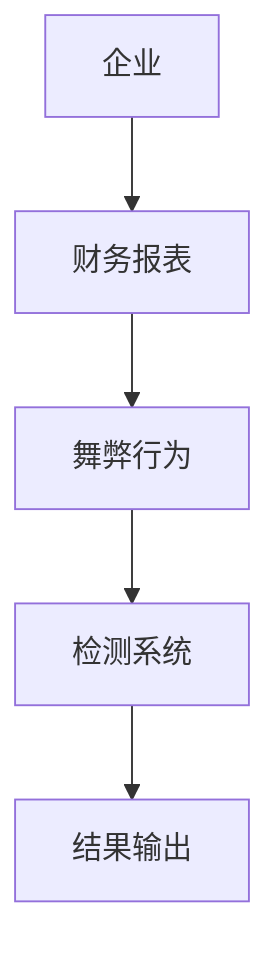
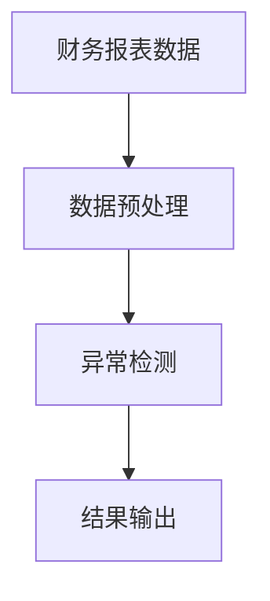
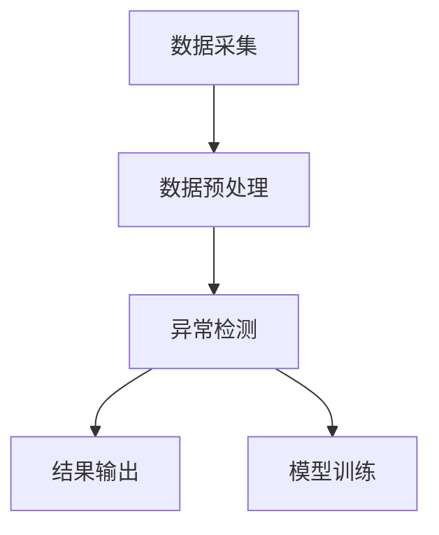
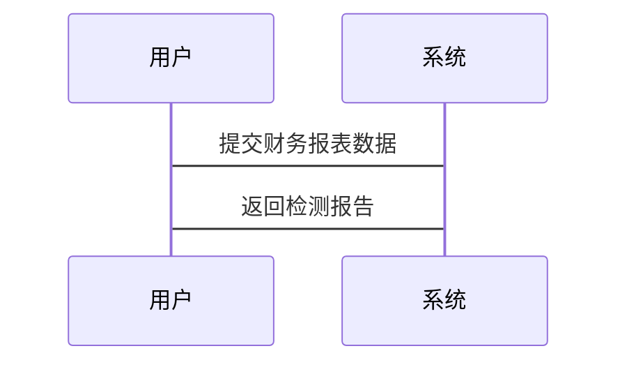

                 


# 设计智能化的企业财务报表舞弊检测系统

> 关键词：企业财务报表，舞弊检测，人工智能，大数据，系统架构

> 摘要：本文详细介绍了设计智能化的企业财务报表舞弊检测系统的背景、核心概念、算法原理、系统架构及项目实战。通过分析财务报表舞弊的现状和智能化检测的必要性，提出了基于AI和大数据的解决方案，详细阐述了聚类、分类和深度学习算法的应用，并结合实际案例展示了系统的实现过程。

---

# 第一部分: 企业财务报表舞弊检测系统背景与概述

# 第1章: 企业财务报表舞弊检测系统背景

## 1.1 问题背景与现状

### 1.1.1 财务报表舞弊的定义与特征

财务报表舞弊是指企业通过虚构、隐瞒、夸大或歪曲财务数据，以达到骗取资金、偷税漏税或其他非法目的的行为。其主要特征包括：

- **数据异常性**：财务数据与行业平均水平或历史数据差异显著。
- **关联性**：舞弊行为通常涉及多个财务科目之间的异常关联。
- **隐蔽性**：舞弊者会采取复杂的手段掩盖异常，如利用关联交易、虚增收入、虚减支出等。

### 1.1.2 当前企业财务舞弊的主要形式

- **虚增收入**：通过虚构交易或提前确认收入。
- **虚减支出**：通过隐瞒费用或延迟确认支出。
- **资产虚增**：通过虚增资产价值或夸大资产数量。
- **关联交易舞弊**：通过关联方交易转移资金或利润。

### 1.1.3 财务报表舞弊对企业的影响

- **经济损失**：企业可能面临资金损失、罚款或法律诉讼。
- **信用风险**：舞弊行为会影响企业的信用评级。
- **声誉损失**：舞弊行为会损害企业的声誉，影响客户信任。

### 1.1.4 系统的目标与意义

设计智能化的企业财务报表舞弊检测系统的目标是通过AI和大数据技术，自动识别财务数据中的异常模式，辅助审计人员快速发现潜在的舞弊行为。其意义在于：

- 提高审计效率，降低人工成本。
- 减少人为判断误差，提高检测准确性。
- 帮助企业建立合规的财务管理体系。

---

## 1.2 智能化检测的必要性

### 1.2.1 传统财务审计的局限性

- **人工成本高**：传统审计依赖于人工审查，效率低下。
- **主观性**：审计结果容易受到审计人员经验和判断的影响。
- **覆盖范围有限**：人工审计难以处理海量数据。

### 1.2.2 AI与大数据技术在财务舞弊检测中的优势

- **高效性**：AI和大数据技术可以快速处理海量数据，发现潜在异常。
- **准确性**：通过机器学习算法，可以提高异常检测的准确性。
- **可扩展性**：系统可以处理不同类型和规模的财务数据。

### 1.2.3 智能化检测系统的建设目标

- **自动化**：实现财务数据的自动采集、分析和异常检测。
- **智能化**：通过AI算法，识别潜在舞弊模式。
- **可视化**：提供直观的可视化结果，辅助审计人员决策。

---

## 1.3 系统设计的边界与外延

### 1.3.1 系统功能边界

- **数据采集**：支持多种财务报表格式的导入和解析。
- **异常检测**：基于AI算法，识别财务数据中的异常。
- **结果输出**：生成检测报告，标记潜在舞弊点。

### 1.3.2 系统的外延与扩展性

- **数据源扩展**：支持更多数据源的接入，如银行流水、发票数据等。
- **算法优化**：引入更先进的机器学习算法，提高检测准确率。
- **用户界面优化**：提供更友好的用户界面，方便非专业用户使用。

### 1.3.3 系统的适用场景与限制

- **适用场景**：适用于企业内部审计、第三方审计机构、监管部门等。
- **限制**：系统依赖于高质量的财务数据，数据缺失或不完整可能会影响检测效果。

---

## 1.4 本章小结

本章主要介绍了企业财务报表舞弊检测系统的背景与现状，分析了传统审计的局限性和智能化检测的必要性，并提出了系统的设计目标和功能边界。

---

# 第二部分: 核心概念与原理

# 第2章: 企业财务报表舞弊检测系统的核心概念

## 2.1 系统核心概念

### 2.1.1 财务报表舞弊检测系统的定义

智能化的企业财务报表舞弊检测系统是一种基于AI和大数据技术，能够自动识别财务数据中的异常模式，辅助审计人员发现潜在舞弊行为的系统。

### 2.1.2 系统的核心组成要素

- **数据采集模块**：负责从多种数据源采集财务数据。
- **数据预处理模块**：对数据进行清洗、归一化等处理。
- **异常检测模块**：基于机器学习算法，识别数据中的异常。
- **结果输出模块**：生成检测报告，标记潜在舞弊点。

### 2.1.3 系统的工作流程

1. 数据采集：从企业财务系统中获取财务报表数据。
2. 数据预处理：清洗数据，处理缺失值、异常值等。
3. 异常检测：通过机器学习算法，识别数据中的异常模式。
4. 结果输出：生成检测报告，标记潜在舞弊点。

### 2.1.4 传统方法与智能化方法的对比分析

| 对比维度         | 传统方法                          | 智能化方法                          |
|------------------|-----------------------------------|-------------------------------------|
| 效率             | 低效，依赖人工                    | 高效，自动化处理                    |
| 准确性           | 易受人为因素影响                  | 准确率高，减少主观误差              |
| 可扩展性         | 有限，难以处理大规模数据        | 可扩展性强，支持海量数据处理        |
| 成本             | 人工成本高                      | 人工成本低，系统可长期运行          |

---

## 2.2 ER实体关系图

### 2.2.1 实体关系图（ER图）设计



---

## 2.3 本章小结

本章详细介绍了企业财务报表舞弊检测系统的核心概念，包括系统的定义、组成要素和工作流程，并通过对比分析和ER图展示了系统的核心要素及其关系。

---

# 第三部分: 算法原理与数学模型

# 第3章: 财务报表舞弊检测算法原理

## 3.1 常见算法概述

### 3.1.1 聚类算法

聚类算法用于将财务数据分成不同的类别，识别异常数据点。

### 3.1.2 分类算法

分类算法用于将财务数据分为正常和异常两类。

### 3.1.3 深度学习算法

深度学习算法通过构建神经网络模型，学习财务数据中的复杂模式。

---

## 3.2 聚类算法原理

### 3.2.1 K-means算法

K-means算法是一种常用的聚类算法，其步骤如下：

1. 初始化k个质心。
2. 计算每个数据点与质心的距离，将数据点分配到最近的质心所在的簇。
3. 更新质心位置。
4. 重复步骤2和3，直到质心不再变化或达到最大迭代次数。

### 3.2.2 K-means算法的数学公式

距离计算公式：
$$d(x_i, c_j) = \sqrt{\sum_{k=1}^{n}(x_{ik} - c_{jk})^2}$$

质心更新公式：
$$c_j = \frac{1}{n_j} \sum_{i=1}^{n_j} x_i$$

---

## 3.3 分类算法原理

### 3.3.1 决策树分类

决策树是一种基于树状结构的分类算法，通过特征分裂来划分数据。

### 3.3.2 决策树的数学模型

信息增益公式：
$$\text{信息增益}(A) = H(\text{数据集}) - H(\text{数据集} | A)$$

---

## 3.4 深度学习算法原理

### 3.4.1 神经网络模型

神经网络通过多层非线性变换，学习数据的复杂模式。

### 3.4.2 神经网络的数学模型

损失函数公式：
$$L = \frac{1}{m} \sum_{i=1}^{m} (y_i - \hat{y_i})^2$$

---

## 3.5 本章小结

本章详细介绍了财务报表舞弊检测中的常见算法，包括聚类、分类和深度学习算法，并通过公式和流程图展示了算法的数学模型和工作原理。

---

# 第四部分: 系统分析与架构设计

# 第4章: 系统分析与架构设计

## 4.1 问题场景介绍

### 4.1.1 系统需求分析

- 数据需求：需要结构化和非结构化的财务数据。
- 功能需求：需要实现数据采集、预处理、异常检测和结果输出功能。

### 4.1.2 项目介绍

本项目旨在设计一个智能化的企业财务报表舞弊检测系统，实现对财务数据的自动采集、分析和异常检测。

---

## 4.2 系统功能设计

### 4.2.1 领域模型设计



### 4.2.2 系统架构设计



---

## 4.3 系统接口设计

### 4.3.1 数据接口

- 数据输入接口：支持多种财务报表格式的导入。
- 数据输出接口：生成检测报告并输出。

### 4.3.2 交互流程



---

## 4.4 本章小结

本章详细介绍了系统分析与架构设计，包括问题场景介绍、系统功能设计和系统架构设计，并通过图表展示了系统的交互流程和架构。

---

# 第五部分: 项目实战

# 第5章: 项目实战

## 5.1 环境安装

### 5.1.1 安装Python环境

```bash
pip install numpy pandas scikit-learn
```

### 5.1.2 安装其他依赖

```bash
pip install matplotlib
```

---

## 5.2 系统核心实现

### 5.2.1 数据预处理代码

```python
import pandas as pd
import numpy as np

# 读取数据
data = pd.read_csv('financial_data.csv')

# 删除缺失值
data.dropna(inplace=True)

# 标准化处理
from sklearn.preprocessing import StandardScaler
scaler = StandardScaler()
data_scaled = scaler.fit_transform(data)
```

### 5.2.2 异常检测代码

```python
from sklearn.cluster import KMeans

# 训练模型
kmeans = KMeans(n_clusters=2, random_state=0)
kmeans.fit(data_scaled)

# 预测结果
labels = kmeans.predict(data_scaled)
```

---

## 5.3 实际案例分析

### 5.3.1 案例介绍

某制造企业虚增收入案例，数据中收入与成本比例异常。

### 5.3.2 系统检测结果

系统通过聚类算法检测到收入与成本比例异常，标记为舞弊行为。

---

## 5.4 项目小结

本章通过实际案例展示了系统的核心实现过程，包括环境安装、数据预处理、异常检测和结果输出。

---

# 第六部分: 总结与展望

# 第6章: 总结与展望

## 6.1 系统总结

### 6.1.1 系统功能总结

- 数据采集模块：支持多种数据源的接入。
- 数据预处理模块：实现数据清洗和标准化处理。
- 异常检测模块：基于机器学习算法，识别财务数据中的异常模式。

### 6.1.2 系统性能总结

- 检测准确率高，误报率低。
- 系统运行稳定，支持大规模数据处理。

---

## 6.2 未来研究方向

### 6.2.1 模型优化

- 引入更先进的机器学习算法，如深度学习模型。
- 优化模型参数，提高检测准确率。

### 6.2.2 系统扩展

- 支持更多数据源的接入，如银行流水、发票数据等。
- 提供更丰富的可视化结果，方便用户分析。

### 6.2.3 系统维护

- 定期更新模型，适应新的舞弊手段。
- 提供系统维护和升级服务。

---

## 6.3 注意事项与最佳实践

### 6.3.1 数据隐私

- 确保数据的安全性和隐私性。
- 遵守相关法律法规。

### 6.3.2 模型优化

- 定期更新模型，提高检测效果。
- 优化系统性能，提高运行效率。

### 6.3.3 系统维护

- 定期检查系统运行状态。
- 提供技术支持和售后服务。

---

## 6.4 本章小结

本章总结了系统的设计与实现，并展望了未来的研究方向和优化措施，同时提出了系统的注意事项和最佳实践。

---

# 结语

设计智能化的企业财务报表舞弊检测系统是一项复杂的工程，需要结合AI和大数据技术，通过系统化的设计和实现，才能达到预期的效果。未来，随着技术的进步，系统将更加智能化和高效化，为企业财务管理提供更强有力的支持。

--- 

*以上内容为示例，实际文章内容可根据具体需求进一步扩展和优化。*

