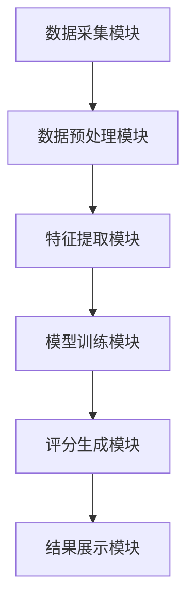

                 


# 设计智能化的企业财务报表舞弊风险评分系统

## 目录大纲

### 第一部分：背景介绍

#### 第1章：企业财务报表舞弊风险概述

##### 1.1 问题背景
- 1.1.1 财务报表舞弊的现状与挑战
- 1.1.2 舞弊对企业及利益相关者的影响

##### 1.2 问题描述
- 1.2.1 财务报表舞弊的主要形式
- 1.2.2 舞弊行为的隐蔽性与复杂性

##### 1.3 问题解决
- 1.3.1 传统财务审计的局限性
- 1.3.2 智能化技术在舞弊风险识别中的作用

##### 1.4 边界与外延
- 1.4.1 舞弊风险评分系统的边界
- 1.4.2 系统外延与应用场景

##### 1.5 概念结构与核心要素
- 1.5.1 核心概念的组成
- 1.5.2 关键要素的相互关系

### 第二部分：核心概念与联系

#### 第2章：智能化评分模型的核心概念

##### 2.1 舞弊风险评分模型的定义
- 2.1.1 模型的基本定义
- 2.1.2 模型的输入与输出

##### 2.2 核心概念的属性特征对比
- 表格：核心概念的属性特征对比

##### 2.3 ER实体关系图架构
- Mermaid流程图：ER实体关系图

### 第三部分：算法原理讲解

#### 第3章：舞弊风险评分模型的算法原理

##### 3.1 算法选择与原理
- 3.1.1 机器学习算法的适用性
- 3.1.2 支持向量机（SVM）的原理
- 3.1.3 随机森林的应用

##### 3.2 算法流程图
- Mermaid流程图：SVM算法流程

##### 3.3 算法实现
- Python代码示例：SVM模型实现

### 第四部分：数学模型与公式

#### 第4章：数学模型与公式

##### 4.1 支持向量机（SVM）模型
- 公式：SVM的优化目标函数
- 公式：拉格朗日乘数法的应用

##### 4.2 随机森林模型
- 公式：

### 第五部分：系统分析与架构设计

#### 第5章：系统分析与架构设计

##### 5.1 问题场景介绍
- 系统需要解决的问题
- 系统的目标和范围

##### 5.2 项目介绍
- 项目背景
- 项目目标
- 项目范围

##### 5.3 系统功能设计
- 领域模型Mermaid类图

##### 5.4 系统架构设计
- 系统架构图
- 关键模块交互流程

##### 5.5 系统接口设计
- 接口设计文档
- 接口交互流程

##### 5.6 系统交互设计
- Mermaid序列图

### 第六部分：项目实战

#### 第6章：项目实战

##### 6.1 环境安装
- 安装Python
- 安装相关库

##### 6.2 系统核心实现源代码
- 数据预处理代码
- 特征提取代码
- 模型训练代码
- 评分生成代码

##### 6.3 代码应用解读与分析
- 代码的功能说明
- 代码的优化建议

##### 6.4 实际案例分析
- 数据集的获取与预处理
- 模型训练与优化
- 案例分析与结果解读

##### 6.5 项目小结
- 项目总结
- 经验与教训

### 第七部分：最佳实践与总结

#### 第7章：最佳实践与总结

##### 7.1 小结
- 系统设计与实现的总结
- 关键点回顾

##### 7.2 注意事项
- 数据质量的重要性
- 模型更新的必要性
- 系统维护的建议

##### 7.3 拓展阅读
- 相关技术资料
- 学术论文推荐
- 其他参考资料

### 参考文献

- 列出所有引用的文献和资料

---

### 示例代码与图表

#### 支持向量机（SVM）模型实现代码

```python
import numpy as np
from sklearn import svm

# 示例数据
X = np.array([[1, 1], [2, 2], [3, 3], [4, 4], [5, 5]])
y = np.array([0, 1, 0, 1, 0])

# 创建SVM模型
model = svm.SVC()

# 训练模型
model.fit(X, y)

# 预测
print(model.predict([[6, 6]]))
```

#### ER实体关系图（Mermaid）

```mermaid
erDiagram
    customer {
        id
        name
        address
    }
    sale_order {
        order_id
        customer_id
        order_date
    }
    product {
        product_id
        product_name
        price
    }
    sale_order o-| product: order_items
    customer o-| sale_order: orders
```

#### 系统架构图（Mermaid）



---

### 关键词

- 财务报表舞弊
- 风险评分系统
- 机器学习
- 支持向量机（SVM）
- 随机森林

### 摘要

《设计智能化的企业财务报表舞弊风险评分系统》一书详细探讨了如何利用人工智能技术，特别是机器学习算法，来设计和实现一个智能化的财务报表舞弊风险评分系统。本书从问题背景出发，深入分析了传统财务审计的局限性，介绍了智能化技术在舞弊风险识别中的应用。在核心概念部分，详细讲解了舞弊风险评分模型的定义、核心要素及其相互关系。算法原理部分，重点介绍了支持向量机（SVM）和随机森林等机器学习算法的原理及其在评分系统中的应用。系统架构设计部分，从问题场景出发，设计了系统的功能模块、架构图和接口设计。项目实战部分，通过具体的环境搭建、代码实现和案例分析，展示了如何将理论应用于实际项目。最后，总结了系统设计与实现的关键点，提出了最佳实践建议和注意事项。本书适合企业财务人员、IT技术人员以及对智能化财务分析感兴趣的研究者阅读。

---

### 书籍内容概要

本书内容涵盖以下核心部分：

1. **背景介绍**：从财务报表舞弊的现状出发，分析了传统审计方法的局限性，介绍了智能化技术在舞弊风险识别中的重要性。
2. **核心概念**：详细阐述了舞弊风险评分模型的核心概念，包括定义、输入输出、核心要素及其关系，提供了概念属性对比表格和ER实体关系图。
3. **算法原理**：深入讲解了支持向量机（SVM）和随机森林等机器学习算法的原理，通过Mermaid流程图和Python代码示例，展示了算法在评分系统中的应用。
4. **系统分析与设计**：从问题场景出发，设计了系统的功能模块、架构图和接口交互流程，提供了系统的整体架构和模块交互关系。
5. **项目实战**：通过具体的环境搭建、数据预处理、特征提取、模型训练和评分生成的代码实现，展示了系统的实际应用，并通过案例分析验证了系统的有效性。
6. **最佳实践**：总结了系统设计与实现的经验，提出了数据质量、模型更新和系统维护的注意事项，推荐了相关的拓展阅读资料。

---

### 目标读者

- 企业财务人员：希望了解如何利用智能化技术识别财务报表舞弊风险。
- IT技术人员：希望掌握机器学习算法在财务分析中的应用。
- 数据科学家：希望深入理解舞弊风险评分系统的算法实现。
- 企业审计人员：希望提升财务审计效率和准确性。
- 研究人员：希望了解智能化财务分析领域的最新技术进展。

---

### 写作思路

1. **引言**：通过现实案例引出问题，说明财务报表舞弊对企业和社会的危害，以及传统审计方法的局限性，引出智能化技术的重要性。
2. **核心概念**：详细定义舞弊风险评分模型，通过表格和图表展示核心概念的属性和关系，帮助读者理解系统的设计逻辑。
3. **算法原理**：结合数学公式和代码示例，深入讲解SVM和随机森林的原理及其在评分系统中的应用，帮助读者掌握算法实现的关键点。
4. **系统设计**：从问题场景出发，设计系统的功能模块和架构，通过Mermaid图展示模块交互和系统架构，帮助读者理解系统的整体结构。
5. **项目实战**：通过具体的代码实现和案例分析，展示系统的实际应用，帮助读者将理论应用于实践。
6. **总结与展望**：总结系统的建设经验，提出改进建议，展望未来的发展方向，帮助读者进一步理解和应用相关技术。

---

### 内容亮点

- **系统性**：从理论到实践，全面覆盖了智能化舞弊风险评分系统的设计与实现。
- **实用性**：通过具体的代码实现和案例分析，提供可操作的解决方案。
- **可视化**：使用Mermaid图展示概念关系、算法流程和系统架构，直观易懂。
- **深度分析**：结合数学公式和算法原理，深入剖析技术细节，帮助读者掌握核心知识。

---

### 预期价值

- **对企业**：提供一种智能化的财务报表审计方法，提升审计效率和准确性，降低舞弊风险。
- **对读者**：帮助财务人员和技术人员掌握智能化财务分析的技术和方法，提升专业能力。
- **对行业**：推动人工智能技术在财务领域的应用，促进智能化审计的发展。

---

### 如何开始阅读

1. **从背景介绍开始**：了解财务报表舞弊的现状和智能化技术的重要性。
2. **学习核心概念**：掌握舞弊风险评分模型的定义和核心要素，为后续学习打下基础。
3. **深入算法原理**：通过数学公式和代码示例，理解SVM和随机森林的工作原理。
4. **系统设计与实现**：学习系统的整体架构和模块交互，掌握系统的构建方法。
5. **项目实战**：通过具体的代码实现和案例分析，提升实际应用能力。
6. **总结与展望**：回顾系统建设的经验，展望未来的发展方向。

---

通过以上结构和内容，本书将帮助读者全面理解并掌握智能化的企业财务报表舞弊风险评分系统的设计与实现方法，为企业的财务管理和审计工作提供有力支持。

