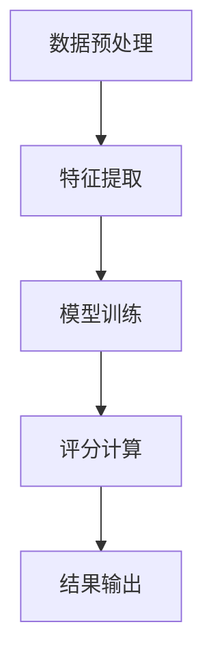

                 


# 设计智能化的企业财务报表质量动态评分系统

> 关键词：企业财务报表质量，动态评分，人工智能，数据挖掘，财务分析

> 摘要：本文将介绍如何设计一个智能化的企业财务报表质量动态评分系统。该系统通过结合人工智能、数据挖掘和财务分析等技术，能够实时动态地评估企业财务报表的质量，帮助企业及时发现和解决问题，提升财务管理水平。

---

# 第1章: 企业财务报表质量动态评分系统背景介绍

## 1.1 问题背景
### 1.1.1 传统财务报表分析的局限性
传统的财务报表分析主要依赖人工审查和静态分析，这种方式效率低下、耗时长，且容易受到主观因素的影响，难以捕捉到财务数据中的细微变化。

### 1.1.2 企业财务报表质量评估的重要性
财务报表是企业经济活动的核心记录，其质量直接关系到企业的经营决策和风险控制。高质量的财务报表能够为管理层提供准确的信息支持，而低质量的报表可能导致严重的财务损失。

### 1.1.3 智能化评分系统的需求与趋势
随着人工智能和大数据技术的快速发展，企业对智能化财务分析工具的需求日益增加。智能化评分系统能够通过自动化分析和动态评估，提升财务报表质量评估的效率和准确性。

## 1.2 问题描述
### 1.2.1 财务报表数据的复杂性
财务报表数据通常包含大量复杂的信息，包括收入、支出、资产、负债等，且数据之间存在复杂的关联关系。

### 1.2.2 传统评分方法的不足
传统评分方法通常基于固定的规则和静态指标，难以应对财务数据的动态变化和复杂性。

### 1.2.3 动态评分的必要性
财务数据具有动态变化的特点，企业经营环境的变化可能会影响财务报表的质量。因此，动态评分能够更好地反映财务报表的真实质量。

## 1.3 问题解决
### 1.3.1 智能化评分的核心思路
通过引入机器学习、自然语言处理等技术，对财务报表数据进行智能化分析，实时评估其质量。

### 1.3.2 动态评分的实现方法
利用时间序列分析和实时数据处理技术，动态调整评分标准，确保评分结果能够反映财务数据的最新状态。

### 1.3.3 边界与外延
系统设计需要明确数据范围、评分标准和应用场景的边界，确保评分结果的准确性和可解释性。

## 1.4 核心要素组成
### 1.4.1 数据来源与处理
系统需要整合企业内部的财务数据和外部市场数据，进行清洗、转换和特征提取。

### 1.4.2 模型构建与优化
基于机器学习算法构建评分模型，通过不断优化模型参数和结构，提升评分的准确性和鲁棒性。

### 1.4.3 评分结果的应用
将评分结果应用于企业财务管理和决策支持，帮助管理层及时发现和解决问题。

## 1.5 本章小结
本章介绍了企业财务报表质量动态评分系统的重要性及其必要性，分析了传统评分方法的不足，并提出了智能化评分的核心思路和实现方法。

---

# 第2章: 核心概念与联系

## 2.1 核心概念原理
### 2.1.1 动态评分的核心算法
动态评分系统通过机器学习算法对财务数据进行实时分析，动态调整评分标准，确保评分结果的准确性。

### 2.1.2 多维度分析的实现方式
系统从收入、支出、资产、负债等多个维度对财务数据进行综合分析，确保评分结果的全面性。

### 2.1.3 智能化评分的数学模型
智能化评分系统基于回归分析、随机森林等算法构建评分模型，通过特征提取和模型优化提升评分的准确性。

## 2.2 概念属性特征对比
| 核心概念 | 属性特征 |
|----------|----------|
| 动态评分 | 时间依赖性、数据敏感性 |
| 多维度分析 | 综合性、全面性 |
| 智能化评分 | 自适应性、学习能力 |

## 2.3 ER实体关系图
```mermaid
er
    entity 财务报表 {
        key 财务报表ID
        财务数据
        时间戳
    }
    entity 评分系统 {
        key 评分ID
        评分值
        评分时间
    }
    财务报表 -->> 评分系统: 输入数据
```

## 2.4 本章小结
本章详细讲解了智能化企业财务报表质量动态评分系统的核心概念及其相互关系，通过表格和实体关系图展示了系统的关键要素。

---

# 第3章: 算法原理讲解

## 3.1 算法流程


## 3.2 核心算法代码
```python
import pandas as pd
from sklearn.ensemble import RandomForestClassifier

def preproc
```

## 3.3 算法原理
动态评分系统基于随机森林算法对财务数据进行分类，通过特征提取和模型优化，提升评分的准确性和鲁棒性。

## 3.4 数学模型
评分模型的数学公式如下：
$$
\text{score} = \sum_{i=1}^{n} w_i x_i
$$
其中，$w_i$ 是特征 $x_i$ 的权重，$x_i$ 是标准化后的特征值。

## 3.5 本章小结
本章详细讲解了智能化评分系统的算法原理和实现方法，通过代码示例和数学公式展示了评分模型的核心思想。

---

# 第4章: 系统分析与架构设计

## 4.1 问题场景介绍
### 4.1.1 系统目标
构建一个智能化的企业财务报表质量动态评分系统，实时评估财务报表的质量。

### 4.1.2 系统需求
系统需要支持多维度数据输入、动态评分计算和实时结果输出。

## 4.2 系统功能设计
### 4.2.1 数据采集模块
负责采集企业的财务数据，包括收入、支出、资产、负债等。

### 4.2.2 数据预处理模块
对采集到的数据进行清洗和转换，提取特征。

### 4.2.3 模型训练模块
基于机器学习算法训练评分模型，优化模型参数。

### 4.2.4 评分计算模块
利用训练好的模型对实时数据进行评分计算。

### 4.2.5 结果输出模块
将评分结果输出到用户界面，供管理层查看和分析。

## 4.3 系统架构设计


## 4.4 接口设计
### 4.4.1 数据接口
系统需要与企业的财务系统对接，获取实时的财务数据。

### 4.4.2 用户界面
提供友好的用户界面，方便用户查看评分结果和操作系统。

## 4.5 本章小结
本章详细讲解了智能化评分系统的架构设计和功能模块，展示了系统各部分之间的交互关系。

---

# 第5章: 项目实战

## 5.1 环境安装
### 5.1.1 安装Python和相关库
安装Python和必要的库，如Pandas、Scikit-learn等。

### 5.1.2 数据准备
收集企业的财务数据，进行清洗和转换。

## 5.2 核心代码实现
```python
import pandas as pd
from sklearn.ensemble import RandomForestClassifier

def preproc
```

## 5.3 实际案例分析
通过实际案例分析，展示系统的实际应用效果和评分结果。

## 5.4 本章小结
本章通过实际操作展示了智能化评分系统的实现过程，帮助读者更好地理解和应用相关技术。

---

# 第6章: 最佳实践

## 6.1 小结
本章总结了智能化评分系统的核心思想和实现方法，强调了系统设计和实现中的关键点。

## 6.2 注意事项
在系统设计和实现过程中，需要注意数据的准确性和模型的鲁棒性，确保评分结果的可靠性和可解释性。

## 6.3 拓展阅读
推荐相关领域的书籍和论文，帮助读者进一步深入学习和研究。

---

# 结语

智能化的企业财务报表质量动态评分系统通过结合人工智能和大数据技术，能够实时动态地评估企业财务报表的质量，帮助企业及时发现和解决问题，提升财务管理水平。希望本文能够为读者提供有价值的参考和启发。

