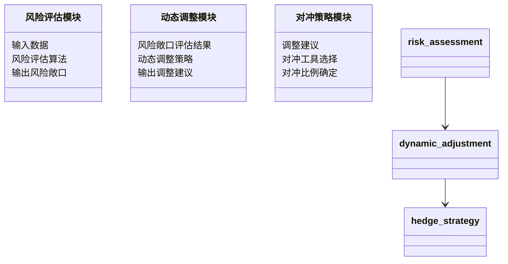
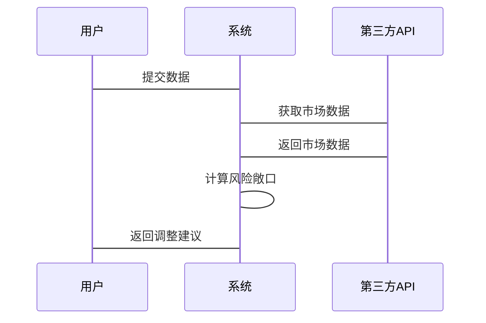

                 


# 设计智能化的企业财务风险敞口动态调整与对冲模型

## 关键词：企业财务风险管理，智能化，动态调整，对冲模型，风险管理，机器学习

## 摘要：  
本文详细探讨了设计智能化的企业财务风险敞口动态调整与对冲模型的核心方法与技术。通过分析财务风险敞口的动态变化，结合智能化技术，提出了一种基于机器学习的动态调整与对冲策略。该模型通过实时监控和分析市场数据，优化风险敞口的调整策略，从而实现对财务风险的有效管理和对冲。本文从模型背景、核心概念、算法原理、系统架构到项目实战，全面阐述了该模型的设计与实现过程。

---

# 第1章: 财务风险敞口的基本概念

## 1.1 财务风险敞口的定义与分类

### 1.1.1 财务风险敞口的定义
财务风险敞口是指企业在经营过程中由于内外部环境变化而可能面临的财务损失。它反映了企业在不同市场条件下，由于资产、负债或权益的价值变动而产生的风险暴露程度。

### 1.1.2 财务风险敞口的分类
财务风险敞口可以分为以下几类：
1. **市场风险敞口**：由于市场价格波动（如汇率、利率、股票价格等）引起的财务风险。
2. **信用风险敞口**：由于交易对手违约或信用评级变化引起的财务风险。
3. **流动性风险敞口**：由于资产无法及时变现或负债无法及时偿还引起的财务风险。
4. **操作风险敞口**：由于内部操作失误或外部事件（如自然灾害、恐怖袭击等）引起的财务风险。

### 1.1.3 财务风险敞口的影响因素
财务风险敞口的影响因素包括：
1. **宏观经济环境**：如经济周期、通货膨胀率、利率政策等。
2. **企业经营策略**：如投资决策、融资策略、资本结构等。
3. **市场波动**：如股票市场、外汇市场的波动性。

## 1.2 财务风险敞口的动态变化

### 1.2.1 经济环境变化对风险敞口的影响
经济环境的变化（如利率上升、通货膨胀）会直接影响企业的财务状况，导致风险敞口的变化。

### 1.2.2 企业经营策略调整对风险敞口的影响
企业通过调整投资组合、优化资本结构等经营策略，可以主动管理风险敞口。

### 1.2.3 市场波动对风险敞口的影响
市场波动（如股票价格的剧烈波动）会增加企业的市场风险敞口，需要及时进行动态调整。

## 1.3 智能化调整与对冲的意义

### 1.3.1 传统财务风险管理的局限性
传统财务风险管理方法通常基于静态分析，难以应对市场环境的快速变化，且缺乏智能化的动态调整能力。

### 1.3.2 智能化技术在财务风险管理中的优势
智能化技术（如机器学习、大数据分析）能够实时监控市场变化，快速识别风险点，并优化对冲策略。

### 1.3.3 动态调整与对冲的必要性
为了应对复杂多变的市场环境，企业需要能够实时调整风险敞口，并通过动态对冲策略降低风险。

---

# 第2章: 风险敞口动态调整与对冲模型的构成

## 2.1 模型的核心要素

### 2.1.1 风险评估模块
风险评估模块负责识别和量化企业的财务风险敞口，包括市场风险、信用风险等。

### 2.1.2 动态调整模块
动态调整模块根据风险评估结果，优化企业的资产配置和负债结构，降低风险敞口。

### 2.1.3 对冲策略模块
对冲策略模块设计具体的对冲方案，如使用金融衍生工具（如期货、期权）进行风险对冲。

## 2.2 模型的输入与输出

### 2.2.1 输入数据的来源与类型
- 市场数据：如股票价格、汇率、利率等。
- 企业数据：如资产负债表、利润表、现金流等。
- 风险参数：如波动率、相关系数等。

### 2.2.2 输出结果的结构与形式
- 风险敞口的动态调整建议。
- 对冲策略的具体实施方案。

## 2.3 模型的动态调整机制

### 2.3.1 动态调整的触发条件
- 市场环境的重大变化。
- 企业经营策略的调整。
- 风险敞口超过预设阈值。

### 2.3.2 调整策略的选择与优化
基于机器学习算法，动态调整模型会选择最优的调整策略，以最小化风险敞口。

### 2.3.3 调整过程中的反馈机制
调整后的结果会反馈到风险评估模块，进一步优化模型的预测能力。

## 2.4 模型的对冲策略设计

### 2.4.1 对冲工具的选择
- 金融衍生工具：如期货、期权。
- 投资组合调整：如调整资产配置比例。

### 2.4.2 对冲比例的确定
对冲比例根据风险敞口的大小和对冲工具的特性进行动态调整。

### 2.4.3 对冲效果的评估
通过VaR（在险值）或CVaR（条件在险值）等风险度量指标，评估对冲策略的效果。

---

# 第3章: 风险评估算法

## 3.1 风险评估的基本原理

### 3.1.1 风险因子的识别与量化
- 市场风险因子：如汇率、利率。
- 信用风险因子：如违约概率、违约损失率。

### 3.1.2 风险暴露的计算公式
$$ 风险暴露 = 资产价值 \times 风险因子 $$

## 3.2 基于机器学习的风险评估

### 3.2.1 机器学习在风险评估中的应用
- 使用随机森林算法预测市场波动。
- 使用神经网络模型分析多维风险因子。

### 3.2.2 常见的机器学习算法
1. **随机森林**：用于特征重要性分析和风险因子筛选。
2. **神经网络**：用于非线性风险预测。

### 3.2.3 算法实现步骤与代码示例
```python
import numpy as np
from sklearn.ensemble import RandomForestRegressor

# 示例数据
X = np.random.rand(100, 5)  # 5个特征，100个样本
y = np.random.rand(100)     # 风险值

# 训练随机森林模型
model = RandomForestRegressor(n_estimators=100)
model.fit(X, y)

# 预测风险值
new_X = np.random.rand(10, 5)
predicted_y = model.predict(new_X)
print(predicted_y)
```

## 3.3 风险评估的优化与改进

### 3.3.1 算法优化方法
- 调整随机森林的超参数（如n_estimators、max_depth）。
- 使用网格搜索优化模型参数。

### 3.3.2 模型调参技巧
- 使用交叉验证评估模型性能。
- 通过特征选择减少计算复杂度。

### 3.3.3 模型的可解释性
通过特征重要性分析，理解各个风险因子对企业财务风险的影响程度。

---

# 第4章: 系统分析与架构设计方案

## 4.1 项目背景介绍

### 4.1.1 项目目标
设计一个智能化的企业财务风险敞口动态调整与对冲模型。

### 4.1.2 项目范围
- 数据采集与处理。
- 模型设计与实现。
- 系统集成与部署。

## 4.2 系统功能设计

### 4.2.1 领域模型设计


### 4.2.2 系统架构设计
```mermaid
rectangle 系统架构 {
    调用外部API
    数据存储
    模型计算
}
```

### 4.2.3 接口与交互设计


---

# 第5章: 项目实战

## 5.1 实现步骤

### 5.1.1 环境配置
- 安装Python、NumPy、scikit-learn、Mermaid工具等。

### 5.1.2 核心代码实现
```python
import numpy as np
from sklearn.ensemble import RandomForestRegressor

# 示例数据
X = np.random.rand(100, 5)
y = np.random.rand(100)

# 训练模型
model = RandomForestRegressor(n_estimators=100)
model.fit(X, y)

# 预测
new_X = np.random.rand(10, 5)
predicted_y = model.predict(new_X)
print(predicted_y)
```

### 5.1.3 代码解读与分析
- 数据准备：生成随机数据用于模型训练。
- 模型训练：使用随机森林算法训练模型。
- 模型预测：基于新数据生成预测结果。

## 5.2 案例分析

### 5.2.1 案例背景
假设某企业面临外汇汇率波动的风险，需要通过模型动态调整资产配置。

### 5.2.2 模型应用
- 风险评估：计算企业的外汇风险敞口。
- 动态调整：优化资产配置，降低风险敞口。
- 对冲策略：使用期货对冲部分外汇风险。

### 5.2.3 结果分析
- 模型预测的风险敞口与实际结果对比。
- 对冲策略的有效性评估。

---

# 第6章: 最佳实践与总结

## 6.1 项目成果总结

### 6.1.1 成果概述
- 成功设计并实现了一个智能化的企业财务风险敞口动态调整与对冲模型。
- 提供了基于机器学习的风险评估和动态调整方法。

### 6.1.2 成果意义
- 提高企业财务风险管理的智能化水平。
- 降低企业面临的财务风险敞口。

## 6.2 最佳实践 tips

### 6.2.1 模型优化建议
- 定期更新模型参数，保持模型的准确性。
- 结合实时市场数据，提升模型的动态调整能力。

### 6.2.2 模型应用注意事项
- 确保数据的准确性和完整性。
- 选择合适的金融衍生工具进行对冲。

## 6.3 未来展望

### 6.3.1 技术发展
- 探索更先进的机器学习算法，如深度学习、强化学习。
- 结合自然语言处理技术，分析财务报表中的非结构化数据。

### 6.3.2 应用扩展
- 将模型应用于更多类型的财务风险管理场景。
- 与其他企业或金融机构共享模型，提升行业整体风险管理水平。

---

# 结语

本文通过系统化的分析和设计，提出了智能化的企业财务风险敞口动态调整与对冲模型。该模型结合机器学习算法和实时市场数据，能够有效识别和对冲企业的财务风险。未来，随着人工智能技术的不断发展，企业财务风险管理将更加智能化和精准化，为企业创造更大的价值。

---

