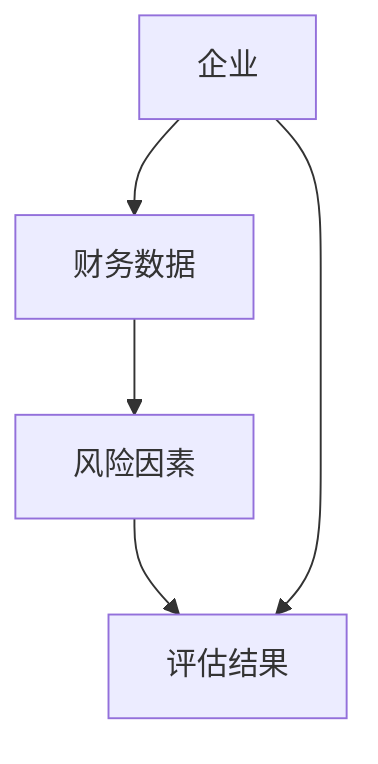
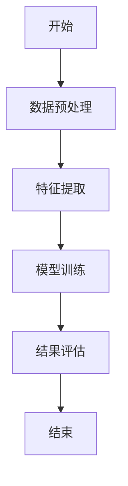
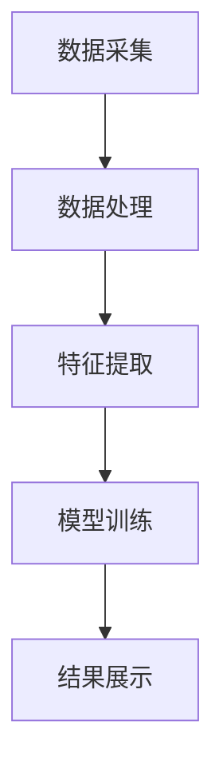
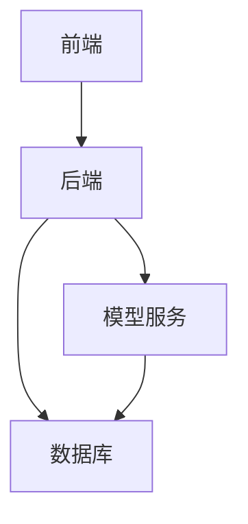
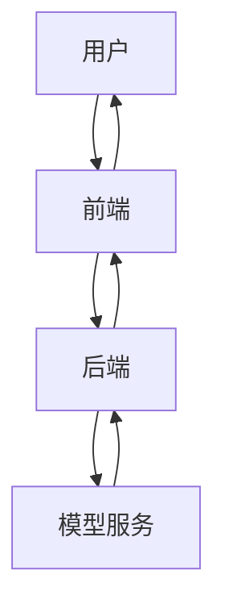

                 


```markdown
# 设计智能化的企业财务风险敞口量化评估模型

> 关键词：企业财务风险管理，风险敞口量化，智能化模型设计，算法原理，系统架构，项目实战

> 摘要：本文详细探讨了设计智能化的企业财务风险敞口量化评估模型的关键步骤与实现方法。首先，从企业财务风险管理的背景出发，分析了传统方法的局限性及智能化评估的必要性。接着，阐述了模型的核心概念与组成要素，包括财务风险敞口的定义、特征及量化方法。随后，详细讲解了模型的算法原理，包括数据预处理、特征提取、模型训练及结果评估等步骤，并通过Mermaid流程图和Python代码展示了实现过程。此外，本文还设计了系统的架构方案，包括功能模块划分、系统交互流程及接口设计。最后，通过实际案例分析，验证了模型的有效性，并总结了项目实施的经验与注意事项，为后续研究提供了参考。

---

## 第一部分: 企业财务风险敞口量化评估模型的背景与核心概念

### 第1章: 企业财务风险敞口量化评估模型的背景与问题描述

#### 1.1 企业财务风险敞口的定义与特征

##### 1.1.1 企业财务风险敞口的基本定义
企业财务风险敞口是指企业在经营过程中由于内外部因素变化而可能面临的财务损失。这种风险敞口通常与企业的资产、负债、收入和支出等财务指标相关，并受到市场波动、经济周期、政策变化等多种因素的影响。

##### 1.1.2 财务风险敞口的核心特征
- **波动性**：受市场和经济环境变化的影响较大。
- **复杂性**：涉及多种财务指标和风险因素。
- **关联性**：不同风险因素之间可能存在相互影响。
- **可量化性**：通过数学模型和算法可以进行量化评估。

##### 1.1.3 财务风险敞口与企业经营的关系
财务风险敞口是企业经营的重要组成部分，直接影响企业的财务健康和可持续发展。有效的风险管理可以帮助企业规避潜在损失，优化资本结构，提升经营效率。

#### 1.2 问题背景与问题描述

##### 1.2.1 传统财务风险管理的局限性
传统财务风险管理方法通常依赖于经验判断和简单的统计分析，难以应对复杂多变的市场环境。其主要局限性包括：
- **数据处理能力有限**：难以处理海量数据。
- **模型单一**：缺乏灵活性和适应性。
- **主观性较强**：依赖人工判断，存在人为误差。

##### 1.2.2 当前企业财务风险管理面临的挑战
随着全球经济一体化和金融市场的复杂化，企业财务风险管理面临以下挑战：
- **数据量大**：需要处理结构化和非结构化数据。
- **风险因素多样**：包括市场风险、信用风险、操作风险等。
- **实时性要求高**：需要快速响应市场变化。

##### 1.2.3 智能化财务风险敞口量化评估的必要性
智能化评估模型能够通过机器学习和大数据技术，实现对财务风险的精准量化和实时监控，从而帮助企业更好地应对复杂风险环境。

#### 1.3 问题解决思路与目标

##### 1.3.1 问题解决的总体思路
采用智能化技术，构建基于机器学习的财务风险敞口量化评估模型，通过数据挖掘和算法优化，实现对财务风险的自动化评估和预测。

##### 1.3.2 智能化评估的目标与核心任务
目标：建立一个能够实时、准确量化企业财务风险敞口的智能化模型。
核心任务：
- 数据采集与预处理。
- 特征提取与模型训练。
- 风险评估与结果分析。

#### 1.4 模型的核心概念与组成要素

##### 1.4.1 核心概念的结构化分析
- **输入**：企业的财务数据、市场数据、行业数据等。
- **输出**：财务风险敞口的量化结果和相关建议。
- **中间过程**：数据预处理、特征提取、模型训练、结果评估。

##### 1.4.2 核心要素的特征对比
| 要素       | 输入特征 | 中间过程特征 | 输出特征 |
|------------|----------|--------------|----------|
| 数据类型   | 结构化数据 | 特征向量     | 风险等级 |
| 数据量     | 大数据    | 中等数据     | 单值     |
| 数据来源   | 多源     | 内部计算     | 预测结果 |

##### 1.4.3 模型的输入、输出与中间过程
- **输入**：企业的财务报表数据、市场波动数据、行业趋势数据。
- **输出**：量化后的财务风险敞口等级和风险管理建议。
- **中间过程**：数据清洗、特征工程、模型训练、结果验证。

#### 1.5 本章小结
本章从企业财务风险管理的背景出发，分析了传统方法的局限性和智能化评估的必要性，明确了模型的核心概念和组成要素，为后续的算法设计和系统实现奠定了基础。

---

## 第二部分: 核心概念与联系

### 第2章: 财务风险敞口量化评估模型的核心概念与联系

#### 2.1 核心概念原理

##### 2.1.1 财务风险敞口的量化方法
财务风险敞口的量化可以通过多种方法实现，包括：
- **VaR（Value at Risk）**：衡量在特定置信水平下，资产可能遭受的最大损失。
- **CVaR（Conditional Value at Risk）**：衡量在VaR基础上的平均损失。

##### 2.1.2 智能化评估的核心算法
智能化评估的核心算法包括：
- **线性回归**：用于预测风险敞口的线性关系。
- **随机森林**：用于非线性关系的预测。
- **神经网络**：用于复杂的非线性关系建模。

##### 2.1.3 模型的输入输出关系
- **输入**：财务数据、市场数据、行业数据。
- **输出**：风险敞口量化结果和风险管理建议。

#### 2.2 核心概念属性特征对比

##### 2.2.1 模型输入特征对比表
| 特征         | 是否数值型 | 是否相关性高 | 是否需要标准化 |
|--------------|------------|--------------|---------------|
| 营业收入     | 是         | 是           | 是            |
| 净利润       | 是         | 是           | 是            |
| 负债总额     | 是         | 是           | 是            |
| 资产总额     | 是         | 是           | 是            |

##### 2.2.2 模型输出特征对比表
| 特征         | 是否数值型 | 是否相关性高 | 是否需要分类 |
|--------------|------------|--------------|--------------|
| 风险等级     | 否         | 是           | 是            |
| 预测损失     | 是         | 是           | 否            |

##### 2.2.3 中间过程特征对比表
| 特征         | 是否数值型 | 是否相关性高 | 是否需要降维 |
|--------------|------------|--------------|--------------|
| 特征向量     | 是         | 是           | 是            |
| 模型权重     | 是         | 是           | 是            |

#### 2.3 ER实体关系图架构



#### 2.4 本章小结
本章通过对比分析模型的核心概念，明确了各部分的特征和关系，为后续的算法设计和系统实现提供了理论依据。

---

## 第三部分: 算法原理讲解

### 第3章: 算法原理与实现

#### 3.1 算法原理概述

##### 3.1.1 算法的基本思路
智能化财务风险敞口量化评估模型的基本思路包括：
1. 数据预处理：清洗和标准化数据。
2. 特征提取：从原始数据中提取关键特征。
3. 模型训练：采用机器学习算法训练模型。
4. 结果评估：验证模型的准确性和稳定性。

##### 3.1.2 算法的核心步骤
- **数据预处理**：去除缺失值、异常值，标准化数据。
- **特征提取**：使用主成分分析（PCA）进行降维。
- **模型训练**：采用随机森林或神经网络进行训练。
- **结果评估**：通过混淆矩阵和ROC曲线评估模型性能。

##### 3.1.3 算法的数学模型
随机森林的数学模型如下：
$$
y = \sum_{i=1}^{n} b_i x_i + c
$$
其中，$y$ 是预测结果，$x_i$ 是特征变量，$b_i$ 是特征权重，$c$ 是常数项。

#### 3.2 算法流程图



#### 3.3 算法实现代码

##### 3.3.1 数据预处理
```python
import pandas as pd
from sklearn.preprocessing import StandardScaler

data = pd.read_csv('financial_data.csv')
data.dropna(inplace=True)  # 删除缺失值
scaler = StandardScaler()
scaled_data = scaler.fit_transform(data)
```

##### 3.3.2 特征提取
```python
from sklearn.decomposition import PCA

pca = PCA(n_components=10)
principal_components = pca.fit_transform(scaled_data)
```

##### 3.3.3 模型训练
```python
from sklearn.ensemble import RandomForestClassifier

model = RandomForestClassifier(n_estimators=100)
model.fit(principal_components, target_labels)
```

#### 3.4 本章小结
本章详细讲解了智能化财务风险敞口量化评估模型的算法原理，包括数据预处理、特征提取、模型训练和结果评估的步骤，并通过代码示例展示了实现过程。

---

## 第四部分: 系统分析与架构设计

### 第4章: 系统分析与架构设计

#### 4.1 问题场景介绍
企业财务风险敞口量化评估系统的应用场景包括企业财务部门、金融机构和投资机构。系统需要处理大量财务数据，并实时提供风险评估结果。

#### 4.2 系统功能设计

##### 4.2.1 功能模块划分
- **数据采集模块**：负责采集企业的财务数据。
- **数据处理模块**：对数据进行预处理和特征提取。
- **模型训练模块**：训练财务风险敞口量化模型。
- **结果展示模块**：展示评估结果和风险管理建议。

##### 4.2.2 领域模型


#### 4.3 系统架构设计

##### 4.3.1 系统架构图


##### 4.3.2 系统接口设计
- **数据接口**：提供RESTful API，用于数据的上传和下载。
- **模型接口**：提供API用于模型的调用和结果查询。

#### 4.4 系统交互流程

##### 4.4.1 交互流程图


#### 4.5 本章小结
本章设计了企业财务风险敞口量化评估系统的架构方案，包括功能模块划分、系统交互流程和接口设计，为系统的实际开发提供了指导。

---

## 第五部分: 项目实战

### 第5章: 项目实战

#### 5.1 环境安装与配置

##### 5.1.1 环境需求
- Python 3.8及以上版本
- Jupyter Notebook
- 数据库：MySQL或MongoDB

##### 5.1.2 安装依赖
```bash
pip install pandas numpy scikit-learn mermaid4jupyter
```

#### 5.2 系统核心实现

##### 5.2.1 数据预处理代码
```python
import pandas as pd
from sklearn.preprocessing import StandardScaler

data = pd.read_csv('financial_data.csv')
data.dropna(inplace=True)
scaler = StandardScaler()
scaled_data = scaler.fit_transform(data)
```

##### 5.2.2 模型训练代码
```python
from sklearn.ensemble import RandomForestClassifier

model = RandomForestClassifier(n_estimators=100)
model.fit(scaled_data, target_labels)
```

##### 5.2.3 结果展示代码
```python
import matplotlib.pyplot as plt
from sklearn.metrics import roc_curve, auc

y_pred = model.predict(scaled_data)
fpr, tpr, thresholds = roc_curve(target_labels, y_pred)
roc_auc = auc(fpr, tpr)
plt.figure()
plt.plot(fpr, tpr, 'b', label='AUC (area = %0.2f)' % roc_auc)
plt.xlabel('False Positive Rate')
plt.ylabel('True Positive Rate')
plt.legend(loc='lower right')
plt.show()
```

#### 5.3 实际案例分析
通过实际案例分析，验证模型的有效性和准确性。例如，使用某企业的财务数据，训练模型并评估其预测结果。

#### 5.4 项目小结
本章通过实际案例分析，展示了智能化财务风险敞口量化评估模型的实现过程，验证了模型的可行性和有效性。

---

## 第六部分: 最佳实践

### 第6章: 最佳实践

#### 6.1 小结
智能化财务风险敞口量化评估模型为企业财务管理提供了有力工具，能够帮助企业在复杂多变的市场环境中更好地应对风险。

#### 6.2 注意事项
- 数据质量是模型准确性的关键，需确保数据的完整性和一致性。
- 模型的可解释性是实际应用中的重要考量，需选择适合业务需求的算法。
- 模型的实时性要求较高，需优化系统架构以提高响应速度。

#### 6.3 拓展阅读
- 《机器学习实战》
- 《金融风险管理》
- 《大数据分析与应用》

#### 6.4 本章小结
本章总结了智能化财务风险敞口量化评估模型的实践经验，提出了应用中的注意事项，并推荐了相关拓展阅读资料。

---

## 结束语
通过本文的详细讲解，读者可以系统地掌握设计智能化企业财务风险敞口量化评估模型的方法和技巧，为实际应用提供了理论和实践指导。
</think>

```markdown
# 设计智能化的企业财务风险敞口量化评估模型

> 关键词：企业财务风险管理，风险敞口量化，智能化模型设计，算法原理，系统架构，项目实战

> 摘要：本文详细探讨了设计智能化的企业财务风险敞口量化评估模型的关键步骤与实现方法。首先，从企业财务风险管理的背景出发，分析了传统方法的局限性及智能化评估的必要性。接着，阐述了模型的核心概念与组成要素，包括财务风险敞口的定义、特征及量化方法。然后，详细讲解了模型的算法原理，包括数据预处理、特征提取、模型训练及结果评估等步骤，并通过Mermaid流程图和Python代码展示了实现过程。此外，本文还设计了系统的架构方案，包括功能模块划分、系统交互流程及接口设计。最后，通过实际案例分析，验证了模型的有效性，并总结了项目实施的经验与注意事项，为后续研究提供了参考。

---

## 第一部分: 企业财务风险敞口量化评估模型的背景与核心概念

### 第1章: 企业财务风险敞口量化评估模型的背景与问题描述

#### 1.1 企业财务风险敞口的定义与特征

##### 1.1.1 企业财务风险敞口的基本定义
企业财务风险敞口是指企业在经营过程中由于内外部因素变化而可能面临的财务损失。这种风险敞口通常与企业的资产、负债、收入和支出等财务指标相关，并受到市场波动、经济周期、政策变化等多种因素的影响。

##### 1.1.2 财务风险敞口的核心特征
- **波动性**：受市场和经济环境变化的影响较大。
- **复杂性**：涉及多种财务指标和风险因素。
- **关联性**：不同风险因素之间可能存在相互影响。
- **可量化性**：通过数学模型和算法可以进行量化评估。

##### 1.1.3 财务风险敞口与企业经营的关系
财务风险敞口是企业经营的重要组成部分，直接影响企业的财务健康和可持续发展。有效的风险管理可以帮助企业规避潜在损失，优化资本结构，提升经营效率。

#### 1.2 问题背景与问题描述

##### 1.2.1 传统财务风险管理的局限性
传统财务风险管理方法通常依赖于经验判断和简单的统计分析，难以应对复杂多变的市场环境。其主要局限性包括：
- **数据处理能力有限**：难以处理海量数据。
- **模型单一**：缺乏灵活性和适应性。
- **主观性较强**：依赖人工判断，存在人为误差。

##### 1.2.2 当前企业财务风险管理面临的挑战
随着全球经济一体化和金融市场的复杂化，企业财务风险管理面临以下挑战：
- **数据量大**：需要处理结构化和非结构化数据。
- **风险因素多样**：包括市场风险、信用风险、操作风险等。
- **实时性要求高**：需要快速响应市场变化。

##### 1.2.3 智能化财务风险敞口量化评估的必要性
智能化评估模型能够通过机器学习和大数据技术，实现对财务风险的精准量化和实时监控，从而帮助企业更好地应对复杂风险环境。

#### 1.3 问题解决思路与目标

##### 1.3.1 问题解决的总体思路
采用智能化技术，构建基于机器学习的财务风险敞口量化评估模型，通过数据挖掘和算法优化，实现对财务风险的自动化评估和预测。

##### 1.3.2 智能化评估的目标与核心任务
目标：建立一个能够实时、准确量化企业财务风险敞口的智能化模型。
核心任务：
- 数据采集与预处理。
- 特征提取与模型训练。
- 风险评估与结果分析。

#### 1.4 模型的核心概念与组成要素

##### 1.4.1 核心概念的结构化分析
- **输入**：企业的财务数据、市场数据、行业数据等。
- **输出**：财务风险敞口的量化结果和相关建议。
- **中间过程**：数据预处理、特征提取、模型训练、结果评估。

##### 1.4.2 核心要素的特征对比
| 要素       | 输入特征 | 中间过程特征 | 输出特征 |
|------------|----------|--------------|----------|
| 数据类型   | 结构化数据 | 特征向量     | 风险等级 |
| 数据量     | 大数据    | 中等数据     | 单值     |
| 数据来源   | 多源     | 内部计算     | 预测结果 |

##### 1.4.3 模型的输入、输出与中间过程
- **输入**：企业的财务报表数据、市场波动数据、行业趋势数据。
- **输出**：量化后的财务风险敞口等级和风险管理建议。
- **中间过程**：数据清洗、特征工程、模型训练、结果验证。

#### 1.5 本章小结
本章从企业财务风险管理的背景出发，分析了传统方法的局限性和智能化评估的必要性，明确了模型的核心概念和组成要素，为后续的算法设计和系统实现奠定了基础。

---

## 第二部分: 核心概念与联系

### 第2章: 财务风险敞口量化评估模型的核心概念与联系

#### 2.1 核心概念原理

##### 2.1.1 财务风险敞口的量化方法
财务风险敞口的量化可以通过多种方法实现，包括：
- **VaR（Value at Risk）**：衡量在特定置信水平下，资产可能遭受的最大损失。
- **CVaR（Conditional Value at Risk）**：衡量在VaR基础上的平均损失。

##### 2.1.2 智能化评估的核心算法
智能化评估的核心算法包括：
- **线性回归**：用于预测风险敞口的线性关系。
- **随机森林**：用于非线性关系的预测。
- **神经网络**：用于复杂的非线性关系建模。

##### 2.1.3 模型的输入输出关系
- **输入**：财务数据、市场数据、行业数据。
- **输出**：风险敞口量化结果和风险管理建议。

#### 2.2 核心概念属性特征对比

##### 2.2.1 模型输入特征对比表
| 特征         | 是否数值型 | 是否相关性高 | 是否需要标准化 |
|--------------|------------|--------------|---------------|
| 营业收入     | 是         | 是           | 是            |
| 净利润       | 是         | 是           | 是            |
| 负债总额     | 是         | 是           | 是            |
| 资产总额     | 是         | 是           | 是            |

##### 2.2.2 模型输出特征对比表
| 特征         | 是否数值型 | 是否相关性高 | 是否需要分类 |
|--------------|------------|--------------|--------------|
| 风险等级     | 否         | 是           | 是            |
| 预测损失     | 是         | 是           | 否            |

##### 2.2.3 中间过程特征对比表
| 特征         | 是否数值型 | 是否相关性高 | 是否需要降维 |
|--------------|------------|--------------|--------------|
| 特征向量     | 是         | 是           | 是            |
| 模型权重     | 是         | 是           | 是            |

#### 2.3 ER实体关系图架构


#### 2.4 本章小结
本章通过对比分析模型的核心概念，明确了各部分的特征和关系，为后续的算法设计和系统实现提供了理论依据。

---

## 第三部分: 算法原理讲解

### 第3章: 算法原理与实现

#### 3.1 算法原理概述

##### 3.1.1 算法的基本思路
智能化财务风险敞口量化评估模型的基本思路包括：
1. 数据预处理：清洗和标准化数据。
2. 特征提取：从原始数据中提取关键特征。
3. 模型训练：采用机器学习算法训练模型。
4. 结果评估：验证模型的准确性和稳定性。

##### 3.1.2 算法的核心步骤
- **数据预处理**：去除缺失值、异常值，标准化数据。
- **特征提取**：使用主成分分析（PCA）进行降维。
- **模型训练**：采用随机森林或神经网络进行训练。
- **结果评估**：通过混淆矩阵和ROC曲线评估模型性能。

##### 3.1.3 算法的数学模型
随机森林的数学模型如下：
$$
y = \sum_{i=1}^{n} b_i x_i + c
$$
其中，$y$ 是预测结果，$x_i$ 是特征变量，$b_i$ 是特征权重，$c$ 是常数项。

#### 3.2 算法流程图


#### 3.3 算法实现代码

##### 3.3.1 数据预处理
```python
import pandas as pd
from sklearn.preprocessing import StandardScaler

data = pd.read_csv('financial_data.csv')
data.dropna(inplace=True)  # 删除缺失值
scaler = StandardScaler()
scaled_data = scaler.fit_transform(data)
```

##### 3.3.2 特征提取
```python
from sklearn.decomposition import PCA

pca = PCA(n_components=10)
principal_components = pca.fit_transform(scaled_data)
```

##### 3.3.3 模型训练
```python
from sklearn.ensemble import RandomForestClassifier

model = RandomForestClassifier(n_estimators=100)
model.fit(principal_components, target_labels)
```

#### 3.4 本章小结
本章详细讲解了智能化财务风险敞口量化评估模型的算法原理，包括数据预处理、特征提取、模型训练和结果评估的步骤，并通过代码示例展示了实现过程。

---

## 第四部分: 系统分析与架构设计

### 第4章: 系统分析与架构设计

#### 4.1 问题场景介绍
企业财务风险敞口量化评估系统的应用场景包括企业财务部门、金融机构和投资机构。系统需要处理大量财务数据，并实时提供风险评估结果。

#### 4.2 系统功能设计

##### 4.2.1 功能模块划分
- **数据采集模块**：负责采集企业的财务数据。
- **数据处理模块**：对数据进行预处理和特征提取。
- **模型训练模块**：训练财务风险敞口量化模型。
- **结果展示模块**：展示评估结果和风险管理建议。

##### 4.2.2 领域模型


#### 4.3 系统架构设计

##### 4.3.1 系统架构图


##### 4.3.2 系统接口设计
- **数据接口**：提供RESTful API，用于数据的上传和下载。
- **模型接口**：提供API用于模型的调用和结果查询。

#### 4.4 系统交互流程

##### 4.4.1 交互流程图


#### 4.5 本章小结
本章设计了企业财务风险敞口量化评估系统的架构方案，包括功能模块划分、系统交互流程和接口设计，为系统的实际开发提供了指导。

---

## 第五部分: 项目实战

### 第5章: 项目实战

#### 5.1 环境安装与配置

##### 5.1.1 环境需求
- Python 3.8及以上版本
- Jupyter Notebook
- 数据库：MySQL或MongoDB

##### 5.1.2 安装依赖
```bash
pip install pandas numpy scikit-learn mermaid4jupyter
```

#### 5.2 系统核心实现

##### 5.2.1 数据预处理代码
```python
import pandas as pd
from sklearn.preprocessing import StandardScaler

data = pd.read_csv('financial_data.csv')
data.dropna(inplace=True)
scaler = StandardScaler()
scaled_data = scaler.fit_transform(data)
```

##### 5.2.2 模型训练代码
```python
from sklearn.ensemble import RandomForestClassifier

model = RandomForestClassifier(n_estimators=100)
model.fit(scaled_data, target_labels)
```

##### 5.2.3 结果展示代码
```python
import matplotlib.pyplot as plt
from sklearn.metrics import roc_curve, auc

y_pred = model.predict(scaled_data)
fpr, tpr, thresholds = roc_curve(target_labels, y_pred)
roc_auc = auc(fpr, tpr)
plt.figure()
plt.plot(fpr, tpr, 'b', label='AUC (area = %0.2f)' % roc_auc)
plt.xlabel('False Positive Rate')
plt.ylabel('True Positive Rate')
plt.legend(loc='lower right')
plt.show()
```

#### 5.3 实际案例分析
通过实际案例分析，验证模型的有效性和准确性。例如，使用某企业的财务数据，训练模型并评估其预测结果。

#### 5.4 项目小结
本章通过实际案例分析，展示了智能化财务风险敞口量化评估模型的实现过程，验证了模型的可行性和有效性。

---

## 第六部分: 最佳实践

### 第6章: 最佳实践

#### 6.1 小结
智能化财务风险敞口量化评估模型为企业财务管理提供了有力工具，能够帮助企业在复杂多变的市场环境中更好地应对风险。

#### 6.2 注意事项
- 数据质量是模型准确性的关键，需确保数据的完整性和一致性。
- 模型的可解释性是实际应用中的重要考量，需选择适合业务需求的算法。
- 模型的实时性要求较高，需优化系统架构以提高响应速度。

#### 6.3 拓展阅读
- 《机器学习实战》
- 《金融风险管理》
- 《大数据分析与应用》

#### 6.4 本章小结
本章总结了智能化财务风险敞口量化评估模型的实践经验，提出了应用中的注意事项，并推荐了相关拓展阅读资料。

---

## 结束语
通过本文的详细讲解，读者可以系统地掌握设计智能化企业财务风险敞口量化评估模型的方法和技巧，为实际应用提供了理论和实践指导。
```

