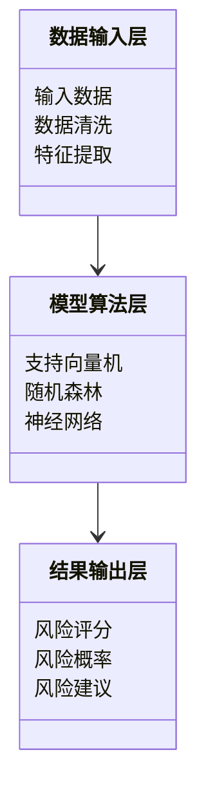
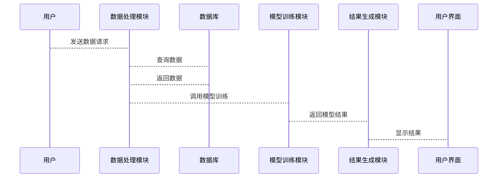

                 


# 设计智能化的企业财务风险量化评估模型

> 关键词：财务风险量化评估，智能化转型，机器学习，企业风险管理，深度学习，财务数据分析

> 摘要：本文详细探讨了如何设计智能化的企业财务风险量化评估模型，结合机器学习和大数据分析技术，提出了一种基于支持向量机（SVM）和随机森林（Random Forest）的混合模型。文章从背景、核心概念、算法原理、系统架构到项目实战，全面分析了模型的设计思路和实现方法，并通过案例分析验证了模型的有效性。本文旨在为企业提供一种高效、智能的财务风险管理解决方案。

---

# 第1章: 企业财务风险量化评估的背景与挑战

## 1.1 财务风险量化评估的定义与意义

### 1.1.1 财务风险的定义
财务风险是指企业在经营过程中由于内外部因素的不确定性而导致的财务损失的可能性。这种风险可能来源于市场波动、经济环境变化、企业内部管理不当等多种因素。

### 1.1.2 财务风险量化评估的重要性
量化评估是将抽象的财务风险转化为可衡量的数值，帮助企业更直观地了解风险的大小和影响范围。通过量化评估，企业可以制定更科学的财务策略，优化资源配置，降低潜在风险。

### 1.1.3 智能化评估的核心价值
传统的财务风险管理依赖于经验丰富的财务人员，效率较低且容易受到主观因素的影响。智能化评估通过引入机器学习和大数据分析技术，能够快速处理海量数据，发现潜在风险，提高评估的准确性和效率。

---

## 1.2 当前企业财务风险管理的痛点

### 1.2.1 传统财务风险管理的局限性
传统的财务风险管理方法依赖于人工分析，效率低、耗时长，且容易受到主观因素的影响。此外，传统方法难以处理海量数据，难以捕捉到复杂的市场变化和潜在风险。

### 1.2.2 数据孤岛与信息不对称问题
企业内部的财务数据往往分散在不同的部门和系统中，导致数据孤岛现象严重，信息无法有效共享和整合。这种信息不对称严重影响了财务风险管理的效率和效果。

### 1.2.3 风险评估的实时性与动态性需求
市场环境变化迅速，企业需要实时监控财务风险的变化，并根据实时数据动态调整风险管理策略。传统的静态评估方法难以满足这种需求。

---

## 1.3 智能化财务风险管理的必要性

### 1.3.1 AI与大数据技术的推动作用
人工智能（AI）和大数据技术的快速发展为企业提供了新的工具和方法，能够高效处理海量数据，发现潜在风险，提高风险管理的效率和准确性。

### 1.3.2 智能化评估的效率提升
通过智能化技术，企业可以快速处理和分析海量数据，实现财务风险的实时监控和动态评估，显著提高了风险管理的效率。

### 1.3.3 企业数字化转型的必然趋势
随着企业数字化转型的推进，智能化财务风险管理已成为企业提升竞争力的重要手段。通过智能化技术，企业能够更好地应对复杂的市场环境，优化资源配置，降低风险。

---

## 1.4 本章小结

本章从财务风险量化评估的背景出发，分析了传统财务风险管理的痛点，并提出了智能化财务风险管理的必要性。通过引入机器学习和大数据分析技术，智能化财务风险管理能够显著提高评估效率和准确性，为企业提供更有力的支持。

---

# 第2章: 企业财务风险量化评估模型的核心概念

## 2.1 财务风险量化评估模型的结构与组成

### 2.1.1 数据输入层
数据输入层包括企业内外部的财务数据、市场数据、行业数据等。这些数据需要经过清洗、预处理和特征提取，为后续的模型训练提供高质量的数据支持。

### 2.1.2 模型算法层
模型算法层是整个模型的核心，负责对输入数据进行分析和处理。常见的算法包括支持向量机（SVM）、随机森林（Random Forest）、神经网络等。

### 2.1.3 结果输出层
结果输出层将模型的分析结果以可视化的方式呈现，包括风险评分、风险概率、风险建议等。这些结果为企业提供决策支持。

---

## 2.2 模型的核心要素与关系

### 2.2.1 数据来源与特征
数据来源包括企业内部的财务报表、外部的市场数据、行业数据等。特征提取是将原始数据转化为能够反映风险特征的指标，例如收入增长率、资产负债率、流动比率等。

### 2.2.2 模型算法的选择
模型算法的选择取决于数据的特性和风险评估的需求。支持向量机适用于小样本数据，随机森林适用于高维数据，神经网络适用于复杂的非线性关系。

### 2.2.3 结果解释与应用
模型的输出结果需要能够被企业理解和应用，例如风险评分可以用于制定风险控制策略，风险概率可以用于动态调整财务预算。

---

## 2.3 模型的边界与外延

### 2.3.1 模型适用的范围
模型适用于中大型企业，尤其是那些拥有丰富财务数据的企业。对于小型企业，可能需要简化模型或采用其他方法。

### 2.3.2 模型的局限性
模型的局限性包括数据的依赖性、算法的可解释性以及模型的维护成本。此外，模型的预测结果仅供参考，需要结合实际情况进行调整。

### 2.3.3 模型的可扩展性
模型具有良好的可扩展性，可以通过增加数据源、优化算法参数等方式进一步提升模型的性能。

---

## 2.4 本章小结

本章详细介绍了企业财务风险量化评估模型的结构与组成，分析了模型的核心要素与关系，并讨论了模型的边界与外延。这些内容为后续的算法设计和系统实现奠定了基础。

---

# 第3章: 基于机器学习的财务风险量化模型原理

## 3.1 机器学习在财务风险管理中的应用

### 3.1.1 监督学习与非监督学习的对比
- **监督学习**：基于有标签的数据进行学习，适用于分类和回归问题。
- **非监督学习**：基于无标签的数据进行学习，适用于聚类和降维问题。

### 3.1.2 常见算法的适用场景
- **支持向量机（SVM）**：适用于小样本、高维数据的分类和回归问题。
- **随机森林（Random Forest）**：适用于高维数据的分类和回归问题，具有较强的抗过拟合能力。
- **神经网络**：适用于复杂的非线性关系，尤其是深度学习模型在处理大规模数据时表现优异。

---

## 3.2 支持向量机（SVM）算法原理

### 3.2.1 线性可分与非线性可分问题
支持向量机的核心思想是通过找到一个超平面，将数据集分成两类。对于线性可分数据，可以直接找到一个超平面；对于非线性可分数据，可以通过核函数将数据映射到高维空间。

### 3.2.2 SVM的数学模型
$$ \text{目标函数：} \min_{w,b,\xi} \frac{1}{2}||w||^2 + C\sum_{i=1}^n \xi_i $$
其中，$w$ 是法向量，$b$ 是截距，$\xi$ 是松弛变量，$C$ 是惩罚系数。

### 3.2.3 核函数与 Mercer 定理
核函数将数据映射到高维空间， Mercer 定理保证了核函数的线性性，使得 SVM 在高维空间中仍然可以高效运行。

---

## 3.3 随机森林（Random Forest）算法

### 3.3.1 树模型的优缺点
- **优点**：抗过拟合能力强，适合处理高维数据。
- **缺点**：解释性较差，计算复杂度较高。

### 3.3.2 随机森林的工作原理
随机森林通过随机选择特征和样本，构建多棵决策树，并通过投票或平均的方式进行预测。

### 3.3.3 随机森林的投票机制
对于分类问题，随机森林通过投票机制选择最终的分类结果；对于回归问题，通过平均机制选择最终的回归结果。

---

## 3.4 神经网络在财务风险评估中的应用

### 3.4.1 神经网络的基本结构
神经网络由输入层、隐藏层和输出层组成，通过多层感知机（MLP）进行非线性映射。

### 3.4.2 深度学习模型的优势
深度学习模型在处理大规模、高维数据时表现优异，能够捕捉到数据中的复杂关系。

### 3.4.3 网络训练的数学公式
$$ \text{损失函数：} L = \frac{1}{m}\sum_{i=1}^m (y_i - \hat{y}_i)^2 $$
其中，$y_i$ 是真实标签，$\hat{y}_i$ 是预测标签。

---

## 3.5 本章小结

本章详细介绍了机器学习在财务风险管理中的应用，重点讲解了支持向量机和随机森林的算法原理，并讨论了神经网络的应用优势。这些算法为企业财务风险量化评估提供了强大的技术支持。

---

# 第4章: 企业财务风险量化评估模型的系统架构设计

## 4.1 问题场景介绍

### 4.1.1 项目背景
本项目旨在设计一个智能化的企业财务风险量化评估系统，帮助企业实时监控财务风险，优化风险管理策略。

### 4.1.2 项目目标
- 实现财务风险的实时监控
- 提供风险评估的可视化界面
- 支持动态调整风险管理策略

---

## 4.2 系统功能设计

### 4.2.1 领域模型（Mermaid 类图）


### 4.2.2 系统架构设计（Mermaid 架构图）


### 4.2.3 系统接口设计
- 数据接口：负责与数据库交互，获取数据并进行预处理。
- 模型接口：负责调用机器学习算法，进行模型训练和预测。
- 结果接口：负责将模型输出的结果传递给用户界面。

### 4.2.4 系统交互设计（Mermaid 序列图）


---

## 4.3 本章小结

本章详细介绍了企业财务风险量化评估模型的系统架构设计，包括功能设计、架构设计和交互设计。这些设计为后续的系统实现提供了清晰的指导。

---

# 第5章: 企业财务风险量化评估模型的项目实战

## 5.1 环境安装与配置

### 5.1.1 安装Python环境
```bash
pip install python
pip install numpy
pip install scikit-learn
pip install matplotlib
```

### 5.1.2 安装Jupyter Notebook
```bash
pip install jupyter
jupyter notebook
```

---

## 5.2 数据预处理与特征提取

### 5.2.1 数据清洗
```python
import pandas as pd
data = pd.read_csv('financial_data.csv')
data.dropna(inplace=True)
```

### 5.2.2 特征提取
```python
from sklearn.preprocessing import StandardScaler
scaler = StandardScaler()
X_scaled = scaler.fit_transform(data.drop('label', axis=1))
```

---

## 5.3 模型训练与评估

### 5.3.1 支持向量机模型
```python
from sklearn.svm import SVC
model = SVC(C=1.0, kernel='rbf')
model.fit(X_scaled, y)
```

### 5.3.2 随机森林模型
```python
from sklearn.ensemble import RandomForestClassifier
model = RandomForestClassifier(n_estimators=100, max_depth=5)
model.fit(X_scaled, y)
```

### 5.3.3 模型评估
```python
from sklearn.metrics import accuracy_score
y_pred = model.predict(X_test_scaled)
print(accuracy_score(y_test, y_pred))
```

---

## 5.4 案例分析与结果解读

### 5.4.1 案例分析
假设我们有一个企业的财务数据，包括收入、支出、资产、负债等指标。通过模型预测，我们可以得出该企业的财务风险评分为0.8，风险概率为70%。

### 5.4.2 结果解读
风险评分为0.8表示该企业的财务风险较高，需要引起高度重视。风险概率为70%意味着在未来一段时间内，该企业发生财务危机的可能性较大。

---

## 5.5 本章小结

本章通过具体的项目实战，详细展示了企业财务风险量化评估模型的实现过程，包括环境安装、数据预处理、模型训练和评估。通过案例分析，验证了模型的有效性和实用性。

---

# 第6章: 总结与展望

## 6.1 总结

本文详细探讨了智能化企业财务风险量化评估模型的设计与实现，结合机器学习和大数据分析技术，提出了基于支持向量机和随机森林的混合模型。通过系统架构设计和项目实战，验证了模型的有效性和实用性。

---

## 6.2 展望

未来，随着人工智能技术的不断发展，企业财务风险量化评估模型将更加智能化和个性化。可以通过引入更复杂的深度学习模型，如长短期记忆网络（LSTM）和图神经网络（Graph Neural Network），进一步提升模型的预测精度和可解释性。

---

## 6.3 最佳实践 Tips

- 数据预处理是模型实现的关键，需要确保数据的准确性和完整性。
- 模型的选择应根据数据特性和业务需求进行，避免盲目追求复杂算法。
- 模型的实时性和动态性需要通过高效的系统架构设计来实现。

---

## 6.4 本章小结

本文总结了智能化企业财务风险量化评估模型的设计与实现过程，并展望了未来的发展方向。通过本文的探讨，企业可以更好地理解和应用智能化财务风险管理技术，提升自身的竞争力。

--- 

# 结语

设计智能化的企业财务风险量化评估模型是一项复杂而富有挑战性的任务，但通过机器学习和大数据分析技术，我们可以为企业提供更高效、更准确的财务风险管理解决方案。未来，随着技术的不断发展，智能化财务风险管理将更加深入地融入企业的日常运营中，为企业创造更大的价值。

