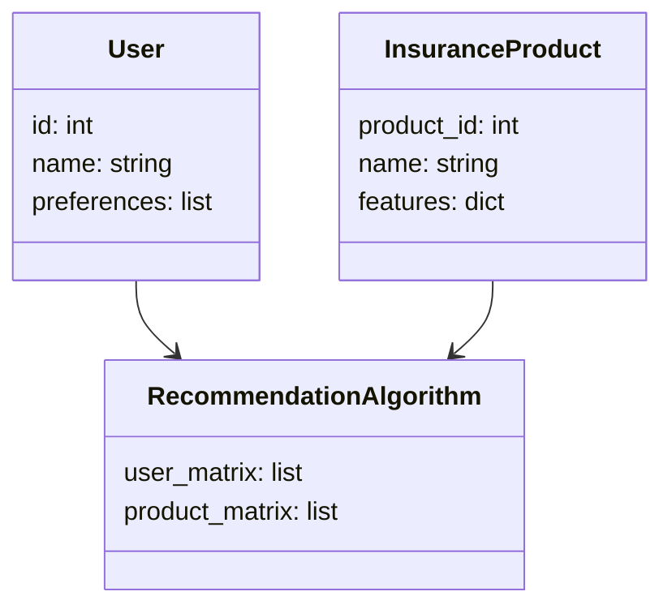
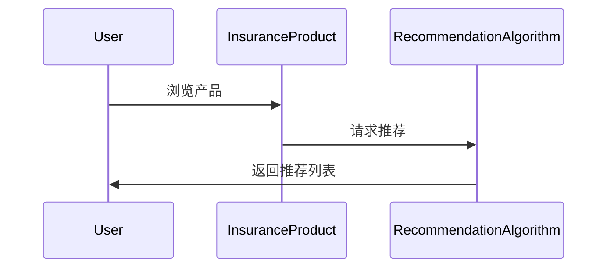

                 


# 设计智能化的保险产品推荐系统

> 关键词：保险产品推荐系统、人工智能、大数据分析、机器学习、协同过滤、深度学习、用户画像

> 摘要：本文详细探讨了设计智能化保险产品推荐系统的各个方面，包括背景分析、核心概念、推荐算法原理、系统架构设计以及实际案例分析。通过结合人工智能和大数据技术，本文提出了基于协同过滤、内容推荐和深度学习的混合推荐模型，旨在为保险行业提供高效的智能化推荐解决方案。

---

## 第1章: 背景介绍与核心概念

### 1.1 保险行业的数字化转型

#### 1.1.1 保险行业的现状与挑战
保险行业正面临着数字化转型的压力。传统保险业务依赖人工销售和单一的产品推荐方式，难以满足日益多样化的客户需求。市场竞争的加剧和客户需求的变化要求保险公司必须采用更智能化的推荐系统。

#### 1.1.2 数字化转型的必要性
数字化转型不仅是技术发展的趋势，更是提升客户体验和提高销售效率的关键。通过智能化推荐系统，保险公司可以更精准地匹配客户需求，提高客户满意度和忠诚度。

#### 1.1.3 智能化推荐系统的角色
智能化推荐系统在保险行业的应用可以提高推荐效率、降低销售成本，并为客户提供个性化的保险产品组合。

### 1.2 保险产品推荐系统的必要性

#### 1.2.1 保险产品的复杂性
保险产品种类繁多，涵盖健康险、寿险、车险等多种类型，每种产品都有其独特的风险评估和保障范围。

#### 1.2.2 用户需求的多样性
用户在选择保险产品时，关注点可能包括保费、保障范围、赔付比例等多个维度，不同用户的需求差异较大。

#### 1.2.3 提高推荐效率的重要性
传统的保险销售模式依赖销售人员的经验判断，效率低下且容易受到主观因素的影响。智能化推荐系统可以显著提高推荐效率和准确性。

### 1.3 传统推荐系统与智能化推荐的对比

#### 1.3.1 传统推荐系统的特点
传统推荐系统通常基于规则或简单的统计分析，难以应对复杂多变的客户需求。

#### 1.3.2 智能化推荐的核心优势
智能化推荐系统利用人工智能和大数据分析技术，能够实时分析用户行为和产品特征，提供更加精准和个性化的推荐。

#### 1.3.3 保险推荐系统的核心要素
保险推荐系统的核心要素包括用户画像、产品画像、推荐算法和反馈机制。

---

## 第2章: 智能化保险产品推荐系统的核心概念

### 2.1 用户画像与行为分析

#### 2.1.1 用户画像的定义
用户画像是基于用户的基本信息、历史行为和偏好构建的用户特征模型。

#### 2.1.2 用户行为的分类
用户行为可以分为显性行为（如点击、购买）和隐性行为（如浏览、停留时间）。

#### 2.1.3 用户画像的构建方法
用户画像是通过收集和分析用户数据，利用聚类、分类等机器学习算法构建而成。

### 2.2 保险产品的特征分析

#### 2.2.1 产品属性的定义
保险产品的属性包括保费、保障范围、赔付比例、保险期限等。

#### 2.2.2 产品风险的评估
产品风险评估是基于历史数据和市场表现，对产品的稳定性进行评估。

#### 2.2.3 产品市场的分析
产品市场的分析包括市场规模、竞争对手分析和用户需求分析。

### 2.3 推荐算法的核心原理

#### 2.3.1 协同过滤算法
协同过滤算法基于用户行为数据，找到与目标用户相似的用户群体，推荐相似产品。

#### 2.3.2 基于内容的推荐
基于内容的推荐算法通过分析产品特征，找到与目标用户需求最匹配的产品。

#### 2.3.3 混合推荐模型
混合推荐模型结合协同过滤和内容推荐的优势，通过加权融合提高推荐准确性。

### 2.4 保险推荐系统的实体关系图

```mermaid
er
    actor User
    actor InsuranceProduct
    actor RecommendationAlgorithm
    relation "推荐" User ----> RecommendationAlgorithm
    relation "适用" InsuranceProduct ----> RecommendationAlgorithm
```

---

## 第3章: 推荐算法的原理与实现

### 3.1 协同过滤算法

#### 3.1.1 基于用户的协同过滤
基于用户的协同过滤算法通过计算用户之间的相似度，推荐相似用户的购买或浏览行为。

#### 3.1.2 基于物品的协同过滤
基于物品的协同过滤算法通过分析产品之间的相似性，推荐目标用户可能感兴趣的产品。

#### 3.1.3 混合协同过滤的实现
混合协同过滤通过结合用户和产品的双重信息，构建更加全面的推荐模型。

### 3.2 基于内容的推荐算法

#### 3.2.1 文本特征提取
文本特征提取通过自然语言处理技术，提取产品描述中的关键词和语义信息。

#### 3.2.2 余弦相似度计算
余弦相似度计算用于衡量两个文本之间的相似程度。

#### 3.2.3 内容相似度的应用
内容相似度应用于产品推荐，确保推荐的产品与用户需求高度匹配。

### 3.3 深度学习推荐模型

#### 3.3.1 神经网络的构建
深度学习推荐模型通过构建神经网络，自动学习用户和产品的特征表示。

#### 3.3.2 Word2Vec在推荐中的应用
Word2Vec用于将文本数据转化为向量表示，提高推荐系统的语义理解能力。

#### 3.3.3 卷积神经网络的实现
卷积神经网络用于提取产品描述中的深层特征，提升推荐系统的准确性。

### 3.4 算法实现的Python代码

```python
from sklearn.metrics.pairwise import cosine_similarity

# 示例：基于协同过滤的推荐算法
def collaborative_filtering(user_matrix):
    # 计算用户相似度
    similarity = cosine_similarity(user_matrix)
    # 找到最相似的用户
    top_similar_users = similarity.argsort()[:, ::-1]
    return top_similar_users
```

---

## 第4章: 系统分析与架构设计方案

### 4.1 问题场景介绍

#### 4.1.1 保险产品的推荐场景
保险产品的推荐场景包括用户访问保险网站、移动应用或保险销售平台。

#### 4.1.2 用户行为分析
通过分析用户的浏览、点击和购买行为，构建用户画像和产品画像。

#### 4.1.3 系统功能需求
系统需要实现用户注册、登录、产品浏览、推荐展示和购买功能。

### 4.2 系统功能设计

#### 4.2.1 领域模型设计


#### 4.2.2 系统架构设计


#### 4.2.3 系统接口设计
系统接口包括用户信息接口、产品信息接口和推荐结果接口。

#### 4.2.4 系统交互流程


---

## 第5章: 项目实战

### 5.1 环境安装

#### 5.1.1 安装Python和相关库
安装Python和scikit-learn、pandas等机器学习库。

#### 5.1.2 数据准备
收集用户行为数据和保险产品数据，构建数据集。

### 5.2 系统核心实现

#### 5.2.1 推荐算法实现
实现协同过滤和基于内容的推荐算法，并进行性能测试。

#### 5.2.2 代码实现与解读
```python
from sklearn.metrics.pairwise import cosine_similarity

# 协同过滤算法实现
def collaborative_filtering(user_matrix):
    similarity = cosine_similarity(user_matrix)
    top_similar_users = similarity.argsort()[:, ::-1]
    return top_similar_users
```

#### 5.2.3 系统功能实现
实现用户注册、登录、产品推荐和购买功能。

### 5.3 实际案例分析

#### 5.3.1 案例背景
以健康险推荐为例，分析用户的健康状况和保险需求。

#### 5.3.2 数据分析
通过数据分析，提取用户特征和产品特征。

#### 5.3.3 推荐结果展示
展示推荐列表和推荐理由，验证推荐算法的有效性。

### 5.4 项目总结

#### 5.4.1 项目成功的关键点
数据质量、算法选择和系统架构设计是项目成功的关键。

#### 5.4.2 项目可能遇到的问题
数据缺失、算法性能瓶颈和用户隐私保护是需要重点关注的问题。

---

## 第6章: 最佳实践与未来展望

### 6.1 本章小结
总结智能化保险产品推荐系统的实现过程和关键点。

### 6.2 注意事项
在实际应用中，需要注意数据隐私保护和算法的可解释性。

### 6.3 未来趋势
未来，随着人工智能和大数据技术的不断发展，保险推荐系统将更加智能化和个性化。

### 6.4 拓展阅读
推荐相关书籍和论文，供读者进一步学习和研究。

---

# 作者简介
作者是[您的姓名]，一位在人工智能和大数据领域有丰富经验的技术专家，致力于通过技术手段推动保险行业的智能化发展。

---

# 结语
智能化保险产品推荐系统的建设是一个复杂的工程，需要结合多种技术手段和业务需求。希望本文能够为读者提供有价值的参考和启发，帮助他们在设计智能化推荐系统时少走弯路，提高效率。

