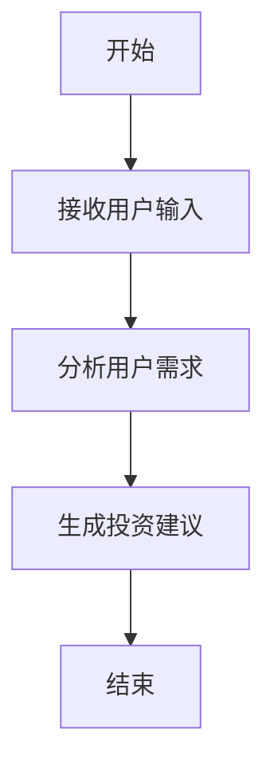

                 


# 设计直观易用的投资理财智能助手用户界面

> 关键词：投资理财，用户界面设计，用户体验优化，信息架构，交互设计，人工智能算法

> 摘要：本文旨在探讨如何设计直观易用的投资理财智能助手用户界面。通过分析用户需求、信息架构和交互设计的核心原理，结合实际案例和最佳实践，为设计人员和开发人员提供系统的指导。文章从背景与重要性入手，深入解析核心概念与算法原理，结合系统架构设计和项目实战，最终总结出一套完整的设计方法论。

---

## 第一部分：投资理财智能助手用户界面设计背景与重要性

### 第1章：投资理财智能助手的背景与重要性

#### 1.1 问题背景与目标
##### 1.1.1 投资理财领域的用户需求分析
投资理财领域涉及复杂的金融知识，用户通常希望快速获取信息、制定决策并执行操作。然而，复杂的金融术语和多样化的理财产品常常让用户感到困惑。因此，设计一个直观易用的智能助手界面至关重要。

##### 1.1.2 智能助手在投资理财中的作用
智能助手通过自然语言处理、数据可视化和个性化推荐，帮助用户快速理解市场动态、评估投资组合并制定策略。它能够简化复杂的金融信息，提升用户体验。

##### 1.1.3 设计直观易用界面的必要性
直观的界面能够降低用户的学习成本，提升操作效率。通过优化信息架构和交互设计，智能助手可以更好地满足用户的实际需求，帮助他们做出明智的投资决策。

#### 1.2 问题描述与解决思路
##### 1.2.1 投资理财用户的核心痛点
用户的核心痛点包括信息过载、操作复杂、个性化需求未满足以及缺乏实时反馈。这些问题直接影响用户的使用体验和投资效果。

##### 1.2.2 智能助手界面设计的关键问题
界面设计的关键问题在于如何通过简洁的交互和直观的可视化，将复杂的金融信息转化为用户易于理解和操作的内容。

##### 1.2.3 设计目标与解决思路
设计目标包括：简化操作流程、优化信息呈现方式、提供个性化推荐和实时反馈。解决思路包括用户研究、信息架构设计和交互优化。

#### 1.3 问题边界与外延
##### 1.3.1 界定设计范围
设计范围包括智能助手的核心功能，如信息查询、投资建议和交易操作。界面设计仅限于移动端和网页端，不包括第三方应用集成。

##### 1.3.2 界外问题的处理
界外问题包括系统后端的实现和数据源的获取，这些问题将通过与其他团队协作解决。

##### 1.3.3 相关领域的关联性分析
投资理财智能助手的设计与数据可视化、人工智能算法和用户行为分析密切相关。

#### 1.4 核心概念与组成要素
##### 1.4.1 投资理财智能助手的核心功能
- 信息查询：提供市场动态、理财产品信息。
- 投资建议：基于用户需求推荐投资方案。
- 交易操作：支持用户进行投资操作。

##### 1.4.2 用户界面设计的关键要素
- 信息架构：确定信息的组织方式。
- 交互设计：设计用户与界面的互动流程。
- 视觉设计：优化界面的美观性和可读性。

##### 1.4.3 界面设计与用户体验的关系
界面设计直接影响用户体验，优秀的界面设计能够提升用户满意度和使用效率。

#### 1.5 本章小结
本章从投资理财领域的用户需求出发，明确了智能助手界面设计的重要性和核心目标，为后续设计提供了理论基础。

---

## 第二部分：核心概念与联系

### 第2章：用户需求与界面设计的核心概念

#### 2.1 用户画像与需求分析
##### 2.1.1 用户画像的构建方法
通过用户调研、数据分析和行为观察，构建用户画像，包括用户的基本信息、投资目标和风险偏好。

##### 2.1.2 不同用户群体的需求特点
- 初级投资者：需要简单易懂的信息。
- 高级投资者：需要专业的分析工具。
- 中间用户：需要个性化的投资建议。

##### 2.1.3 用户需求的优先级排序
根据用户群体和需求的重要性，将需求分为高、中、低优先级。

#### 2.2 信息架构与交互设计
##### 2.2.1 信息架构的定义与作用
信息架构是将信息组织成易于理解和查找的结构。其作用是优化用户的信息获取效率。

##### 2.2.2 交互设计的核心原则
- 简洁性：减少不必要的步骤。
- 反馈性：提供操作结果的实时反馈。
- 一致性：保持界面风格和操作逻辑的一致。

##### 2.2.3 信息架构与交互设计的关系
信息架构为交互设计提供基础，交互设计则通过流程优化提升信息架构的可用性。

#### 2.3 核心概念的原理与特征
##### 2.3.1 信息架构的原理
信息架构通过分类、分组和导航等方式，将信息组织成易于理解和操作的结构。

##### 2.3.2 交互设计的特征对比
- 响应性：界面能够快速响应用户操作。
- 易用性：界面设计符合用户的使用习惯。
- 可扩展性：界面能够适应未来的需求变化。

##### 2.3.3 核心概念的属性特征表格
| 属性 | 信息架构 | 交互设计 |
|------|----------|----------|
| 目标 | 组织信息 | 优化流程 |
| 方法 | 分类、分组 | 流程图、交互原型 |
| 作用 | 提高信息获取效率 | 提升用户体验 |

#### 2.4 ER实体关系图
```mermaid
erDiagram
    user {
        id : integer
        name : string
        email : string
    }
    product {
        id : integer
        name : string
        type : string
    }
    transaction {
        id : integer
        user_id : integer
        product_id : integer
        amount : decimal
        date : datetime
    }
    user --> product : "投资"
    user --> transaction : "进行交易"
    product --> transaction : "被选择"
```

---

### 第3章：界面设计的核心算法原理

#### 3.1 算法原理概述
##### 3.1.1 算法的基本原理
通过自然语言处理和机器学习算法，分析用户的输入并生成相应的投资建议。

##### 3.1.2 算法的实现步骤
1. 接收用户输入。
2. 分析用户需求。
3. 生成投资建议。

##### 3.1.3 算法的优缺点分析
优点：能够快速生成建议；缺点：依赖算法的准确性和数据质量。

#### 3.2 算法流程图


#### 3.3 算法实现代码
```python
def generate_recommendation(user_input):
    # 分析用户需求
    user_preferences = analyze_input(user_input)
    # 生成投资建议
    recommendations = get_recommendations(user_preferences)
    return recommendations

# 示例代码
user_input = "我想投资股票市场"
recommendations = generate_recommendation(user_input)
print(recommendations)
```

#### 3.4 数学模型与公式
##### 3.4.1 核心公式推导
$$ 推荐分数 = \alpha \times 用户评分 + \beta \times 理论评分 $$

##### 3.4.2 公式的实际应用
通过公式计算每个投资产品的推荐分数，选择分数最高的产品作为推荐。

##### 3.4.3 公式的验证与测试
通过用户反馈和实际数据验证公式的准确性，并进行必要的参数调整。

#### 3.5 示例分析
##### 3.5.1 示例的背景与目标
假设用户希望投资股票市场，系统需要根据用户的资金规模和风险偏好生成推荐。

##### 3.5.2 示例的详细分析
- 用户资金规模：$10,000
- 风险偏好：中风险
- 推荐股票组合：$5,000投资指数基金，$3,000投资成长股，$2,000投资蓝筹股。

##### 3.5.3 示例的结论与启示
通过公式计算和用户反馈，验证推荐策略的有效性。

---

## 第三部分：系统分析与架构设计

### 第4章：系统功能设计

#### 4.1 问题场景介绍
##### 4.1.1 系统的目标与范围
设计一个支持信息查询、投资建议和交易操作的智能助手界面。

##### 4.1.2 系统的使用场景
用户在移动端和网页端使用系统进行投资理财。

##### 4.1.3 系统的用户角色
- 初级投资者
- 中级投资者
- 高级投资者

#### 4.2 领域模型设计
##### 4.2.1 领域模型的构建
通过分析用户需求，构建包含用户、产品和交易的领域模型。

##### 4.2.2 领域模型的分析
领域模型反映了系统的功能需求和数据关系。

##### 4.2.3 领域模型的应用
领域模型为后续的系统设计提供了基础。

#### 4.3 系统架构设计
##### 4.3.1 系统架构的概述
采用分层架构，包括数据层、业务逻辑层和表现层。

##### 4.3.2 系统架构的详细设计
- 数据层：负责数据的存储和管理。
- 业务逻辑层：负责业务逻辑的实现。
- 表现层：负责用户界面的展示和交互。

##### 4.3.3 系统架构的优缺点分析
优点：模块化设计，便于维护；缺点：可能增加系统的复杂性。

#### 4.4 系统接口设计
##### 4.4.1 系统接口的定义
通过RESTful API实现系统的接口设计。

##### 4.4.2 系统接口的详细设计
- GET /api/users：获取用户信息。
- POST /api/products：提交投资产品。

##### 4.4.3 系统接口的应用
通过接口实现系统功能的模块化。

#### 4.5 系统交互设计
##### 4.5.1 系统交互的定义
系统交互包括用户的操作和系统的反馈。

##### 4.5.2 系统交互的详细设计
通过交互流程图描述用户与系统之间的互动。

##### 4.5.3 系统交互的应用
确保用户与系统的交互流畅自然。

---

## 第四部分：项目实战

### 第5章：项目实战与优化

#### 5.1 环境安装与配置
##### 5.1.1 开发环境的安装
安装Python、Jupyter Notebook和相关库。

##### 5.1.2 开发环境的配置
配置虚拟环境并安装必要的依赖。

#### 5.2 系统核心实现
##### 5.2.1 核心功能的实现
实现用户输入分析和投资建议生成功能。

##### 5.2.2 核心功能的代码实现
```python
def analyze_input(user_input):
    # 分析用户输入并提取关键词
    keywords = extract_keywords(user_input)
    return keywords

def generate_recommendation(keywords):
    # 根据关键词生成投资建议
    recommendations = get_recommendations(keywords)
    return recommendations

# 示例代码
user_input = "我想投资低风险的债券"
keywords = analyze_input(user_input)
recommendations = generate_recommendation(keywords)
print(recommendations)
```

##### 5.2.3 代码的优化与改进
通过用户反馈优化算法，提升推荐的准确性。

#### 5.3 代码应用解读与分析
##### 5.3.1 代码的结构与功能
代码分为输入分析和建议生成两部分，实现了基本的投资建议功能。

##### 5.3.2 代码的详细解读
通过详细解读代码，帮助读者理解实现原理。

##### 5.3.3 代码的优化建议
建议引入机器学习模型，提升推荐的智能化水平。

#### 5.4 案例分析与详细讲解
##### 5.4.1 案例的背景与目标
分析一个典型的投资理财案例，目标是通过智能助手优化用户的投资决策。

##### 5.4.2 案例的详细分析
通过案例分析，验证系统的功能和性能。

##### 5.4.3 案例的结论与启示
总结案例分析的经验和教训，为后续设计提供参考。

#### 5.5 项目小结
##### 5.5.1 项目总结
总结项目的实施过程和成果。

##### 5.5.2 项目经验与教训
总结项目中的经验和教训，为未来项目提供参考。

##### 5.5.3 项目未来的改进方向
提出未来项目的改进方向和优化建议。

---

## 第五部分：总结与展望

### 第6章：总结与展望

#### 6.1 本章总结
本文通过分析投资理财智能助手用户界面设计的背景与重要性，探讨了核心概念与算法原理，并结合系统架构设计和项目实战，总结出一套完整的设计方法论。

#### 6.2 未来研究方向
未来的研究方向包括：
- 更智能化的交互设计。
- 更精准的投资建议生成算法。
- 更多样化的用户需求满足。

#### 6.3 致谢
感谢读者的耐心阅读和支持。

---

**摘要**：本文系统地探讨了设计直观易用的投资理财智能助手用户界面的关键问题，从背景分析到算法实现，再到项目实战，为设计人员和开发人员提供了全面的指导。通过本文的学习，读者可以掌握投资理财智能助手界面设计的核心方法论，并能够将其应用于实际项目中。

---

