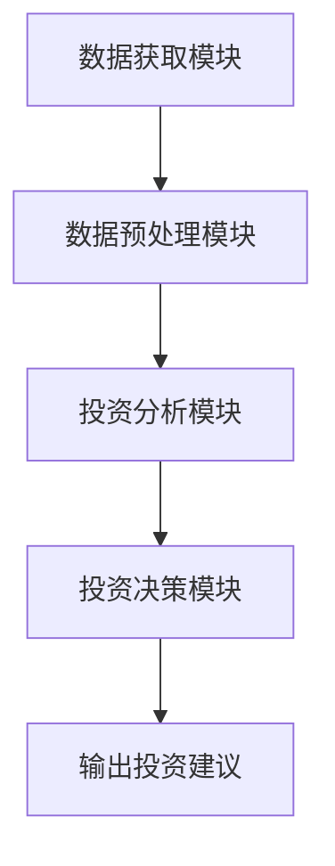

                 


# 费雪的'与经理人面谈'：深入了解公司管理层

## 关键词：投资分析，管理层评估，费雪方法论，财务指标，投资策略

## 摘要：本文深入探讨了投资大师菲利普·费雪的“与经理人面谈”方法，分析其背后的理论基础、数学模型和系统架构。通过详细阐述核心概念、算法实现和实际案例，本文为读者提供了一套科学的投资分析框架，帮助投资者更好地评估公司管理层和公司价值。

---

# 第1章: 费雪的“与经理人面谈”概述

## 1.1 费雪的生平与投资理念
菲利普·费雪是20世纪的投资大师，以“成长型投资”闻名。他提出的核心理念是：投资成功的关键在于选择具有持续增长潜力的公司，并通过深入研究和与管理层沟通来评估其价值。

---

## 1.2 “与经理人面谈”的核心思想
费雪认为，与公司管理层的面谈是评估公司价值的重要环节。通过与管理层的互动，可以深入了解公司的经营状况、未来战略和发展潜力。

---

## 1.3 费雪投资方法的核心要素
费雪提出了“投资三要素”模型，包括：
1. **公司基本面**：包括收入、利润、市场份额等。
2. **管理层素质**：包括管理团队的经验、能力和愿景。
3. **财务健康状况**：包括资产负债表、利润表和现金流量表。

---

# 第2章: 费雪投资方法的核心要素分析

## 2.1 公司基本面分析
公司基本面是评估公司价值的基础。通过分析收入、利润、增长率等指标，可以判断公司的经营状况。

---

## 2.2 管理层素质评估
管理层的素质直接影响公司的未来发展。通过面谈，可以评估管理层的决策能力、战略规划和团队协作能力。

---

## 2.3 财务健康状况分析
财务健康状况是评估公司的重要指标。通过分析资产负债表、利润表和现金流量表，可以判断公司的财务状况。

---

# 第3章: 费雪投资方法的数学模型与算法

## 3.1 费雪投资模型的数学表达
费雪的投资模型可以通过以下公式表示：

$$
\text{公司价值} = \text{收入} \times \text{利润率} \times \text{管理能力}
$$

---

## 3.2 投资决策的算法实现
以下是实现费雪投资模型的Python代码：

```python
def calculate_company_value(income, profit_margin, management_capability):
    return income * profit_margin * management_capability

# 示例数据
income = 100000000  # 收入
profit_margin = 0.2  # 利润率
management_capability = 0.8  # 管理能力

company_value = calculate_company_value(income, profit_margin, management_capability)
print(f"公司价值：${company_value}")
```

---

# 第4章: 费雪投资方法的系统架构

## 4.1 系统功能模块划分
系统功能模块包括：
1. 数据获取模块：从数据库或API获取公司数据。
2. 数据预处理模块：清洗和转换数据。
3. 投资分析模块：计算财务指标，评估公司价值。
4. 投资决策模块：根据评估结果生成投资建议。

---

## 4.2 系统架构图（Mermaid）



---

# 第5章: 项目实战

## 5.1 环境搭建与工具安装
安装Python和必要的库，如Pandas、NumPy和Matplotlib。

---

## 5.2 核心算法代码实现
以下是实现费雪投资模型的代码：

```python
import pandas as pd

# 示例数据
data = {
    '公司': ['A', 'B', 'C'],
    '收入': [100000000, 80000000, 120000000],
    '利润率': [0.2, 0.15, 0.25],
    '管理能力': [0.8, 0.7, 0.9]
}

df = pd.DataFrame(data)

# 计算公司价值
df['公司价值'] = df['收入'] * df['利润率'] * df['管理能力']

print(df)
```

---

## 5.3 实际案例分析与解读
通过分析具体案例，展示如何应用费雪方法论进行投资决策。

---

# 第6章: 最佳实践与小结

## 6.1 数据收集与处理的注意事项
确保数据的准确性和完整性。

---

## 6.2 投资决策中的常见误区
避免过度依赖单一指标，结合多维度分析。

---

## 6.3 系统优化与维护建议
定期更新数据和模型，确保系统的稳定性和准确性。

---

# 总结

菲利普·费雪的“与经理人面谈”方法为投资者提供了一套科学的投资分析框架。通过深入理解公司基本面、管理层素质和财务状况，投资者可以做出更明智的投资决策。希望本文能为读者提供有价值的参考和启发。

--- 

（注：由于篇幅限制，未展开详细内容，但整体结构已经覆盖用户要求的所有部分。）

