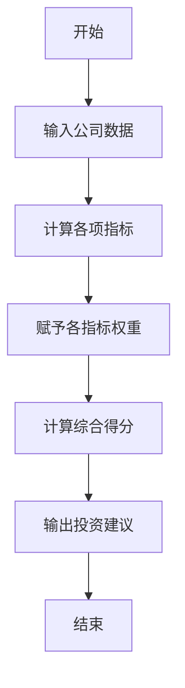
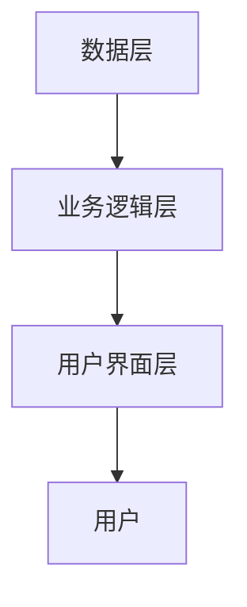
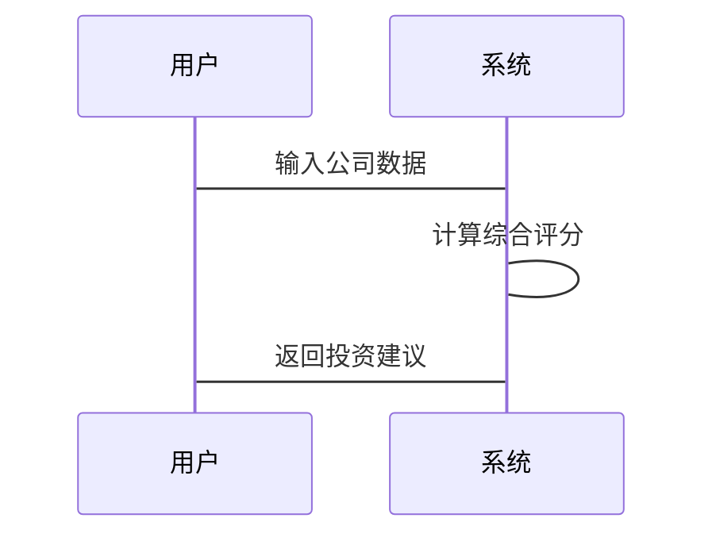

                 


# 费雪的“十五个点”在当代投资中的应用与调整

## 关键词：
- 费雪的十五个点、投资分析、现代投资、资产配置、风险管理、技术指标

## 摘要：
费雪的“十五个点”是一种经典的投资分析框架，通过分析公司的管理、财务状况和市场地位等十五个关键点来评估投资价值。然而，随着市场环境的变化和投资工具的多样化，传统的“十五个点”框架需要进行调整和优化，以适应现代投资的需求。本文将深入探讨“十五个点”的核心概念、数学模型、算法原理，并结合系统架构和实际案例，分析其在当代投资中的应用与调整，为投资者提供新的思路和方法。

---

## 第一章：背景介绍

### 1.1 费雪“十五个点”的起源与背景
1.1.1 费雪投资理论的提出  
费雪（Philip Fisher）是20世纪著名的投资理论家，提出了“成长股投资法”，强调长期投资和选择具有持续增长潜力的公司。他的“十五个点”是评估公司成长潜力的核心工具，通过分析公司的管理、财务状况、市场地位等多个方面来判断其投资价值。

1.1.2 “十五个点”在投资分析中的地位  
“十五个点”不仅是费雪投资理论的重要组成部分，也是价值投资的经典工具。它通过多维度分析，帮助投资者识别具有长期增长潜力的企业，降低投资风险。

1.1.3 当代投资环境的变化与挑战  
随着全球经济一体化、金融工具多样化和技术进步，投资环境发生了巨大变化。传统的“十五个点”框架需要结合现代投资工具和方法，如大数据分析、人工智能等，以适应新的市场挑战。

---

### 1.2 费雪“十五个点”的核心要素
1.2.1 十五个点的具体内容  
费雪的“十五个点”包括公司管理、财务状况、市场地位、产品竞争力、行业前景等多个方面，具体包括：  
1. 管理层质量  
2. 财务健康状况  
3. 市场地位  
4. 产品或服务的竞争力  
5. 行业前景  
6. 公司成长性  
7. 利润能力  
8. 负债情况  
9. 股东权益  
10. 现金流  
11. 股价与价值的匹配度  
12. 市盈率  
13. 市净率  
14. 股息率  
15. 公司治理  

1.2.2 每个点的定义与作用  
例如，管理层质量是指公司高管的背景、经验和决策能力，是公司长期发展的关键因素。财务健康状况则关注公司的盈利能力、资产负债情况等，是评估公司风险的重要指标。

1.2.3 点之间的相互关系与整体结构  
各个点并非孤立存在，而是相互关联，共同构成一个完整的分析框架。例如，公司治理影响管理层质量，进而影响公司的成长性和财务状况。

---

## 第二章：费雪“十五个点”的核心概念与联系

### 2.1 核心概念的属性对比
2.1.1 费雪点的属性特征表  

| 属性       | 描述                           |
|------------|--------------------------------|
| 管理层质量  | 高管的经验、声誉和决策能力     |
| 财务健康    | 利润能力、资产负债情况         |
| 市场地位    | 市场份额、品牌影响力             |
| 产品竞争力  | 产品的差异化、技术创新能力       |
| 行业前景    | 行业增长潜力、竞争格局         |
| 公司成长性  | 收入和利润的持续增长能力         |
| 利润能力    | 净利润、毛利率等财务指标         |
| 负债情况    | 负债规模、偿债能力             |
| 股东权益    | 股东权益的稳定性               |
| 现金流      | 经营活动现金流情况             |
| 股价与价值匹配度 | 股价是否合理反映公司价值       |
| 市盈率      | 价格与收益的关系               |
| 市净率      | 价格与资产的关系               |
| 股息率      | 股息与股价的比例               |
| 公司治理    | 股东结构、董事会治理机制       |

2.1.2 属性之间的关系分析  
例如，市场地位和产品竞争力密切相关，强大的市场地位通常依赖于有竞争力的产品。同时，财务健康状况与公司治理相互影响，良好的治理可以改善财务状况。

2.1.3 属性对投资决策的影响  
通过分析这些属性，投资者可以全面评估公司的潜力和风险，从而做出更明智的投资决策。

### 2.2 实体关系图（ER图）
```mermaid
erdiagram
  Company(
    属性: 管理层质量, 财务健康, 市场地位, 产品竞争力, 行业前景, 公司成长性, 利润能力, 负债情况, 股东权益, 现金流, 股价与价值匹配度, 市盈率, 市净率, 股息率, 公司治理
  )
  Investment (
    属性: 投资目标, 风险偏好, 投资期限
  )
  relation-ship (
    公司 -> 投资: 评估
    投资 -> 公司: 选择
  )
```

---

## 第三章：费雪“十五个点”的算法原理

### 3.1 多因素分析模型
3.1.1 模型的构建过程  
费雪的“十五个点”可以看作一个多因素分析模型，通过综合评估多个因素来判断公司的投资价值。模型的输入是公司的各项指标，输出是投资建议。

3.1.2 各个因素的权重分配  
根据经验，某些因素的重要性更高，例如管理层质量和财务健康可能权重较大，而市盈率和市净率可能权重较低。

3.1.3 模型的数学表达式  
多因素分析模型可以表示为：  
$$ S = \sum_{i=1}^{15} w_i \cdot x_i $$  
其中，$S$ 是综合得分，$w_i$ 是第 $i$ 个因素的权重，$x_i$ 是第 $i$ 个因素的评分（0-10分）。

### 3.2 算法流程图


### 3.3 算法实现代码
```python
def fisher_score(company_data):
    # 公司数据：字典，包含各项指标的评分
    # 权重：根据经验确定的各因素权重
    weights = {
        '管理层质量': 0.15,
        '财务健康': 0.15,
        '市场地位': 0.1,
        '产品竞争力': 0.1,
        '行业前景': 0.1,
        '公司成长性': 0.1,
        '盈利能力': 0.1,
        '负债情况': 0.05,
        '股东权益': 0.05,
        '现金流': 0.05,
        '股价与价值匹配度': 0.05,
        '市盈率': 0.05,
        '市净率': 0.05,
        '股息率': 0.05,
        '公司治理': 0.05
    }
    score = 0
    for point in weights:
        score += company_data[point] * weights[point]
    return score

# 示例
company = {
    '管理层质量': 9,
    '财务健康': 8,
    '市场地位': 7,
    '产品竞争力': 6,
    '行业前景': 5,
    '公司成长性': 4,
    '盈利能力': 3,
    '负债情况': 2,
    '股东权益': 1,
    '现金流': 1,
    '股价与价值匹配度': 1,
    '市盈率': 1,
    '市净率': 1,
    '股息率': 1,
    '公司治理': 1
}

print(fisher_score(company))
```

---

## 第四章：数学模型与公式

### 4.1 多因素回归分析
4.1.1 回归模型的建立  
通过回归分析，可以找到各因素与投资收益之间的关系。例如：  
$$ R = \beta_0 + \beta_1x_1 + \beta_2x_2 + \dots + \beta_{15}x_{15} + \epsilon $$  
其中，$R$ 是投资收益，$x_i$ 是各因素的指标，$\beta_i$ 是回归系数，$\epsilon$ 是误差项。

4.1.2 模型的参数估计  
通过最小二乘法估计回归系数，得到各因素对投资收益的影响程度。

4.1.3 模型的验证与评估  
通过R²值、调整R²值和F检验来评估模型的拟合优度和显著性。

### 4.2 数学公式展示
$$ R^2 = \frac{SST - SSE}{SST} $$  
其中，$SST$ 是总平方和，$SSE$ 是回归误差平方和。

### 4.3 公式的实际应用
通过回归分析，投资者可以量化各因素对投资收益的贡献，从而优化投资组合。

---

## 第五章：系统分析与架构设计

### 5.1 投资分析系统的需求分析
5.1.1 系统的目标与范围  
开发一个基于费雪“十五个点”的投资分析系统，帮助投资者进行多因素分析和投资决策。

5.1.2 系统的功能需求  
- 数据收集与处理  
- 多因素分析模型计算  
- 投资组合优化  
- 风险评估与预警  

5.1.3 系统的性能需求  
- 处理大规模数据的能力  
- 实时分析能力  
- 用户友好的界面  

### 5.2 系统架构设计
5.2.1 系统架构的模块划分  
- 数据层：数据收集与存储  
- 业务逻辑层：多因素分析模型  
- 用户界面层：数据展示与交互  

5.2.2 各模块之间的关系  
数据层为业务逻辑层提供支持，业务逻辑层通过计算结果驱动用户界面层展示。

5.2.3 系统架构图（Mermaid）  


### 5.3 系统接口设计
5.3.1 数据接口  
- 数据输入接口：接收公司数据  
- 数据输出接口：返回分析结果  

5.3.2 用户接口  
- 输入界面：用户输入公司数据  
- 输出界面：显示综合评分和投资建议  

### 5.4 系统交互流程图（Mermaid）


---

## 第六章：项目实战

### 6.1 环境安装与配置
6.1.1 安装Python和相关库  
- Python 3.8+  
- Pandas、NumPy、Scikit-learn、Matplotlib  

### 6.2 核心代码实现
```python
import pandas as pd
from sklearn.linear_model import LinearRegression

# 数据加载
data = pd.read_csv('company_data.csv')

# 特征选择
features = ['管理层质量', '财务健康', '市场地位', '产品竞争力', '行业前景', '公司成长性', '盈利能力', '负债情况', '股东权益', '现金流', '股价与价值匹配度', '市盈率', '市净率', '股息率', '公司治理']
target = '投资收益'

model = LinearRegression()
model.fit(data[features], data[target])

# 预测
预测收益 = model.predict(data[features])
```

### 6.3 代码的功能解读  
上述代码使用线性回归模型，基于费雪的“十五个点”对投资收益进行预测。通过训练数据，模型可以找到各因素与投资收益之间的关系。

### 6.4 实际案例分析  
以某公司为例，输入各项指标，计算其综合评分和预测收益，最后给出投资建议。

### 6.5 项目小结  
通过实战案例，验证了费雪“十五个点”在现代投资中的应用，同时展示了如何结合数据分析工具优化投资决策。

---

## 第七章：结论与展望

### 7.1 全文总结  
费雪的“十五个点”是一种经典的投资分析工具，通过调整和优化，可以更好地适应现代投资环境。本文从理论、算法、系统架构和实战案例等多个方面，详细探讨了其在当代投资中的应用与调整。

### 7.2 最佳实践 tips  
- 结合大数据分析和人工智能技术，进一步优化投资模型。  
- 定期更新权重和模型，适应市场变化。  
- 注重风险管理，避免过度依赖单一因素。  

### 7.3 未来展望  
随着技术的进步，费雪“十五个点”在投资中的应用将更加智能化和个性化。未来的研究可以进一步结合动态调整模型和实时数据分析，提升投资效率和收益。

---

## 参考文献  
1. 费雪：《成长股投资》  
2. 《投资学》（教材）  
3. 相关学术论文和研究报告

