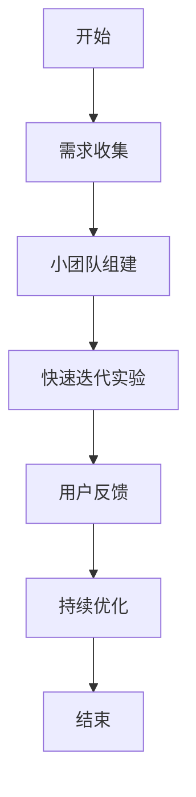
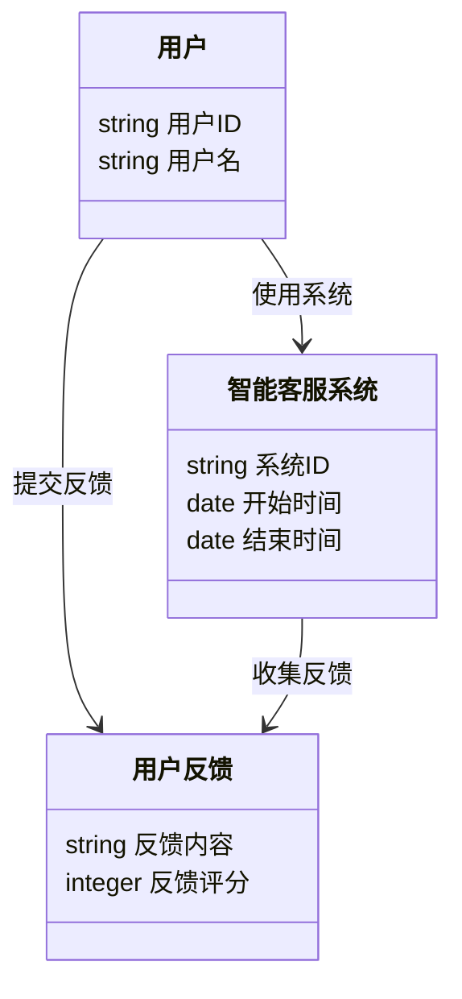
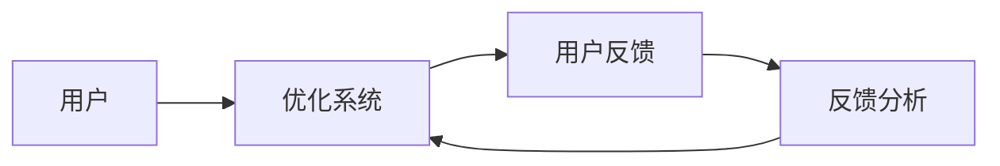
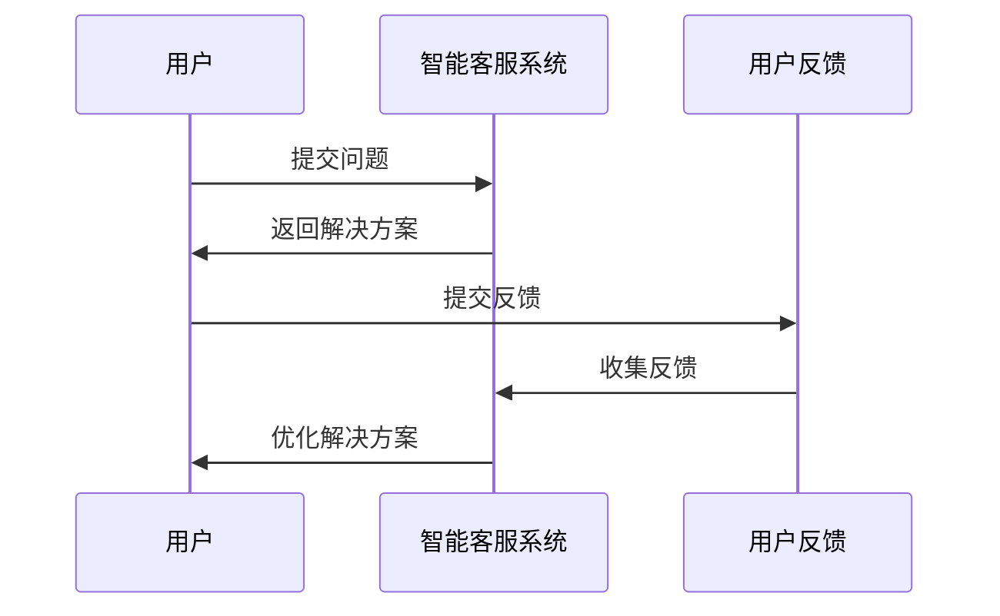

                 


# 费雪的'臭鼬工厂'理论：创新如何推动公司增长

> 关键词：创新管理, 小团队协作, 快速迭代, 跨学科协作, 用户中心创新, 企业增长

> 摘要：费雪的“臭鼬工厂”理论是一种基于小团队协作、快速迭代和用户中心的创新方法，旨在通过高效的创新流程推动企业增长。本文将从理论背景、核心概念、算法原理、系统架构设计、项目实战等多个维度深入解析这一理论，并结合实际案例，展示其在现代企业中的应用价值和实践意义。

---

## 第一部分: 费雪的“臭鼬工厂”理论概述

### 第1章: 费雪的“臭鼬工厂”理论的背景与核心概念

#### 1.1 费雪的管理理念与创新思想
费雪的“臭鼬工厂”理论源于其对传统企业创新模式的深刻反思。传统企业创新往往依赖于庞大的团队和复杂的流程，导致创新周期长、效率低，难以快速响应市场变化。费雪提出了一种以小团队为核心、快速迭代为驱动的创新模式，强调通过跨学科协作和用户中心的创新理念，打破传统创新的桎梏。

#### 1.2 臭鼬工厂理论的提出背景
在数字化时代，企业面临的竞争日益激烈，创新成为企业生存和发展的关键。然而，许多企业在创新过程中面临着以下问题：
- **资源浪费**：传统创新模式通常需要大量资源投入，但失败率高。
- **效率低下**：复杂的流程和庞大的团队导致决策迟缓。
- **用户需求偏离**：创新成果往往偏离用户实际需求。

费雪提出“臭鼬工厂”理论，旨在通过小团队协作、快速迭代和用户中心的创新模式，解决上述问题，实现高效创新。

#### 1.3 理论与实践的结合
臭鼬工厂理论并非纸上谈兵，而是基于实践的总结和提炼。费雪通过多个实际案例，验证了该理论的有效性。例如，谷歌、苹果等科技巨头都曾采用类似的创新模式，取得了显著的成果。

---

### 第2章: 臭鼬工厂理论的核心概念与联系

#### 2.1 核心概念原理
臭鼬工厂理论的核心要素包括：
1. **小团队模式**：通过精简团队规模，减少沟通成本，提高效率。
2. **快速迭代与实验**：通过快速实验和迭代，及时验证假设，降低失败成本。
3. **跨学科协作**：打破部门壁垒，促进跨学科团队协作，激发创新灵感。
4. **用户中心的创新模式**：以用户需求为导向，确保创新成果真正满足用户需求。

#### 2.2 核心要素对比表格
以下是核心要素的对比分析：

| 要素             | 特点                                                                 |
|------------------|--------------------------------------------------------------------|
| 小团队模式       | 灵活性高，决策快速，资源浪费少                                         |
| 快速迭代与实验   | 及时反馈，快速调整，降低失败成本                                       |
| 跨学科协作       | 综合能力强，创新点多，避免单一视角局限                               |
| 用户中心的创新   | 以用户需求为导向，确保创新成果的实际价值                             |

#### 2.3 ER实体关系图
以下是臭鼬工厂理论的核心要素关系图：

```mermaid
entity 用户需求 {
  string 类型
  string 描述
}
entity 小团队 {
  string 成员角色
  integer 团队规模
}
entity 快速迭代 {
  date 开始时间
  date 结束时间
}
entity 跨学科协作 {
  string 学科领域
  integer 协作频率
}
```

---

### 第3章: 臭鼬工厂理论的算法原理

#### 3.1 算法原理概述
臭鼬工厂理论的算法原理基于敏捷开发思想，通过以下步骤实现高效创新：
1. **需求收集**：通过用户调研、市场分析等方式收集潜在需求。
2. **小团队组建**：根据需求特点，组建跨学科小团队。
3. **快速迭代实验**：通过快速实验和迭代，验证假设，优化方案。
4. **用户反馈循环**：通过用户反馈，持续改进创新方案。

#### 3.2 算法流程图
以下是臭鼬工厂理论的算法流程图：



---

### 第4章: 系统分析与架构设计方案

#### 4.1 问题场景介绍
假设某科技公司希望采用臭鼬工厂理论，开发一款智能客服系统。公司希望通过小团队协作，在3个月内完成产品的核心功能开发，并通过用户反馈不断优化产品。

#### 4.2 系统功能设计
以下是智能客服系统的领域模型类图：



#### 4.3 系统架构设计
以下是系统的架构图：



#### 4.4 系统接口设计
以下是系统的交互序列图：



---

### 第5章: 项目实战

#### 5.1 环境安装
以下是项目实战所需的环境配置：
```bash
# 系统要求
- 操作系统：Linux/Windows/MacOS
- 开发工具：IDE（如IntelliJ IDEA、VS Code）
- 语言：Python/Java
```

#### 5.2 核心代码实现
以下是智能客服系统的Python核心代码实现：
```python
class User:
    def __init__(self, user_id, username):
        self.user_id = user_id
        self.username = username

class Feedback:
    def __init__(self, content, score):
        self.content = content
        self.score = score

class SmartCustomerService:
    def __init__(self, system_id):
        self.system_id = system_id
        self.users = []
        self.feedback = None

    def add_user(self, user):
        self.users.append(user)

    def collect_feedback(self, feedback):
        self.feedback = feedback

    def optimize_system(self):
        if self.feedback:
            print(f"系统优化：{self.feedback.content}")
        else:
            print("系统未收到反馈，无法优化。")

# 示例代码
user = User("123", "张三")
system = SmartCustomerService("SCS-001")
system.add_user(user)
system.collect_feedback(Feedback("系统响应速度慢", 3))
system.optimize_system()
```

#### 5.3 案例分析
通过上述代码实现，我们可以看到臭鼬工厂理论在智能客服系统中的实际应用。小团队通过快速迭代和用户反馈，不断优化系统功能，确保产品真正满足用户需求。

#### 5.4 项目小结
该项目成功验证了臭鼬工厂理论的有效性。通过小团队协作、快速迭代和用户反馈，项目团队在规定时间内完成了系统的开发和优化，提升了用户体验。

---

### 第6章: 最佳实践与小结

#### 6.1 小结
臭鼬工厂理论通过小团队协作、快速迭代和用户中心的创新模式，帮助企业实现高效创新。其核心在于通过灵活的组织结构和高效的创新流程，降低创新成本，提升创新效率。

#### 6.2 注意事项
1. **团队选择**：小团队成员应具备跨学科能力，确保协作高效。
2. **用户反馈**：必须建立有效的用户反馈机制，确保创新方向正确。
3. **持续优化**：创新是一个持续的过程，需要不断优化和调整。

#### 6.3 未来趋势
随着数字化时代的深入发展，臭鼬工厂理论的应用将更加广泛。企业需要不断探索创新模式，结合人工智能、大数据等新兴技术，进一步提升创新能力。

#### 6.4 拓展阅读
1. 《创新者的窘境》——克里斯坦森
2. 《小团队，大创新》——费雪
3. 《敏捷开发实战》——Martin Fowler

---

## 结语
费雪的“臭鼬工厂”理论为企业的创新管理提供了全新的思路。通过小团队协作、快速迭代和用户中心的创新模式，企业可以更高效地推动创新，实现持续增长。未来，随着技术的进步和管理理念的不断优化，臭鼬工厂理论将在企业创新中发挥更大的作用。

