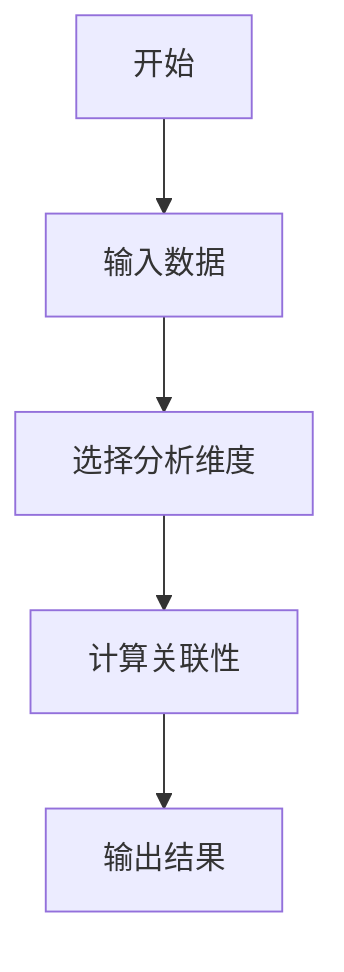

                 


# 费雪的产业链分析方法

> 关键词：产业链分析，费雪分析模型，系统架构，投资策略，数据分析

> 摘要：本文系统地介绍了费雪的产业链分析方法，从背景、核心概念到算法原理、系统架构，再到项目实战，深入剖析了该方法的理论基础和实际应用。文章通过详细的技术分析和代码实现，展示了如何利用费雪方法进行产业链优化和投资决策。

---

# 目录

1. [费雪产业链分析方法概述](#费雪产业链分析方法概述)
2. [费雪产业链分析方法的核心概念与联系](#费雪产业链分析方法的核心概念与联系)
3. [费雪产业链分析方法的算法原理](#费雪产业链分析方法的算法原理)
4. [费雪产业链分析方法的系统架构设计](#费雪产业链分析方法的系统架构设计)
5. [费雪产业链分析方法的项目实战](#费雪产业链分析方法的项目实战)
6. [费雪产业链分析方法的最佳实践与小结](#费雪产业链分析方法的最佳实践与小结)

---

## 第1章: 费雪产业链分析方法概述

### 1.1 费雪产业链分析方法的背景与意义

随着全球经济的快速发展，产业链的复杂性和相互依存性日益增强。企业如何在复杂的产业链中找到最优策略，成为管理者和投资者关注的焦点。费雪的产业链分析方法作为一种系统化的分析工具，为企业战略规划、投资决策和供应链优化提供了重要的理论支持。

**1.1.1 产业链分析的定义与作用**

产业链分析是指对某一行业或产业的各个环节进行系统性研究，以识别关键环节、优化资源配置、提升效率。其作用包括：

1. 揭示产业链的结构和运行机制。
2. 发现产业链中的瓶颈和机会。
3. 支持企业战略决策和投资规划。

**1.1.2 费雪分析方法的核心思想**

费雪分析方法以系统性、动态性为特点，强调产业链各环节的协同优化。其核心思想包括：

1. 产业链是一个有机整体，各环节相互影响。
2. 分析应基于数据和模型，注重量化评估。
3. 动态调整分析结果以适应市场变化。

**1.1.3 费雪分析方法的应用领域**

- **企业战略规划**：帮助企业识别核心竞争力。
- **投资决策支持**：指导投资者选择优质标的。
- **产业政策制定**：为政府提供产业扶持依据。
- **供应链优化管理**：帮助企业降低运营成本。

---

## 第2章: 费雪产业链分析方法的核心概念与联系

### 2.1 核心概念原理

**2.1.1 产业链的结构层次**

产业链由上游、中游、下游三个部分构成：

- **上游**：原材料供应、设备制造等基础环节。
- **中游**：生产制造、加工环节。
- **下游**：销售、物流、售后服务等环节。

**2.1.2 费雪分析模型的要素**

费雪模型包括以下几个关键要素：

- **数据来源**：产业链各环节的生产、销售、成本数据。
- **分析维度**：成本、效率、市场占有率等。
- **输出结果**：产业链优化建议、风险评估。

**2.1.3 产业链各环节的相互作用**

- 上游影响中游的生产成本。
- 中游影响下游的产品质量。
- 下游反馈影响整个产业链的竞争力。

### 2.2 核心概念属性特征对比表

| 概念 | 特征1 | 特征2 | 特征3 |
|------|-------|-------|-------|
| 产业链环节 | 输入 | 输出 | 关联性 |
| 费雪分析模型 | 数据来源 | 分析维度 | 输出结果 |

### 2.3 ER实体关系图架构

```mermaid
erDiagram
    actor 费雪分析模型 {
        +id : integer
        +输入数据 : string
        +分析维度 : string
    }
    actor 产业链环节 {
        +id : integer
        +环节名称 : string
        +关联性 : integer
    }
    费雪分析模型 --> 产业链环节 : 分析
```

---

## 第3章: 费雪产业链分析方法的算法原理

### 3.1 算法原理概述

**3.1.1 费雪分析模型的输入与输出**

- **输入数据**：产业链各环节的生产数据、成本数据、销售数据。
- **分析维度**：成本效率、市场占有率、供应链稳定性。
- **输出结果**：各环节优化建议、风险评估。

**3.1.2 分析过程的逻辑步骤**

1. 数据采集：收集产业链各环节的数据。
2. 数据清洗：去除异常值，填补缺失数据。
3. 数据分析：计算各环节的效率、成本等指标。
4. 关键环节识别：找出瓶颈环节。
5. 优化建议：提出改进建议。

### 3.2 算法流程图



### 3.3 数学模型与公式

**3.3.1 成本效率计算公式**

$$ \text{成本效率} = \frac{\text{总成本}}{\text{总产量}} $$

**3.3.2 市场占有率计算公式**

$$ \text{市场占有率} = \frac{\text{销售额}}{\text{市场总销售额}} \times 100\% $$

**3.3.3 供应链稳定性指标**

$$ \text{供应链稳定性} = 1 - \frac{\text{供应链中断次数}}{\text{总分析次数}} $$

---

## 第4章: 费雪产业链分析方法的系统架构设计

### 4.1 系统架构概述

系统采用分层架构，包括数据采集层、数据处理层、分析层和用户层。

### 4.2 系统功能设计

- **数据采集模块**：负责采集产业链各环节的数据。
- **数据处理模块**：清洗和预处理数据。
- **分析模块**：计算各项指标，识别关键环节。
- **用户模块**：展示分析结果，提供优化建议。

### 4.3 系统架构图


---

## 第5章: 费雪产业链分析方法的项目实战

### 5.1 项目背景

假设我们为一家汽车制造企业进行产业链分析，优化其供应链。

### 5.2 项目环境安装

- **工具**：Python 3.8+, Pandas, NumPy, Matplotlib。
- **数据源**：企业内部数据，公开行业数据。

### 5.3 核心代码实现

```python
import pandas as pd
import numpy as np

# 数据清洗
def data_cleaning(df):
    df = df.dropna()
    df = df.replace({np.nan: 0})
    return df

# 成本效率计算
def cost_efficiency(df):
    cost = df['总成本'].sum()
    production = df['总产量'].sum()
    return cost / production

# 市场占有率计算
def market_share(df, total_sales):
    return (df['销售额'].sum() / total_sales) * 100

# 供应链稳定性
def supply_chain_stability(df):
   中断次数 = df['中断次数'].sum()
    return 1 - (中断次数 / df.shape[0])
```

### 5.4 代码解读与分析

- **数据清洗**：处理缺失值，确保数据完整性。
- **成本效率计算**：评估各环节的成本效益。
- **市场占有率计算**：分析企业市场地位。
- **供应链稳定性**：评估供应链的可靠性。

### 5.5 案例分析与结果展示

通过分析，发现企业的上游原材料供应环节存在瓶颈，建议优化供应商选择和库存管理。

---

## 第6章: 费雪产业链分析方法的最佳实践与小结

### 6.1 最佳实践

- **数据质量**：确保数据的准确性和完整性。
- **模型选择**：根据实际需求选择合适的分析模型。
- **动态调整**：定期更新数据，适应市场变化。

### 6.2 小结

费雪的产业链分析方法为企业优化运营、提升竞争力提供了有力工具。通过系统化的分析和优化建议，企业可以显著降低成本，提高效率，增强市场竞争力。

---

## 总结

费雪的产业链分析方法是一种系统化、动态化的分析工具，广泛应用于企业战略规划、投资决策和供应链优化。通过本文的详细讲解，读者可以全面掌握该方法的核心思想和实际应用。未来，随着技术的发展，费雪分析方法将更加智能化和数据化，为企业创造更大的价值。

