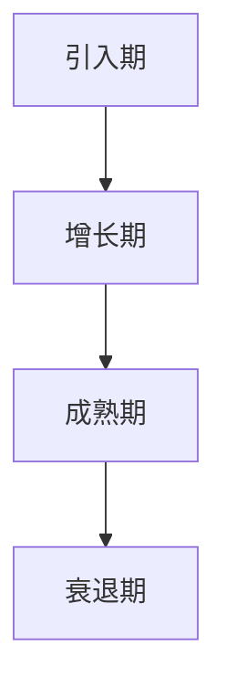

                 


# 费雪的产品生命周期分析在投资中的应用

> 关键词：产品生命周期分析，费雪投资理论，投资策略，市场分析，股票投资

> 摘要：本文通过分析费雪的产品生命周期理论，探讨其在投资分析中的应用。文章详细介绍了产品生命周期的四个阶段及其对投资决策的影响，结合数学模型和实际案例，阐述了如何利用产品生命周期分析优化投资策略，降低投资风险，实现长期收益最大化。

---

# 第一部分: 费雪的产品生命周期分析基础

## 第1章: 产品生命周期分析概述

### 1.1 产品生命周期的概念与背景

#### 1.1.1 产品生命周期的定义
产品生命周期（Product Life Cycle，PLC）是指产品从进入市场到退出市场的整个过程，通常分为四个阶段：引入期（Introduction）、增长期（Growth）、成熟期（Maturity）和衰退期（Decline）。

#### 1.1.2 产品生命周期在投资中的重要性
在投资领域，产品生命周期分析可以帮助投资者理解产品在市场中的地位和趋势，从而制定更科学的投资策略。例如，判断某个行业的市场潜力、评估企业的成长性以及预测公司的未来收益。

#### 1.1.3 产品生命周期分析的核心要素
- **市场增长率**：衡量产品所处市场的扩张速度。
- **市场份额**：企业在市场中的占有率。
- **利润率**：产品盈利能力的直接体现。
- **投资回报率**：投资该产品的预期收益与成本的比率。

---

### 1.2 产品生命周期分析的背景与现状

#### 1.2.1 投资分析的传统方法
传统投资分析方法主要依赖于财务指标（如PE、PB等）和市场趋势分析，但忽视了产品的市场阶段对企业价值的影响。

#### 1.2.2 产品生命周期分析的兴起
随着市场竞争加剧，企业的产品创新和市场定位变得至关重要。产品生命周期分析为投资者提供了一种更动态的视角，帮助他们识别高增长潜力的投资标的。

#### 1.2.3 当前研究与应用的现状
目前，产品生命周期分析已被广泛应用于股票投资、行业分析和企业价值评估等领域。然而，如何将产品生命周期分析与量化模型结合，仍是一个值得深入研究的方向。

---

### 1.3 费雪产品生命周期分析的核心思想

#### 1.3.1 费雪的投资理念
菲利普·费雪（Philip Fisher）是价值投资的重要倡导者，他认为投资成功的关键在于选择那些具有强大竞争优势和持续增长潜力的企业。

#### 1.3.2 产品生命周期与投资决策的关系
产品生命周期分析是费雪投资理念的重要组成部分。通过分析产品的市场阶段，投资者可以更好地判断企业的成长性和投资价值。

#### 1.3.3 费雪分析方法的特点与优势
- **动态性**：关注产品的市场阶段变化。
- **长期性**：注重企业长期增长潜力。
- **个股分析**：强调对公司基本面的深入研究。

---

### 1.4 产品生命周期分析的应用领域

#### 1.4.1 股票投资中的应用
通过分析公司主要产品的生命周期，投资者可以评估公司的成长性和投资价值。

#### 1.4.2 行业分析中的应用
行业分析可以帮助投资者判断整个行业的市场阶段，从而做出更合理的投资决策。

#### 1.4.3 企业价值评估中的应用
产品生命周期分析是企业价值评估的重要依据，特别是在科技和消费类行业。

---

## 第2章: 产品生命周期的阶段划分与特征分析

### 2.1 产品生命周期的四个阶段

#### 2.1.1 引入期
- **特征**：市场需求小，产品知名度低，成本高，利润低。
- **投资策略**：关注高增长潜力的企业，耐心持有。

#### 2.1.2 增长期
- **特征**：市场需求迅速增长，企业市场份额扩大，利润上升。
- **投资策略**：加大投资，享受增长红利。

#### 2.1.3 成熟期
- **特征**：市场需求稳定，竞争加剧，利润增速放缓。
- **投资策略**：关注企业盈利能力和分红能力。

#### 2.1.4 衰退期
- **特征**：市场需求萎缩，企业利润下降，市场份额流失。
- **投资策略**：逐步退出，避免损失。

---

### 2.2 各阶段的市场表现与投资机会

#### 2.2.1 引入期的投资策略
- 选择具有创新能力和市场潜力的企业。
- 耐心等待产品进入增长期。

#### 2.2.2 增长期的投资机会
- 利润率快速上升，股价可能被市场重新定价。

#### 2.2.3 成熟期的投资风险
- 利润率下降，行业竞争激烈。

#### 2.2.4 衰退期的投资调整
- 减持或退出投资，避免进一步损失。

---

### 2.3 产品生命周期的动态变化与拐点识别

#### 2.3.1 产品生命周期的动态特征
- 产品的生命周期可能因市场环境和技术进步而缩短或延长。

#### 2.3.2 产品生命周期拐点的识别方法
- 关注市场增长率的变化。
- 分析市场份额的变化趋势。

#### 2.3.3 拐点对投资决策的影响
- 成长股投资需要提前布局拐点。

---

### 2.4 产品生命周期与行业周期的关系

#### 2.4.1 产品生命周期与行业周期的互动
- 行业周期影响产品生命周期的速度和方向。

#### 2.4.2 行业周期对产品生命周期的影响
- 快速变化的行业周期可能导致产品生命周期缩短。

#### 2.4.3 行业周期分析对投资的启示
- 关注行业周期与产品生命周期的结合点。

---

## 第3章: 费雪产品生命周期分析的核心模型与指标

### 3.1 费雪分析模型的构建

#### 3.1.1 模型的输入变量
- 市场增长率。
- 市场份额。
- 利润率。

#### 3.1.2 模型的输出结果
- 产品生命周期阶段。
- 投资建议。

#### 3.1.3 模型的假设条件
- 市场环境稳定。
- 企业竞争策略合理。

---

### 3.2 产品生命周期分析的关键指标

#### 3.2.1 市场增长率
$$市场增长率 = \frac{当前市场规模 - 上年市场规模}{上年市场规模} \times 100\%$$

#### 3.2.2 市场份额
$$市场份额 = \frac{企业销售额}{行业销售额} \times 100\%$$

#### 3.2.3 利润率
$$利润率 = \frac{净利润}{营业收入} \times 100\%$$

#### 3.2.4 投资回报率
$$投资回报率 = \frac{净利润}{投资成本} \times 100\%$$

---

### 3.3 指标之间的关系与综合分析

#### 3.3.1 市场增长率与利润率的关系
- 增长期市场增长率高，利润率上升。
- 成熟期市场增长率下降，利润率稳定。

---

### 3.4 费雪分析模型的数学公式



$$ 费雪分析指数 = \sum_{i=1}^{n} (市场增长率_i \times 市场份额_i) $$

---

# 第二部分: 产品生命周期分析在投资中的应用

## 第4章: 产品生命周期分析的系统架构与实现

### 4.1 系统功能设计

#### 4.1.1 数据采集模块
- 数据来源：市场数据、企业财务数据。

#### 4.1.2 数据分析模块
- 数据清洗、特征提取。

#### 4.1.3 生命周期判定模块
- 基于数学模型判断产品所处阶段。

#### 4.1.4 投资策略生成模块
- 根据生命周期阶段制定投资建议。

#### 4.1.5 结果展示模块
- 可视化报告、投资建议书。

---

### 4.2 系统架构设计

```mermaid
graph LR
    Client --> API Gateway
    API Gateway --> Data Layer
    Data Layer --> Analysis Layer
    Analysis Layer --> Report Layer
    Report Layer --> Client
```

---

## 第5章: 产品生命周期分析的项目实战

### 5.1 环境安装与数据准备

#### 5.1.1 环境安装
- 安装Python、Pandas、Matplotlib等工具。

#### 5.1.2 数据准备
- 下载行业数据、企业财务数据。

---

### 5.2 核心代码实现

```python
import pandas as pd
import numpy as np

# 数据清洗
def preprocess_data(df):
    df.dropna(inplace=True)
    return df

# 生命周期判定
def determine_stage(growth_rate, market_share):
    if growth_rate > 0.2 and market_share < 0.2:
        return "增长期"
    elif growth_rate > 0 and market_share > 0.2:
        return "成熟期"
    else:
        return "衰退期"

# 投资建议生成
def investment_recommendation(stage):
    if stage == "引入期":
        return "谨慎投资，关注企业创新"
    elif stage == "增长期":
        return "积极投资，把握增长机会"
    elif stage == "成熟期":
        return "稳健投资，关注分红"
    else:
        return "逐步退出，避免损失"

# 示例代码
df = pd.read_csv("market_data.csv")
df = preprocess_data(df)
stage = determine_stage(df["增长率"].mean(), df["市场份额"].mean())
recommendation = investment_recommendation(stage)
print(f"当前阶段：{stage}\n投资建议：{recommendation}")
```

---

### 5.3 实际案例分析

#### 5.3.1 案例背景
以某科技公司为例，分析其核心产品的生命周期阶段。

#### 5.3.2 数据分析与结果展示
- 市场增长率为15%，市场份额为20%。
- 判定结果：成熟期。
- 投资建议：稳健投资，关注分红。

---

## 第6章: 总结与展望

### 6.1 本章小结
- 产品生命周期分析是投资决策的重要工具。
- 费雪分析方法提供了动态的视角，帮助投资者优化投资策略。

### 6.2 未来研究方向
- 结合大数据和人工智能，提升产品生命周期分析的精度。
- 研究产品生命周期与其他投资策略的结合。

### 6.3 最佳实践 tips
- 关注行业动态，及时调整投资策略。
- 长期持有优质企业，避免短期波动干扰。

---

# 结语
通过本文的分析，读者可以深入了解费雪的产品生命周期分析方法，并将其应用于实际投资中。希望本文能为投资者提供有价值的参考，帮助他们在复杂多变的市场中做出更明智的投资决策。

