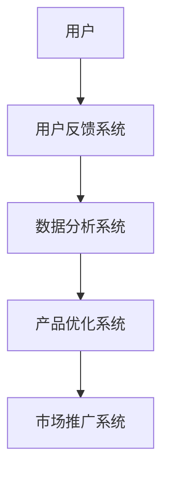

                 


# 费雪的产品生命周期分析：快速迭代时代的新思路

---

## 关键词  
产品生命周期、快速迭代、敏捷开发、数据分析、系统架构

---

## 摘要  
在现代商业环境中，产品生命周期管理变得更加复杂，尤其是在快速迭代的时代，传统的产品生命周期理论需要新的思路和方法。本文将从产品生命周期的核心概念出发，结合敏捷开发和数据分析的实践，探讨在快速迭代时代如何优化产品生命周期管理。通过系统架构设计和案例分析，本文将提供一套新的产品生命周期分析框架，帮助企业在快速变化的市场中保持竞争力。

---

# 第一部分：产品生命周期概述

## 第1章：产品生命周期的基本概念

### 1.1 产品生命周期的定义

产品生命周期（Product Life Cycle, PLC）是指一个产品从进入市场到退出市场的整个过程。通常，产品生命周期可以分为四个阶段：引入期（Introduction）、成长期（Growth）、成熟期（Maturity）和衰退期（Decline）。每个阶段的特点和目标不同，企业在不同阶段需要采取不同的策略。

### 1.2 产品生命周期的重要性

产品生命周期管理是企业战略的重要组成部分。通过了解产品在不同阶段的表现，企业可以制定有效的市场策略、资源分配和风险管理计划。特别是在快速迭代的时代，产品生命周期的管理变得更加动态和复杂。

### 1.3 快速迭代时代的背景

在现代市场环境中，技术的进步和用户需求的变化速度越来越快，产品生命周期也在不断缩短。敏捷开发和持续交付成为主流，企业需要更加灵活地应对市场变化，及时调整产品策略。

---

## 第2章：产品生命周期的阶段分析

### 2.1 引入期分析

引入期是产品的初步进入市场阶段。在这一阶段，企业的目标是建立品牌认知和用户基础。引入期的特点是市场需求较低，竞争较小，但推广成本较高。

**案例分析：** 某初创公司的新产品在引入期时，通过社交媒体营销迅速建立了用户基础。

### 2.2 成长期分析

成长期是产品市场需求快速增长的阶段。在这一阶段，企业需要加大市场推广力度，优化产品功能，以满足更多用户的需求。

**数据分析：** 在成长期，用户增长速度通常会超过市场容量增长速度，企业需要关注用户留存率和满意度。

### 2.3 成熟期分析

成熟期是市场需求趋于饱和的阶段。在这一阶段，企业的目标是通过产品创新和差异化竞争来维持市场份额。

**系统架构设计：** 在成熟期，企业需要建立完善的用户反馈系统，及时收集用户需求，优化产品功能。

### 2.4 衰退期分析

衰退期是市场需求下降的阶段。在这一阶段，企业需要逐步退出市场，优化资源配置，为新产品腾出空间。

**战略调整：** 在衰退期，企业可以考虑通过降价促销、推出新产品线等方式延长产品生命周期。

---

# 第二部分：产品生命周期的分析方法

## 第3章：产品生命周期的数学模型

### 3.1 引入期的数学模型

引入期的用户增长可以用指数增长模型表示：

$$
\frac{dN}{dt} = rN
$$

其中，\( N \) 表示用户数量，\( r \) 表示增长率。

### 3.2 成长期的数学模型

成长期的用户增长可以用对数增长模型表示：

$$
\frac{dN}{dt} = r(N_c - N)
$$

其中，\( N_c \) 表示市场容量上限。

### 3.3 成熟期的数学模型

成熟期的用户增长可以用线性增长模型表示：

$$
\frac{dN}{dt} = r
$$

其中，\( r \) 表示稳定增长速率。

### 3.4 衰退期的数学模型

衰退期的用户流失可以用指数衰减模型表示：

$$
\frac{dN}{dt} = -rN
$$

---

## 第4章：系统架构设计

### 4.1 系统架构概述

系统架构设计是产品生命周期管理的重要组成部分。通过合理的系统架构，企业可以更好地支持产品在不同阶段的需求。

### 4.2 系统架构图

以下是系统架构的Mermaid图：



### 4.3 系统功能设计

系统功能设计需要涵盖用户反馈、数据分析、产品优化和市场推广四个模块。

---

# 第三部分：快速迭代时代的产品生命周期管理

## 第5章：敏捷开发与产品生命周期

### 5.1 敏捷开发的定义

敏捷开发是一种以用户需求为核心，通过迭代、增量的方式开发产品的模式。其核心理念是快速响应变化，持续交付价值。

### 5.2 敏捷开发与产品生命周期的关系

敏捷开发通过短周期的迭代开发，缩短了产品生命周期的每个阶段，使得企业能够更快地适应市场变化。

---

## 第6章：项目实战与案例分析

### 6.1 环境安装与工具配置

项目实战需要安装以下工具：
- Python 3.8+
- Jupyter Notebook
- Pandas
- Matplotlib

### 6.2 核心代码实现

以下是产品生命周期分析的核心代码：

```python
import pandas as pd
import matplotlib.pyplot as plt

# 数据加载
data = pd.read_csv('productLifecycle.csv')

# 引入期分析
introduction_phase = data[data['phase'] == 'Introduction']
plt.plot(introduction_phase['time'], introduction_phase['users'], label='Introduction')

# 成长期分析
growth_phase = data[data['phase'] == 'Growth']
plt.plot(growth_phase['time'], growth_phase['users'], label='Growth')

# 成熟期分析
maturity_phase = data[data['phase'] == 'Maturity']
plt.plot(maturity_phase['time'], maturity_phase['users'], label='Maturity')

# 衰退期分析
decline_phase = data[data['phase'] == 'Decline']
plt.plot(decline_phase['time'], decline_phase['users'], label='Decline')

plt.xlabel('Time')
plt.ylabel('Users')
plt.legend()
plt.show()
```

### 6.3 案例分析

以某互联网产品的生命周期分析为例，通过数据分析和敏捷开发的方法，优化了产品在成熟期的市场策略，成功延长了产品生命周期。

---

## 第七部分：总结与最佳实践

## 第7章：总结与最佳实践

### 7.1 总结

本文从产品生命周期的基本概念出发，结合敏捷开发和数据分析的实践，探讨了在快速迭代时代如何优化产品生命周期管理。通过系统架构设计和案例分析，提供了一套新的产品生命周期分析框架。

### 7.2 最佳实践

- **小结：** 企业需要根据市场变化及时调整产品生命周期管理策略。
- **注意事项：** 在数据分析和系统设计中，要注意数据的准确性和系统的可扩展性。
- **拓展阅读：** 推荐阅读《敏捷开发实战》和《数据分析方法论》。

---

通过本文的分析和实践，读者可以更好地理解产品生命周期在快速迭代时代的新思路，并能够将其应用到实际的企业管理中。

