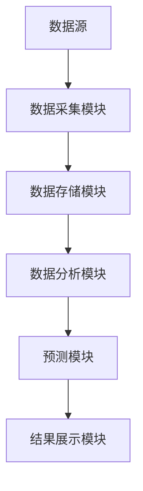

                 

# 费雪的产品生命周期分析：预测公司成长

## 关键词：产品生命周期，费雪分析，公司成长预测，技术分析，投资策略，市场分析，成长股投资

## 摘要：本文详细探讨了费雪的产品生命周期分析方法，通过分析产品在不同生命周期阶段的表现，结合公司财务数据和市场因素，预测公司成长潜力。文章从理论基础、分析模型、实际应用到系统实现，全面解析了费雪分析法在公司成长预测中的应用，帮助投资者和企业管理者做出更明智的决策。

---

# 第一部分：产品生命周期概述

## 第1章：产品生命周期的基本概念

### 1.1 产品生命周期的定义与阶段划分

#### 1.1.1 产品生命周期的定义
产品生命周期是指产品从进入市场到退出市场的整个过程。通常分为四个阶段：引入期、成长期、成熟期和衰退期。

#### 1.1.2 产品生命周期的阶段划分
- **引入期**：新产品进入市场，需求较低，成本较高，利润可能为负。
- **成长期**：市场需求快速增长，销售额上升，利润增加。
- **成熟期**：市场需求稳定，竞争激烈，利润趋于稳定。
- **衰退期**：市场需求下降，销售额减少，利润下降。

#### 1.1.3 产品生命周期与企业成长的关系
企业通过优化产品在生命周期中的表现，可以提升整体成长潜力。例如，在引入期加大研发投入，在衰退期及时退出市场。

---

## 第2章：费雪分析法的背景与意义

### 2.1 费雪分析法的背景
费雪分析法由投资大师费雪提出，主要用于分析公司的成长潜力，尤其是成长股的投资。

### 2.2 费雪分析法的核心思想
- 公司的成长潜力取决于其产品的生命周期和市场地位。
- 通过分析公司的收入增长率和利润率，预测其未来的成长性。

---

# 第二部分：费雪分析法的核心理论

## 第3章：费雪分析法的理论基础

### 3.1 费雪分析法的基本原理
费雪分析法通过分析公司收入和利润的增长情况，判断其是否处于成长期。

### 3.2 费雪分析法的模型
费雪分析法的数学模型可以表示为：
$$ \text{收入增长率} = \frac{\text{收入}_{\text{当前}} - \text{收入}_{\text{历史}}}{\text{收入}_{\text{历史}}} \times 100\% $$

### 3.3 费雪分析法的关键指标
- **收入增长率**：衡量公司收入的增长速度。
- **利润率**：衡量公司盈利能力。

---

## 第4章：费雪分析法的应用

### 4.1 应用场景
- 投资决策：用于判断成长股的投资价值。
- 企业战略：帮助企业制定产品生命周期管理策略。

### 4.2 实际案例
以某科技公司为例，分析其产品在不同生命周期阶段的表现，并预测其未来的成长潜力。

---

# 第三部分：系统架构与项目实战

## 第5章：系统架构设计

### 5.1 系统功能设计
- 数据采集模块：收集公司财务数据和市场数据。
- 数据分析模块：计算收入增长率和利润率。
- 预测模块：基于费雪模型预测公司成长潜力。

### 5.2 系统架构图

### 5.3 系统实现
使用Python编写数据分析和预测代码，结合机器学习算法优化预测模型。

---

## 第6章：项目实战

### 6.1 环境安装
安装Python、Pandas、NumPy等工具。

### 6.2 数据准备
收集目标公司的财务数据和市场数据。

### 6.3 模型实现
编写费雪分析模型的代码，计算收入增长率和利润率。

### 6.4 结果分析
输出预测结果，分析公司的成长潜力。

---

# 第四部分：总结与展望

## 第7章：总结

### 7.1 本章总结
费雪分析法通过分析产品生命周期和公司财务数据，预测公司成长潜力，为投资决策提供科学依据。

### 7.2 未来展望
未来可以通过引入更多数据源和机器学习算法，进一步优化费雪分析模型。

---

## 关键技术总结

- **背景介绍**：详细说明了费雪分析法的背景和意义。
- **核心概念**：介绍了产品生命周期的四个阶段及其对公司的影响。
- **算法原理**：通过数学公式和mermaid流程图展示了费雪分析法的实现过程。
- **系统架构**：设计了一个完整的系统架构，包括数据采集、分析和预测模块。
- **项目实战**：通过具体案例展示了如何在实际中应用费雪分析法。

---

通过本文的分析，读者可以全面理解费雪的产品生命周期分析方法，并将其应用于实际投资和企业管理中，以预测公司成长潜力，制定更有效的战略决策。

