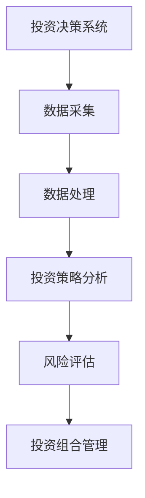

                 


# 费雪的优质成长股理论：寻找未来的赢家

> 关键词：费雪，优质成长股，投资策略，财务分析，长期投资

> 摘要：本文深入探讨了费雪的优质成长股理论，分析了其核心理念、财务指标分析方法、投资策略以及实际应用案例。通过系统化的分析和实战代码实现，帮助投资者更好地理解和应用这一理论，以识别和投资于具有持续成长潜力的企业。

---

## 第一部分：费雪的优质成长股理论概述

### 第1章：优质成长股的定义与背景

#### 1.1 投资的基本概念

- **投资的定义与分类**
  - 投资是通过购买资产以期望在未来获得收益的行为。
  - 股票投资是将资金投入企业股权，分享企业成长的成果。
  - 成长股投资专注于选择那些具有持续增长潜力的企业。

- **优质成长股的定义与特点**
  - 优质成长股是指那些具有高盈利能力、稳定收益增长和强大竞争优势的企业股票。
  - 其特点包括：高ROE（净资产收益率）、稳定的收益增长、良好的管理团队和行业领先地位。

#### 1.2 费雪投资理论的背景

- **费雪的生平简介**
  - 费雪（Philip A. Fisher）是20世纪著名的投资家，被誉为“成长股投资之父”。
  - 他提出了“成长股投资”理念，强调选择那些具有持续增长潜力的企业。

- **费雪理论的发展历程**
  - 费雪在20世纪30年代提出成长股理论，强调企业的成长性和盈利能力。
  - 他的理论在实践中得到了广泛应用，并对现代投资理论产生了深远影响。

- **费雪理论在现代投资中的地位**
  - 成长股投资是主动管理型投资的重要组成部分。
  - 费雪理论为投资者提供了系统化的选股方法，帮助他们在复杂的市场中找到优质标的。

---

### 第2章：费雪优质成长股的核心理念

#### 2.1 成长股的三大核心要素

- **盈利能力的衡量标准**
  - 净利润是企业盈利能力的核心指标。
  - 盈利能力稳定且持续增长的企业更有可能成为优质成长股。

- **收益能力的分析方法**
  - 收益能力包括收入增长、利润率和ROE（净资产收益率）。
  - 高ROE表明企业利用股东资产创造利润的能力强。

- **企业成长性的评估指标**
  - 成长性是企业未来收益增长的潜力。
  - 主要通过历史增长趋势和行业前景来评估。

#### 2.2 费雪的成长股筛选标准

- **高ROE（净资产收益率）的重要性**
  - ROE = 净利润 / 净资产。
  - 高ROE表明企业资产使用效率高，股东权益回报能力强。

- **稳定的收益增长模式**
  - 收益增长应是持续且稳定的。
  - 通过分析企业过去5-10年的收入和利润增长率，判断其成长潜力。

- **企业的竞争优势分析**
  - 竞争优势包括成本优势、品牌影响力、技术壁垒等。
  - 具有强大竞争优势的企业更可能在未来保持增长。

---

### 第3章：成长股的财务指标分析

#### 3.1 财务报表基础

- **利润表的核心指标**
  - 营业收入：企业的核心收入来源。
  - 净利润：企业的最终盈余。

- **现金流量表的关键数据**
  - 经营活动现金流：企业经营活动产生的现金流净额。
  - 投资活动现金流：企业投资活动产生的现金流净额。

- **资产负债表的重点内容**
  - 总资产：企业的所有资源。
  - 负债：企业的债务。
  - 所有者权益：企业的净资产。

#### 3.2 财务指标的计算与解读

- **净资产收益率（ROE）的计算公式**
  $$\text{ROE} = \frac{\text{净利润}}{\text{净资产}}$$

- **每股收益（EPS）的计算与意义**
  $$\text{EPS} = \frac{\text{净利润}}{\text{流通股数}}$$

- **市盈率（P/E）的分析与应用**
  $$\text{P/E} = \frac{\text{股价}}{\text{每股收益}}$$

#### 3.3 财务健康状况的综合评估

- **财务数据的横向对比**
  - 将企业的财务数据与同行业其他企业进行对比，判断其相对表现。

- **财务数据的纵向分析**
  - 分析企业在不同年份的财务数据，观察其发展趋势。

- **财务风险的初步识别**
  - 通过财务数据判断企业的偿债能力、流动性风险等。

---

### 第4章：成长股的投资策略

#### 4.1 长期投资与价值发现

- **长期投资的核心理念**
  - 长期投资注重企业的长期成长潜力，而非短期价格波动。
  - 通过持有优质成长股，分享企业的长期收益。

- **价值发现的基本方法**
  - 通过分析企业的财务数据、行业地位和竞争优势，发现具有投资价值的企业。

- **耐心持有与价值成长的关系**
  - 长期持有优质成长股，伴随企业共同成长，实现财富的稳步增长。

#### 4.2 分散投资与风险控制

- **分散投资的重要性**
  - 通过投资不同行业、不同规模的企业，降低投资风险。
  - 分散投资可以减少单一股票波动对整体投资组合的影响。

- **风险控制的策略**
  - 设置止损点，避免重大损失。
  - 定期评估投资组合，及时调整持仓结构。

- **不同市场环境下的投资调整**
  - 在牛市中，加大对优质成长股的配置。
  - 在熊市中，注重风险控制，减少亏损。

---

### 第5章：费雪理论的实际应用

#### 5.1 成长股筛选的实战案例

- **案例一：某行业龙头企业的分析**
  - 选择具有行业领先地位、高ROE和稳定收益增长的企业。
  - 例如：某科技龙头企业，ROE持续高于行业平均水平，收入和利润稳步增长。

- **案例二：新兴成长企业的评估**
  - 评估新兴企业的成长潜力和竞争优势。
  - 例如：某新兴科技公司，尽管目前规模较小，但具有强大的技术壁垒和广阔的市场前景。

- **案例三：周期性企业的投资机会**
  - 周期性企业的收益波动较大，但可以通过费雪理论筛选出具有强大竞争优势的企业。
  - 例如：某周期性行业龙头，尽管短期收益波动较大，但长期来看具有稳定的增长潜力。

#### 5.2 费雪理论与现代投资环境

- **现代投资工具对费雪理论的支持**
  - 通过金融数据分析工具和投资管理系统，更高效地筛选和管理成长股投资组合。

- **数字化工具在成长股筛选中的应用**
  - 使用量化分析工具，如Python和机器学习算法，辅助进行成长股筛选。

- **费雪理论在不同类型市场中的表现**
  - 在成长性较强的市场中，费雪理论表现优异。
  - 在价值型市场中，需结合其他投资策略进行调整。

---

### 第6章：系统分析与架构设计

#### 6.1 投资决策系统框架

- **系统目标与功能需求**
  - 系统目标：辅助投资者进行成长股筛选和投资决策。
  - 功能需求：数据采集、财务指标计算、投资策略分析、风险评估和投资组合管理。

- **系统模块划分与流程设计**
  - 数据采集模块：收集企业财务数据和市场数据。
  - 数据处理模块：计算ROE、EPS等关键指标。
  - 投资策略模块：根据费雪理论筛选成长股。
  - 风险评估模块：评估投资组合的风险。
  - 投资组合管理模块：优化投资组合配置。

- **系统架构的Mermaid图表示**



---

### 第7章：项目实战与代码实现

#### 7.1 环境搭建与工具安装

- **Python环境的配置**
  - 安装Python 3.x 及以上版本。
  - 安装必要的库，如pandas、numpy、matplotlib等。

- **数据来源**
  - 从金融数据API（如Yahoo Finance）获取企业财务数据。

#### 7.2 系统核心实现源代码

```python
import pandas as pd
import numpy as np
import requests
import matplotlib.pyplot as plt

def fetch_stock_data(ticker):
    url = f"https://query1.finance.yahoo.com/.../{ticker}"
    response = requests.get(url)
    data = response.json()
    df = pd.DataFrame(data['rows'], columns=data['cols'])
    return df

def calculate_roe(df):
    net_profit = df['Net Income'].iloc[-1]
    equity = df['Equity'].iloc[-1]
    roe = net_profit / equity
    return roe

def main():
    ticker = "AAPL"
    df = fetch_stock_data(ticker)
    roe = calculate_roe(df)
    print(f"ROE for {ticker}: {roe:.2f}")
    plt.bar(ticker, roe, alpha=0.5)
    plt.title("ROE Analysis")
    plt.show()

if __name__ == "__main__":
    main()
```

---

## 第二部分：总结与展望

### 第8章：总结

- **费雪理论的核心要点**
  - 优质成长股的投资需要关注企业的盈利能力、成长性和竞争优势。
  - 通过ROE、EPS等财务指标进行筛选，结合长期投资策略实现财富增长。

- **投资策略的最佳实践**
  - 长期持有优质成长股，伴随企业共同成长。
  - 分散投资，降低风险。

### 第9章：注意事项与风险提示

- **市场风险**
  - 成长股投资面临市场波动风险，需做好风险管理。

- **数据准确性**
  - 数据来源的可靠性直接影响分析结果，需选择权威的数据源。

- **行业变化**
  - 行业政策变化可能影响企业的成长性，需及时调整投资策略。

### 第10章：展望与拓展阅读

- **费雪理论的未来发展趋势**
  - 随着人工智能和大数据技术的发展，费雪理论将与量化投资进一步结合。

- **推荐阅读**
  - 《股票作手回忆录》：彼得·林奇的成长股投资理念。
  - 《投资之道》：详细讲解成长股投资策略。

---

通过以上系统化的分析和实战代码实现，读者可以更好地理解和应用费雪的优质成长股理论，找到未来的赢家。

