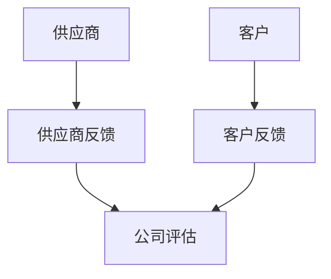
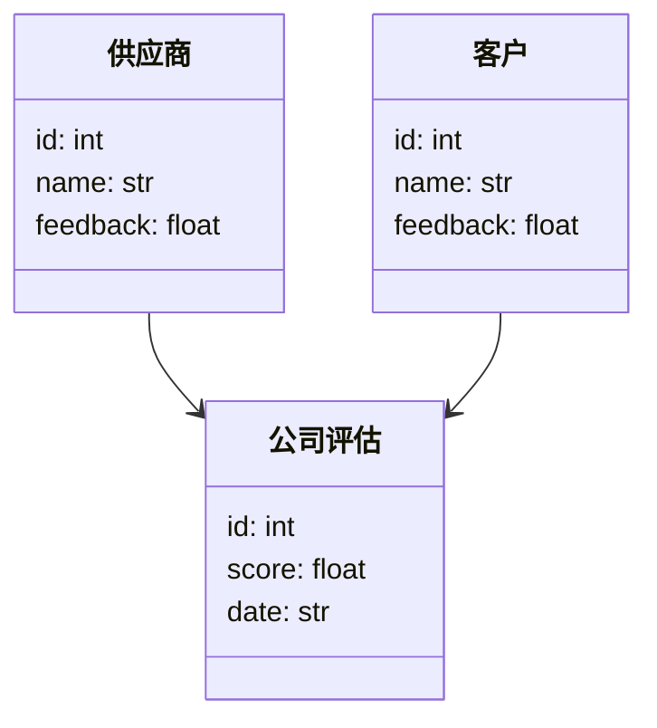
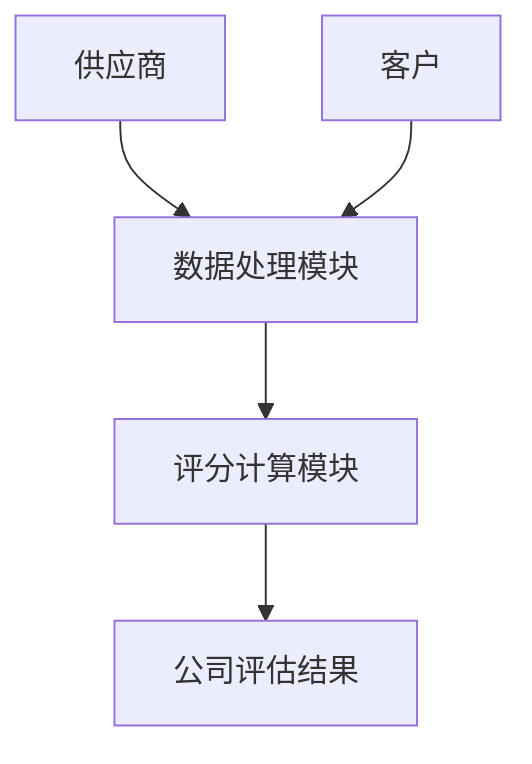
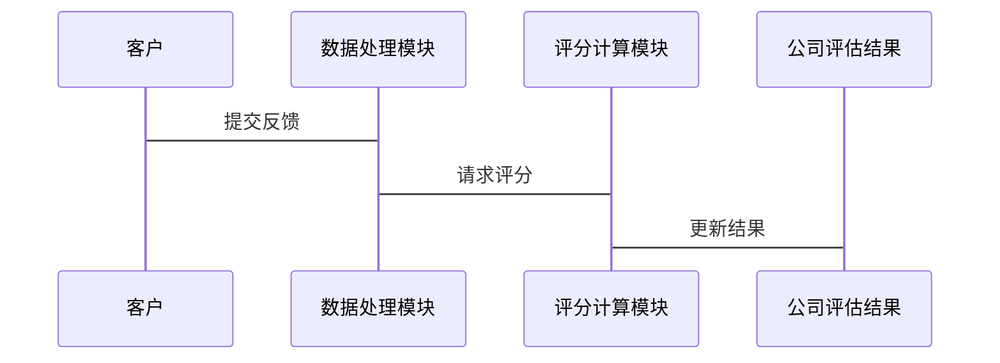

                 


# 费雪的供应商客户调研：360度了解公司

## 关键词：供应商调研、客户调研、企业评估、数据分析、费雪评分模型

## 摘要：本文详细介绍费雪的供应商客户调研方法，通过供应商和客户的反馈数据，构建360度的企业评估模型。文章从背景、概念、算法、系统架构到项目实战，全面解析该方法的应用和实现，帮助读者掌握如何通过多维度数据了解公司。

---

# 第一部分: 费雪的供应商客户调研概述

## 第1章: 费雪供应商客户调研的背景与意义

### 1.1 问题背景

#### 1.1.1 传统企业调研的局限性
传统的企业调研通常仅依赖内部数据或单一来源的反馈，难以全面反映企业的真实情况。供应商和客户的外部视角往往被忽视，导致评估结果片面。

#### 1.1.2 费雪调研方法的提出
费雪调研方法通过整合供应商和客户的反馈，提供360度的企业评估视角，弥补了传统方法的不足。

#### 1.1.3 费雪调研方法的应用价值
- 提供全面的企业画像
- 识别潜在问题和改进机会
- 增强企业与供应商、客户的关系

### 1.2 费雪调研的核心概念

#### 1.2.1 供应商与客户的定义与分类
- 供应商：按行业、规模和合作年限分类
- 客户：按类型、区域和采购金额分类

#### 1.2.2 费雪调研的核心要素
- 供应商反馈：产品质量、交付周期、服务态度
- 客户反馈：产品性能、服务质量、企业信誉

#### 1.2.3 费雪调研的目标与边界
目标：评估企业整体表现；边界：仅关注供应商和客户的直接反馈，不涉及内部数据。

---

## 第2章: 费雪调研的核心概念与联系

### 2.1 费雪调研的核心原理

#### 2.1.1 供应商与客户的双向反馈机制
通过收集供应商和客户的评分，构建双向评估体系，全面反映企业表现。

#### 2.1.2 费雪调研的整合方法
将供应商和客户的反馈数据整合，形成综合评分。

#### 2.1.3 费雪调研的逻辑框架
- 数据收集
- 数据整合
- 综合评估

### 2.2 费雪调研的核心概念对比

#### 2.2.1 供应商与客户反馈的特征对比

| 特征       | 供应商反馈         | 客户反馈           |
|------------|--------------------|--------------------|
| 数据类型    | 定量               | 定量与定性         |
| 主要维度    | 交付、质量、服务   | 产品、服务、信誉   |

#### 2.2.2 费雪调研与其他调研方法的对比

| 方法         | 费雪调研         | 传统调研           |
|--------------|------------------|--------------------|
| 数据来源     | 供应商+客户       | 内部数据           |
| 数据维度     | 双向             | 单向               |
| 评估深度     | 全面             | 片面               |

#### 2.2.3 费雪调研的优劣势分析

| 优势         | � 劣势           |
|--------------|-----------------|
| 数据全面       | 数据收集难度大   |
| 结果客观       | 时间成本较高     |

### 2.3 费雪调研的ER实体关系图



---

# 第二部分: 费雪调研的算法原理

## 第3章: 费雪调研的算法原理

### 3.1 数据处理流程

#### 3.1.1 数据收集与清洗
- 清洗无效数据，处理异常值
- 使用Python的pandas库进行数据清洗

```python
import pandas as pd
# 读取数据
data = pd.read_csv('feedback.csv')
# 删除空值
data.dropna(inplace=True)
```

#### 3.1.2 数据预处理与特征提取
- 标准化评分数据
- 提取关键特征

#### 3.1.3 数据标准化与归一化
- 使用sklearn进行标准化

```python
from sklearn.preprocessing import StandardScaler
scaler = StandardScaler()
scaled_data = scaler.fit_transform(data[['score_supplier', 'score_customer']])
```

### 3.2 费雪调研的核心算法

#### 3.2.1 供应商与客户评分的加权计算
- 加权平均法

$$
\text{总分} = 0.4 \times \text{供应商评分} + 0.6 \times \text{客户评分}
$$

#### 3.2.2 费雪综合评分模型
- 综合评分模型公式

$$
F = \alpha \times S + \beta \times C
$$

其中，\( F \) 是综合评分，\( S \) 是供应商评分，\( C \) 是客户评分，\( \alpha \) 和 \( \beta \) 是权重系数。

#### 3.2.3 费雪评分的预测算法
- 使用线性回归预测未来评分

```python
from sklearn.linear_model import LinearRegression
model = LinearRegression()
model.fit(X, y)
```

### 3.3 算法实现代码

```python
def calculate_fisher_score(supplier_score, customer_score):
    # 加权计算
    alpha = 0.4
    beta = 0.6
    fisher_score = alpha * supplier_score + beta * customer_score
    return fisher_score

# 示例
supplier = 85
customer = 90
score = calculate_fisher_score(supplier, customer)
print(score)  # 输出：89.0
```

---

## 第4章: 费雪调研的数学模型

### 4.1 费雪评分模型

$$
F = \sum (\text{权重}_i \times \text{评分}_i)
$$

### 4.2 供应商和客户评分的预测模型

$$
Y = aX + b
$$

---

## 第5章: 费雪调研的系统架构设计

### 5.1 系统功能设计



### 5.2 系统架构设计



### 5.3 接口设计与交互流程图



---

## 第6章: 费雪调研的项目实战

### 6.1 环境安装

```bash
pip install pandas sklearn mermaid4j
```

### 6.2 核心代码实现

```python
import pandas as pd
from sklearn.linear_model import LinearRegression

# 数据加载与预处理
data = pd.read_csv('feedback.csv')
data.dropna(inplace=True)

# 特征提取与模型训练
X = data[['supplier_score', 'customer_score']]
y = data['company_score']
model = LinearRegression()
model.fit(X, y)

# 预测新评分
new_supplier = 85
new_customer = 90
predicted_score = model.predict([[new_supplier, new_customer]])
print(predicted_score[0])
```

### 6.3 案例分析

- 数据收集：供应商和客户反馈
- 数据分析：计算综合评分
- 结果解读：企业表现评估

---

## 第7章: 最佳实践

### 7.1 小结

- 费雪调研通过整合供应商和客户反馈，提供全面的企业评估。
- 数据分析和模型构建是关键步骤。

### 7.2 注意事项

- 数据质量：确保反馈数据的准确性和完整性。
- 权重调整：根据行业特点调整供应商和客户评分的权重。

### 7.3 未来发展方向

- 结合NLP技术，分析客户反馈文本。
- 实时监控企业表现。

### 7.4 拓展阅读

- 《数据分析实战》
- 《机器学习算法解析》

---

通过以上详细分析，费雪的供应商客户调研方法为企业提供了全面的评估视角，帮助企业识别改进机会，提升竞争力。

